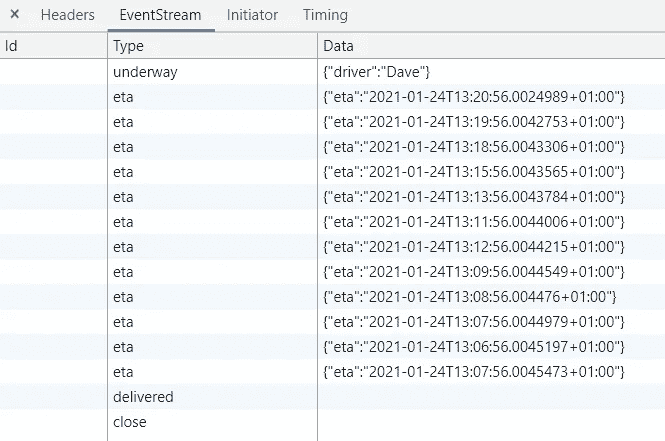
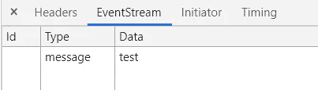

# 具有 Dotnet 核心和 TypeScript 的服务器端事件流

> 原文：<https://itnext.io/server-side-event-streams-with-dotnet-core-and-typescript-d20c84017480?source=collection_archive---------0----------------------->

Chrome 开发工具中的服务器端事件

在现代 web 开发中，看到网站上的数据实时更新是非常常见的。例如，在外卖订单的地图上查找快递员，或者在跟踪和追踪页面上查找新鞋的预计到达时间。这(很可能)是所有的实时数据，直接从服务器传到你的屏幕上。

有多种方法可以实现这些功能。有了 Dotnet Core，你当然可以使用 [SignalR](https://docs.microsoft.com/en-us/aspnet/core/signalr/introduction?view=aspnetcore-5.0) ，但是如果你只是想实时更新 ETA，这对于一个小问题来说是一个[相当大的](https://bundlephobia.com/result?p=angular@1.8.2)和相对复杂的锤子。另一方面，您可以使用客户端循环，每隔 X 秒从正常的 REST 端点获取一个新值。虽然这是一个非常简单的解决方案，但它也不是真正实时的(至少在合理的时间间隔内)。

第三种不太为人所知的解决方案是使用服务器端事件流。服务器端事件允许您向客户端发送实时事件，由普通 JavaScript 支持，只需在标准控制器中执行一个普通操作即可完成。这使他们有可能很好地介于前面提到的两个选项之间。在本文中，我想向您展示如何以无库的方式在 Dotnet Core 和 JavaScript 中实现服务器端事件。

# 在 Dotnet 核心中发送事件

Dotnet Core 没有对服务器端事件的内置支持，所以我们必须自己实现一些规范。我决定通过在`HttpContext`类上创建扩展方法来做到这一点，这些方法可以在任何具有`HttpContext`属性的控制器中使用。

## 正在初始化流

我们要做的第一件事是通过向客户端发送正确的`Content-Type`头来初始化流。这将告诉浏览器这个响应确实是一个事件流，并且可以在一个`EventStream`对象中使用(稍后将详细介绍)。

## 流的内容

之后，我们可以开始向客户端发送事件。可以通过事件流发送多种不同的内容:

*   普通数据:只是一个包含一些文本的字符串。要向客户端发送一个字符串，我们需要在写入正文之前在它前面加上`data :`。一个小问题是，如果我们发送一个多行字符串，我们必须在每一行前面加上`data :`。
*   事件:一个事件由四个字段组成:`name`、`data`、`id`和`retry`。`name`是客户端将要收听的事件的名称。`data`是事件的有效负载，可以是常规字符串，也可以是 JSON。`id`是可选字段，可用于向客户端发送额外的标识符。使用`retry`可以在出现连接错误时更改客户端的重试策略。
*   注释:我们可以通过在流前加上`:`来发送注释。客户端会忽略注释，但是它们对于发送调试数据很有用。

## 发送数据消息

我们将从向客户端发送数据字符串的方法开始。扩展方法的实现如下所示。注意，我们必须在发送数据之前写一个额外的换行符，这样客户端就知道消息已经结束并且是完整的。

有了这两种方法，我们就可以创建一个控制器，并开始通过流发送数据。事件流的操作与普通请求的操作有一些重要的不同。因为我们不是对单个请求发送单个响应，所以动作的返回类型不是`IActionResult`，而是`Task`(不是`void`，因为流是异步发生的)。当操作返回所有数据已经发送到客户端时，Dotnet 剩下要做的唯一事情就是关闭连接。例如，返回`Ok()`会抛出一个异常，显示我们已经向客户端发送了一个响应。

这个事件流在 Chrome 开发工具中是什么样子的

## 发送事件

接下来要做的是开始发送事件(毕竟是一个*event*流)。为了存储组成事件的字段，我将首先创建一个代表服务器端事件的`SSEEvent`类。

接下来是向客户机发送完整事件的扩展方法。这一个的实现看起来有很多代码，但是大部分只是在我们将可选字段写入主体之前检查它们是否被设置。注意，我们在这里需要检查我们是否发送了一个`string`或者一个`object`，因为如果是一个字符串，我们需要在所有的行前面加上`data :`前缀。然而，JSON 数据字段中的换行符不是问题。另一个特例是`null`值:它必须用空字符串而不是 JSON null 发送。

现在，我们已经可以开始沿着事件流发送一些事件了。在本例中，我们仅在 500 毫秒的延迟后发送一条消息，但当然，您可以在很长的时间内发送任意多条消息:

上面显示的事件主体

## 发送评论

为了结束我们的服务器端代码，我们将添加通过事件流发送注释的扩展方法。这种方法几乎与发送数据消息的方法相同，但是现在没有了`data`前缀(但是我们仍然需要在每一行前面加上`:`)。

# 在 TypeScript 中列出事件

在 TypeScript 中，我们可以为每个包含事件流的端点创建一个`EventSource`对象。这是通过将 url 和一些可选选项传递给构造函数来实现的。一个单独的`EventStream`代表一个单独的 url，并且可以附加多个事件监听器。

创建事件源

## 列出数据消息

为了监听用`SSESendDataAsync`发送的普通数据消息，我们可以将事件流的`onmessage`属性设置为一个函数。该函数将获取事件作为参数，您可以在该事件的`data`属性中找到数据。

对于每个`EventSource`,我们只能有一个数据消息监听器，不像对于事件，我们可以有任意多个监听器。

## 列出事件

对于监听命名事件，您可以使用 even 信号源的`addEventListener`方法。对于命名事件，您可以为每个名称添加一个监听器来监听这个特定的事件。可以为每个事件名称添加多个侦听器。移除监听器是通过`removeEventListener`完成的(就像 JavaScript 中的任何其他事件监听器一样)。

## 关闭流

关于服务器端事件流，需要记住的一点是，只有客户端可以关闭它们。如果服务器停止发送事件，客户端会将其视为连接错误，并重试连接。如果您的应用程序中服务器知道它何时发送完所有事件，这可能有点烦人。解决这个问题的方法是从服务器发送一个空的`close`事件，并在收到该事件时关闭客户端连接。

# 事件流和 HTTP1

然而，使用事件流还有最后一个问题:因为事件流保持连接打开，所以您需要通过 HTTP2 连接运行它们，否则您将遇到最大打开连接数的问题。(在 HTTP1 中，每个域的最大连接数只有 6 个。)

# 结论

我希望这篇文章能让您对服务器端事件如何工作以及如何实现它们有所了解。你怎么看，服务器端事件在 polling 和 SignalR 旁边有一席之地吗？(是的，我知道 SignalR 也使用服务器端事件作为不支持 websockets 时的后备。)