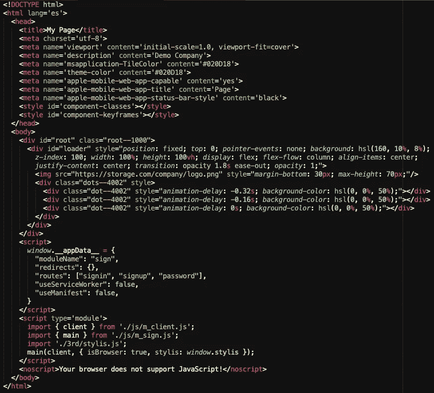
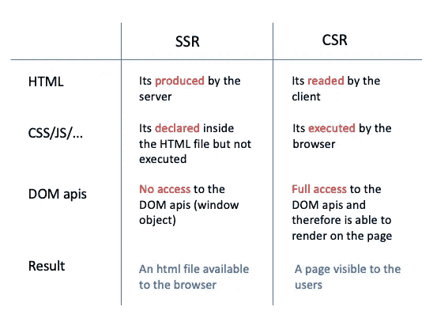
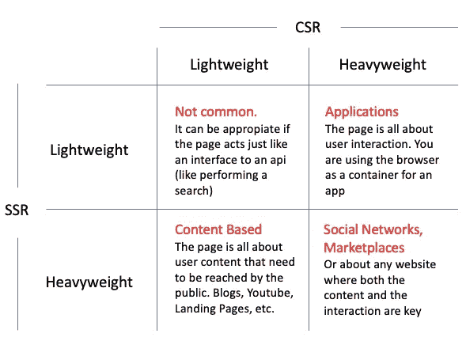
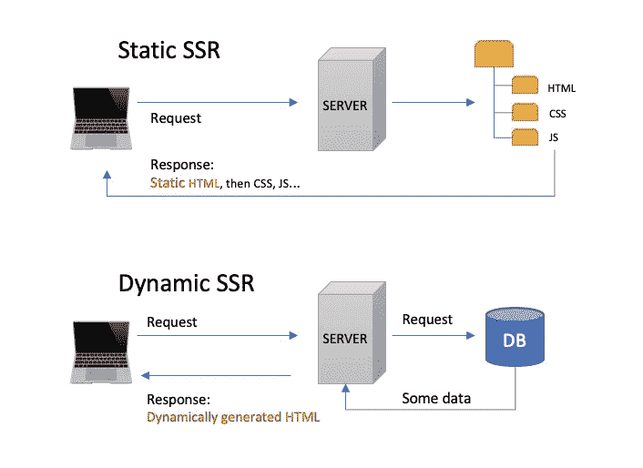
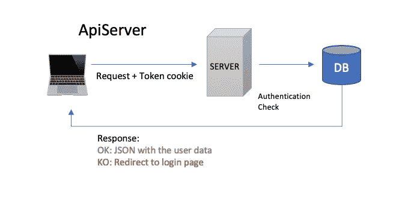
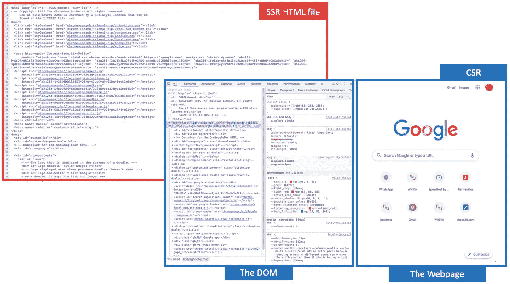
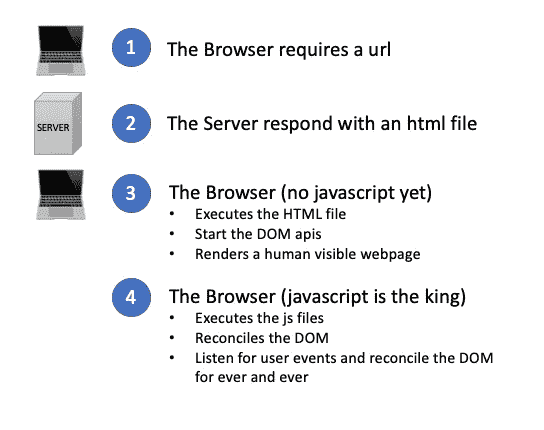

# 服务器端以正确的方式呈现

> 原文：<https://itnext.io/server-side-rendering-the-right-way-6c6ab5995be3?source=collection_archive---------0----------------------->

## 原则、战略和客户方

如果你是一名 web 开发人员，你迟早需要去“服务器端”，了解那里正在发生什么，以及如何与客户端(浏览器)完美结合。

一个简单的 HTML 文件，也就是任何 SSR 进程的输出

## SSR 和 CSR 的定义

因此，我们将从定义什么是 SSR(服务器端渲染)和 CSR(客户端渲染)开始

*   **SSR** :用户向服务器请求某个 url 的过程，例如:【https://www.mywebsite.com/how-to-ssr】T2，服务器用一个 html 文件响应，如上图所示。就这么简单，所以请记住，每当您的一些同事或一些文章谈论 SSR 时，不要害怕:它基本上是在谈论一个服务器发送给您的文件，其中包含 html 文本(可能还附有一些标题)。因此，浏览器有一个可以处理的 html 文件。
*   **CSR** :解析客户端(浏览器)上已经下载的 html 文件的过程(执行 css 文件、javascript、图像请求、字体等)，结果浏览器可以修改 DOM(最初加载 html 内容)。这一次，结果是用户实际上可以在浏览器中看到一个页面。

SSR / CSR 的简单比较

## 主要使用案例

因此，在只做 SSR 或只做 CSR 之间没有选择，你将总是两者都按顺序做。

您的页面在服务器端可以是轻量级的(只是一个基本的 html 结构)，在客户端可以是重量级的(执行了大量的 javascript)，在服务器端可以是重量级的(当服务器生成 html 文件时，html 文件中已经包含了大量的内容)，在客户端可以是轻量级的(只是一些基本的行为)，或者可能两边都是重量级的。

SSR / CSR 的典型使用案例

把上面的图片作为一个心理参考。“轻”和“重”之间没有明确的界限，并且总是有新的用例出现。

事情是，由于 javascript 作为一种语言的发展所带来的浏览器引擎的演变，“瘦客户端”的旧 web 范式正在被“胖客户端”所取代。

对于创业公司来说，今天的用户手边有“一台完整的电脑”(手机)是件好事，这样他们就可以建立更丰富的交互，避免服务器端的资源消耗。

## 静态 SSR 与动态 SSR

另一个重要的考虑是决定你是想要已经生成的 html 文件(静态呈现)还是需要先处理请求，然后(相应地)动态生成 html。

静态 SSR 与动态 SSR

我知道这可能看起来很奇怪，但实际上对于大多数用例，您可以使用静态 SSR 或动态 SSR，让我用一个例子来解释。

**策略一。静态 SSR 脸书配置文件页面:**

*   很明显，用户 A 和用户 B 会看到完全不同的个人资料页面，那么静态 SSR 怎么可能呢？
*   答案是轻量级 SSR。因此，HTML 中不包含太多数据，只包含一些基本的结构、样式，javascript 将完成所有“繁重的工作”:连接到服务器，为用户请求数据，然后将轻量级 DOM 转换为完全呈现的个人资料页面。
*   但是，服务器如何知道登录的用户是谁呢？为此，在客户机中需要一个 cookie(未过期的、安全的和 HttpOnly ),它将与请求一起发送到服务器。
*   然后，服务器可以读取 cookie 并发送所需的数据，或者将用户重定向到登录页面。
*   注意:前一个服务器可能不是你请求 html 文件的同一台服务器，我们称它为“ApiServer”(稍后会详细介绍)

**策略二。动态 SSR 脸书个人资料页面:**

*   在这种情况下，我们可以生成一个 html 文件，其中包含特定于请求页面的用户的所有内容。
*   首先，我们需要知道用户是谁，以及它是否经过身份验证(策略 1 中的相同 cookie 很好)，然后向数据库发出请求以检索该用户的数据，最后生成自定义 html 以发送给客户端。
*   注意:这个服务器就像一个 ApiServer。

ApiServer 用于返回关于用户的数据(给定一个令牌 cookie)

那么，如何决定呢？以下是每种策略的权衡

**静态 SSR**

*   最佳性能:服务器不需要生成文件(他们已经准备好了)
*   CDN / Caching / Gzip:因此，您可以在用户附近压缩和缓存文件，以降低网络调用的延迟。
*   需要“重量级”CSR:因为 html 文件非常简单，所以客户端将负责数据获取和呈现
*   需要管理 html 文件生成过程:您可以只手动编写一个 html 文件，但您很可能会使用一些进程管理器(如 gulp)来调用一些进程来生成 html。这是一个仅限于开发人员的过程，您可以在部署之前在您的机器上完成。
*   您仍然需要实现 ApiServer，因为您确实可以将 html、css 和 js 文件作为静态文件提供，但是 json 数据很可能总是动态的并且依赖于用户。

**动态 SSR**

*   不是最佳性能:服务器需要为每个请求生成响应，所以性能仍然可以很好，但不是最佳的。
*   缓存是可以做到的，但是比较棘手。
*   您不需要 hmtl 文件的构建过程(您正在动态创建 html 响应)。
*   您不需要实现单独的服务器来处理数据需求(“ApiServer”)。
*   你的客户端可以是轻量级的(但也可能因为其他原因而变得很重)。

现在，我们来谈谈客户端的渲染。

## 客户端渲染

如果我们希望定义非常“规范”，客户端渲染实际上是唯一“在用户眼前”发生的渲染。

好的(网页)，坏的(DOM)和丑的(SSR)😜

在图像中:

*   **SSR**(HTML)是浏览器的“指令”。所以它不适合人类，除非你是开发者😎
*   **DOM**(文档对象模型)它是浏览器执行 html 时的幕后工作。但是，同样的，它不适合人类。它代表了浏览器中正在发生的事情，以及一些有用的 API 来为页面添加行为、提供存储等等。
*   **网页**(实际渲染)，就是用户看到的和交互的。在图片中，谷歌主页。

所以，所有的渲染都可以看作是一个包含 4 个步骤的过程:

1.  你点击了一个链接，浏览器要求提供互联网的网址。
2.  服务器用一个 hmtl 文件作出响应(由于 DNS 可以找到它)
3.  bowser 执行 html 文件，并启动页面在不久的将来可能需要的 DOM apis。因此，用户现在可以在页面上看到“一些东西”。Javascript 还没有工作，但它即将到来…
4.  javascript 文件被执行，现在完全控制了页面中的内容。因此:

*   SSR 页面可以完全改变(更可能是“扩展”)
*   JS 可以与 DOM apis 进行交互，从而平滑地、渐进地修改页面。
*   用户看到并感受到一个响应页面，在他点击和手势之后事件发生。

整个渲染过程循序渐进

## NAQ:非常见问题

**1。CSR 流程何时停止？**

= >当用户单击页面上的链接时= >这会告诉浏览器需要一个新的 url = >这会启动一个新的 SSR-CSR 循环。

**2。浏览器位置的每次改变都会触发整个渲染周期？**

幸好没有。

如果你知道新页面不需要加载额外的 javascript 或者启动一个全新的循环，不要这样做(使用***window . history . replace state***API)。否则使用***window . location . replace*。**

**3。用户是否注意到 SSR 和 CSR 之间的转换？**

不幸的是，也许。

从服务器向用户呈现一些东西，然后有一个 3 秒钟的白色页面，最后在他的眼前有一个令人惊叹的页面，这确实是一个糟糕的做法。

为了避免这种情况，您的客户端 javascript 必须知道页面何时准备好完全呈现，并同时显示一些加载器、闪屏或漂亮的消息。

**4。做 SSR 需要框架吗？**

幸好没有。

我使用 React(实际上是 Preact)是因为它非常符合我的思维模式。此外，使用 React，我可以在服务器(SSR)中将 javascript 代码转换为 html 字符串，并将页面从状态 1 转换为状态 2(在客户端)，而不用担心协调或一些涉及 DOM 的命令性代码。

但是！我目前的策略是不在服务器上进行大量渲染，而给客户端更多的能力。所以，我的 html 文件内容是轻量级的，不需要使用任何框架就可以生成。

但是，这取决于你…

我希望这有所帮助。它不是框架驱动或代码驱动的，因为我认为这是理解原则和策略的方法，而不会迷失在实现细节中。

来自智利的欢呼！！🇨🇱