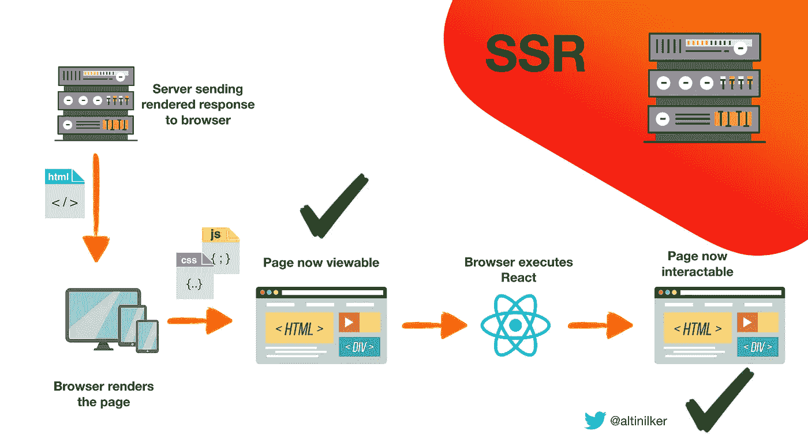
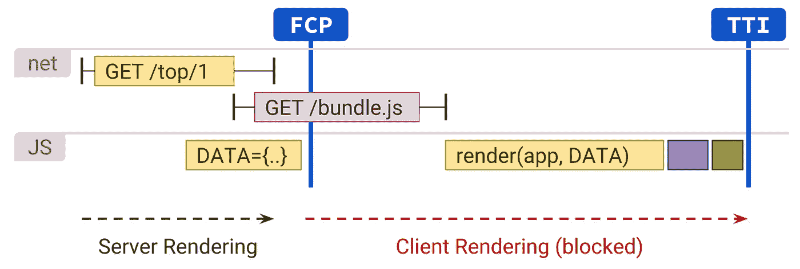
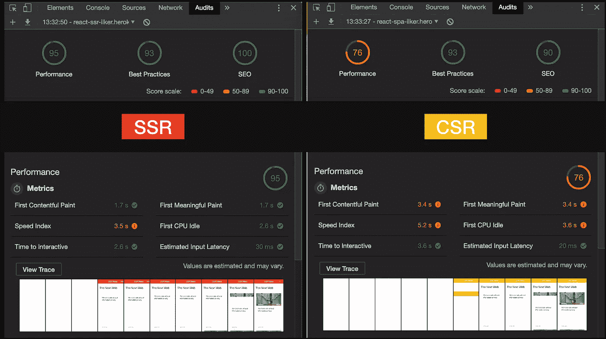

# 使用 React、Redux 和 React-Router 进行服务器端渲染

> 原文：<https://itnext.io/server-side-rendering-with-react-redux-and-react-router-fa5b67d4965e?source=collection_archive---------0----------------------->

图片来自 Unsplash [Martijn Baudoin](https://unsplash.com/@martijnbaudoin)

# **TL；博士**

最近有一场关于服务器端渲染的大讨论。大家都说很难实现和维护。我用 **3 种不同的方法**创建了一个 **React** 新闻 web 应用程序，以便能够理解彼此之间的性能和实现差异。我想让这个应用程序尽可能接近真实世界的用例。我用过； **React，React-Router，Redux，Node.js，**和 **Express** 。您可以通过下面的链接查看每个应用程序；

*   ***单页应用***[**bit.ly/spa-react**](http://bit.ly/spa-react)
*   ***服务器端渲染(通用)***[**bit.ly/ssr-react**](http://bit.ly/ssr-react)
*   ***服务器端渲染用 Redis***[**bit.ly/ssr-cached**](http://bit.ly/ssr-cached)

# 为什么？

我在网上看到了很多关于服务器端渲染的讨论，尤其是在 Twitter 上。我知道 React 有很多通用的渲染框架，但是我想自己从头开始构建它，不需要任何黑盒解决方案。但是首先要理解什么是服务器端和客户端渲染。

# Javascript 革命

浏览器比 5-10 年前更加强大。我们开始用客户端 JavaScript 创建完整的网站和网络应用。我们开始把这种方法叫做**“单页应用”**。这导致我们创建更多的交互式实时更新的 web 应用程序。

但是这种方法有一个问题，我们最初的 HTML 不再包含与该 URL 相关的所有数据。

> 谷歌和社交媒体爬虫对此一点也不高兴

客户端渲染(CSR)

# 什么是客户端渲染？(企业社会责任)

> **在浏览器中渲染应用，一般使用 DOM**

服务器呈现的初始 HTML 是一个占位符，所有脚本加载后，整个用户界面和数据都会呈现在浏览器中。

## 客户端渲染是如何工作的？

客户端呈现工作方式概述

## 赞成的意见

*   丰富的网站互动
*   初始加载后的快速渲染
*   部分实时更新
*   托管和扩展成本更低

## 面向连接的网络服务(Connection Oriented Network Service)

*   搜索引擎优化和索引问题
*   主要是初始 bundle.js 加载持续时间
*   旧移动设备/慢速网络的性能问题
*   社交媒体爬虫和分享问题(SMO)

服务器端呈现(SSR)

# 什么是服务器端渲染？(SSR)

> 响应于导航，服务器呈现为服务器上的页面生成完整的 HTML。

对于 React 或任何其他 Javascript 库/框架的用例；服务器端呈现是一种技术，用于在服务器上呈现通常只有客户端的单页应用程序(SPA ),然后将完全呈现的页面发送到浏览器。

## 服务器端渲染是如何工作的？

服务器端呈现如何工作的概述

## **优点**

*   一致的搜索引擎优化
*   性能，初始页面加载
*   适用于社交媒体爬虫和平台(SMO)

## 面向连接的网络服务(Connection Oriented Network Service)

*   频繁请求
*   慢速页面呈现(TTFB —到达第一个字节的时间)
*   复杂架构(通用方法)

# 谷歌如何索引？

我们提到了单页 Javascript 应用程序的 SEO 问题。理解 Google index system 如何通过服务器端渲染解决这个问题很重要。

在 Google I/O 2018 JavaScript 会议上，John Mueller 和 Tom Greenaway 就搜索引擎如何索引 JavaScript 做了一些澄清。我们了解到有两波索引，它们是这样工作的:

谷歌的第二波索引系统

# 如何 SSR？

我们已经谈了几乎所有的理论部分。让我们把重点放在实现部分，以及我们如何用 React 实现服务器端渲染。

## 方法学

*   服务器上的初始渲染
*   显示完整格式的 HTML
*   JS 执行
*   React 接管/重新渲染

## 挑战

*   Node.js 上的 JSX
*   服务器上的冗余
*   按指定路线发送
*   再水化

> **补液**
> 
> 在客户机上“启动”JavaScript 视图，以便它们重用服务器呈现的 HTML 的 DOM 树和数据。

补液[图片来源](https://developers.google.com/web/updates/2019/02/rendering-on-the-web)

# React 新闻 Web 应用程序

我用 React 创建了一个基于新闻 API 的新闻应用程序，有 3 种不同的方法。我创建了我的自定义实现来理解它是如何工作的。使用 Create-React-App 定制 webpack 配置可能会很棘手。

## **单页应用(黄色)**

经典的单页应用程序。

**演示:**[bit.ly/spa-react](http://bit.ly/spa-react)
**回购:**[bit.ly/spa-repo](http://bit.ly/spa-repo)

## **服务器端渲染—通用(红色)**

初始渲染发生在服务器上(Node.js / Express)。在第一次 render 和 bundle.js 加载后，React 会重新水合并接管应用程序。这意味着 React-Router 将处理第一次加载后的每次点击，它将像单页应用程序一样工作。如果您检查源代码，您将看到完整的 dom 树，其中包含所有数据。如果刷新同一个页面或在 URL 栏上按 enter 键，当前页面将由服务器处理。

**试玩:**【bit.ly/ssr-react】
**回购:**[bit.ly/ssr-repo](http://bit.ly/ssr-repo)

## 使用 Redis 的服务器端渲染(蓝色)

与服务器端版本几乎一样。我试图在发送到浏览器之前缓存 HTML 结果，以查看性能改进。因此，对于某个 URL，来自服务器的第一个响应将被缓存在 Redis 中，第二个响应将来自内存。为了测试这一点，你可以输入一个网址，复制该网址，并再次访问隐姓埋名或另一个浏览器。

**演示:**bit.ly/ssr-cached

# 性能比较

首先，我想检查 Google 是否能够索引我的通用应用程序。正如你在下面看到的，**它能够毫无问题地看到**所有的页面内容。这也意味着**社交媒体爬虫**也可以毫无问题地抓取我的页面内容。

服务器端渲染的 Google 搜索控制台索引检查

我的第二个测试是关于性能的。我用 Lighthouse 工具和 WepageTest 做了一些性能测试。

桌面负载比较

我们可以在下面的视频中看到 SSR 在慢速网络条件下是如何大放异彩的。

在 Moto G4 — Chrome —慢速网络上进行手机对比

## 灯塔测试

单页应用程序—灯塔结果

服务器端渲染应用程序—灯塔结果

## 结果比较

请记住，所有这些测试都是在没有大负载的情况下进行的。所以在现实世界中，结果可能会改变。

# 结论

在开发这些应用程序的过程中，我真的很享受，也学到了很多东西。我没有提到很多关于代码的部分，但是你可以在 GitHub repos 上查看所有的实现。我应该提到的是，这些实现只是概念验证，离产品质量还很远。

到目前为止，我可以说服务器端渲染不是一个神奇的实现。检查你的企业是否真的需要它是很重要的。你可以在下面看到我固执己见的决定。

## 什么时候使用单页应用程序？

*   丰富的网站互动
*   网络很快
*   最少的服务器资源
*   主脚本很小或延迟加载/分割
*   实时/部分更新

## 何时使用服务器端渲染(通用)？

*   SEO 很重要
*   网络很慢
*   足够的服务器资源
*   主脚本很大，加载很慢
*   社交分享很重要

## 进一步阅读

 [## 网络渲染|网络|谷歌开发者

### 作为开发人员，我们经常面临影响整个应用程序架构的决策。其中一个…

developers.google.com](https://developers.google.com/web/updates/2019/02/rendering-on-the-web)  [## 网飞网络性能案例研究

### 改善桌面 Netflix.com 的交互时间

medium.com](https://medium.com/dev-channel/a-netflix-web-performance-case-study-c0bcde26a9d9) 

[https://github.com/brillout/awesome-universal-rendering](https://github.com/brillout/awesome-universal-rendering)