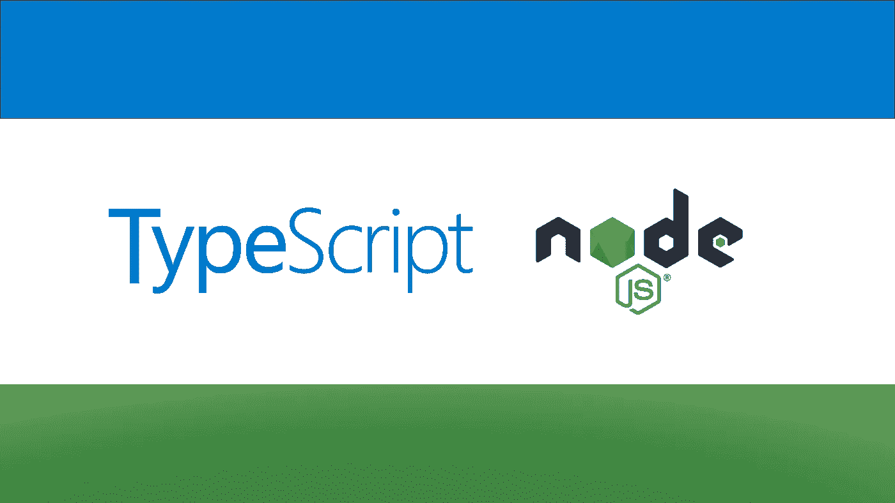
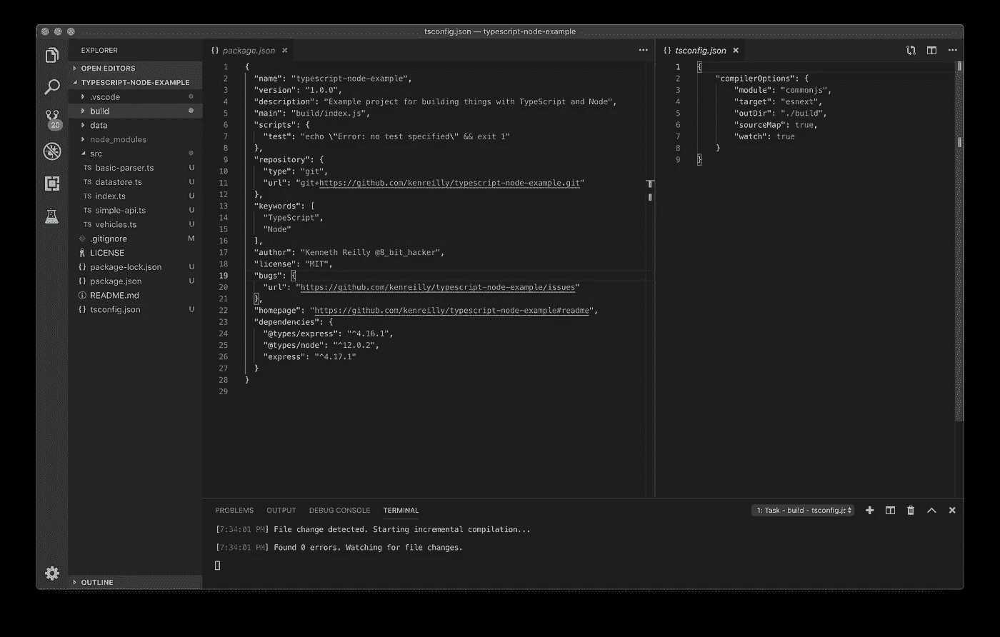
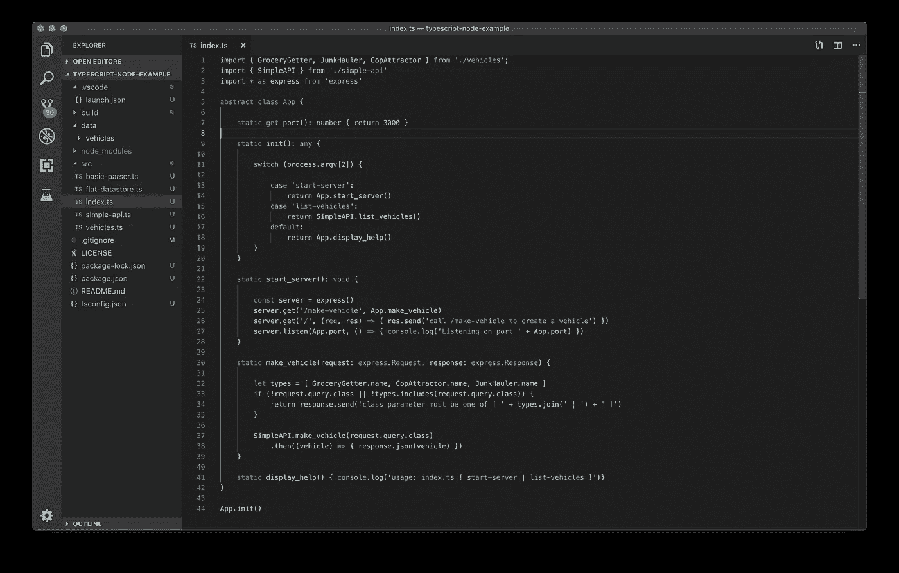
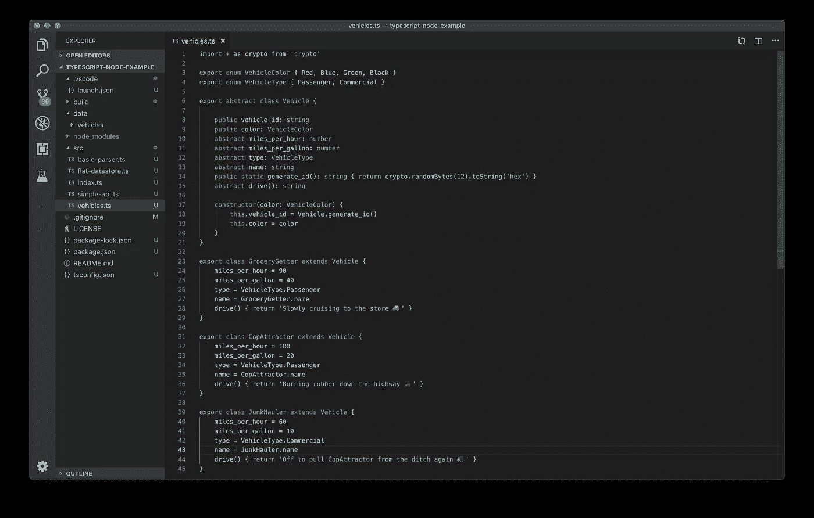
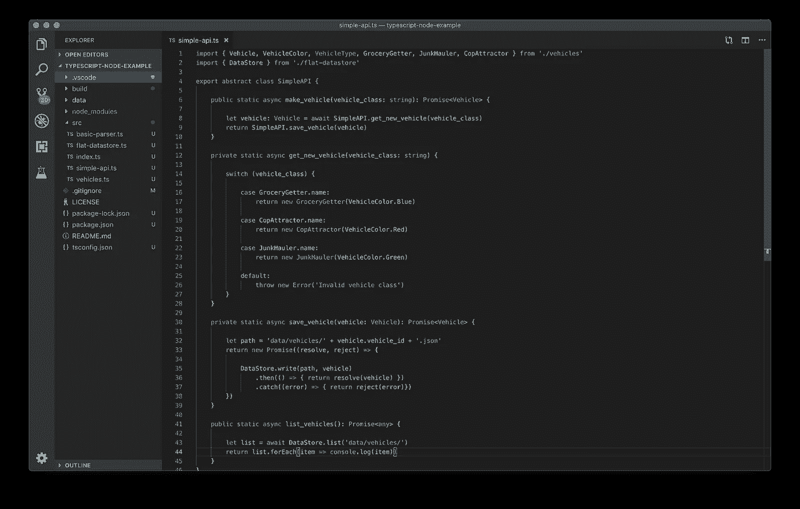
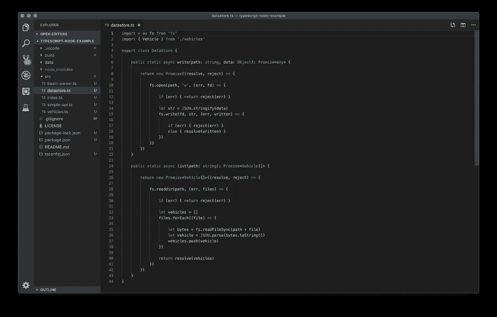
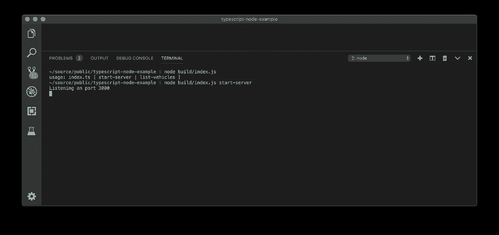
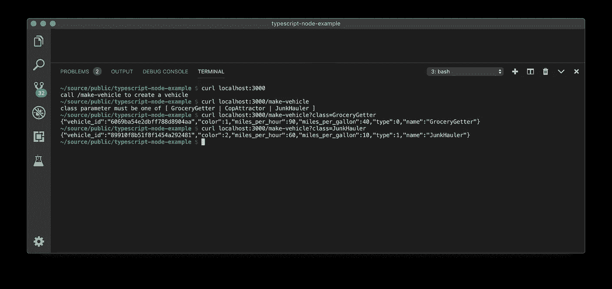
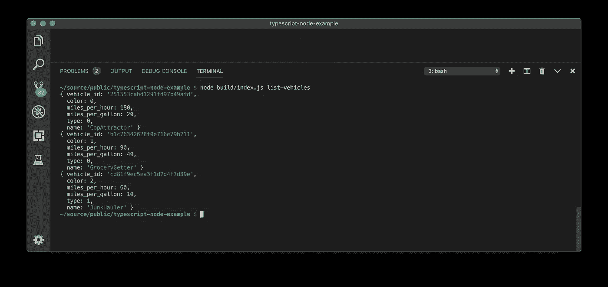

# 带有节点的服务器端类型脚本

> 原文：<https://itnext.io/server-side-typescript-with-node-c5cef1584684?source=collection_archive---------0----------------------->

## 如何用 TypeScript 和 Node 构建 API 等等

## 介绍

在本文中，我们将研究用[节点](https://nodejs.org/en/)和[类型脚本](https://www.typescriptlang.org)创建 API 和其他工具的过程。TypeScript 中强大而富于表现力的特性，加上 Node 的灵活性和可伸缩性，使之成为在相对较短的时间内构建高性能服务的绝佳组合。

截至 2019 年，Node 已经存在了大约十年，TypeScript 已经存在了大约六年。这两种技术甚至在早期的 alpha 阶段就显示出了巨大的潜力，经过多年的生产使用和维护，它们已经成为可靠和成熟的工具，正在稳步获得普及和广泛采用，尤其是在软件被期望能够正常工作的快速开发时代。

示例项目将演示一个简单的 HTTP 服务器和命令行工具的组合，创建和保存具有类型和唯一非序列 ID 的车辆的新实例，并检索车辆的结果列表。

## 入门指南

本文中使用的项目的完整源代码可从[这里](https://github.com/kenreilly/typescript-node-example)获得。

如果您还没有这些工具，请获取一份[节点](https://nodejs.org/en/)和[类型脚本](https://www.typescriptlang.org/#download-links)的副本。同样，如果您还没有支持这种环境的编辑器，流行的 [Visual Studio 代码](https://code.visualstudio.com)支持现成的 TypeScript，并会在项目打开时提供下载节点扩展的选项。

一旦安装了 Node 和 TypeScript 编译器，就可以使用`tsc`从源目录中编译项目，然后使用`./start.sh`命令启动项目。

## 项目配置

这个项目是用标准的`npm init`命令创建的。接下来，流行的 [Express](https://expressjs.com) 服务器安装了`npm install --save express`。TypeScript 编译器本身配置为将`./build`文件夹作为输出目录，将`esnext`作为 [ECMAScript](https://en.wikipedia.org/wiki/ECMAScript) 的目标版本，将`commonjs`作为 JS 输出模块类型。另外，使用命令`install --save @types/node`为节点安装 TypeScript 类型。

我们来看看项目的 **package.json** 和 **tsconfig，json** 文件:

**package.json** 和 **tsconfig.json** 的内容

在 **package.json** 中，该项目的*依赖*由*节点*和 *express* 的类型以及 [express](https://expressjs.com) 包本身组成。在 **tsconfig.json** 中，指令编译器生成用 [*esnext*](https://medium.freecodecamp.org/es5-to-esnext-heres-every-feature-added-to-javascript-since-2015-d0c255e13c6e) 语法(ECMAScript 的最新当前开发版本)编写的 [CommonJS](https://en.wikipedia.org/wiki/CommonJS) 模块，并将它们与 TypeScript 中调试用的源代码图一起放在`./build`文件夹下。

这涵盖了基本的项目设置，对类型和 Node/Express 有一些要求。其余的我们将从头开始实现，以便对环境和使用这些开发工具能做什么有个感觉。

## 应用程序入口点

包配置文件中定义的主应用程序文件是 **build/index.js** ，因此我们将查看其对应的源文件 **src/index.ts** :

主应用文件 **src/index.ts** 的内容

在这个文件中，我们有一个 **App** 类，它有一些通过命令行参数处理初始化的属性和方法，以及一个用于*端口的 get 访问器，*是我们的 express 服务器将监听的端口号。

静态的 **init()** 方法接受一个命令行参数，这个参数可以是`start-server`或`list-vehicles`，这取决于操作者当时想要做什么。如果没有提供其中一个选项，将显示一条默认帮助消息，列出该程序的可用参数。

**start_server()** 方法就是这样做的，它创建了一个 *express* 的实例，并设置了两条路线，一条是显示帮助消息的`/`路线，另一条是接受查询字符串参数`*class*` 的`/make-vehicle`，该参数应该对应于一种可用的车辆类型，我们稍后将进一步详细研究这种类型。如果`class`的值不是预期值之一，则会发送一条帮助消息来指示可用的车辆类别，我们将在下一节中对此进行介绍。

## 车辆类别定义

我们要检查的下一个文件是 **src/vehicles.ts** ，其中包含我们的车辆定义:

带有车型定义的文件 **src/vehicles.ts**

在这个文件中，我们有一些不同的东西有助于创建新的车辆实例。首先， *crypto* 库被导入以生成新的随机 ID，而不是使用串行机制，这种机制容易出现同步问题以及经典的[可预测序列号攻击](https://en.wikipedia.org/wiki/Predictable_serial_number_attack)。当然，对于我们简单的 API 来说，这并不是什么大不了的事情，但是构建一些很难绕过默认设计的东西，而不是试图在以后的某个时间点附加安全性，这很少会起作用。

接下来是 VehicleColor 和 VehicleType 的几个枚举定义，给我们一些关于这些车辆属性的约束，而不是让它们在我们的应用程序中被设置成无意义的东西，比如' *transparent* 或' *UFO* '。

抽象的 **Vehicle** 类定义了我们系统中任何车辆所期望的一组基本属性和方法，比如 *vehicle_id* 、 *color* 、 *type* 以及其他一些。此外，该类定义了一个静态方法 **generate_id()** ，用于生成 *vehicle_id* 本身，当创建任何车辆时，构造函数都会调用该方法。这意味着任何扩展 **Vehicle** 类的类都将有一个正确格式化的 ID，而不需要任何进一步的实现。

还定义了单个类别**grocer getter**、**合作承包商**和**junk haul**，每个类别的属性值都反映了车辆的类型。例如，跑车的速度是家用车的两倍，效率是家用车的一半，而卡车在这两方面都排在最后。每辆车都有一个 **drive()** 的实现，它返回一个关于它如何前进的描述。

## API 逻辑定义

接下来是 API 控制器文件本身， **src/simple-api.ts** :

带有 **SimpleAPI** 类的文件 **src/simple-api.ts**

除了列出当前在数据存储中的车辆之外，SimpleAPI 类还实现了一些基本的 API 逻辑来创建和保存新的车辆实例。 **make_vehicle(** 得到的车辆最终作为**承诺<车辆>** 对象返回给调用者。有关异步编程的更多信息，请参见本指南[中关于 ES6 的承诺](https://codeburst.io/a-simple-guide-to-es6-promises-d71bacd2e13a)。

**list_vehicles()** 方法通过从**数据存储**中检索一个列表，然后对每个列表调用 *console.log()* ，列出数据存储中存储的所有车辆。

## 简单的基于文件的数据存储

我们示例项目中的最后一个文件是 **src/datastore.ts** :

**src/datastore.ts** 中的简单 **DataStore** 类

**DataStore** 类为这个项目实现了一个非常简单的基于文件的 DataStore，它有一个 **write(** *路径，data* **)** 方法用于存储车辆 JSON 数据，还有一个**list(***path***)**方法用于从先前存储的数据文件中检索车辆数组。带有所有回调的典型文件 IO 操作已经被包装在 **Promise** 对象中，以使实现细节对程序的其余部分隐藏起来，这使得这些组件不会变得紧密耦合(这种情况会使[很快失控](https://medium.com/me/stats/post/4c087d30a056))。

## 试车

有了文件定义之后，接下来要做的就是尝试我们的超简单演示服务的 API 和命令行特性:

从命令行运行简单 API 服务器

使用`node build/index.js`不带任何参数地运行项目会产生一条帮助消息，这对那些不是每天都使用它的人来说很有用(比如一个项目维护人员，几个月或几年后，他会根据你让他们的工作变得容易或困难来爱你或恨你)。

当我们用`node build/index.js start-server`再次运行它时，我们得到消息`Listening on port 3000` ，让我们知道一切都在按预期工作。现在，让我们尝试针对 API 运行一些 [curl](https://curl.haxx.se) 请求:

对简单 API 服务器发出一些请求

在这里，我们可以看到帮助消息如何提供关于如何使用 API 的线索。有人可以从盲目地对它提出请求，到准确地理解如何正确地使用它，只需遵循帮助提示的几个简单命令。当然，在某些情况下，您可能不想提供帮助信息，但是对于简单的公共 API，这对于使用您的应用程序 web 服务的开发人员来说是非常有用的。最后但同样重要的是，让我们看看通过调用 API 创建的列出所有车辆的特性:

**列表的输出-车辆**命令行参数

`list-vehicles`参数从文件夹`data/vehicles`中获取一个`.json`文件列表，然后以一种漂亮的格式打印这个列表，显示 API 制造的闪亮新车的各种属性和类型。

## 结论

这个例子展示了现代服务器端技术(如带有 TypeScript 的 Node)提供的功能和灵活性。通过几个简单的文件，我们定义了一个 API 来创建一个对象的实例，每个实例都有一个惟一的 ID，此外还有一个基于定制文件的 JSON 数据存储和一个实用程序来列出所有已创建的车辆。这个项目可以扩展到创建一些很酷的东西，比如一个简单的通用数据库。

对于这个和其他利用最先进的现代技术的示例项目的源代码，请查看[我的 GitHub 简介](https://github.com/kenreilly)。感谢阅读！

> 肯尼斯·雷利( [8_bit_hacker](https://twitter.com/8_bit_hacker) )是 [LevelUP](https://lvl-up.tech/) 的 CTO