# AWS 上的无服务器分析:亚马逊 EMR 无服务器和亚马逊 MSK 无服务器入门

> 原文：<https://itnext.io/serverless-analytics-on-aws-getting-started-with-amazon-emr-serverless-and-amazon-msk-serverless-67155fa0f5e0?source=collection_archive---------1----------------------->

## 利用最近发布的亚马逊 EMR 无服务器和亚马逊 MSK 无服务器，通过 Apache Spark 和 Apache Kafka 进行批处理和流分析

# 介绍

## 亚马逊 EMR 无服务器

AWS 最近[宣布](https://aws.amazon.com/about-aws/whats-new/2022/06/amazon-emr-serverless-generally-available/)[亚马逊 EMR 无服务器](https://aws.amazon.com/emr/serverless/)于 2022 年 6 月 1 日全面上市 (GA)。EMR Serverless 是[亚马逊 EMR](https://aws.amazon.com/emr/) 中新的无服务器部署选项，除此之外还有 EC2 上的[EMR](https://docs.aws.amazon.com/emr/latest/ManagementGuide/emr-what-is-emr.html)、EKS 上的[EMR](https://docs.aws.amazon.com/emr/latest/EMR-on-EKS-DevelopmentGuide/emr-eks.html)和 AWS 前哨上的[EMR](https://aws.amazon.com/emr/features/outposts/)。EMR Serverless 提供了一个无服务器运行时环境，简化了使用最新开源框架的分析应用程序的操作，如 [Apache Spark](https://spark.apache.org/) 和 [Apache Hive](https://hive.apache.org/) 。根据 [AWS](https://docs.aws.amazon.com/emr/latest/EMR-Serverless-UserGuide/emr-serverless.html) 的说法，有了 EMR 无服务器，你就不必配置、优化、保护或操作集群来运行这些框架的应用程序。

## 亚马逊 MSK 无服务器

同样，2022 年 4 月 28 日，AWS [宣布](https://aws.amazon.com/blogs/aws/amazon-msk-serverless-now-generally-available-no-more-capacity-planning-for-your-managed-kafka-clusters/)[亚马逊 MSK 无服务器](https://aws.amazon.com/msk/features/msk-serverless/?trk=e0324ae4-4a7e-4aa3-a9f8-d473d0398616)的全面上市。根据 [AWS](https://aws.amazon.com/msk/features/msk-serverless/) 的说法，亚马逊 MSK 无服务器是[亚马逊 MSK](https://aws.amazon.com/msk/) 的一种集群类型，它可以轻松运行 [Apache Kafka](https://kafka.apache.org/) 而无需管理和扩展集群容量。MSK 无服务器自动供应和扩展计算和存储资源，因此您可以按需使用 Apache Kafka，并且只需为您传输和保留的数据付费。

## 无服务器分析

在下面的帖子中，我们将了解如何使用这两种新的、强大的、经济高效的、易于操作的无服务器技术来执行批处理和流分析。本文中使用的 [PySpark](https://spark.apache.org/docs/latest/api/python/#pyspark-documentation) 示例与之前两篇文章中的示例相似，这两篇文章都提到了非无服务器的替代方案[亚马逊 EC2 上的 EMR](https://docs.aws.amazon.com/emr/latest/ManagementGuide/emr-what-is-emr.html)和[亚马逊 MSK](https://aws.amazon.com/msk/) 。

[](/getting-started-with-spark-structured-streaming-and-kafka-on-aws-using-amazon-msk-and-amazon-emr-91b1f2ef0162) [## 使用亚马逊 MSK 和亚马逊 EMR 在 AWS 上开始使用 Spark 结构化流和 Kafka

### 使用批处理查询和 Spark 结构化流，使用 Apache Kafka 探索 Apache Spark

itnext.io](/getting-started-with-spark-structured-streaming-and-kafka-on-aws-using-amazon-msk-and-amazon-emr-91b1f2ef0162) [](/stream-processing-with-apache-spark-kafka-avro-and-apicurio-registry-on-amazon-emr-and-amazon-13080defa3be) [## 使用 Amazon EMR 和 Amazon 上的 Apache Spark、Kafka、Avro 和 Apicurio Registry 进行流处理…

### 在事件流分析架构中使用注册表将模式与消息分离

itnext.io](/stream-processing-with-apache-spark-kafka-avro-and-apicurio-registry-on-amazon-emr-and-amazon-13080defa3be) 

# 源代码

这篇文章中展示的所有源代码都是开源的，可以在 [GitHub](https://github.com/garystafford/emr-msk-serverless-demo/tree/main) 上获得。

```
git clone --depth 1 -b main \
    https://github.com/garystafford/emr-msk-serverless-demo.git
```

# 体系结构

邮报的高层架构由亚马逊 EMR 无服务器应用程序、亚马逊 MSK 无服务器集群和亚马逊 EC2 Kafka 客户端实例组成。为了支持这三种资源，我们将需要两个亚马逊虚拟专用云(VPC)，至少三个子网，一个 AWS 互联网网关(IGW)或同等设备，一个亚马逊 S3 存储桶，多个 AWS 身份和访问管理(IAM)角色和策略，安全组和路由表，以及一个 S3 的 VPC 网关端点。所有资源都被限制到单个 AWS 帐户和单个 AWS 区域，`us-east-1`。

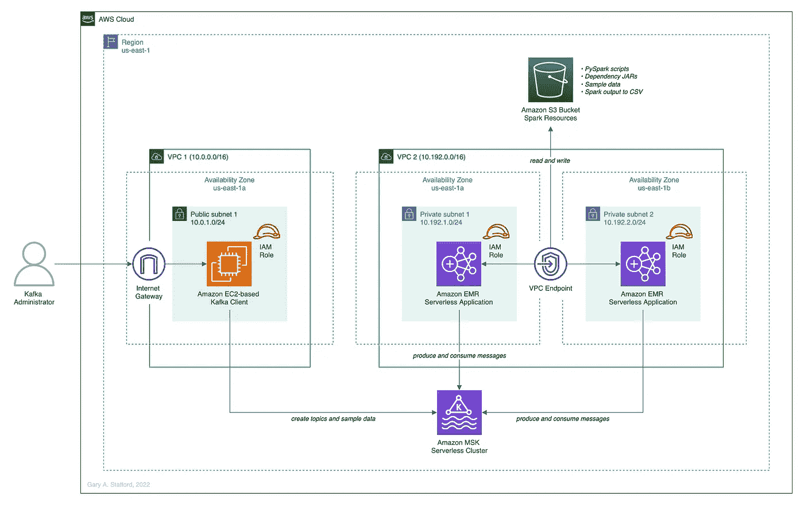

本文中使用的高级 AWS 无服务器分析架构

# 先决条件

作为此职位的先决条件，您需要创建以下资源:

1.  (1)亚马逊 EMR 无服务器应用；
2.  (1)亚马逊 MSK 无服务器集群；
3.  (1)亚马逊 S3 桶；
4.  ①VPC 端点为 S3；
5.  (3)阿帕奇卡夫卡专题；
6.  PySpark 应用程序、相关的 JAR 依赖项和样本数据文件上传到亚马逊 S3 桶；

让我们逐一了解这些先决条件。

## 亚马逊 EMR 无服务器应用

在继续之前，我建议你先熟悉一下亚马逊 EMR 无服务器的 AWS 文档，尤其是，[什么是亚马逊 EMR 无服务器？](https://docs.aws.amazon.com/emr/latest/EMR-Serverless-UserGuide/emr-serverless.html)按照 AWS 文档创建一个新的 EMR 无服务器应用，[Amazon EMR 无服务器入门](https://docs.aws.amazon.com/emr/latest/EMR-Serverless-UserGuide/getting-started.html)。EMR 无服务器应用程序的创建包括以下资源:

1.  存储星火资源的亚马逊 S3 桶；
2.  至少有两个私有子网和相关安全组的亚马逊 VPC；
3.  EMR 无服务器运行时 AWS IAM 角色和关联的 IAM 策略；
4.  亚马逊 EMR 无服务器应用；

对于本文，使用 EMR Studio 无服务器应用程序控制台中可用的最新版本 EMR(最新发布的版本 6.7.0)来创建 Spark 应用程序。

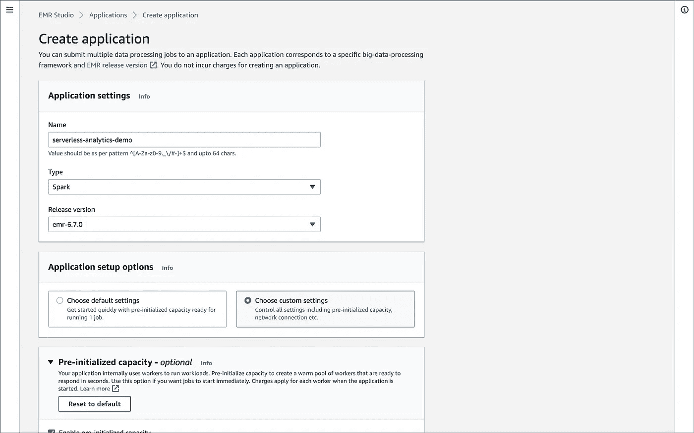

EMR Studio 无服务器应用程序创建控制台

保留默认的预初始化容量、应用程序限制和应用程序行为设置。

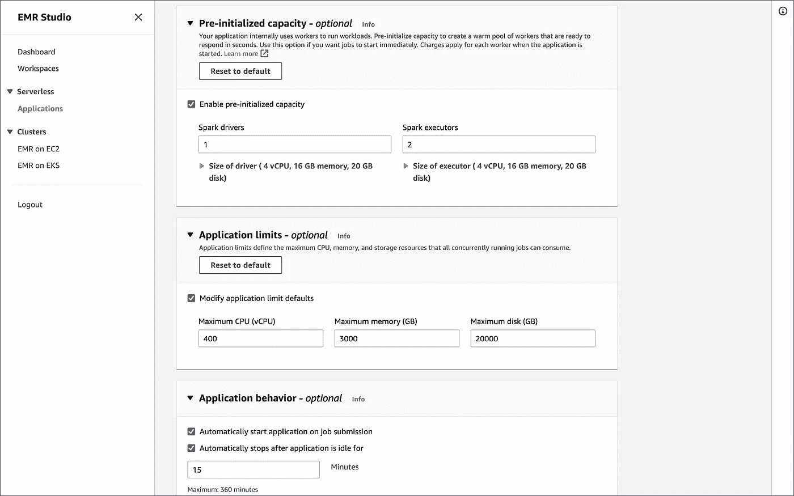

EMR Studio 无服务器应用程序创建控制台

由于我们从 EMR 无服务器连接到 MSK 无服务器，我们需要配置 VPC 访问。选择新的 VPC 和不同可用性区域(az)中的至少两个专用子网。

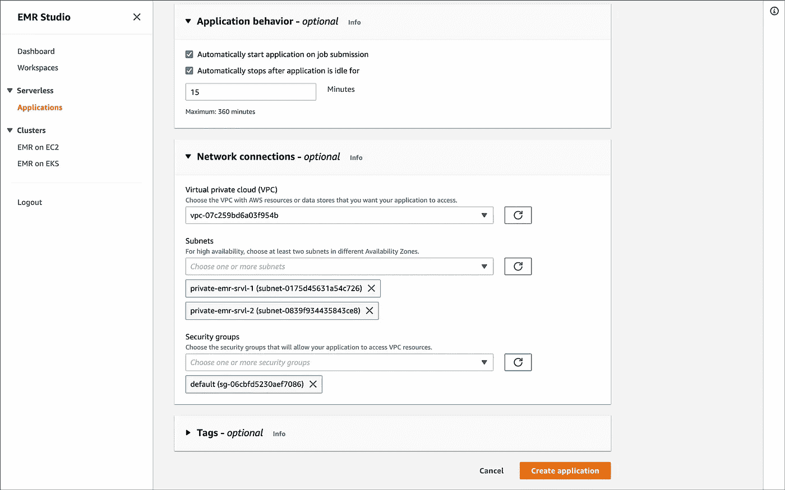

EMR Studio 无服务器应用程序创建控制台

根据[文档](https://docs.aws.amazon.com/emr/latest/EMR-Serverless-UserGuide/vpc-access.html)，为 EMR 无服务器选择的子网必须是私有子网。子网的相关路由表不应包含通往 Internet 的直接路由。

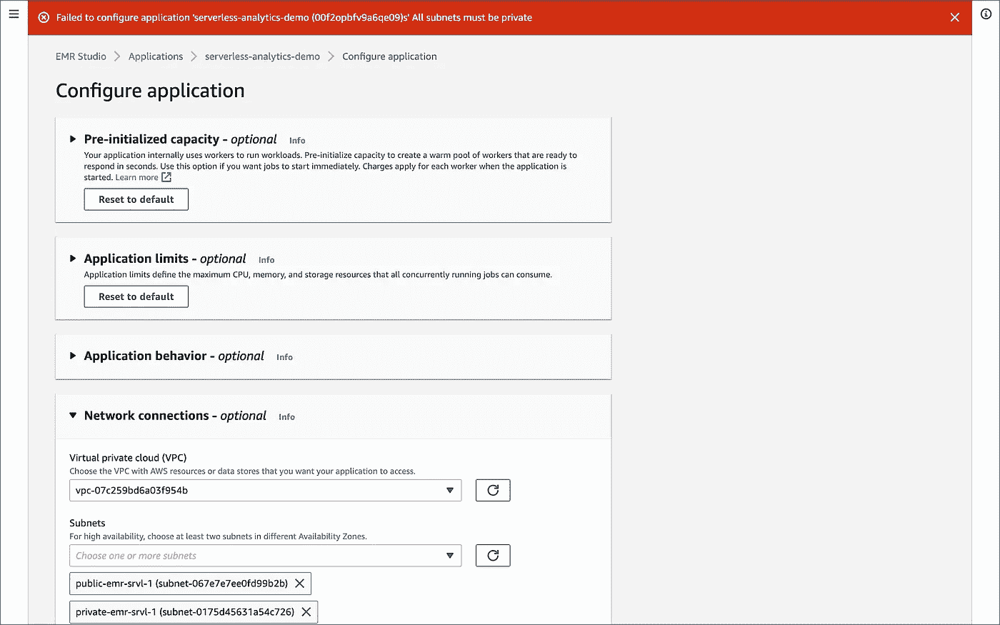

尝试将公共子网与 EMR 无服务器关联时出错

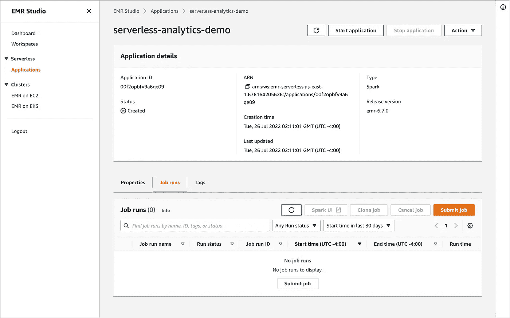

显示新应用程序的 EMR Studio 无服务器应用程序详细信息控制台

## 亚马逊 MSK 无服务器集群

同样，在继续之前，我建议你熟悉一下亚马逊 MSK 无服务器版的 AWS 文档，尤其是 [MSK 无服务器版](https://docs.aws.amazon.com/msk/latest/developerguide/serverless.html)。按照 AWS 文档[MSK 无服务器集群使用入门](https://docs.aws.amazon.com/msk/latest/developerguide/serverless-getting-started.html)创建一个新的 MSK 无服务器集群。MSK 无服务器集群的创建包括以下资源:

1.  Amazon EC2 Kafka 客户端实例的 AWS IAM 角色和相关 IAM 策略；
2.  至少有一个公共子网和相关安全组的 VPC；
3.  Amazon EC2 实例用作 Apache Kafka 客户端，在上述 VPC 的公共子网中提供；
4.  亚马逊 MSK 无服务器集群；

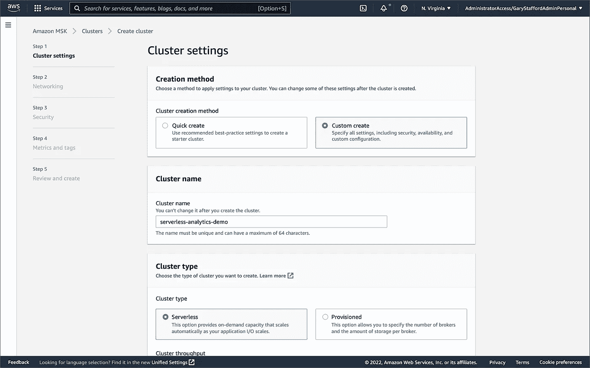

亚马逊 MSK 无服务器创建集群控制台

将新的 MSK 无服务器群集与 EMR 无服务器应用程序的 VPC 和两个专用子网相关联。此外，将集群与基于 EC2 的 Kafka 客户端实例的 VPC 及其公共子网相关联。

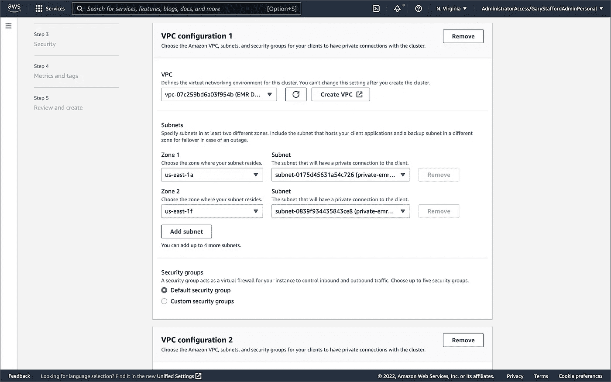

亚马逊 MSK 无服务器创建集群控制台— VPC 1

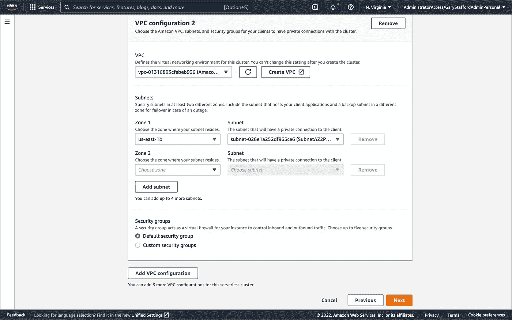

亚马逊 MSK 无服务器创建集群控制台— VPC 2

根据 AWS [文档](https://docs.aws.amazon.com/msk/latest/developerguide/msk-create-cluster.html#create-cluster-cli)，亚马逊 MSK 并不支持所有 az。例如，我试图在`us-east-1e`中使用一个子网时抛出了一个错误。如果发生这种情况，请选择另一个 AZ。


使用不支持的 AZ 导致错误

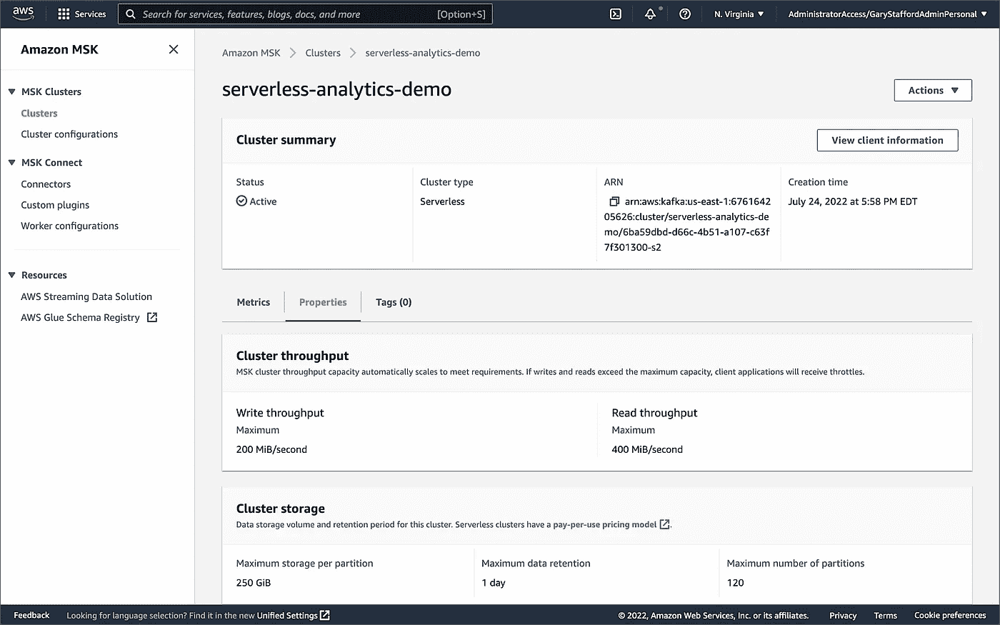

成功创建亚马逊 MSK 无服务器集群

## S3 的 VPC 端点

为了从运行在两个私有子网中的 EMR 无服务器访问亚马逊 S3 的 Spark 资源，我们需要一个用于 S3 的 [VPC 端点](https://docs.aws.amazon.com/vpc/latest/privatelink/concepts.html#concepts-service-consumers)。具体来说，一个[网关端点](https://docs.aws.amazon.com/AmazonS3/latest/userguide/privatelink-interface-endpoints.html#types-of-vpc-endpoints-for-s3)，它使用私有 IP 地址向亚马逊 S3 或 DynamoDB 发送流量。亚马逊 S3 的网关端点使您能够使用私有 IP 地址访问亚马逊 S3，而无需暴露于公共互联网。EMR Serverless 不需要公共 IP 地址，您也不需要互联网网关(IGW)、NAT 设备或 VPC 中的虚拟专用网关来连接到 S3。

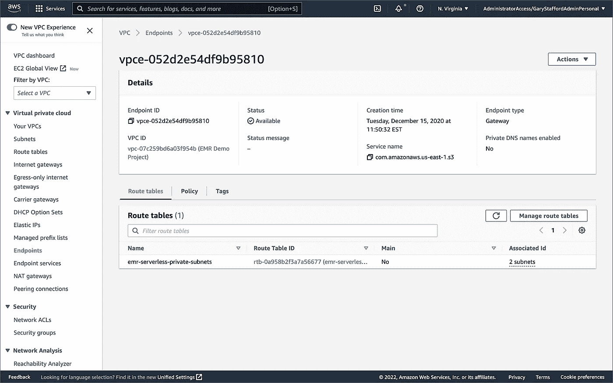

与专用子网路由表相关联的 S3 VPC 端点

为 S3 ( *网关端点*)创建 VPC 端点，并为两个 EMR 无服务器专用子网添加[路由表](https://docs.aws.amazon.com/vpc/latest/userguide/VPC_Route_Tables.html)。您可以向路由表中添加额外的路由，例如 [VPC 对等](https://docs.aws.amazon.com/vpc/latest/peering/what-is-vpc-peering.html)到 Amazon Redshift 或 Amazon RDS 等数据源的连接。但是，不要添加提供直接 Internet 访问的路由。

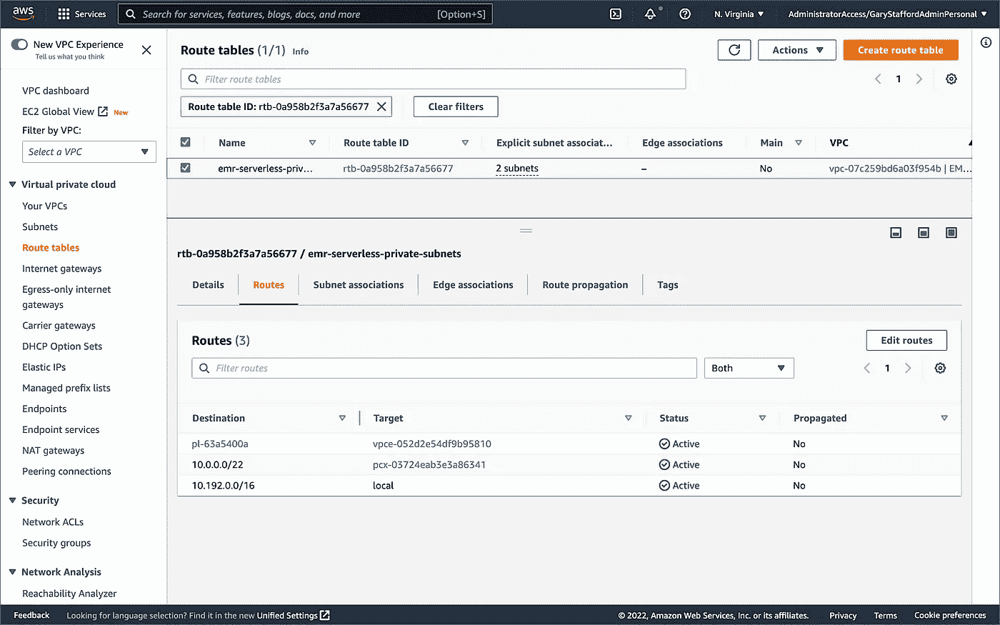

私有子网的路由表显示了 VPC 端点到 S3 的路由(显示的第一条路由)

## 卡夫卡主题和示例消息

一旦 MSK 无服务器集群和基于 EC2 的 Kafka 客户端实例被提供并运行，使用基于 EC2 的 Kafka 客户端实例创建三个必需的 Kafka 主题。我推荐使用 [AWS 系统管理器会话管理器](https://docs.aws.amazon.com/systems-manager/latest/userguide/session-manager.html)作为`ec2-user`用户连接到客户端实例。会话管理器提供安全和可审计的节点管理，无需打开入站端口、维护堡垒主机或管理 SSH 密钥。或者，您可以 SSH 到客户机实例。

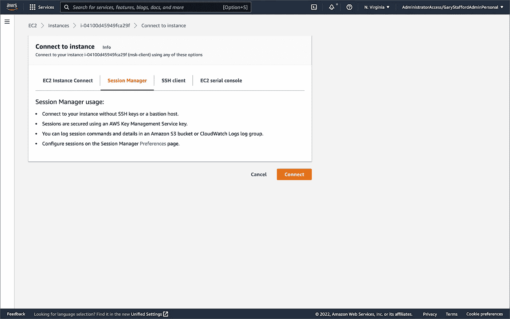

在创建主题之前，使用类似于`telnet`的实用程序来确认 Kafka 客户端和 MSK 无服务器集群之间的连接。验证连接性将为您省去许多潜在的安全和网络问题。

确认 MSK 无服务器集群连接后，创建三个 Kafka 主题:`topicA`、`topicB`和`topicC`。我使用 AWS [入门教程](https://docs.aws.amazon.com/msk/latest/developerguide/msk-serverless-create-topic.html)中的默认分区和复制设置。

为了创建一些快速的示例数据，我们将从 GitHub 项目中包含的文件`sample_data/sales_messages.txt`中复制 250 条消息并粘贴到`topicA`中。这些消息是简单的模拟销售交易。

使用`kafka-console-producer` Shell 脚本将消息发布到 Kafka 主题。使用`kafka-console-consumer` Shell 脚本，通过使用一些消息来验证到达主题的消息。

输出应该类似于下面的示例。

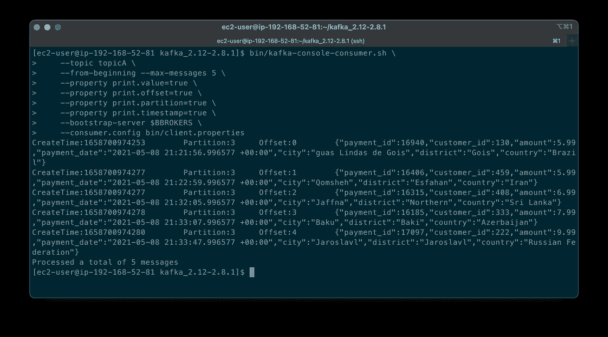

Kafka 主题的示例消息输出

## 亚马逊 S3 的星火资源

要提交并运行项目中包含的五个 Spark 作业，您需要将以下资源复制到您的 Amazon S3 bucket 中:(5) Apache Spark 作业，(5)相关的 JAR 依赖项，以及(2)样本数据文件。

**PySpark 应用程序** 首先，将五个 PySpark 应用程序复制到亚马逊 S3 桶内的`scripts/`子目录中。

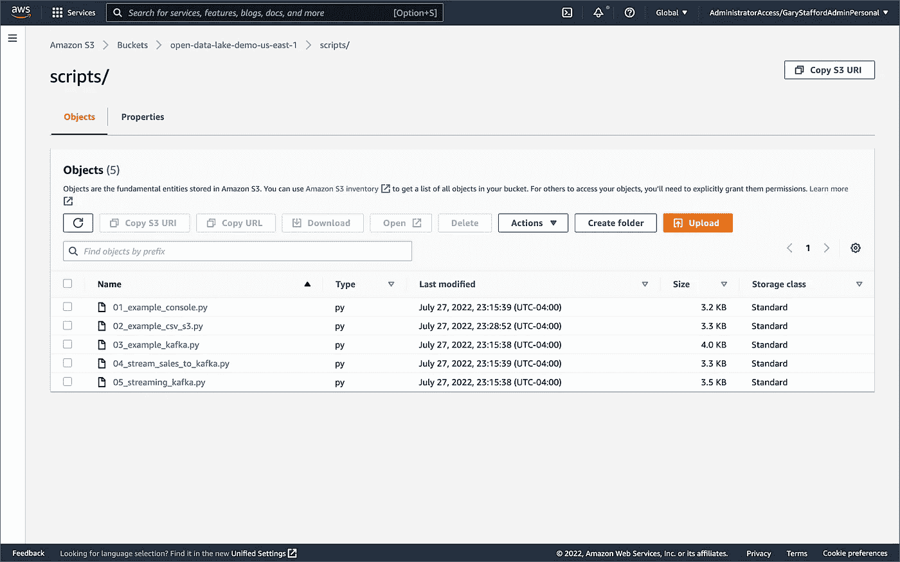

上传到亚马逊 S3 桶的 PySpark 应用程序

**示例数据**
接下来，将这两个示例数据文件复制到亚马逊 S3 存储桶中的一个`sample_data/`子目录中。大文件包含 2000 条消息，而小文件包含 600 条消息。这两个文件可以与帖子的最终流示例互换使用。

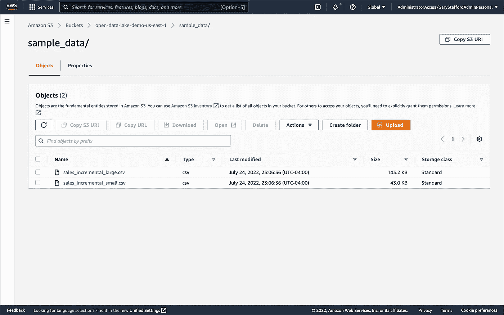

样本销售数据上传到亚马逊 S3 桶

最后，PySpark 应用程序有一些 JAR 依赖项，这些依赖项在作业运行时必须可用，默认情况下不在 EMR 无服务器类路径上。如果您不确定哪些 jar 已经在 EMR 无服务器类路径上，您可以检查 Spark UI 的[环境](https://spark.apache.org/docs/3.1.2/web-ui.html#environment-tab)选项卡的类路径条目部分。下面的第一个 PySpark 应用程序示例演示了如何访问 Spark UI。

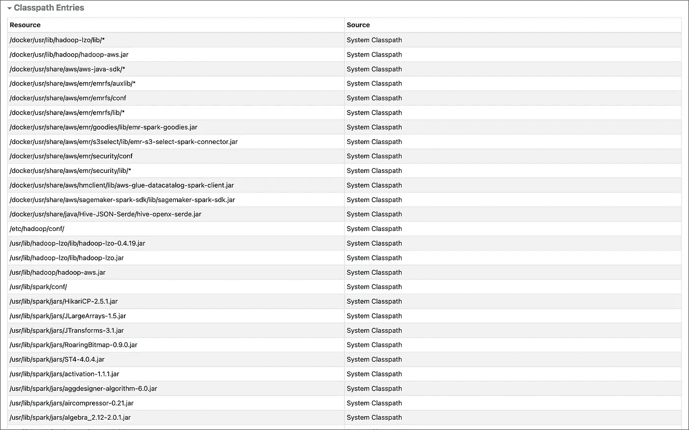

Spark UI 的环境选项卡显示类路径条目

根据 EMR 和 MSK 使用的库的版本，选择每个 JAR 依赖项的正确版本是非常关键的。使用错误的版本或不一致的版本，尤其是 Scala，会导致作业失败。具体来说，我们针对的是 Spark 3.2.1 和 Scala 2.12 ( [EMR v6.7.0](https://docs.aws.amazon.com/emr/latest/ReleaseGuide/emr-670-release.html) :亚马逊的 Spark 3.2.1、Scala 2.12.15、[亚马逊 Corretto 8](https://docs.aws.amazon.com/corretto/latest/corretto-8-ug/what-is-corretto-8.html) 版本的 OpenJDK)、阿帕奇 Kafka 2.8.1 (MSK 无服务器:Kafka 2.8.1)。

在本地下载这七个 JAR 文件，然后将它们复制到亚马逊 S3 桶中的一个`jars/`子目录中。


上传到亚马逊 S3 桶的依赖关系 jar

# PySpark 应用示例

随着 EMR 无服务器应用程序、MSK 无服务器集群、Kafka 主题和示例数据的创建，以及 Spark 资源上传到亚马逊 S3，我们已经准备好探索四个不同的 Spark 示例。

## 示例 1: Kafka 批处理聚合到控制台

第一个 PySpark 应用程序`01_example_console.py`从您之前发布的`topicA`中读取同样的 250 个示例销售消息，聚合这些消息，并将各个国家的总销售额和订单数量写入控制台(stdout)。

在任何 PySpark 应用程序示例中都没有硬编码的值。所有必需的特定于环境的变量，比如您的 MSK 无服务器引导服务器(主机和端口)和 Amazon S3 存储桶名称，将作为来自`spark-submit`命令的参数传递给正在运行的 Spark 作业。

要向 EMR 无服务器应用程序提交您的第一个 PySpark 作业，请从 AWS CLI 使用`emr-serverless` API。您将需要(4)个值:1)您的 EMR 无服务器应用程序的`application-id`，2)您的 EMR 无服务器应用程序的执行 IAM 角色的 ARN，3)您的 MSK 无服务器引导服务器(主机和端口)，以及 4)您的包含 Spark 资源的 Amazon S3 存储桶的名称。

切换到 EMR 无服务器应用程序控制台，您应该可以在几个[作业状态](https://docs.aws.amazon.com/emr/latest/EMR-Serverless-UserGuide/job-states.html)之一中看到您刚刚提交的新 Spark 作业。

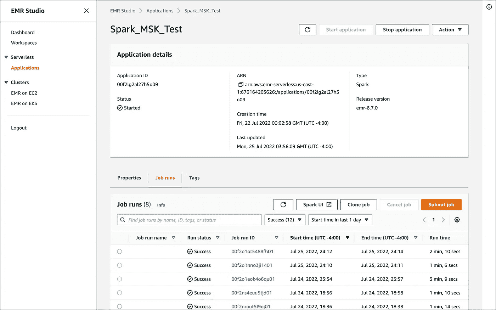

EMR Studio 无服务器应用程序详细信息控制台

你可以点击 Spark job 了解更多详情。注意从`spark-submit`命令传入的脚本参数和 Spark 属性。

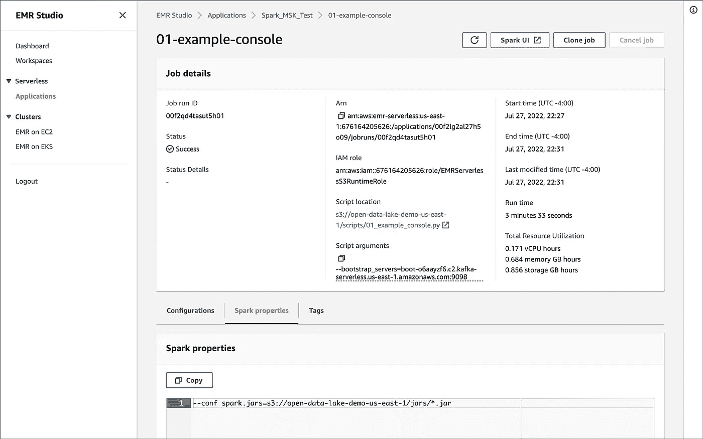

EMR Studio 无服务器应用程序详细信息作业详细信息视图

在 Spark job details 选项卡中，通过屏幕右上角的按钮访问 Spark UI，也称为 [Spark Web UI](https://spark.apache.org/docs/latest/web-ui.html) 。如果您有使用 Spark 的经验，您很可能熟悉 Spark Web UI 来监控和调优 Spark 作业。

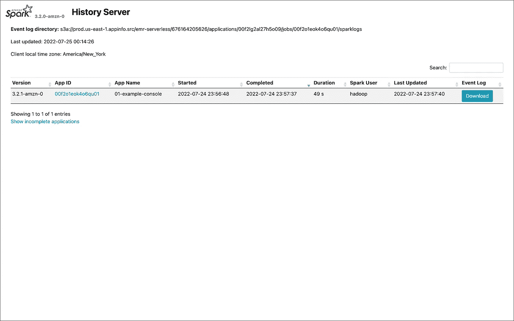

Spark 历史服务器用户界面

在初始屏幕的 Spark History Server 选项卡上，单击 App ID。您可以从 Spark Web UI 访问大量关于您的工作和 EMR 环境的 Spark 相关信息。

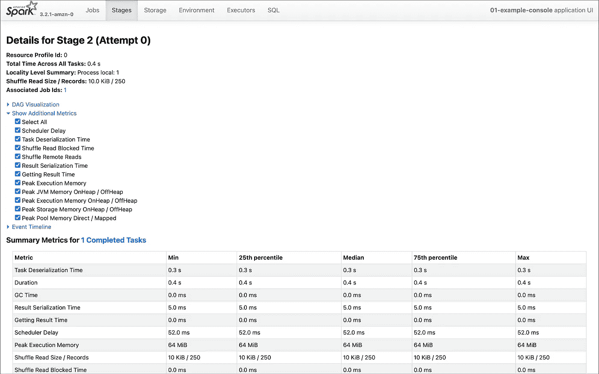

Spark UI 的[阶段](https://spark.apache.org/docs/3.1.2/web-ui.html#stages-tab)选项卡

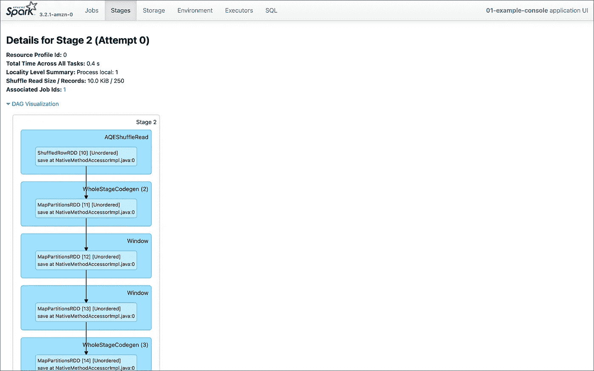

Spark UI 的 [Stages](https://spark.apache.org/docs/3.1.2/web-ui.html#stages-tab) 选项卡显示有向无环图(DAG)可视化

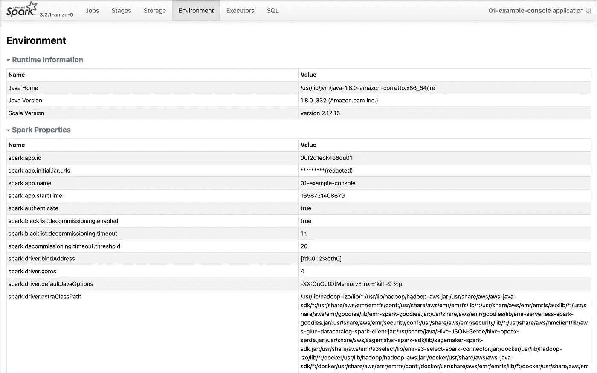

Spark UI 的环境选项卡显示环境变量，包括 Spark、Java 和 Scala 的版本

[Executors](https://spark.apache.org/docs/3.1.2/web-ui.html#executors-tab) 选项卡将让您访问 Spark 作业的输出。我们最感兴趣的输出是`driver`执行者的`stderr`和`stdout`(第二个表的*第一行，如下图*)。


Spark UI 的执行者选项卡

`stderr`包含与运行火花作业相关的输出。下面我们看到一个 Kafka 消费者配置值输出到`stderr`的例子。这些值中有几个是从 Spark 作业传入的，包括诸如`kafka.bootstrap.servers`、`security.protocol`、`sasl.mechanism`和`sasl.jaas.config`之类的项目。

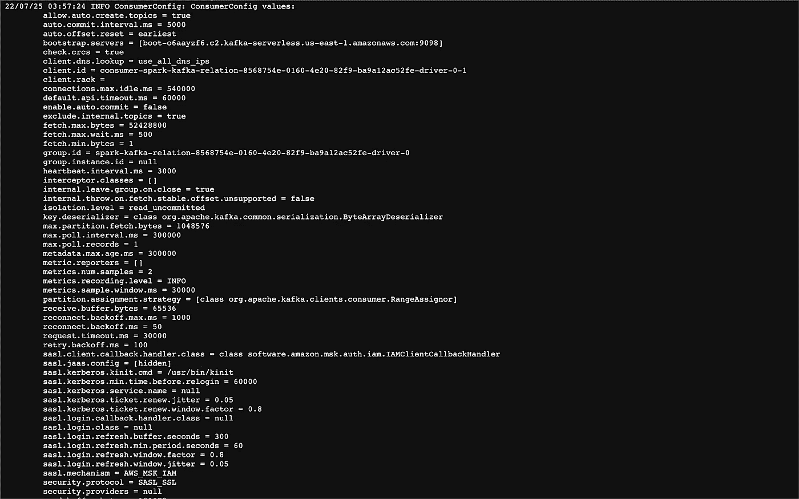

驱动程序执行器到控制台的 stderr 输出

来自`driver`执行器的`stdout`包含来自 Spark 作业的控制台输出。下面我们看到第一个 Spark 作业的成功聚合结果，输出到`stdout`。

## 示例 2:S3 Kafka 批量聚合为 CSV

尽管控制台对于开发和调试很有用，但它通常不用于生产。相反，Spark 通常将结果以 CSV、JSON、Parquet 或 Arvo 格式的文件发送给 S3、Kafka、数据库或 API 端点。第二个 PySpark 应用程序，`02_example_csv_s3.py`，从您之前发布的`topicA`中读取同样的 250 个示例销售消息，聚合这些消息，并将各个国家的总销售额和订单数量写入亚马逊 S3 的 CSV 文件中。

要向 EMR 无服务器应用程序提交第二个 PySpark 作业，请从 AWS CLI 使用`emr-serverless` API。与第一个例子类似，您将需要(4)个值:1)您的 EMR 无服务器应用程序的`application-id`，2)您的 EMR 无服务器应用程序的执行 IAM 角色的 ARN，3)您的 MSK 无服务器引导服务器(主机和端口)，以及 4)您的包含 Spark 资源的 Amazon S3 存储桶的名称。

如果成功，Spark 作业应该在指定的 Amazon S3 键(目录路径)中创建一个 CSV 文件和一个空的`_SUCCESS`指示器文件。空的`_SUCCESS`文件表示`save()`操作正常完成。

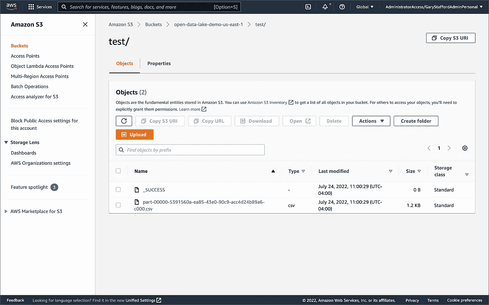

亚马逊 S3 桶显示由火花工作输出的 CSV 文件

下面我们看到第二个 Spark 作业的预期管道分隔输出。

## 示例 3: Kafka 批量聚合到 Kafka

第三个 PySpark 应用程序，`03_example_kafka.py`，从您之前发布的`topicA`中读取同样的 250 个示例销售消息，聚合这些消息，并将各个国家的总销售额和订单数量写入第二个 Kafka 主题，`topicB`。该作业现在具有读取和写入选项。

要向 EMR 无服务器应用程序提交您的下一个 PySpark 作业，请从 AWS CLI 使用`emr-serverless` API。与前两个例子类似，您将需要(4)个值:1)您的 EMR 无服务器应用程序的`application-id`，2)您的 EMR 无服务器应用程序的执行 IAM 角色的 ARN，3)您的 MSK 无服务器引导服务器(主机和端口)，以及 4)包含 Spark 资源的 Amazon S3 存储桶的名称。

一旦作业完成，您可以通过返回到基于 EC2 的 Kafka 客户端来确认结果。使用之前使用的相同的`kafka-console-consumer`命令显示来自`topicB`的消息。

如果 Spark 作业和 Kafka 客户端命令成功运行，您应该会看到类似于以下示例输出的聚合消息。注意，我们没有对 Kafka 消息使用[键](https://docs.streamsets.com/platform-datacollector/latest/datacollector/UserGuide/Pipeline_Configuration/KMessageKey.html#concept_ujc_cml_smb),只有这些简单示例的值。

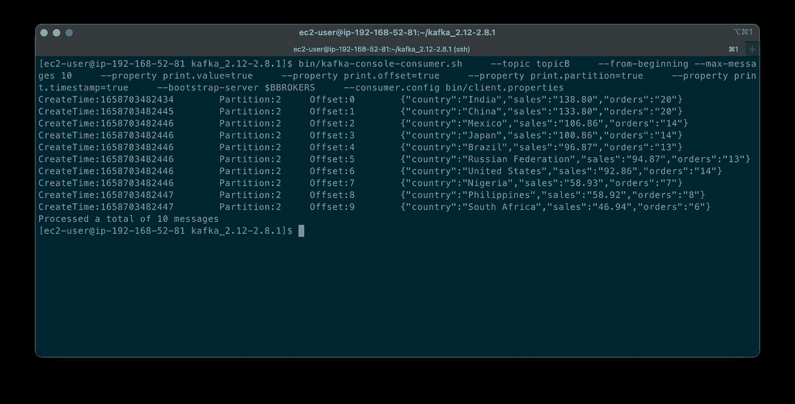

来自卡夫卡主题的聚合消息

## 示例 4: Spark 结构化流

对于我们的最后一个例子，我们将从批处理切换到流处理——从`read`到`readstream`以及从`write`到`writestream`。在继续之前，我建议阅读[结构化流编程指南](https://spark.apache.org/docs/latest/structured-streaming-programming-guide.html)。

[](https://spark.apache.org/docs/latest/structured-streaming-programming-guide.html) [## 结构化流式节目指南

### 结构化流是一个基于 Spark SQL 引擎的可扩展和容错的流处理引擎。

spark.apache.org](https://spark.apache.org/docs/latest/structured-streaming-programming-guide.html) 

在本例中，我们将演示如何持续测量一个常见的业务指标——实时销售量。假设您正在全球销售产品，并希望实时了解不同地理区域的时间和购买模式之间的关系。对于任何给定的时间窗口——这 15 分钟、这一小时、这一天或这一周——您想要了解各个国家的当前销售量。您不是在回顾以前的销售周期或检查运行的销售总额，而是在滑动时间窗口内的实时销售。

我们将使用两个并发运行的 PySpark 作业来模拟这一指标。第一个应用程序`04_stream_sales_to_kafka.py`通过向`topicC`连续写入消息来模拟流数据——2000 条消息，消息之间有 0.5 秒的延迟。在我的测试中，这个任务运行了大约 28-29 分钟。

与此同时，PySpark 应用程序`05_streaming_kafka.py`不断使用来自同一个主题`topicC`的销售交易消息。然后，Spark 在一个滑动的事件时间窗口内聚合消息，并将结果写入控制台。

要向 EMR 无服务器应用程序提交两个 PySpark 作业，请从 AWS CLI 使用`emr-serverless` API。同样，您将需要(4)个值:1)您的 EMR 无服务器应用程序的`application-id`，2)您的 EMR 无服务器应用程序的执行 IAM 角色的 ARN，3)您的 MSK 无服务器引导服务器(主机和端口)，以及 4)包含 Spark 资源的 Amazon S3 存储桶的名称。

切换到 EMR 无服务器应用程序控制台，您应该可以在几个[作业状态](https://docs.aws.amazon.com/emr/latest/EMR-Serverless-UserGuide/job-states.html)之一中看到您刚刚提交的两个 Spark 作业。

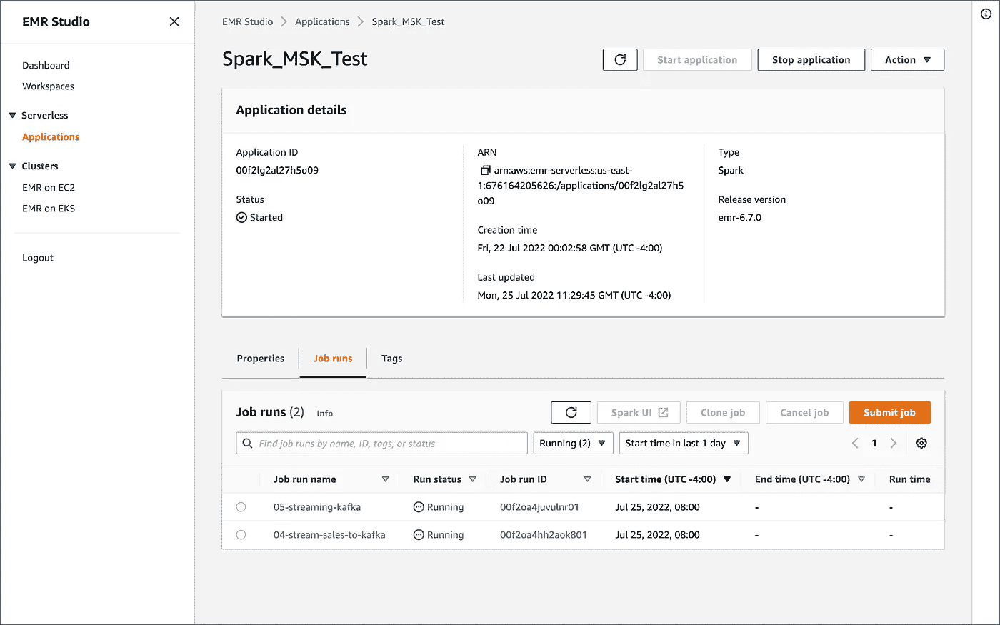

EMR Studio 无服务器应用程序详细信息控制台

再次使用 Spark UI，我们可以查看第二个作业`05_streaming_kafka.py`的输出。

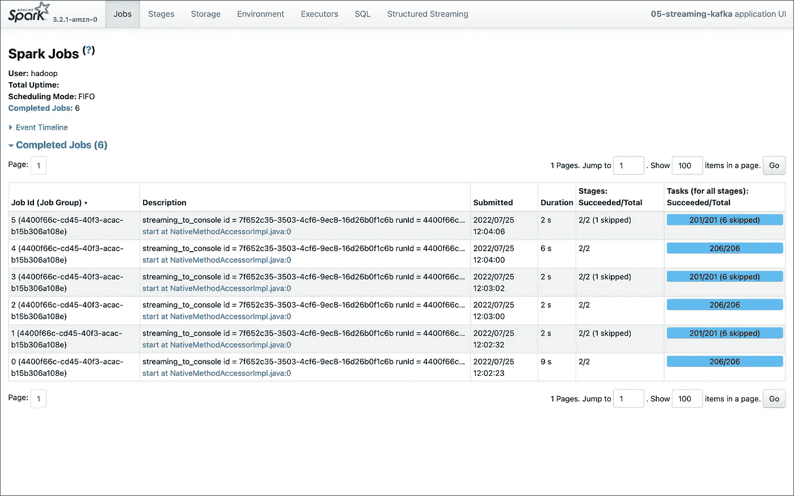

Spark UI 的作业选项卡

对于 Spark 结构化流作业，我们在 Spark UI 中有一个额外的选项卡，[结构化流](https://spark.apache.org/docs/3.1.2/web-ui.html#structured-streaming-tab)。该选项卡显示所有正在运行的作业及其最新的[微]批次号、数据到达的总速率以及 Spark 处理数据的总速率。不幸的是，由于 MSK 无服务器，AWS 似乎不允许通过运行 ID 访问详细的流查询统计数据，这大大降低了它的价值。单击运行 ID 超链接时，您会收到 502 错误。

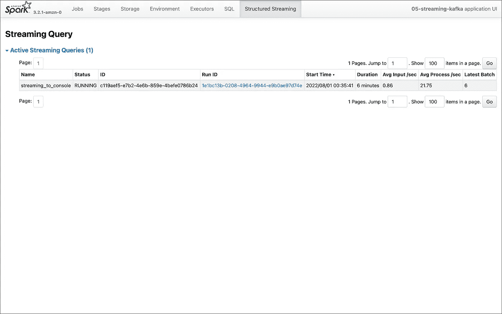

Spark UI 的结构化流标签

我们最感兴趣的输出再次包含在`driver`执行程序的`stderr`和`stdout`中(第二个表的*第一行，显示在*下面)。

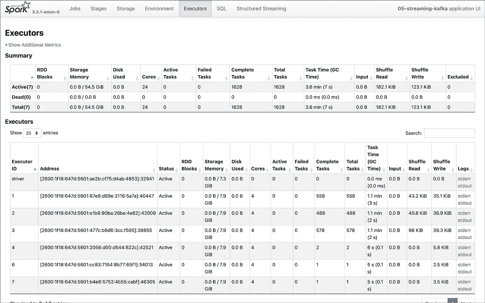

Spark UI 的执行者选项卡

下面我们看到来自`stderr`的样本输出。输出显示了微批次的结果。根据 Apache Spark [文档](https://spark.apache.org/docs/latest/structured-streaming-programming-guide.html)，在内部，默认情况下，使用*微批处理*引擎处理结构化流查询。该引擎将数据流作为一系列小批量作业进行处理，实现了低至 100 毫秒的端到端延迟和一次性容错保证。

火花结构流式微批次输出示例

与上面的微批处理输出相对应的输出如下所示。我们看到了最初的微批处理结果，从任何消息流到`topicC`之前的第一个微批处理开始。

Spark 结构化流式微批次结果到控制台的示例

如果您熟悉 Spark 结构化流，您可能会意识到这些 Spark 作业是连续运行的。换句话说，流式作业不会停止；他们不断地等待更多的流数据。

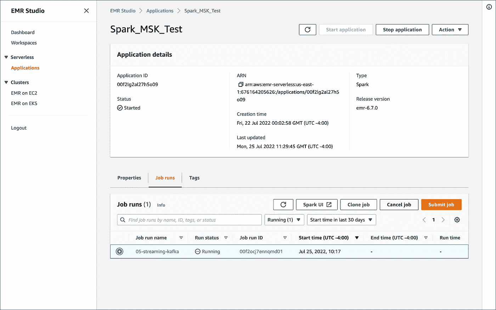

EMR Studio 无服务器应用程序详细信息控制台

第一个作业`04_stream_sales_to_kafka.py`将运行大约 28–29 分钟，并以状态`Sucess`停止。但是，第二个作业`05_streaming_kafka.py`，Spark 结构化流作业，必须手动取消。

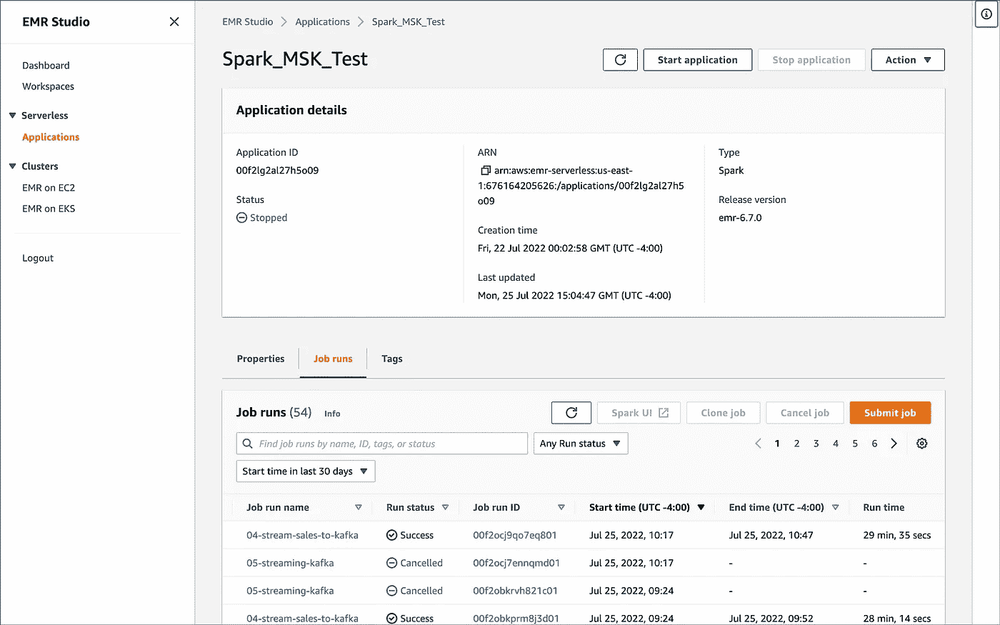

EMR Studio 无服务器应用程序详细信息控制台

# 清理

您可以从 AWS 管理控制台或 AWS CLI 删除您的资源。但是，要删除您的 Amazon S3 存储桶，必须先删除存储桶中的所有对象(包括所有对象版本和删除标记)，然后才能删除存储桶本身。

# 结论

在这篇文章中，我们发现在 AWS 上采用无服务器的分析方法是多么容易。使用 EMR Serverless，您不必配置、优化、保护或操作集群来运行这些框架的应用程序。有了 MSK 无服务器版，你可以按需使用 Apache Kafka，并为你传输和保留的数据付费。此外，MSK 无服务器自动配置和扩展计算和存储资源。如果有合适的分析使用案例，EMR 无服务器和 MSK 无服务器可能会节省您的时间、精力和费用。

这篇博客代表我的观点，而不是我的雇主亚马逊网络服务公司的观点。所有产品名称、徽标和品牌都是其各自所有者的财产。除非另有说明，所有图表和插图都是作者的财产。