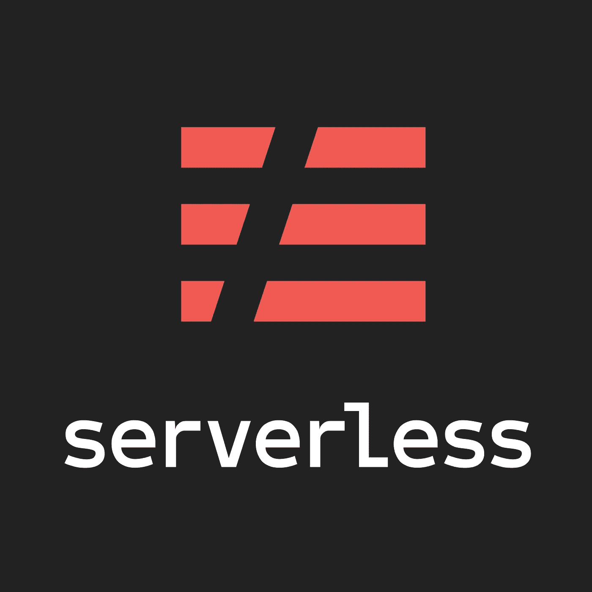
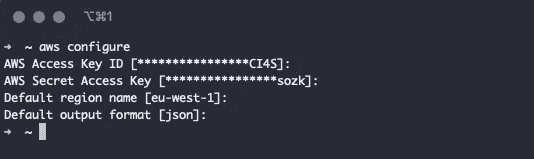
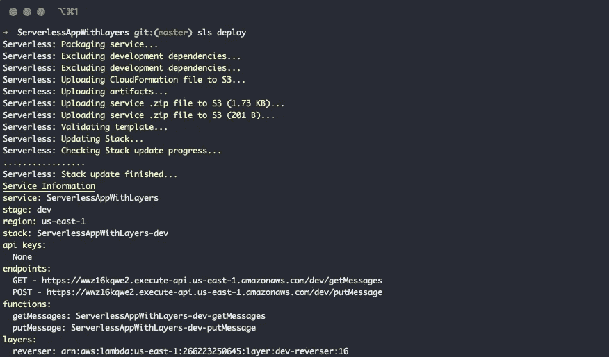
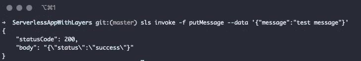
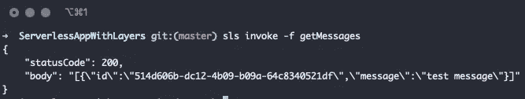
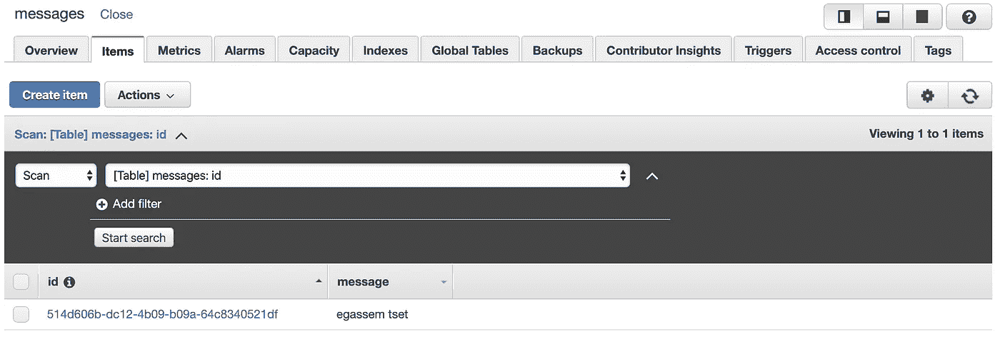

# 使用无服务器框架在 AWS 平台上使用 Node.js 开发无服务器应用程序

> 原文：<https://itnext.io/serverless-application-development-with-node-js-on-aws-platform-using-serverless-framework-63e79fcf9409?source=collection_archive---------0----------------------->

在本教程中，我们将使用各种 **AWS 服务**在 **AWS** 平台上**创建和部署一个无服务器 Node.js 应用程序**，例如使用 [**无服务器框架**](https://serverless.com/) 的 **Lambda** 、**层**、 **DynamoDB** 、 **API 网关**。



来源:[http://serverless.com](https://serverless.com/)

让我们先安装无服务器框架。

```
sudo npm install -g serverless
```

安装完成后，**您需要配置您的 AWS 凭证**。您可以在下面找到所需的信息:

[](https://serverless.com/framework/docs/providers/aws/guide/credentials/) [## 无服务器框架— AWS Lambda 指南—凭据

### 无服务器框架需要访问您的云提供商帐户，以便能够在您的上创建和管理资源…

serverless.com](https://serverless.com/framework/docs/providers/aws/guide/credentials/) 

我会选择`aws configure`来保持简单，但是我强烈建议你使用*IAM roles*来代替。



AWS SDK 配置

完成配置后，您可以使用以下命令测试无服务器框架。

使用`aws-nodejs`模板创建新服务:

```
sls create --template aws-nodejs --path myService
```

无服务器 CLI 将为您创建一个空的`hello world`服务，带有`serverless.yml`和`handler.js`，您可以使用它们来测试您的`serverless`配置。

我们要做的是从头开始创建一个无服务器应用程序，并将其部署到 AWS 平台。

首先，在项目目录的根目录下创建`serverless.yml`文件。

让我们开始配置无服务器应用程序。

在`serverless.yml`文件的这一部分，我们定义了我们将要使用的服务和提供者资源。在我们的例子中，提供者是 AWS。

将下列行添加到`serverless.yml`文件中。

我们在`dev`阶段配置了我们的服务，并且**分配了访问`messages` DynamoDB 表所需的权限**;因此，我们需要创建`messages`表。

现在是时候**创建我们的 Lambda 函数**了。

在项目目录的根目录下创建一个`functions`目录，并将以下 JavaScript 文件放入其中。

getMessages.js

`getMessages` Lambda 函数将允许我们**从我们的 DynamoDB 表中检索消息。**

putMessage.js

`putMessage` Lambda 函数将让我们**把消息放到我们的 DynamoDB 表中。**

现在，我们准备在`serverless.yml`文件中配置我们的 Lambda 函数。

我们配置了我们的函数处理程序，并使用 API Gateway 将它们连接到 HTTP 端点。

您可能注意到了，我们在应用程序中引用了我们的层。

> **来自 AWS 文档:**
> 
> **层**是包含库、[自定义运行时](https://docs.aws.amazon.com/lambda/latest/dg/runtimes-custom.html)或其他依赖项的 ZIP 存档。**有了层，您可以在您的函数中使用库，而不需要将它们包含在您的部署包中。**
> 
> **关于图层的重要提示:**
> 
> 您的功能可以在 `**/opt**` **目录**中访问执行期间该层的内容。图层按指定的顺序应用，合并任何同名的文件夹。如果同一文件出现在多个图层中，则使用最后一个应用图层中的版本。
> 
> [https://docs . AWS . Amazon . com/lambda/last/DG/configuration-layers . html](https://docs.aws.amazon.com/lambda/latest/dg/configuration-layers.html)

现在是时候配置我们的图层了。

在项目目录的根目录下创建`layers/reverser`目录，并将下面的 JavaScript 文件放入其中。

这只是一个**简单的 JavaScript 模块，用来反转我们将用来测试我们的层实现的输入字符串**。

现在，让我们在`serverless.yml`文件中添加以下几行来配置我们刚刚创建的`Reverser`层。

> **来自 AWS 文档的重要提示:**
> 
> 一个功能**一次最多可以使用 5 层**。功能和所有层的总解压缩大小**不能超过**250 MB 的解压缩部署包大小**限制**。更多信息参见 [AWS Lambda Limits](https://docs.aws.amazon.com/lambda/latest/dg/limits.html) 。
> 
> [https://docs . AWS . Amazon . com/lambda/latest/DG/configuration-layers . html](https://docs.aws.amazon.com/lambda/latest/dg/configuration-layers.html)

最后，**通过在终端中执行以下命令，我们已经准备好将无服务器应用程序**部署到 AWS 平台。

```
sls deploy
```

作为该执行的结果，您应该会看到类似于下面的屏幕。



为了测试你的应用程序，你可以使用**你的** `sls deploy`的输出中声明的端点，或者你可以在你的项目的根目录中用`sls`CLI**调用你的 Lambda 函数**。

让我们用`sls` CLI 试试。

```
sls invoke -f putMessage --data '{"message":"test message"}'
```

结果应该如下所示:



现在，让我们试着获取放入`messages`表的消息。

```
sls invoke -f getMessage
```

结果应该如下所示:



此外，您可以在 **AWS 控制台**上的 DynamoDB 表中看到您的消息**。**



字符串反向模块工作正常，表中的消息似乎是反向的。

您可以在下面的 [Github 资源库](https://github.com/gkhn/ServerlessAppWithLayers)中找到包含本教程中使用的文件的项目。

[](https://github.com/gkhn/ServerlessAppWithLayers) [## gkhn/ServerlessAppWithLayers

### 演示使用 AWS API Gateway、Lambda、Layers 和 DynamoDB 构建的无服务器应用程序

github.com](https://github.com/gkhn/ServerlessAppWithLayers)