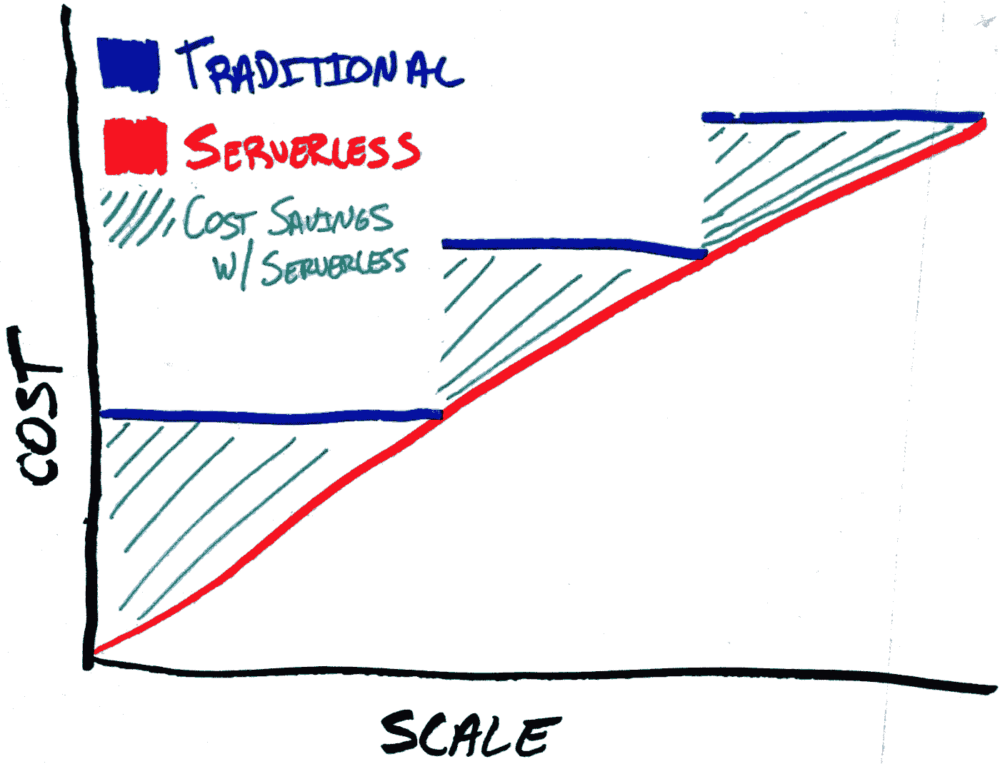
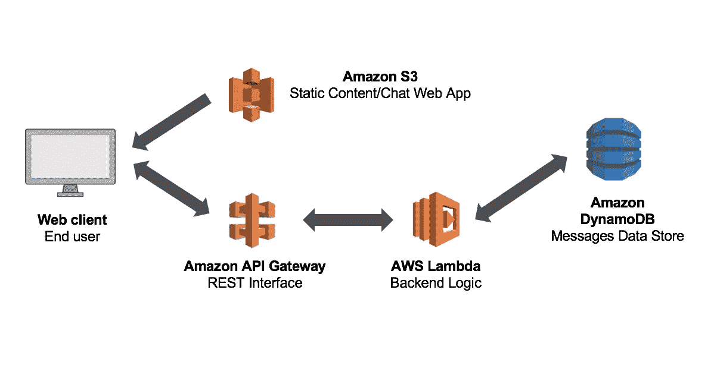

# 无服务器概念是可伸缩性的关键

> 原文：<https://itnext.io/serverless-concept-is-the-key-of-scalability-66e7086399c6?source=collection_archive---------1----------------------->

来源:[https://www . trek 10 . com/blog/server less-framework-for-processes-projects-and-scale/](https://www.trek10.com/blog/serverless-framework-for-processes-projects-and-scale/)

从这张图片中，您可能已经了解了无服务器的概念。即使不深究细节，显然无服务器应用程序更具可伸缩性和成本效益。

我已经听到你们的想法“如果它更具可扩展性和效率，为什么我们还在使用传统的服务器和应用程序？”。答案有点棘手，因为**这要看情况！** *大多数公司仍在努力转向微服务，因此无服务器对他们来说还不严重！*如果您使用事件驱动原则从头开始构建无服务器应用程序(或将其分离出来)，那么无服务器应用程序的成本效益会更高(参见下面的案例)*并非所有编程语言都足够灵活，能够支持可扩展的无服务器功能。*显然，开发人员和公司需要更多的案例研究来了解这一新原则

我们将打破这一点，并获得更多关于什么时候选择无服务器原则是正确的见解，即使是你的应用程序的一小部分。

# 无服务器是如何构建和工作的。

“无服务器”并不意味着没有服务器，它只是一个术语，你基本上不知道谁在运行你的代码，你对执行环境没有任何控制。你只是给出一个代码/函数，并接收返回的结果。在 AWS 发布了他们的`Amazon Lambda`服务后，这种让应用程序广泛应用的概念开始发展，他们只是将其宣传为事件接收器，而不是应用程序的主要执行部分。但它可能是应用程序的主要逻辑。

AWS Lambda 基本结构

假设你有一个函数，它从 S3 桶中获取一个图像并调整其大小。首先，这是一项 CPU 密集型操作，其可扩展性取决于服务器数量。另一方面，AWS Lambda 说“根本不关心可伸缩性！只要按执行时间付费”，如果你的应用程序是最佳的，你将支付更少的钱！在过去的 3-4 年里，我看到许多公司转向 AWS Lambda，开始编写更优化的代码，并投资于代码清理。这真是个好主意！

所以你现在可以想象，Serverless 实际上很小`Containers`，它有预定义的函数结构来控制执行时间、内存，并在超出规则时限制程序，因为它是纯微服务原则构建的，所以它很容易扩展，或移动到另一个服务器。每个容器本身都是原子的，彼此之间没有显著的关系，因为它不关心你的代码逻辑，这是最重要的部分。

> 单点逻辑更少，系统的可扩展性更强

# 为什么使用无服务器在经济上是合理的

> 想象一下，你正在编写代码，你将为每一个非优化的功能支付真金白银。这极大地推动了编写干净的代码，并最终产生更可靠、错误更少的代码。这一切都变成了经济方面。公司开始减少对代码重构的投资，猜猜会发生什么？，如果你有一个干净的代码，在大多数情况下，你可以用更少的开发人员更容易地扩展它。

除了干净代码带来的好处之外。如果您考虑到可扩展性，并且当您的负载较低时，您实际上在大多数情况下比使用专用服务器支付的费用更低。现在经常出现的唯一缺点是，您无法控制代码执行的环境，但随着时间的推移，这不会有问题，因为我们已经开始信任公共云了。

# TreeScale 如何变得无服务器

在 [TreeScale](https://treescale.com) 开始时，我们有专用的服务器，因为我们是一个核心工程师团队:)但随着时间的推移，我们发现我们的技术非常适合无服务器的思想，并且已经有了事件驱动原则，这是启动新的 TreeScale 无服务器企业产品的理想选择，这基本上是 AWS Lambda 的完全替代，但在您自己的服务器上，您可以控制，或者如果您需要多云实施。公共版本仍在开发中，但在与我们的客户进行了几个月的测试后，我们很想看看你会用它来做什么！

我敢肯定，云计算的未来在向无服务器方向发展，即使你考虑区块链智能合约，那也是无服务器执行原则！

感谢您阅读这篇文章，并感谢👏！