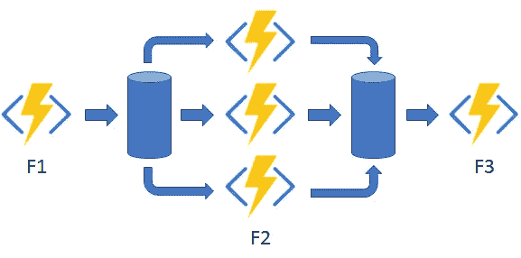
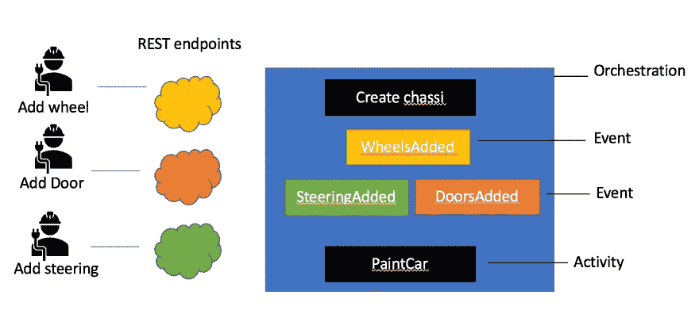
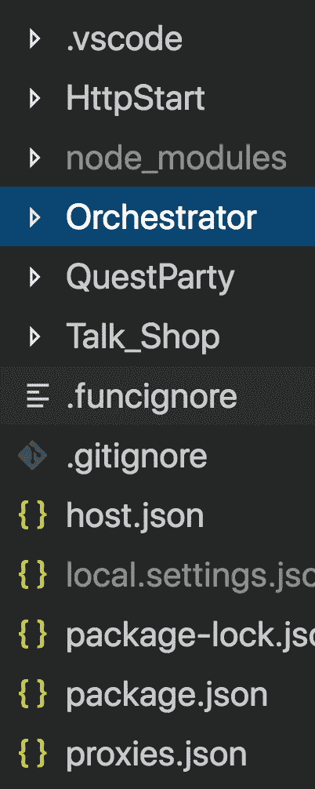
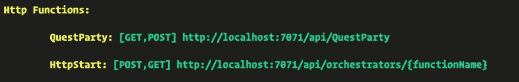
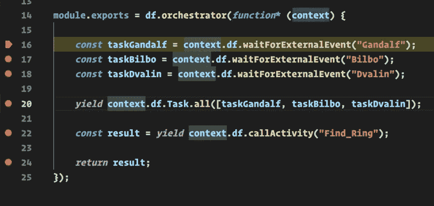
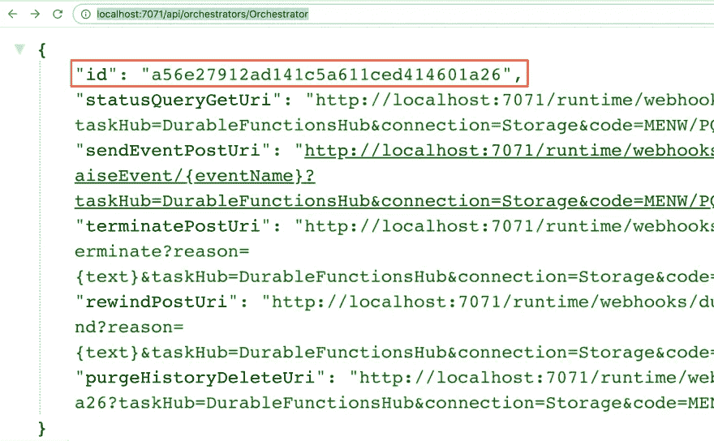
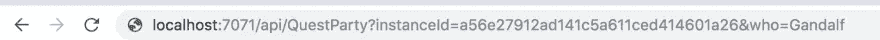
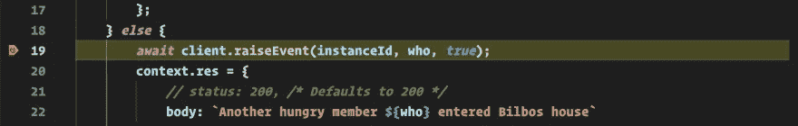
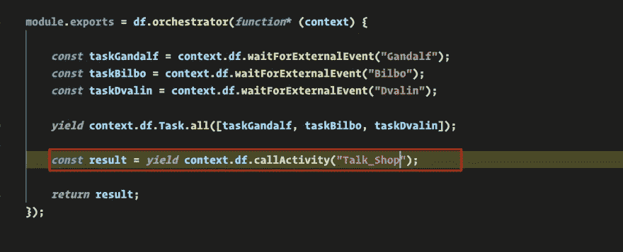

# 无服务器、持久的函数，如何学习实现扇出/扇入模式

> 原文：<https://itnext.io/serverless-durable-functions-how-you-can-learn-to-implement-the-fan-out-fan-in-pattern-b6a6ae671cfc?source=collection_archive---------5----------------------->


在 [Twitter](https://twitter.com/chris_noring) 上关注我，很乐意接受您对主题或改进的建议/Chris

> *持久函数使你能够编写大型复杂的应用程序流。最好的部分是，它使用你知道的无服务器功能。你只需要专注于定义事情应该如何流动。*

在第一部分[第一部分——持久功能](https://dev.to/azure/durable-functions-stateful-long-running-functions-in-serverless-part-i-5bm)中，我们尝试学习不同的核心概念，例如:

*   **Orchestrator 函数**，这是包含您的业务流程的函数
*   **活动功能**，执行实际工作的功能
*   **客户端功能**，入口点

在第一篇文章中，我们构建了一个应用程序，一个接一个地执行许多活动功能。
以这种方式执行功能有一个名字，*链接*，是一种已知的应用模式。

在本文中，我们将了解:

*   **应用模式**，让我们仔细看看持久功能使用的最常见的架构模式。
*   **扇出/扇入**，我们将特别放大*扇出/扇入*图案。
*   **实验室**，作为我们学习*扇出/扇入*模式的一部分，我们将用它来构建一些东西，以确保我们理解核心概念

# 资源

- [免费账户 Azure 账户](https://azure.microsoft.com/en-gb/free/?wt.mc_id=medium-blog-chnoring)你需要在 Azure 上注册使用持久函数
- [用 JavaScript 创建你的第一个持久函数](https://docs.microsoft.com/en-us/azure/azure-functions/durable/quickstart-js-vscode?wt.mc_id=medium-blog-chnoring)快速入门，带你创建持久函数
- [持久函数概念](https://docs.microsoft.com/en-us/azure/azure-functions/durable/durable-functions-concepts?wt.mc_id=medium-blog-chnoring)在这里阅读更多关于概念和模式以及如何实现所述模式的内容。
- [Orchestrator 功能约束](https://docs.microsoft.com/en-us/azure/azure-functions/durable/durable-functions-checkpointing-and-replay#orchestrator-code-constraints?wt.mc_id=medium-blog-chnoring)您需要了解的约束。
- [具有持久功能的事件处理](https://docs.microsoft.com/en-us/azure/azure-functions/durable/durable-functions-external-events?wt.mc_id=medium-blog-chnoring)
如何引发和处理事件。
- [应用模式](https://docs.microsoft.com/en-us/azure/azure-functions/durable/durable-functions-concepts?wt.mc_id=medium-blog-chnoring)
对您可以实现的不同应用模式的描述

# 应用模式

对于持久函数，我们可以使用不止一种模式。让我们从更高的角度来看一下我们拥有的最常见的应用程序模式:

*   链接，一系列函数以特定的顺序执行，这是我们在持久函数系列的第一篇文章中使用的模式
*   **扇出/扇入**，并行执行多个功能，然后等待所有功能完成
*   **异步 HTTP API**，实现这种模式的一种常见方式是让 HTTP 调用触发长时间运行的动作。然后，将客户端重定向到一个状态端点，客户端轮询该端点以了解操作何时完成
*   **监控**，指的是工作流程中一个灵活的、循环的流程。一个例子是轮询直到满足特定条件
*   许多自动化流程都涉及到某种形式的人工交互。让人类参与自动化过程是很棘手的，因为人们不像云服务那样高度可用和响应迅速。自动化流程可以通过使用超时和补偿逻辑来实现这一点

# 扇出/扇入

下图很好地解释了这种模式:



在这个模式中，我们开始执行函数`F1`。此后，我们有三个并行函数，我们希望在继续执行函数`F3`之前执行它们。我们执行这三个并行函数的顺序并不重要。关键是他们都需要完成，然后我们才能继续。

这里有很多问题，比如:

1.  我什么时候会使用这种模式
2.  如果我使用这个模式，我将如何实现它？

让我们试着依次回答每个问题。*什么时候*你会用？这种行为在很多工作流中都有体现。一个非常常见的领域可能是工厂中的装配线。假设我们有一个玩具汽车工厂。想象一下，你从制造底盘开始，这将是第`F1`步。然后，它移动到一个工位，在那里 3 个不同的装配工都需要把他们自己的东西添加到这个产品上。一个人加轮子，第二个人车门，第三个人加发动机。然后，当它们完成时，它移动到最后一个工位 F3，在那里玩具车获得一层油漆。

这就是了。漂亮的车和快乐的孩子。:)


现在你可能在某个地方工作，在那里你做的事情没有让孩子们开心那么有魅力，但原则是一样的。你有一个由几个步骤组成的东西，你想让一些步骤并行执行，一些按顺序执行。

现在，让我们试着回答另一个问题，即*如何*。

我们在持久函数中有一些很好的构造，这些构造使我们能够并行运行，并使我们能够等待一组活动，直到它们都处理完。

你问的那些结构是什么？他们有三个人:

1.  **引发**外部事件
2.  **等待**外部事件
3.  **决策**逻辑

这里的第一个看起来像这样:

```
await client.raiseEvent(instanceId, 'EventName', <value>);
```

第二个构造如下所示:

```
yield context.df.waitForExternalEvent("EventName");
```

第三个构造如下所示:

```
yield context.df.Task.all([gate, gate2, gate3]);
```

它需要更多的解释。它回答了我们应该如何等待的问题。上面说我将`gate`、`gate2`和`gate3`全部解决，然后再采取下一步行动。在 Orchestrator 函数中一起使用时，它可能看起来像这样:

```
const gate = context.df.waitForExternalEvent("WheelsAddedEvent");

const gate2 = context.df.waitForExternalEvent("DoorsAddedEvent");

const gate3 = context.df.waitForExternalEvent("SteeringAddedEvent");

yield context.df.Task.all([gate, gate2, gate3]);

const result = yield context.df.callActivity("Send_Car_To_Be_Painted");
```

现在，上面说，任何上述事件可以以任何顺序发生，但我们将只发送我们的玩具车被油漆，如果所有需要的汽车部件都已添加。

我可以想象你现在在想什么。那养个事件呢？。我什么时候做那个？想象一下，在每一个组装点，你做的实际工作是添加轮子、门或转向，在你完成之后，你调用一个 REST 端点，这个端点最终引发它各自的事件。让我用一张图展示一下:



理解如何构建这样一个流程可能还有点模糊。别担心，我们会在下一个标题中展示这一点。

# 实验室——夏尔的晚餐会议

在本实验中，我们将使用我们刚刚介绍的所有概念，即如何引发事件、等待事件以及介绍两种不同的决策逻辑方法。

这个演示的主题是 LOTR 或指环王，更具体地说是电影霍比特人的开始。那里发生了什么？这一切都是从夏尔的一个晚宴开始的，在那里，探险队的所有成员都聚在一起，共进晚餐，然后他们就出发了。当然，它们最后会吃掉比尔博所有的食物，但那是另一回事了。

现在，选择这个场景来演示持久功能的原因是它代表了一种*扇出/扇入*模式。一些最初的事情发生了。然后一个接一个的晚宴客人到了，顺序无所谓。当他们都到达并吃过晚餐后，他们终于可以继续他们的冒险了。

> *好了，我们需要*在持久函数中编排*这一点，那么我们从哪里开始呢？*

让我们首先确定我们有哪些*事件*。如果你没记错你的霍比特人电影，晚餐客人一个接一个到达。所以客人*到达*是一个事件。我们也有一些决策逻辑。一旦所有参加晚宴的客人都聚集在一起，他们就开始谈论他们的大计划。所以我们需要等所有人都到达后才能继续。有了这些知识，我们实际上可以开始推敲我们的 orchestrator 逻辑，就像这样:

```
const gate = context.df.waitForExternalEvent("BilboArrived");

const gate2 = context.df.waitForExternalEvent("DvalinArrived");

const gate3 = context.df.waitForExternalEvent("GandalfArrived");

yield context.df.Task.all([gate, gate2, gate3]);

const result = yield context.df.callActivity("Talk_Shop");
```

上面我们已经创建了三个不同的事件`BilboArrived`、`DvalinArrived`、`GandalfArrived`，最后，我们有一个活动，当所有的晚餐客人都到位后，我们就开始`Talk_Shop`。

> *是的，是的，我知道还有很多客人，但以上将说明原则:)*

从我们的概览图中我们了解到，我们可以创建带有 HTTP 触发器的普通 Azure 函数，当完成时可以引发事件，所以差不多就是这样，接下来让我们将它变成实际的代码。

# 支持我们的项目

我们首先调用我们的命令面板，或者是`CMD + SHIFT + P`或者是`View > Command Palette`，然后我们选择下面的选项


接下来是创建一个`HttpStart`函数。我们再次调用命令面板，选择创建 Azure 函数并选择`Durable Functions HTTP Starter`。

之后，我们选择创建一个 orchestrator 函数。我们遵循与上面相同的步骤，但是我们选择了名为`Durable Functions Orchestrator`的步骤。

然后我们选择创建一个普通的`Azure Function`，我们选择它作为一个 HTTP 触发器，并将其命名为`QuestParty`。

最后，我们创建一个`Durable Functions activity`，并选择将其命名为`Talk_Shop`。

您的目录应该如下所示



# 设置 orchestrator

好了，我们已经画出了这个可能的样子，但是再来一次:

```
const taskGandalf = context.df.waitForExternalEvent("Gandalf");
const taskBilbo = context.df.waitForExternalEvent("Bilbo");
const taskDvalin = context.df.waitForExternalEvent("Dvalin");

yield context.df.Task.all([taskGandalf, taskBilbo, taskDvalin]);

const result = yield context.df.callActivity("Talk_Shop");

return result;
```

上面的代码说我们正在等待事件`Bilbo`、`Dvalin`、`Gandalf`，没有特定的顺序，下面的代码行说在我们继续之前这三个事件都需要发生:

```
yield context.df.Task.all([taskGandalf, taskBilbo, taskDvalin]);
```

是的，我们的最后一步是调用活动`Talk_Shop`:

```
const result = yield context.df.callActivity("Talk_Shop");
```

这就是配器。

# 设置 HTTP 触发的`QuestParty`功能

好，那么这个函数是由 HTTP 触发的。我们可以看到，如果我们进入`QuestParty/function.json`，特别是这个绑定条目:

```
{
  "authLevel": "anonymous",
  "type": "httpTrigger",
  "direction": "in",
  "name": "req",
  "methods": [
    "get",
    "post"
  ]
}
```

但是，我们不得不添加一个东西来使它发挥作用，即这个条目:

```
{
  "name": "starter",
  "type": "orchestrationClient",
  "direction": "in"
}
```

这使我们能够与编排客户端实例对话，我们将需要它来引发事件。现在，让我们看看下一个`QuestParty/index.js`的代码:

```
const df = require("durable-functions");

module.exports = async function (context, req) {
  context.log('Quest party member arrival');

  const { who, instanceId }  = req.query;

  const client = df.getClient(context);

  const fellowshipMembers = ['Gandalf', 'Bilbo', 'Dvalin'];
  const found = fellowshipMembers.find(m => who);

  if(!found)  {
      context.res = {
          status: 400,
          body: `Someone unknown called ${who} just entered Bilbos house, crap!`
      };
  } else {
      await client.raiseEvent(instanceId, who, true);
      context.res = {
          // status: 200, /* Defaults to 200 */
          body: `Another hungry member ${who} entered Bilbos house`
      };
  }
};
```

现在，我们从查询参数中获取了两条非常重要的信息，即`who`和`instanceId`。`who`是我们传递一个类似`Gandalf`、`Dvalin`或`Bilbo`的论点。`instanceId`是对特定函数调用实例的引用。因此，如果我们想要影响一个特定的执行实例，我们需要知道那个特定的 id。但是它是从哪里来的呢？你第一次调用`HttpStart/index.js`时，我们得到一个`instanceId`:

```
module.exports = async function (context, req) {
    const client = df.getClient(context);
    const instanceId = await client.startNew(
      req.params.functionName, 
      undefined, req.body
    );

    context.log(`Started orchestration with ID = '${instanceId}'.`);

    return client.createCheckStatusResponse(
      context.bindingData.req, 
      instanceId
    );
};
```

重点是，如果我们想要调用我们的 REST API `QuestParty`，我们需要给它两个不同的参数来调用正确的执行实例，同时将正确的信息传递回编排函数。

理论到此为止。让我们启动并调试它。

# 调试

好的，所以理解事物如何工作的最好方法就是简单地调试它。我们将通过点击`Debug > Start Debugging`来做到这一点。

这将为我们提供以下信息:



从上面可以看出，我们有两个可以达到的端点:

1.  [http://localhost:7071/API/orchestrators/{ function name }](http://localhost:7071/api/orchestrators/%7BfunctionName%7D)这将触及我们的入口点并启动编排
2.  [http://localhost:7071/API/QuestParty](http://localhost:7071/api/QuestParty)

让我们从第一个开始，通过这样调用它来开始我们的编排:

```
[http://http://localhost:7071/api/orchestrators/Orchestrator](http://http://localhost:7071/api/orchestrators/Orchestrator)
```



我们遍历所有内容，并在浏览器中收到以下内容:



我们突出了重要的部分，即我们的执行标识符。如果我们想要引用这个特定的函数调用，我们需要跟踪它。

还记得我们的编排是如何被告知等待事件`Gandalf`、`Bilbo`或`Dvalin`的吗？是时候触发这些事件了，不管我们从哪三个开始。让我们来看看另一个端点，例如:

```
http://localhost:7071/api/QuestParty?instanceId={the id we saw in the browser}&who=Gandalf
```

给定上面的示例 URL，我们将触发事件`Gandalf`，给定代码是如何在`QuestParty/index.js`中编写的。因此，让我们从浏览器中复制`id`并点击浏览器中的`QuestParty` URL，看看会发生什么:



接下来，我们应该像这样点击 VS 代码和我们的`QuestParty`代码:



我们看到接下来要发生的事情是我们的事件`Gandalf`将要被引发。所以我们让调试器继续运行。


让我们对`QuestParty`端点进行另一个浏览器调用:

```
http://localhost:7071/api/QuestParty?instanceId={the id we saw in the browser}&who={Dvalin, Gandalf or Bilbo}
```

用`Dvalin`和`Bilbo`分别作为参数`who`的 args。在我们继续每次调用的调试器后，我们将在 orchestrator 中结束:



正如您在上面看到的，我们的决策逻辑已经实现，所有三个事件`Gandalf`、`Bilbo`和`Dvalin`都已经发生，这意味着:

```
yield context.df.Task.all(taskGandalf, taskBilbo, taskDvalin)
```

这意味着我们不再停留在上一行，而是经过它，我们的最后一项任务是调用活动`Talk_Shop`。

我们有它，每个人都在这里，准备执行一个任务。


# 决策逻辑

我们目前正在使用`Task`类上的方法`all()`来确定我们何时可以继续。 *all* 意味着我们必须等待所有定义的任务完成后才能继续。我们可以使用另一种有用的方法，即`any()`。这仅仅意味着，如果上述任何事件发生，我们可以继续。想象一下这样一种情况，三个经理中有一个需要签收一张发票，那么方法`any()`就是合适的方法，就像这样:

```
const taskSignedCEO = context.df.waitForExternalEvent("InvoiceSignedCEO");const taskSignedCFO = context.df.waitForExternalEvent("InvoiceSignedCFO");const taskSignedManager = context.df.waitForExternalEvent("InvoiceSignedManager");

yield context.df.Task.any([taskSignedCEO, taskSignedCFO, taskSignedManager]);

const result = yield context.df.callActivity("Set_Invoice_As_Processed");

return result;
```

# 摘要

这一次我们讨论了持久功能的应用模式。在我看来，这使得持久功能变得非常强大和有用。我们谈到了了解`instanceId`或至少某种唯一标识符的重要性，以了解您正在处理的具体编排调用，只要它是唯一的，允许您回来继续处理相同的订单、组装或您正在处理的任何事情。

此外，我们还讨论了特定的模式*扇出/扇入*，并举例说明了如何在装配线上使用该模式，以及如何等待矮人/霍比特人/魔法师参加晚宴。无论您的业务类型如何，持久功能都可以极大地帮助您协调业务流程。

## 承认

感谢您对这篇文章的支持:)

*原发布于 2019 年 6 月 18 日*[*https://dev . to*](https://dev.to/azure/durable-functions-application-patterns-13p2)*。*