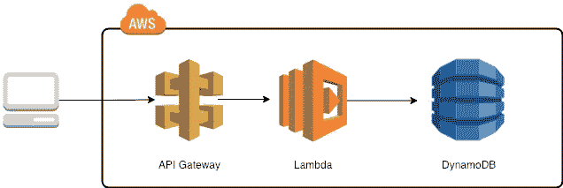
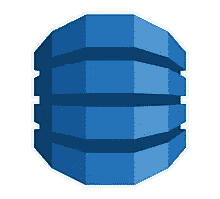

# 无服务器框架:使用 AWS Lambda 和 DynamoDB 部署 REST API

> 原文：<https://itnext.io/serverless-framework-deploy-a-rest-api-using-aws-lambda-and-dynamodb-9c396a49e52?source=collection_archive---------1----------------------->

# 目标

在我之前的教程“[无服务器框架:在 AWS](https://medium.com/@micheleriso/serverless-framework-deploy-an-http-endpoint-using-nodejs-lambda-on-aws-30558422de1b) 上使用 NodeJS，Lambda 部署 HTTP 端点”中，我们已经学习了如何使用[无服务器框架](http://serverless.com)创建一个用 [Express](https://expressjs.com/) 在 NodeJS 中实现的 [AWS Lambda](https://aws.amazon.com/lambda/) HTTP 端点。

今天我们将学习如何:

*   使用 Express、Serverless 和 [AWS API 网关](https://aws.amazon.com/api-gateway/)创建并部署带有两个端点(GET、POST)的 [REST API](https://en.wikipedia.org/wiki/Representational_state_transfer)
*   使用无服务器语法提供一个 [DynamoDB](https://aws.amazon.com/dynamodb/) 表
*   使用 [AWS SDK](https://aws.amazon.com/tools/) 连接到 DynamoDB



我们旨在实现的架构

# 什么是 DynamoDB？

> Amazon DynamoDB 是一个完全托管的 NoSQL 数据库服务，提供快速、可预测的性能和无缝的可伸缩性。—docs.aws.amazon.com



DynamoDB 徽标

简而言之， **DynamoDB** *是一个无服务器数据库，适用于任何规模都需要高性能的应用*。

因此，在无服务器应用程序中使用无服务器数据库听起来非常正确！

# 先决条件

本教程考虑到您已经学习了我的上一个教程，并且熟悉无服务器的基本概念。如果不是，或者你只是想刷新一下你的思维，请看看“[无服务器框架:在 AWS](https://medium.com/@micheleriso/serverless-framework-deploy-an-http-endpoint-using-nodejs-lambda-on-aws-30558422de1b) 上使用 NodeJS，Lambda 部署 HTTP 端点”

# 开始吧！

在我之前的教程中，部署一个用硬编码的“Hello Serverless！”然而，它并不那么值钱。今天，我们将了解如何动态地持久存储和检索数据。因此，我们将在一个用户表中创建一个 DynamoDB，在这个表中我们将按 userId 存储用户。


## 配置无服务器

作为第一步，我们需要配置无服务器，以便:

*   授予我们对 DynamoDB 的 Lambda 读写权限
*   在资源部分提供用户表

让我们在 serverless.yml 上复制以下代码

```
service: serverless-aws-nodejs-dynamodbcustom:
  tableName: 'users-table-${self:provider.stage}'provider:
  name: aws 
  runtime: nodejs8.10
  stage: dev
  region: eu-central-1
  iamRoleStatements:
    - Effect: Allow
      Action:
        - dynamodb:Query
        - dynamodb:Scan
        - dynamodb:GetItem
        - dynamodb:PutItem
        - dynamodb:UpdateItem
        - dynamodb:DeleteItem
      Resource:
        - { "Fn::GetAtt": ["UsersDynamoDBTable", "Arn" ] }
  environment:
    USERS_TABLE: ${self:custom.tableName}functions:
  app:
    handler: app.server
    events:
      - http:
          path: /
          method: ANY
          cors: true
      - http:
          path: /{proxy+}
          method: ANY
          cors: trueresources:
  Resources:
    UsersDynamoDBTable:
      Type: 'AWS::DynamoDB::Table'
      Properties:
        AttributeDefinitions:
          -
            AttributeName: userId
            AttributeType: S
        KeySchema:
          -
            AttributeName: userId
            KeyType: HASH
        ProvisionedThroughput:
          ReadCapacityUnits: 1
          WriteCapacityUnits: 1
        TableName: ${self:custom.tableName}
```

我们可以注意到，我们增加了 3 个部分:

*   Custom:这是一个自定义部分，我们可以使用它来保存我们想要重用的任何类型的配置。特别是，我们正在保存用户表名
*   *iamRoleStatements* :通过这个部分，我们可以定义 lambda 函数与 AWS DynamoDB 交互所需的权限。对于本教程的范围，我们给了 Lambda 管理员访问权限。在实际场景中，请记住使用“[最小特权](https://kb.iu.edu/d/amsv)”原则，并始终给出所需的最小权限
*   *resources* :使用这个部分，我们可以使用 CloudFormation 语法定义 AWS 需要使用或创建的堆栈(如果不存在的话)。特别是，我们正在定义和提供用户表。如果你不熟悉 CloudFormation，请看看亚马逊网站上的官方文档。[自动气象站云形成](https://aws.amazon.com/cloudformation/)

## 编辑服务器逻辑

定义了 AWS 堆栈之后，我们需要修改 NodeJS 应用程序，以便:

*   实现 GET/POST 端点:我们将使用 GET `/user/{userId}`来检索用户信息，并使用 POST `/user`来创建一个新的信息
*   与迪纳摩数据库交互

作为第一步，我们需要安装 AWS SDK 和 bodyparser。AWS SDK 是官方工具，它使我们能够与所有 AWS 服务和组件进行交互。Bodyparser 用于解析 HTTP 请求的主体

```
*$ npm install --save aws-sdk body-parser*
```

现在，让我们将以下代码复制到 app.js 中:

```
// app.js 
const sls = require('serverless-http');
const bodyParser = require('body-parser');
const express = require('express')
const app = express()
const AWS = require('aws-sdk');const USERS_TABLE = process.env.USERS_TABLE;
const dynamoDb = new AWS.DynamoDB.DocumentClient();app.use(bodyParser.json({ strict: false }));// Create User endpoint
app.post('/users', function (req, res) {
  const { userId, name } = req.body;const params = {
    TableName: USERS_TABLE,
    Item: {
      userId: userId,
      name: name,
    },
  };dynamoDb.put(params, (error) => {
    if (error) {
      console.log(error);
      res.status(400).json({ error: `Could not create user ${userId}` });
    }
    res.json({ userId, name });
  });
})// Get User endpoint
app.get('/users/:userId', function (req, res) {
  const params = {
    TableName: USERS_TABLE,
    Key: {
      userId: req.params.userId,
    },
  }dynamoDb.get(params, (error, result) => {
    if (error) {
      console.log(error);
      res.status(400).json({ error: `Could not get user ${userId}` });
    }
    if (result.Item) {
      const {userId, name} = result.Item;
      res.json({ userId, name });
    } else {
      res.status(404).json({ error: `User ${userId} not found` });
    }
  });
})module.exports.server = sls(app)
```

我们删除了通用端点，并添加了 2 个新端点:

*   帖子`/users`，我们可以用它来创建一个新用户
*   GET `/users/{userId`，我们将使用它来检索提供了 userId 的用户

为了简单起见，我们没有对请求的参数进行任何安全检查。然而，在真实的场景中，请记住，您至少需要检查类型(例如，如果 userId 是一个字符串)。在 POST 请求中，您还可以净化参数以避免最常见的攻击(例如，使用 [DOM PURIFY](https://github.com/cure53/DOMPurify) )

## 部署！

让我们用众所周知的命令`sls deploy`再部署一次。输出和以前一样，但是这次 Serverless 也提供了一个 DynamoDB。

## 测试

让我们尝试使用 curl 创建一个新用户:

```
$ curl -X POST "[https://xxxxxxxx.execute-api.eu-central-1.amazonaws.com/dev/users](https://rrp9vypgn3.execute-api.eu-central-1.amazonaws.com/dev/users)" -d '{"userId":"micheleriso","name":"Michele Riso"}' -H "Content-Type: application/json"{"userId":"micheleriso","name":"Michele Riso"}%#THE OUTPUT
```

现在找回它:

```
$ curl -X GET "[https://xxxxxxxx.execute-api.eu-central-1.amazonaws.com/dev/users/micheleriso](https://rrp9vypgn3.execute-api.eu-central-1.amazonaws.com/dev/users/micheleriso)" -H "Content-Type: application/json"{"userId":"micheleriso","name":"Michele Riso"}% #THE OUTPUT
```

我们在 DynamoDB 上创建了一个新用户！真的很酷，不是吗？:-)

# 结论

在本教程中，我们学习了如何使用无服务器框架将 REST API Lambda 函数互连部署到 DynamoDB。

在下一个教程中， [**无服务器框架:预热 AWS Lambda 以避免“冷启动”**](/serverless-framework-warming-up-aws-lambda-to-avoid-cold-start-2be579475531) ，我们将了解什么是 AWS Lambda 函数的“冷启动”问题，以及如何使用无服务器框架来解决它

这里链接到[比特桶回购](https://bitbucket.org/mriso/serverless-aws-nodejs-dynamodb)