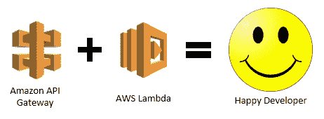

# 无服务器框架:在 AWS 上使用 NodeJS，Lambda 部署 HTTP 端点

> 原文：<https://itnext.io/serverless-framework-deploy-an-http-endpoint-using-nodejs-lambda-on-aws-30558422de1b?source=collection_archive---------4----------------------->

# 目标

今天你将学习如何使用[无服务器框架](http://serverless.com)创建一个 [AWS Lambda](https://aws.amazon.com/lambda/) HTTP 端点，在 NodeJS 中用 [Express](https://expressjs.com/) 实现


在我们要实现的架构之上

# 什么是无服务器框架？

> *“无服务器是您部署和操作无服务器架构的工具包。专注于您的应用，而不是您的基础设施。——*[](http://serverless.com)

****

**无服务器框架的主要优势:**

*   **使用无服务器框架，您可以通过定义一个简单的 yam 配置文件来定义整个无服务器应用程序**
*   **无服务器框架是开源的，并提供不可知的**
*   **无服务器框架支持多种语言，如 NodeJS、Python、Java、Ruby、Go 等等**

# **先决条件**

**本教程将介绍在 AWS 中创建和部署无服务器应用程序所需的一些步骤。但是，在开始之前，您需要:**

*   **拥有一个 [AWS 账户](https://aws.amazon.com/free/) : AWS 给你 [12 个月的免费等级](https://aws.amazon.com/free/)，你可以使用它来进行你的测试！**
*   **安装[节点](https://nodejs.org/en/download/)和[纱线](https://yarnpkg.com/)**

# **无服务器配置**

**在开始之前，我们需要做一些无聊的步骤来安装和配置无服务器**

## **安装无服务器**

**打开你的控制台，输入(如果你用的是 Linux，把 sudo 放在前面)**

```
**$ npm install -g serverless**
```

## **配置 AWS IAM 密钥**

```
***$ serverless config credentials --provider aws --key xxxxxxxxxxxxxx --secret xxxxxxxxxxxxxx***
```

# **开始吧！**

**我们终于准备好开始了！我们将开始创建一个 HTTP 端点，它将通过 [AWS API 网关](https://aws.amazon.com/api-gateway/)公开**

****

**AWS API 网关将帮助我们公开 HTTP 端点**

## **创建样板文件**

**一旦定义了我们想要使用的技术堆栈(NodeJS)和云提供商(Serverless 可以为我们准备一个简单的项目。所以打开一个控制台，输入**

```
***$ serverless create --template aws-nodejs --path* serverless-aws-nodejs**
```

**如您所见，Serverless 在一个基本的 NodeJS 服务中创建了一个新文件夹。主要文件有:**

*   ***server less . yml*:server less 的主配置文件**
*   ***handlers.js* :确实包含 NodeJS 应用。我们可以在 *app.js* 中重命名**

**下一步是安装所需的依赖项。进入创建的文件夹并键入**

```
**$ npm init -y && npm install**
```

## **部署！**

**我们终于准备好部署了！只需在控制台上键入:**

```
**$ serverless deploy**
```

**几秒钟后，您将得到以下输出**

```
**Serverless: Packaging service...
Serverless: Excluding development dependencies...
Serverless: Creating Stack...
Serverless: Checking Stack create progress...
.....
Serverless: Stack create finished...
Serverless: Uploading CloudFormation file to S3...
Serverless: Uploading artifacts...
Serverless: Uploading service .zip file to S3 (387 B)...
Serverless: Validating template...
Serverless: Updating Stack...
Serverless: Checking Stack update progress...
...............
Serverless: Stack update finished...
Service Information
service: serverless-aws-nodejs
stage: dev
region: us-east-1
stack: serverless-aws-nodejs
api keys:
  None
endpoints:
  None
functions:
  hello: serverless-aws-nodejs-dev-hello
layers:
  None**
```

**不到 5 分钟，我们就在 AWS 上部署了第一个服务！虽然看起来很酷，但是我们部署的服务没有暴露任何端点所以不能用(Doh！)我们稍微改一下吧。**

# **公开 HTTP 端点**

**为了公开一个 HTTP 端点，我们需要在 *serverless.yml* 中配置 AWS API 网关，并用 *Express* 处理它。**

**让我们清理一下 *serverless.yml* 文件，并在里面粘贴这些内容**

```
**service: serverless-aws-nodejsprovider:
 name: aws #Define the cloud provider to use
 runtime: nodejs8.10 
 stage: dev
 region: eu-central-1functions:
 app:
  handler: app.server
  events: #Define the events that trigger the lambda
   - http: #Define an HTTP endpoint that respond to the / route
     path: /
     method: ANY #Define the HTTP methods to be used (GET/POST)
     cors: true
   - http: #Define an HTTP endpoin that respond to any routes
     path: /{proxy+}
     method: ANY
     cors: true**
```

**清理 app.js 并粘贴到该内容中**

```
**// app.js
const express = require('express')
const app = express()
const sls = require('serverless-http')//Handle the GET endpoint on the root route /
app.get('/', async (req, res, next) => { 
 res.status(200).send('Hello Serverless!')
})module.exports.server = sls(app)**
```

**安装依赖项**

```
**npm install express serverless-http**
```

## **再部署一下吧！**

**几分钟后，您将得到类似的输出**

```
**Serverless: Packaging service...
Serverless: Excluding development dependencies...
Serverless: Uploading CloudFormation file to S3...
Serverless: Uploading artifacts...
Serverless: Uploading service .zip file to S3 (283 B)...
Serverless: Validating template...
Serverless: Updating Stack...
Serverless: Checking Stack update progress...
.......................................
Serverless: Stack update finished...
Service Information
service: serverless-aws-nodejs
stage: dev
region: eu-central-1
stack: serverless-aws-nodejs-dev
api keys:
  None
endpoints:
  ANY - [https://xxxxxxxxxx.execute-api.eu-central-1.amazonaws.com/dev/](https://sjib9tfm63.execute-api.eu-central-1.amazonaws.com/dev/)
  ANY - [https://xxxxxxxxxx.execute-api.eu-central-1.amazonaws.com/dev/{proxy+](https://sjib9tfm63.execute-api.eu-central-1.amazonaws.com/dev/{proxy+)}
functions:
  app: serverless-aws-nodejs-dev-app
layers:
  None**
```

**您可以从输出中注意到，这一次它公开了两个不同的端点。让我们测试第一个**

```
**$ curl [https://xxxxxxxxxx.execute-api.eu-central-1.amazonaws.com/dev/](https://xxxxxxxxxx.execute-api.eu-central-1.amazonaws.com/dev/)Hello Serverless!% ###The output!**
```

# **结论**

**在本教程中，我们学习了如何使用无服务器框架部署一个非常简单的 HTTP 端点。**

**后续教程:**

*   **[**“无服务器框架:使用 AWS Lambda 和 DynamoDB 部署 REST API”**](https://link.medium.com/0FpYcgFFEU)，我们将看到如何创建一个与 DynamoDB 集成的类 REST API！**
*   **[**无服务器框架:预热 AWS Lambda 以避免“冷启动”**](/serverless-framework-warming-up-aws-lambda-to-avoid-cold-start-2be579475531) ，我们将了解 AWS Lambda 函数的“冷启动”问题是什么，以及如何使用无服务器框架解决它**

**此处链接到[位存储桶回购](https://bitbucket.org/mriso/serverless-aws-nodejs)**

**请不吝赐教:)**