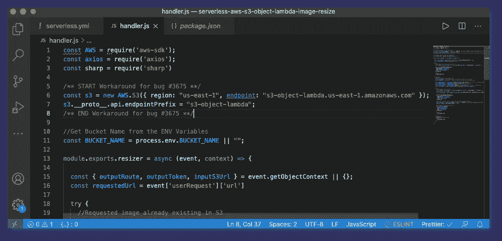
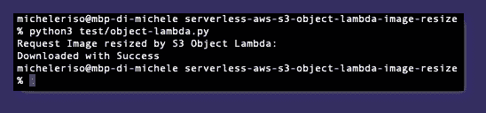
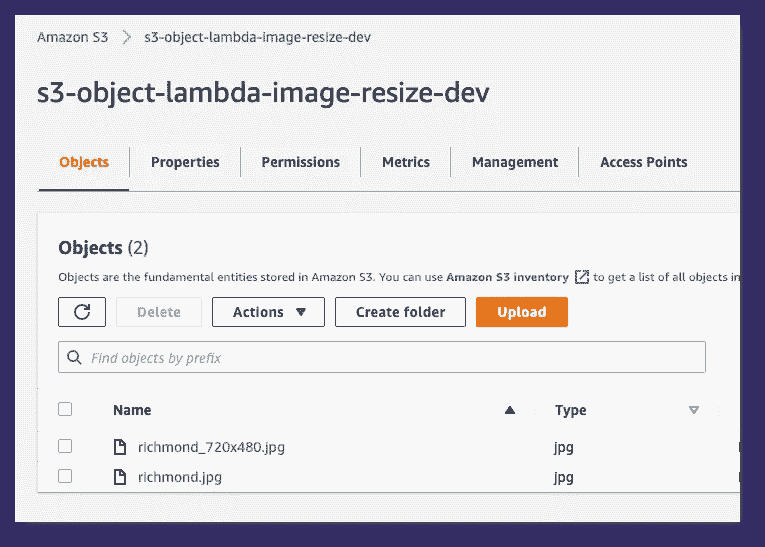
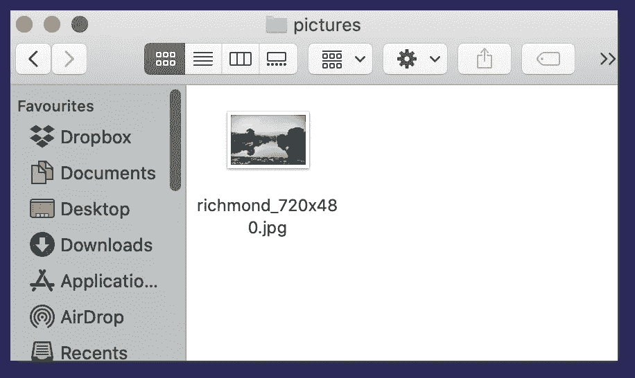

# 无服务器框架:使用亚马逊 S3 对象 Lambda 动态调整图像大小(Node.js 和 Sharp)

> 原文：<https://itnext.io/serverless-framework-use-aws-s3-object-lambda-to-resize-images-on-the-fly-868a37017f3c?source=collection_archive---------0----------------------->

泰晤士河畔的里士满，由[加勒特·基奥](https://unsplash.com/photos/DdKphkh-c1o)在 [Unsplash](https://unsplash.com/)

# 目标

在这篇文章中，我将向你展示如何使用亚马逊 S3 对象 Lambda 动态调整图片大小。[无服务器框架](https://www.serverless.com/)将用于将基础设施定义为代码，并简化部署。 [Sharp](https://github.com/lovell/sharp) 将用于调整图像大小。Lambda 将使用 Node.js 14x [Lambda 运行时](https://docs.aws.amazon.com/lambda/latest/dg/lambda-runtimes.html)编写

# 什么是亚马逊 S3 对象λ

最常见的 Lambda 模式之一是转换存储在亚马逊 S3 内部的数据。通常，lambda 函数在文件上传后被调用。Lambda 将检索该文件，应用任何所需的转换(例如，转换文件类型)并将结果存储在 S3 中。

这种模式工作得很好，但是，它需要对一个文件做一些工作，不管这个文件将来是否被访问。

如果你需要动态转换一个文件，你应该创建一个 lambda 函数，通过 Amazon API GW 调用它，等待 Lambda 执行转换。

AWS 最近在 Danilo Poccia 的一篇好文章中介绍了亚马逊 S3 对象 Lambda。S3 对象 Lambda 允许创建一个直接连接到 S3 桶的 Lambda(使用 [S3 访问点](https://aws.amazon.com/s3/features/access-points/)),当从 S3 检索对象时会自动调用它！

这意味着我们的应用程序只需要发送一个 S3 Get 对象请求来检索原始数据或转换后的数据

此外，使用亚马逊 S3 对象 Lambda 的一个非常重要的特点是，你想要检索的文件不需要存在于 S3 上！我们将在我们的场景中利用这一点

> N *注:高级 AWS CLI S3 命令(如* `*aws s3 cp*` *)目前不支持 S3 对象 Lambda，我们需要使用低级 S3 API 命令(如* `*aws s3api get-object)*`

# 常见使用案例

在他的帖子中，Danilo 强调了亚马逊 S3 对象 Lambda 最常见的用例:

*   跨数据格式转换(例如，从 XML 到 JSON)
*   动态压缩或解压缩文件
*   动态调整图像大小(我们的用例！)
*   更多(留给开发者的创造力)

# 我们开始吧！

让我们关注一下使用 S3 对象 Lambda 动态调整图像大小的用例。

虚拟代码

## 先决条件

本教程考虑了对无服务器框架和 Node.js 的基本熟悉。如果您从未使用过它，或者您只是想刷新一下您的思维，请看看我以前的教程“[无服务器框架:在 AWS 上使用 NodeJS，Lambda 部署 HTTP 端点”](https://medium.com/@micheleriso/serverless-framework-deploy-an-http-endpoint-using-nodejs-lambda-on-aws-30558422de1b)

## 配置无服务器

作为第一步，我们需要使用无服务器框架来配置基础设施。特别是，我们需要:

*   创建 S3 桶
*   定义调整大小λ
*   给 S3 我们的 Lambda 写权限和使用`WriteGetObjectResponse`方法的权限
*   定义 S3 接入点
*   定义 S3 对象λ访问点

Lambda 的 IAM 角色必须拥有`s3-object-lambda:WriteGetObjectResponse`权限。然而，它不需要`read`的许可，因为我们将使用来自`context`的`PreSigned URL`来读取所请求的图像

# 缩放器λ

其次，我们需要编写 Resizer Lambda 函数

我们实现的逻辑如下:

*   用户请求来自 S3 的名为`richmond_600x400.jpg`的图像
*   S3 自动调用 S3 对象 Lambda
*   Lambda 试图从 S3 下载该文件
*   如果文件不存在，Lambda 会查找名为`richmond.jpg`的全尺寸图像，并从请求的图像中提取大小
*   Lambda 将图像调整到要求的大小`600x400`
*   Lambda 将调整后的图像存储到 S3 中
*   Lambda 使用新引入的方法`WriteGetObjectResponse`返回对象

> 注意:在撰写本文时，AWS SDK 中有一个错误( [#3675](https://github.com/aws/aws-sdk-js/issues/3675) ),它在使用方法`*WriteGetObjectResponse*` : `*405 MethodNotAllowed: The specified method is not allowed against this resource*`时导致了一个错误。由于这个错误，端点和服务名没有正确解析。作为临时解决办法，我们需要设置正确的端点和前缀。一旦 bug 关闭，就不需要这样做了

错误#3675 的解决方法

> **1/4/2021 更新**:AWS 已经在`aws-sdk-js`的`2.876.0`版本中修复了`#3675` bug，因此不再需要上述变通方法。我已经更新了所有的脚本和回购，以反映这一点

# 试验

为了测试它，我们可以编写一个简单的 python 脚本，使用`boto3`从 S3 获取图像

然后我们可以用`python3 test/object-lambda.py`来运行它

试验结果

我们可以检查这是否有效:

*   在 S3，一个名为`richmond_720x480.jpg`的新文件已经创建

S3 控制台

*   相同的文件已经下载到名为`pictures`的本地文件夹中

本地“图片”文件夹

# 结论

在本教程中，我们学习了:

*   什么是亚马逊 S3 对象λ
*   S3 对象 Lambda 的常见用例
*   如何使用无服务器框架 Node.js 和 Sharp，使用 S3 对象 Lambda 动态调整图像大小(存储在 S3)

敬请关注其他关于无服务器框架的教程！

这里是 GitHub repo 的链接