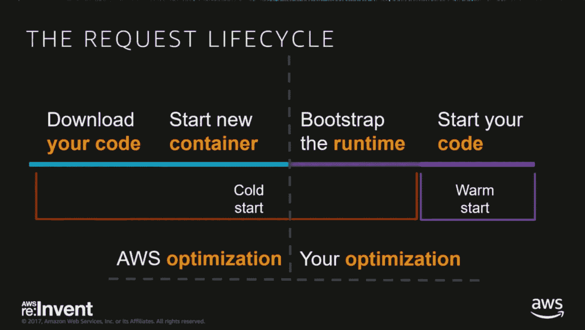
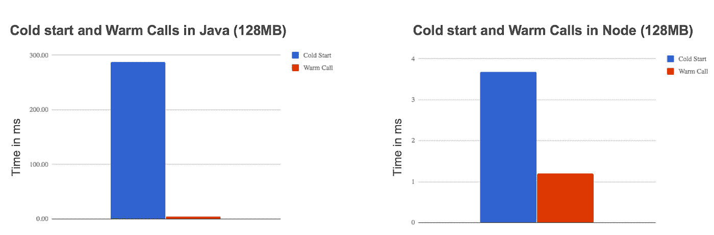
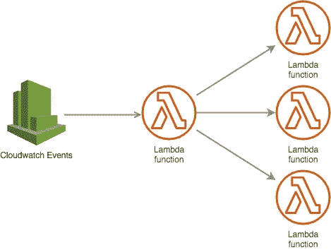
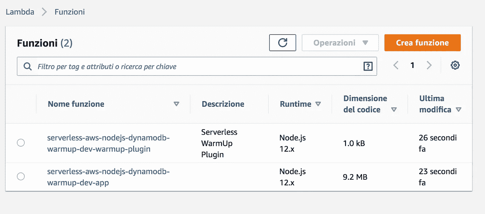
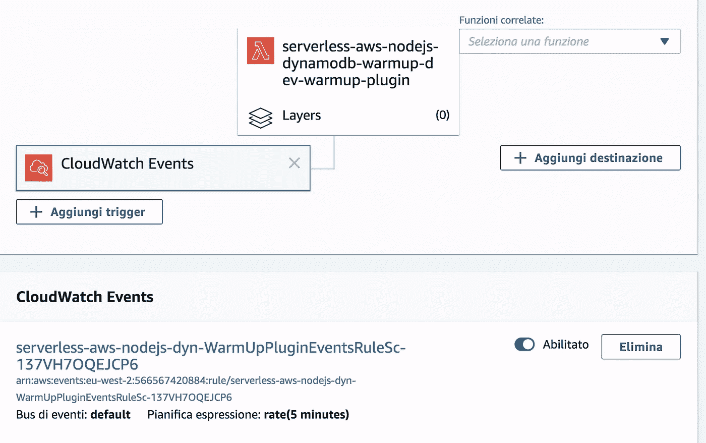

# 无服务器框架:预热 AWS Lambda 以避免“冷启动”

> 原文：<https://itnext.io/serverless-framework-warming-up-aws-lambda-to-avoid-cold-start-2be579475531?source=collection_archive---------0----------------------->

# 目标

在我之前的教程中，我们开始学习[无服务器框架](http://serverless.com/)。特别是在以下方面:

*   "[无服务器框架:在 AWS](https://medium.com/@micheleriso/serverless-framework-deploy-an-http-endpoint-using-nodejs-lambda-on-aws-30558422de1b) 上使用 NodeJS，Lambda 部署 HTTP 端点"我们已经学习了如何使用[无服务器框架](http://serverless.com/)创建一个在 NodeJS 中实现的 [AWS Lambda](https://aws.amazon.com/lambda/) HTTP 端点
*   "[无服务器框架:使用 AWS Lambda 和 DynamoDB](/serverless-framework-deploy-a-rest-api-using-aws-lambda-and-dynamodb-9c396a49e52) 部署 REST API "我们已经学习了如何使用 Express、无服务器和 [AWS API 网关](https://aws.amazon.com/api-gateway/)创建和部署具有两个端点(GET、POST)的 [REST API](https://en.wikipedia.org/wiki/Representational_state_transfer) ，使用无服务器语法提供 [DynamoDB](https://aws.amazon.com/dynamodb/) 表，并使用 [AWS SDK](https://aws.amazon.com/tools/) 连接到 DynamoDB

今天我们将学习:

*   什么是 AWS Lambda“冷启动”问题
*   如何使用无服务器框架提供的插件来避免冷“启动问题”

# 什么是“冷启动”问题


典型的冷启动问题

为了理解“冷启动”问题，我们需要更好地研究 AWS Lambda 函数如何在幕后工作。AWS Lambda 让我们部署和运行一些代码，向我们证明了一个高度可扩展的架构，并允许我们消除供应服务器的负担。

尽管从开发人员的角度来看这是正确的说法，但是一旦 Lambda 函数被调用，AWS 仍然需要动态地提供服务器。特别是，它需要提供一个容器，将提供一个执行代码的容器

当在容器中运行时，该功能被认为是活动的(又名**热**)。一旦不活动一段时间，容器将被终止，功能被认为是**冷**

一旦冷却，该功能的执行时间可能会延迟 5-10 秒，因此会出现“冷启动”问题。

> “简而言之，冷启动是指触发功能时经历的延迟”

# 等等，为什么要这么久？

当 Lambda 函数“第一次”被触发时，AWS 必须执行整个请求生命周期。事实上，AWS 需要一些时间来下载代码、启动新的容器、部署代码、引导运行时并最终运行它。所有这些操作都会延迟总的执行时间

请求生命周期优化的责任由 AWS 和开发人员对半分担



[AWS Lambda 生命周期](https://youtu.be/oQFORsso2go?t=8m5s)

从它的角度来看，AWS 总是试图优化请求生命周期的这一方面，减少容器的启动时间

从开发人员的角度来看，lambda 的执行时间取决于许多因素:

*   使用的语言/运行时:每种语言都有不同的引导时间。例如，Java 可能需要 300 毫秒，而 nodejs 需要的时间要少得多
*   代码大小和代码实现:例如，NodeJS 项目中使用的节点模块的数量
*   专用于该功能的内存量(MB)



Java 和 NodeJS 的冷启动问题

为了优化它，我们可以干预导致延迟的一些因素(例如优化代码、减少包的大小、增加分配的内存、使用不同的语言……)

# 如何减少“冷启动”问题？

虽然代码优化可能有助于减少引导时间，但它不会消除当函数**变冷**时 AWS 启动新容器所需的时间。

相反，如果该功能已经**预热**，它将立即可用，没有明显的延迟。

因此，我们需要找到一种几乎总是有暖 lambda 函数的方法。


保持 lambda 函数的一种方法是定期调用它们。

为了实现这一点，我们可以配置一个 Cloudwatch 事件，该事件定期(例如每 5 分钟)调用一个新的 lambda 函数。这个 lambda 触发对我们需要预热的任何 lambda 的异步调用。



冷启动还原模式

# 如何使用无服务器框架预热 lambda 函数

对我们来说幸运的是，有一个方便的插件，称为预热插件，可以从无服务器框架中获得，它只用一行代码就实现了上述实现


让我们开始在代码目录中安装插件

```
$ *npm install serverless-plugin-warmup --save-dev*
```

并在 serverless.yml 文件的 plugins 部分添加插件

```
plugins:- serverless-plugin-warmup
```

之后，我们需要在任何需要预热的函数中启用插件，使用“warmup: true”参数

```
functions: app: **warmup: true** handler: app.server events: - http: path: / method: ANY cors: true - http: path: /{proxy+} method: ANY cors: true
```

# 部署！

让我们用已经众所周知的命令`sls deploy`再次部署它。这一次，Serverless 部署了一个名为我们的 lambda +前缀“warmup-plugin”的函数



AWS Lambda 控制台

使用 AWS 控制台，我们可以看到预热插件配置了一个 Cloudwatch 事件，每 5 分钟运行一次，触发这个新的 lambda 函数



# 供应的并发

在 2019 年 12 月的 AWS re:Invent 上，AWS 引入了“供应并发”的概念，允许开发人员消除冷启动问题，指定应该始终保持温暖的 Lambda 工作器的数量。

AWS 控制台和无服务器框架的配置都很简单。

在第一种情况下，开发人员应该打开 Lambda 服务页面，一直向下滚动，并设置所需的供应并发数

在第二种情况下，我们需要将“provisionedConcurrency: 5”参数添加到 serverless.yml 文件中的函数配置中，其中 5 是并发 warm 实例的期望数量

```
app: handler: app.server **provisionedConcurrency: 5**...
```

# 结论

在本教程中，我们学习了

*   AWS Lambda 功能的“冷启动”问题是什么
*   我们如何优化函数引导时间
*   我们如何使用 AWS 预热功能
*   我们如何使用无服务器框架的预热插件来简化上述要点

敬请关注其他关于无服务器框架的教程！

此处链接到[位存储桶回购](https://bitbucket.org/mriso/serverless-aws-nodejs-dynamodb-warmup/src/master/)