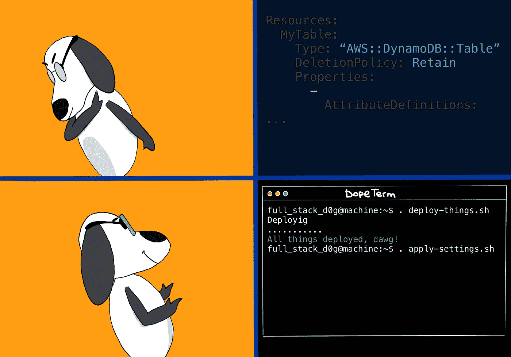

# 无服务器框架的资源地狱

> 原文：<https://itnext.io/serverless-frameworks-resource-hell-44cd4293b027?source=collection_archive---------4----------------------->

全栈狗破坏了这个博客的主旨🙁

***(2019 年 7 月 24 日更新—增加了关于 AWS CDK 的信息)***

你好，又见面了。这次让我们来谈谈我非常喜欢的无服务器框架。完全免责声明:我下面说的一切都是我的个人意见，基于我在这个了不起的工具的帮助下管理一堆 lambda 函数的经验。

首先，对于那些不知道的人来说，无服务器框架是一个软件套件，它极大地简化了基于 FaaS 的系统的组成和部署。在 AWS 世界中，这意味着框架上传您的代码并为您的项目创建一个 CloudFormation 堆栈，该堆栈由一个或多个 lambda 函数和其他所需的 AWS 资源组成——lambda 触发器、数据库、IAM 角色等等。你可以在这里了解更多关于[的信息。从现在开始，我假设你对它很熟悉，并且对它的能力有非常清楚的了解。](https://serverless.com)

## 那么什么不好呢

正如我上面提到的，无服务器主要做两件事:

1.  上传你的应用程序代码到 S3。
2.  创建以您想要的方式运行代码所需的 AWS 资源。

因此，虽然上传部分简单明了，但资源创建部分实际上可以分为四类:

1.  Lambda 函数——非常明显。
2.  与函数触发器相关的资源，例如 API 端点。
3.  我的角色。
4.  无服务器配置文件的“资源”部分中描述的其他 AWS 资源。

如果您曾经看过这个文件，您可能已经注意到它的 resource 部分实际上只不过是 CloudFormation(有时简称为 CF)模板的一部分。前提是你知道 CloudFormation 模板是什么样子，否则你可能不会注意到这一点。无论如何，您可以使用这一部分来创建和配置 AWS 资源。举个例子，如果你在无服务器网站上看一些例子，你会发现一个[示例应用配置](https://serverless.com/examples/aws-python-rest-api-with-dynamodb/)，它创建了一个函数和一个 DynamoDB 表，并设置了函数角色在表上的权限。多么方便快捷啊！只不过这不是。

你看，**第一个问题**来自于这样一个事实，即无服务器框架将你的整个应用部署为一个单一的[云架构栈](https://docs.aws.amazon.com/AWSCloudFormation/latest/UserGuide/stacks.html)。这意味着 DynamoDB 表的生命周期与应用程序的生命周期绑定在一起。现在，如果您想删除并重新创建您的表，您需要重新部署您的无服务器项目。这并不理想，因为在某些情况下，您希望独立于依赖它的函数删除并重新创建表。

最明显的场景是从本地备份中恢复表的过程。如果是 DynamoDB，您的本地备份只能恢复到一个新表中。因此，您应该将函数重定向到一个恢复的表，或者删除一个原始的损坏的表，并从备份中创建一个同名的新表。无论哪种方式，你最终都会得到一个新的表，不同于你的 CloudFormation 堆栈中添加的表，它可能属于也可能不属于这个堆栈，这取决于你如何命名它。此外，这个新恢复的表将缺少一些设置，如 [TTL](https://docs.aws.amazon.com/amazondynamodb/latest/developerguide/TTL.html) ，以及一个包含所有订阅的[流](https://docs.aws.amazon.com/amazondynamodb/latest/developerguide/Streams.html)。这些东西你必须单独重新配置。稍后我们将讨论如何在没有人工干预的情况下实现这一点。

最终，这意味着，作为无服务器项目的一部分，您将能够成功地维护 DynamoDB 表，只有在一个完美的世界里才不会出错。

**另一个让我们避免使用 CloudFormation 部署一些资源的问题**是，CF 语法有时需要一段时间才能跟上新的 AWS 功能。AWS 发布的某些东西您可能想立即使用，但需要几个月才能在 CloudFormation 中使用。情况并不总是如此，但是当这种情况发生时，您可能会决定好好研究一下管理 AWS 资源的替代方法。

## 让我们把事情变得更好！

好了，最后让我们来谈谈我们公司用来解决管理 DynamoDB 表问题的一种替代方法。该解决方案的名称是 AWS CLI。

对于那些不知道的人(在这篇博文的这个时候，我希望有绝对的少数人)，AWS CLI 是 AWS 提供的命令行工具，因此他们的用户可以从终端管理他们的云。它实际上是 AWS 控制台的命令行版本，这太棒了，因为控制台意味着脚本，而脚本意味着我们都想要的自动化。否则我们就不会把基础设施当作代码来做，不是吗？下面是 DynamoDB btw 的 CLI 参考:[参考](https://docs.aws.amazon.com/cli/latest/reference/dynamodb/index.html)

**表格创建**

您可能想做的第一件事是编写表创建脚本。这是一项简单的任务(不像其他任务那样困难)，因为您只需要一个 CLI 命令和一个表的 JSON 定义。请，请看看下面的例子。

部署脚本和定义文件

请注意，还有一个选项可以将您的表细节作为 CLI 参数传递，尽管这将大大降低您的脚本的可读性。我看不出有什么理由要用一个单独的 JSON 文件来做这件事。除了个人喜好，我不做判断。通常我不会。

**表格设置**

现在，第二个 CloudFormation 问题有了一个解决方案——有些设置不能使用 CF 模板来设置。有时它们可以在模板中设置，但不能从备份中恢复，所以我们需要能够将它们应用到现有的表中。然而，我们很幸运，因为我们已经决定切换到 ol' good 终端命令。

以 [TTL(生存时间)](https://docs.aws.amazon.com/amazondynamodb/latest/developerguide/TTL.html)为例。这个设置并不作为本机 DynamoDB 备份的一部分保存，这意味着我们需要在恢复后将它应用到一个表中。既然我们已经有了一个应用这个设置的脚本，为什么不把它作为真实的唯一来源呢？

在这里，我们来看一个 shell 脚本，它使用 AWS CLI 对上一个示例中的表的“created”字段设置 TTL:

这就是我们在现有表上启用 TTL 的方法

**流订阅**

从备份中恢复表后会丢失的另一个东西是它的流和流订阅。如果你不知道什么是 DynamoDB 流，请停止你正在做的任何事情，让自己熟悉[这个概念](https://docs.aws.amazon.com/amazondynamodb/latest/developerguide/Streams.html)。

我们可以再次使用 AWS CLI 的强大功能来扭转局面。下面的一个脚本👇在我们在前面的一个例子中创建的表上启用一个流，并为它订阅一个 lambda 函数。太棒了。

λ函数+ DynamoDB 流= ❤️

现在，既然我们有了这三个脚本，我们可以随意使用它们。例如，可以将这三者结合起来，在部署管道中执行它们。还可以选择将脚本二和脚本三结合起来，作为灾难恢复工具的一部分。只要有意义，你高兴做什么就做什么。重点是——shell 脚本让我们非常灵活地自动化资源的生命周期。

对于好奇的人，我还提供了一个 *serverless.yml* ，如果你决定忽略我的建议，你可以使用它:

## 哇，太酷了，这大概是*唯一的*处理事情的正确方式吧！

是也不是，但基本上不是。绝对不是，而且是个大胖子**【N】**。

一件好的(或坏的)事情是，总是有不止一种方法来实现某事。我也是。除了我出色的 shell 脚本之外，我还想提到另外两种克服无服务器框架和 CloudFormation 局限性的方法。这些不是我走过的路，但它们可能是更好的。

**地形**

Terraform 是一个作为代码管理工具的云无关基础设施。我从来没用过，但是我听说它很好。它有很好的模块化——至少我是这么听说的，而且它是由社区驱动的。它的语法主观上也比 CF 更好。在功能方面，它也领先于亚马逊的产品。例如，您可以配置一个 Kibana 实例，仅使用 Terraform 使用 Cognito 进行身份验证——这是我以前做过的，只使用了两个 CF 模板和三个 shell 脚本。

与 CloudFormation 不同，Terraform 是一个工具，而不是原生的 AWS 服务，这意味着您必须自己设置它。例如，您需要决定在哪里存储您的状态文件。

**云形成宏**

CF 中有一个名为[宏](https://docs.aws.amazon.com/AWSCloudFormation/latest/UserGuide/template-macros.html)的功能，允许开发人员在部署堆栈时执行自定义模板转换。这里最酷的一点是，你还可以运行自己的 lambda 函数来执行转换，或者做任何你想让它做的事情。我的意思是它只是一个λ函数。这里有一篇关于如何使用无服务器框架实现这一点的文章。

我自己从未尝试过，但我觉得我绝对应该试一试。

**AWS CDK**

AWS CDK 是亚马逊的 SDK，它可以帮助你使用你选择的编程语言轻松地创建和管理你的 AWS 基础设施。因此，与依赖声明性模板的 CloudFormation 不同，AWS CDK 允许您将基础设施作为代码来管理。字面上。你可以在这里了解更多信息。听起来对我很有吸引力。

# 就这些吗？

今天——是的。

作为代码的基础设施很酷等等。然而，它也很容易搞砸，如果你这样做，它会毁了你的生活。或者你生命中的一小部分，比如某一天。不管怎样，你不会高兴的。因此，负责任地编码，永远不要停止寻找更好的解决方案。我的意思是，比你现在拥有的更好，也比我在这篇文章中向你展示的更好。

和平。