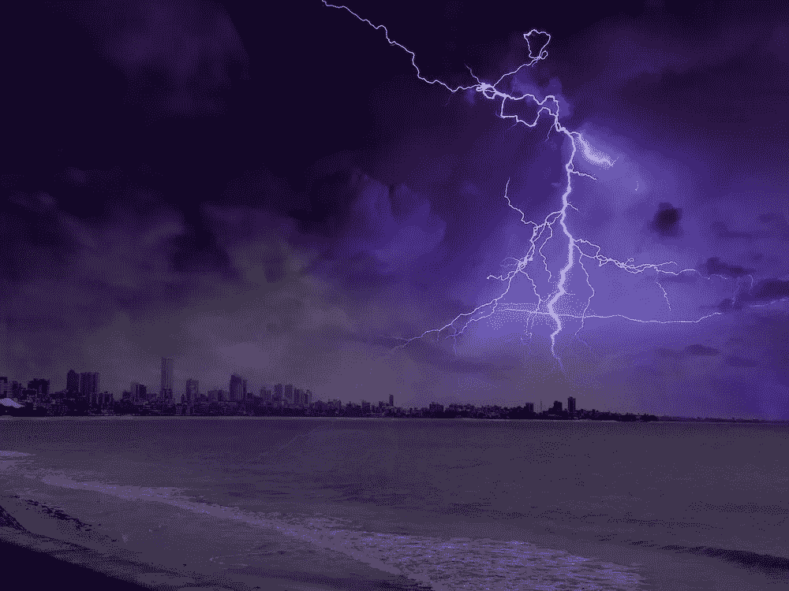

# 无服务器—从一开始，使用 Azure 功能(Azure portal)，第二部分

> 原文：<https://itnext.io/serverless-from-the-beginning-part-ii-getting-to-know-your-portal-ide-eff3bffed4e3?source=collection_archive---------3----------------------->

在 [Twitter](https://twitter.com/chris_noring) 上关注我，很乐意接受您对主题或改进的建议/Chris

这篇文章被移到了 https://softchris.github.io/pages/serverless-two.html 的