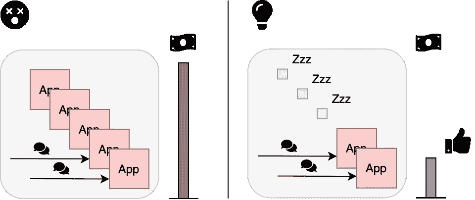
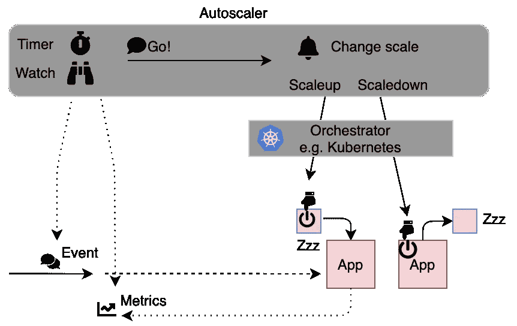
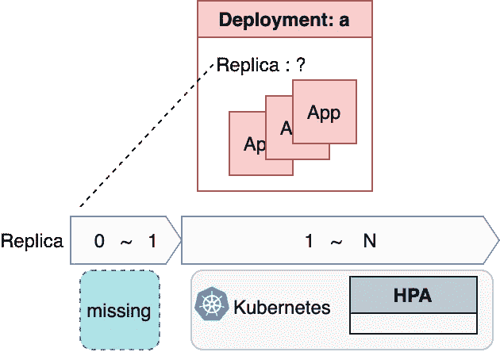
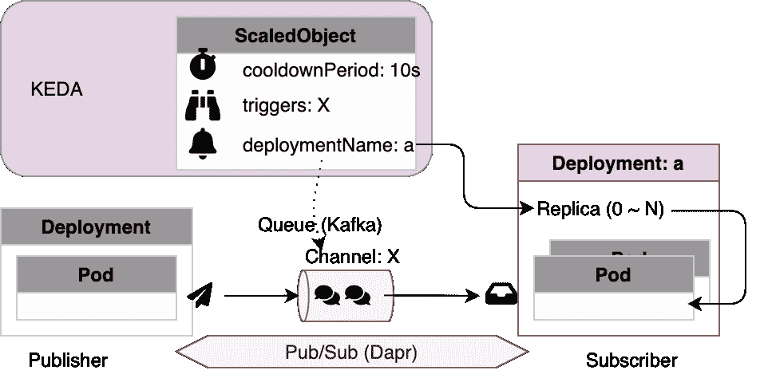
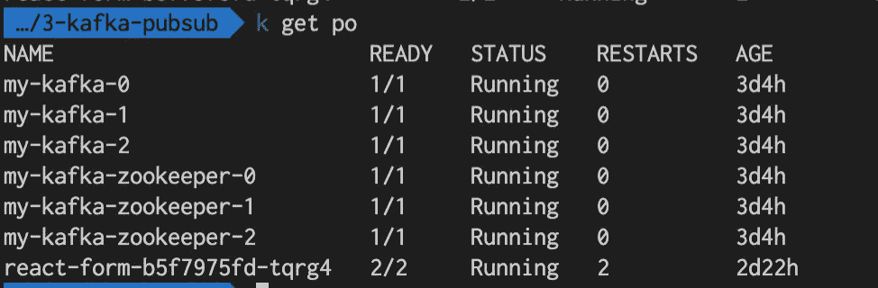
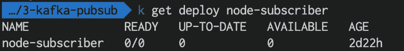
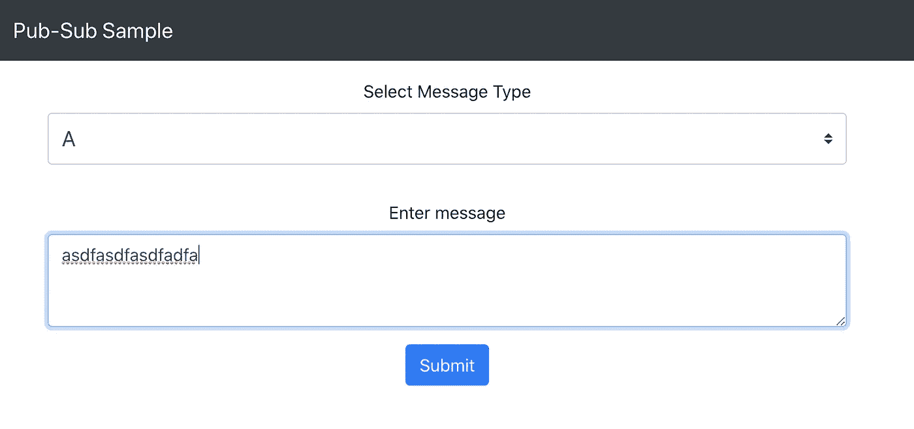
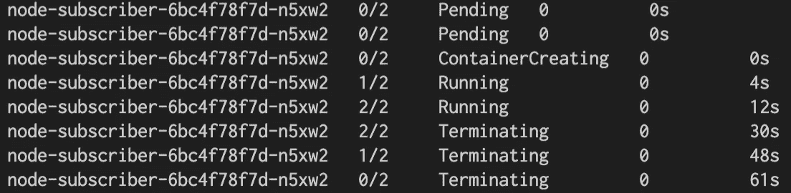
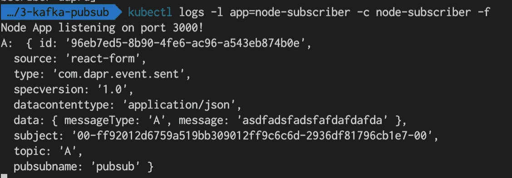

# “无服务器插件”:KEDA 缩小你的容器到零

> 原文：<https://itnext.io/serverless-keda-for-scaling-down-your-containers-to-zero-5bf35a75072c?source=collection_archive---------3----------------------->

## 使用 autoscaler 最大限度地降低您的容器基础设施成本

我简要描述了什么是无服务器，以及如何将容器缩减到零。这包括库伯内特，KEDA，卡夫卡，Dapr。

# 问题:我如何降低成本？



所有的应用程序都需要每次运行。我们应该关掉开关。

我的痛点很简单。这是关于如何降低我的基础设施成本。我将在基础设施上放置许多应用程序。但是没有必要一直运行应用程序。我希望我的应用程序仅在需要时运行。即使如此，我也不能一直关注这些应用程序的每一个请求…当不需要的时候，我该如何关闭我的应用程序呢？

# 解决方案:“无服务器”，更具体地说是“自动缩放”

## “无服务器”一体式机型(作为学习的第一步)

我认为无服务器是这个问题的最后手段。无服务器的先驱，AWS 说；

> 它消除了基础架构管理任务，如服务器或群集配置、修补、操作系统维护和容量配置。

简而言之，无服务器意味着**“服务器维护”——少了**。其实还有服务器。服务器永远不会消失。应用程序运行在服务器上。消失的是维护劳动。在无服务器环境中，应用程序开发人员不需要考虑服务器维护，可以专注于开发。

Serverless 只是一个形容词，所以这个词本身并没有提到任何具体的软件、硬件或厂商。

AWS lambda 是公共云中的无服务器应用平台之一。AWS lambda 拥有[扩展应用的原始机制](https://docs.aws.amazon.com/lambda/latest/dg/invocation-scaling.html)来增加并发性。上次调用后 10 分钟，AWS lambda 的资源回收(应用程序停止)根据[这篇文章](https://mikhail.io/serverless/coldstarts/aws/)自动发生。

当然，还存在其他实现方式。我们可以在本地使用**无服务器应用平台**。例如， *OpenFaaS* 、*open whish*和 *kubeless* 都是在内部环境中运行应用的无服务器应用平台。他们在一个平台中提供一体化堆栈。

## 更深一步的“无服务器”:关键是“自动缩放”

深入“无服务器”内部。当我们尝试“无服务器”的自助堆栈时，最简单的方法是使用**容器和 Kubernetes** 。这些是软件堆栈的构建模块。容器用于应用程序的维护自动化。Kubernetes 用于协调多个容器和多个服务器。

在容器技术和 Kubernetes 之上， **autoscaler** 来了。Kubernetes 推出 HPA(卧式容器自动秤)等容器自动秤非常重要。当工作负载增加时，Kubernetes 会检测到并自动增加容器数量。这是迈向无服务器世界的惊人一步。



Autoscaler 监视事件和指标。自动缩放控制放大或缩小。

嵌入在 Kubernetes 中的 autoscaler 的限制是它不能处理向下到零的缩放。这意味着，即使工作负载非常低并且暂时接近零请求，Kubernetes 也不能杀死最后一个容器。换句话说，只要容器的数量在 1 到 N 的范围内，Kubernetes 本身就可以扩大和缩小容器部署，但是它不能将容器部署缩小到零。这是缺失的部分。



新的其他自动缩放器可以处理这种情况“缩小到零”。这些自动缩放器充当 Kubernetes 的助手插件。如果一定时间过去了，没有请求，定标器检测到它，杀死最后一个容器。

## 自动缩放 1 : Knative

Knative 是 Kuberntes 世界中 scaler 的前沿。当 Knative 在零容器状态下检测到传入请求时，Knative 自动将请求保存在一种路由器中，并启动新的容器。非常聪明。Knative 具有网络路由器功能，可以监视请求包和目标地址。

## 自动缩放器 2: KEDA

KEDA 是同一案件的另一个光明的希望。KEDA 也支持“缩减至零”。KEDA 观察像 Apache Kafka 这样的许多服务，并检测这些服务中的变化(例如，Kafka 主题中是否有新的请求在排队。)

## 定标器的比较:Knative 和 KEDA

Knative 和 KEDA 的区别在于如何检测传入的请求。Knative 是非常面向网络的架构。另一方面，KEDA 不太依赖网络。相反，KEDA 只是依赖其他服务，如阿帕奇卡夫卡。这意味着 KEDA 的重量更轻。

# 让我们试着把 KEDA 缩小到零吧！

在这篇文章中，我采用 Kubernetes 为基础，KEDA 为自动缩放。我确认 KEDA 意识到缩小到零。

## KEDA 情景

这次我使用发布/订阅采样系统作为自动缩放的目标。该系统有两个应用程序，一个是发送消息的发布者，另一个是接收消息的订阅者。该示例还将 Apache Kafka 作为发布者和订阅者之间的消息队列。

在这个系统中，KEDA 控制用户容器的数量。



KEDA 在阿帕奇卡夫卡的一个特定主题(=频道)中观看到来的消息。当一些消息到达主题时，KEDA 唤醒 Kubernetes 上指定为“deploymentName”的目标部署。当在指定为“冷却时间”的冷却时间内没有消息时，KEDA 将订户应用程序中的容器号(副本)减少到零。最后，Kubernetes 杀死所有运行的容器。

## 用善良创造库伯内特

首先，我准备了 Kubernetes 集群。kind 是 Kubernetes 集群构建器。

```
kind create cluster --name serverless --config kind-config.yaml
```

在`kind-config.yaml`中，我添加了唯一的端口配置，用于稍后在 Kubernetes 外部公开 publisher 应用程序。

```
kind: Cluster
apiVersion: kind.x-k8s.io/v1alpha4
nodes:
- role: control-plane
  kubeadmConfigPatches:
  - |
    kind: InitConfiguration
    nodeRegistration:
      kubeletExtraArgs:
        node-labels: "ingress-ready=true"
  extraPortMappings:
  - containerPort: 80
    hostPort: 31502
    protocol: TCP
  - containerPort: 443
    hostPort: 31503
    protocol: TCP
```

## 在 Kubernetes 集群上安装 KEDA

这是开球的时间。KEDA 安装超级容易。创建一个名称空间`keda`，在名称空间中安装 KEDA 的头盔包。

```
helm repo add kedacore https://kedacore.github.io/charts
kubectl create namespace keda  
helm install keda kedacore/keda --namespace keda
```

## 安装示例应用程序和 Dapr

我使用了来自 Dapr 存储库(应用程序之间的消息传递工具)的示例发布/订阅应用程序。这个例子有非常有用的容器图像。我用这个样本进行 KEDA 缩放测试。

在 Kubernetes 上安装 dapr 就像在 KEDA 一样简单。只需运行一个舵命令。

```
helm repo add dapr [https://daprio.azurecr.io/helm/v1/repo](https://daprio.azurecr.io/helm/v1/repo)
kubectl create namespace dapr-system
helm install dapr dapr/dapr --namespace dapr-system
```

安装 Apache Kafka 作为发布者和订阅者之间的排队系统。

```
helm install my-kafka incubator/kafka
```

接下来，我安装了订阅者和发布者应用程序。

这是 publisher 应用程序部署`node-subscriber.yaml`

```
apiVersion: apps/v1
kind: Deployment
metadata:
  name: node-subscriber
  labels:
    app: node-subscriber
spec:
  # replicas: 1
  selector:
    matchLabels:
      app: node-subscriber
  template:
    metadata:
      labels:
        app: node-subscriber
      annotations:
        dapr.io/enabled: "true"
        dapr.io/app-id: "node-subscriber"
        dapr.io/app-port: "3000"
    spec:
      containers:
      - name: node-subscriber
        image: dapriosamples/pubsub-node-subscriber:0.10.0
        ports:
        - containerPort: 3000
        imagePullPolicy: Always
```

这是发布者应用部署`react-publisher.yaml`

```
kind: Service
apiVersion: v1
metadata:
  name: react-form
  labels:
    app: react-form
spec:
  selector:
    app: react-form
  ports:
  - protocol: TCP
    port: 80
    targetPort: 8080
  type: ClusterIP---
apiVersion: apps/v1
kind: Deployment
metadata:
  name: react-form
  labels:
    app: react-form
spec:
  replicas: 1
  selector:
    matchLabels:
      app: react-form
  template:
    metadata:
      labels:
        app: react-form
      annotations:
        dapr.io/enabled: "true"
        dapr.io/app-id: "react-form"
        dapr.io/app-port: "8080"
    spec:
      containers:
      - name: react-form
        image: dapriosamples/pubsub-react-form:0.10.0
        ports:
        - containerPort: 8080
        imagePullPolicy: Always
```

这些应用程序与下列 Dapr 对象相关联。Dapr 将来自发布者的消息数据存储到 Apache Kafka 部署`my-kafka`中。

```
apiVersion: dapr.io/v1alpha1
kind: Component
metadata:
  name: pubsub
spec:
  type: pubsub.kafka
  metadata:
    - name: brokers
      value: "**my-kafka.default.svc.cluster.local:9092**"
    - name: authRequired
      value: "false"
```

到目前为止，发布/订阅应用程序应该可以正常运行。

最后，我添加了以下 KEDA 对象来自动缩小规模。

```
apiVersion: keda.k8s.io/v1alpha1
kind: ScaledObject
metadata:
  name: kafka-scaler
  namespace: default
  labels:
    deploymentName: node-subscriber
spec:
  scaleTargetRef:
    deploymentName: **node-subscriber**
  minReplicaCount: 0
  cooldownPeriod:  **10**
  pollingInterval: **30**
  triggers:
  - type: kafka
    metadata:
      topic: **A**
      bootstrapServers:  **my-kafka.default.svc.cluster.local:9092**
      consumerGroup: node-subscriber
      lagThreshold: '1'
```

此`ScaledObject`监视 ub/sub 使用的`my-kafka`服务中的主题`A`和上面描述的`node-subscriber`的 kick scaling。冷却时间是`10s`。

我确认了 publisher 应用程序容器和 Kafka 容器正在`default`名称空间中运行。看起来没有订户申请。没错。当 KEDA 初始化`ScaledObject`时，`deploymentName`中指定的展开总是设置为零作为初始状态。



证据可以在部署中找到。部署`node-subscriber`实际存在。但是`replicas`被设置为零。



## 向订阅者应用程序发送事件

让我们在 publisher 应用程序中发送消息。

从浏览器访问 publisher 应用程序。在下面的文本框中放一条随机消息并发送消息。如果 KEDA 正常工作，您可以仅通过这一步启动订户。



按“提交”向订户发送消息

## 观察订户的缩小和扩大

```
kubectl get pod -w
```

在发送消息后的 30 秒内，我观看了上述命令的结果。我确认`node-subscriber`应用程序自动启动，并在 30 秒后自动终止🍻



在容器日志中，`node-subscriber`应用程序成功获取了从`react-publisher`发送的消息。🥳



在这个可行性检查中，我通过观察 Apache Kafka 事件流确认了 KEDA 自动启动并终止了容器。👍

我在这里分享了这个完整的样本[(github)](https://github.com/onelittlenightmusic/keda-dapr-scaling-sample)。

## 我尝试过的其他挑战(但失败了)

我先尝试了 Knative 和 Dapr 样本，但是试验最终失败了。简单地说，Dapr 和 Knative 并不是很好的组合，因为它们都想通过创建自己的 sidecars 和服务来控制网络。这是因为 Knative 在零容器状态期间使用类似 Istio 的服务网格作为消息传输。

# 摘要:KEDA 是简单而强大的自动缩放器

我谈到了我的应用程序维护问题。“无服务器”是一个很有前途的概念，但实现是多种多样的。在现有的实现中，我选择了自己动手堆栈和 KEDA 作为自动缩放器。通过示例发布/订阅应用程序，我确认了 KEDA 观察像 Apache Kafka 这样的排队系统，并从 1 到 0 或从 0 到 1 改变部署规模。参数是可定制的，KEDA 支持除阿帕奇卡夫卡之外的许多[缩放器](https://keda.sh/docs/1.5/scalers/)。这么简单又百搭。不像 Knative，KEDA 可能不支持在线 HTTP 请求…但是如果我们的目标是发布/订阅类型的应用，KEDA 是最有前途的自动缩放器。享受自动缩放！在没有服务器的世界里自由飞翔。


照片由[杆长](https://unsplash.com/@rodlong?utm_source=medium&utm_medium=referral)在 [Unsplash](https://unsplash.com?utm_source=medium&utm_medium=referral) 上拍摄

感谢 [Zbynek Roubalik](https://app.slack.com/team/UNBV55YKU) @ redhat 对 Kubernetes #keda slack 频道的建议。