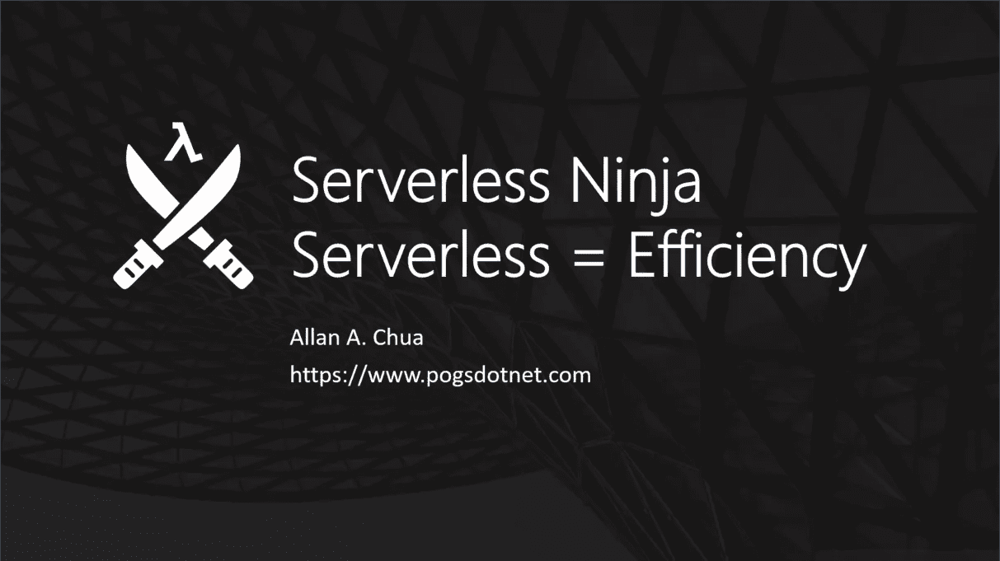
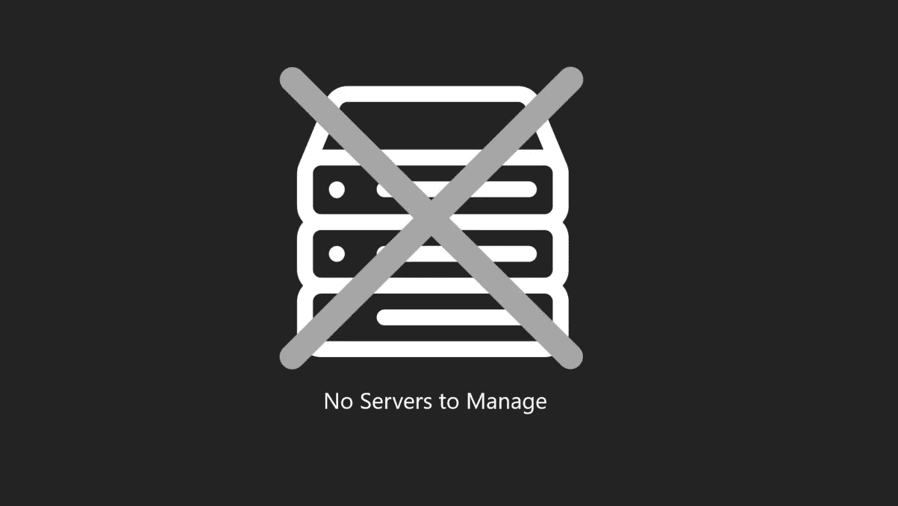
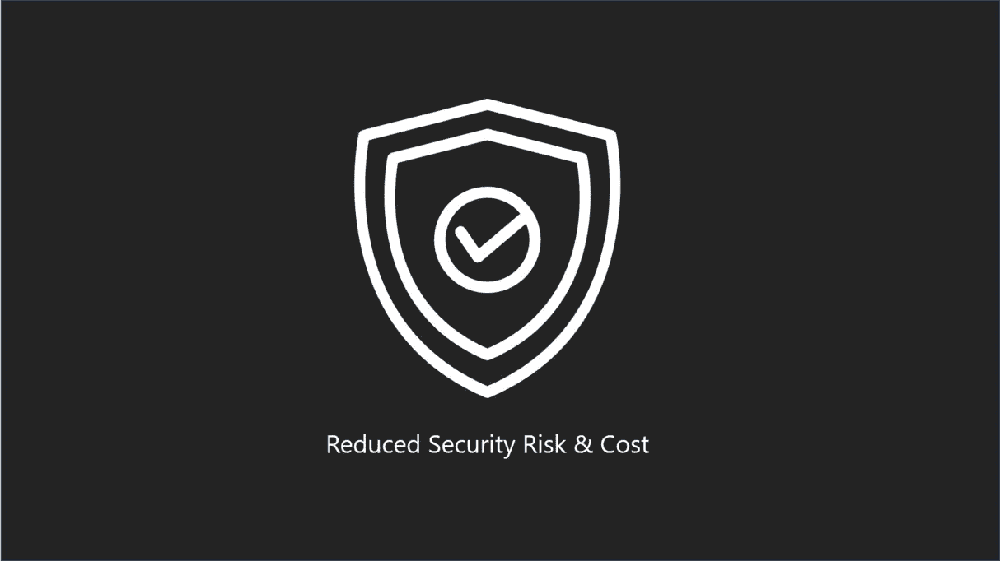
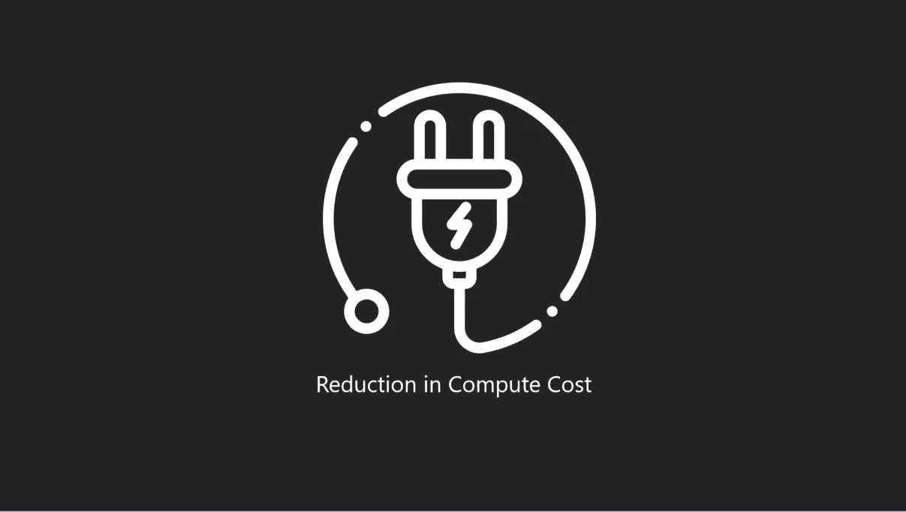
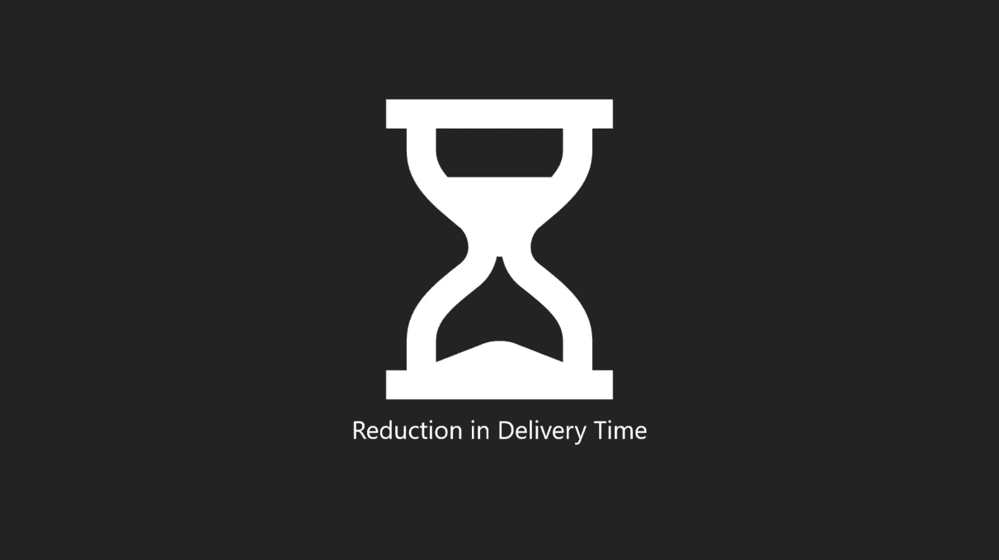

# 无服务器忍者第 1 部分:无服务器=效率

> 原文：<https://itnext.io/serverless-ninja-part-01-serverless-efficiency-64cf77915838?source=collection_archive---------4----------------------->

本文旨在解释组织和个人如何从无服务器架构提供的效率中获益。本文分享了基于无服务器系统有助于优化的四大成本中心。

# 消除服务器管理成本

无服务器架构不需要开发人员或组织来管理底层基础设施。另一方面，AWS 代表我们处理服务器管理活动，因此我们可以专注于编写应用程序的特性和功能。

因为基于无服务器的系统不需要组织来管理服务器。组织通过在以下活动中花钱来实现成本效益:

*   管理集群可扩展性
*   实施风险缓解
*   实施灾难恢复策略
*   修补安全漏洞
*   安装操作系统更新
*   雇佣服务器管理人员

# 降低安全风险和成本

让 AWS 管理底层基础设施的一个很酷的副作用是降低了安全风险和相关成本。想想看，AWS 雇佣顶级的安全和基础设施工程师，利用无服务器架构几乎类似于请这些世界级的技术专家来管理我们的基础设施，最终降低安全部门的成本和风险。

# 计算机费用减少

由于 AWS Lambda 的计费模式要求我们为实际执行使用时间付费，因此我们通过消除以下成本节省了大量资金:

*   空闲计算时间(为服务器不处理调用的时间付费。)
*   故障转移服务器的计算时间(为服务器冗余和灾难恢复付费)

# 减少开发成本和时间

基于 Lambda 的 API 旨在使我们能够更专注于构建我们的应用程序。我们可以节省用于以下方面的开发预算:

*   与设置服务器相关的活动
*   开发人员、基础架构团队、管理和架构团队召开的会议
*   测试集群可扩展性和弹性
*   设计和实施灾难恢复系统

将这些活动委托给 AWS 使我们能够通过构建、维护和增强我们软件的功能，将更多的精力放在为组织交付价值上。

# 我在写一本关于无服务器的书！

如果你有兴趣了解更多关于无服务器架构的知识，你可以访问我的 G [ithub](https://github.com/allanchua101/serverless-ninja) 知识库，阅读更多我还没有在博客中发表的主题。您还可以找到有趣的示例代码和项目，它们可以帮助您开始使用无服务器架构。

*原载于 2020 年 8 月 21 日*[*【https://www.pogsdotnet.com】*](https://www.pogsdotnet.com/2020/08/serverless-ninja-serverless-efficiency.html)*。*