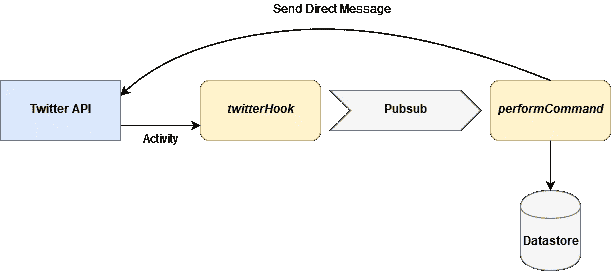

# 使用谷歌云的无服务器 Twitter 机器人

> 原文：<https://itnext.io/serverless-twitter-bot-with-google-cloud-35d370676f7?source=collection_archive---------0----------------------->

这篇文章通过开发一个 Twitter 书签机器人来探索使用 Google Cloud 组件的无服务器开发。该机器人允许用户通过向机器人的 Twitter 用户发送直接消息或在推文中提及机器人来保存和检索链接。

该机器人使用 Google Cloud 函数作为其业务逻辑，使用 NoSQL 数据库 Google Cloud Datastore 来存储和查询链接，使用消息队列 Google Cloud Pubsub 来进行函数之间的通信。

# 什么是无服务器？

无服务器或功能即服务，允许开发人员通过实现事件驱动的业务逻辑的功能来创建应用程序。无服务器平台将功能部署在短期容器中，以响应触发这些功能的事件。这种触发事件包括外部端点上的 HTTP 请求或云组件中的活动，例如由其他无服务器功能发布到队列的消息。

无服务器为功能提供了近乎无限的可扩展性，因为平台部署了足够多的功能容器来处理任何时候发生的大量触发事件，并允许应用程序开发者忽略运行应用程序的操作方面。

# 生产发展

无服务器平台通过提供具有不同语言运行时的容器来支持用多种编程语言编写函数，并支持在触发事件发生时调用和监控每种语言的函数。

我个人最熟悉静态类型的语言，比如 Java、Scala 和 Rust，但是我觉得这个 bot 是一个足够小的项目，使用 Google Cloud Functions 提供的内嵌 JavaScript 编辑器可能会更有成效。

内联 JavaScript 编辑器将代码完全保存在 Google Cloud 中，每当有人保存对代码的更改时，新版本的函数将部署在 NodeJS 容器中，以处理下一个触发事件。代码通过 Google Cloudstack 的函数日志进行调试和监控。

# 机器人的功能规范

Twitter 将通过向一个端点(一个 webhook)发送 HTTP 请求来与我们的 bot 进行交互，我们在 Twitter API 中注册了这个端点。端点必须能够响应每小时的加密活动挑战，Twitter 将定期向端点发布一批直接消息和推文提及，作为 JSON 数据。我们的机器人将需要解析所有的直接消息和推文，并把它们分成机器人的命令。该机器人应该支持以下命令

1.  机器人应该保存用户在直接消息或推文中发送给机器人用户的链接。链接应该用消息中包含的任何标签进行注释。
2.  如果用户发送包含单词“列表！”，机器人应该用一些用户链接的列表来响应。如果消息包含标签，那么只应该选择带有这些标签的链接。

为了开放机器人供公众使用，人们希望允许用户注册机器人，这样机器人就可以跟踪他们，并让他们向机器人用户发送直接消息，但这是以后的版本，我现在只是让机器人通过 Twitter 用户界面跟踪我自己的用户。

# 设计

我们的机器人将被实现为两个无服务器功能

1.  一个 ***twitterHook*** 函数公开了一个端点，并由来自 Twitter 的 HTTP 请求触发。该函数处理对 Twitter 的加密活动挑战的响应，并接收和解析批量活动数据的帖子。它将批处理分成单独的命令，以存储链接或执行列表，并将命令作为消息发布到 Google Pubsub 命令主题。
2.  一个 ***performCommand*** 函数由命令主题上的消息触发，并执行一个命令，要么在 Google Cloud Datastore 中存储一个链接，要么查询链接并将结果作为 Twitter direct 消息发送。

我们可以在一个函数中完成所有这些工作，但是这需要链接异步数据存储和列表发送操作，并且会使代码和错误处理变得复杂。如果在向 Twitter API 发送直接消息时速度缓慢或超时，这也可能会使无服务器功能花费太长时间来完成大批量操作。为了能够快速伸缩，无服务器平台只让函数运行几分钟就终止它们，这样函数就可以快速完成。

我们还可以将 ***performCommand*** 函数的工作分成两个独立的函数，一个存储链接，另一个响应列表命令，但是这要么需要发布到两个不同的主题，要么如果两个函数都由每个消息的相同主题触发，就会导致不必要的函数调用。

第三种方法是为结果列表创建一个额外的主题，并让***perform command***函数发布到这个主题，而不是通过 Twitter API 直接发送消息。结果列表主题将触发一个单独的函数，并发出直接消息。如果 list 命令不经常出现，这可能会导致它们的等待时间更长。

不经常调用的函数可能需要更长时间才能完成，因为它不太可能有可重用的运行容器来处理触发事件。启动一个新的容器会增加第一个函数执行的额外时间，这就是所谓的无服务器冷启动问题。

# 谷歌云的功能相当于 Twitter 的网络钩子

一旦我们在 Twitter 开发人员控制台中为我们的 bot 创建了一个用户和应用程序，Twitter API 就允许我们注册一个端点，一个 webhook，它将被调用，并通知帐户上的活动。这些通知包括帐户何时收到直接消息，或何时创建提及用户的推文。要使 webhook 获得 Twitter 的批准，它还需要对初始加密注册挑战和 Twitter 每小时发送的周期性挑战做出响应。

我们在下面创建 Google Cloud 函数，并将其配置为由 Google Cloud 控制台生成的端点触发。当函数在触发了异步发布操作(稍后将通过回调完成)后返回时，函数和回调调用响应对象上的 **send** 以让平台知道工作何时完成是很重要的。

APP_SECRET 等环境变量来自我们的 bot 应用程序的 Twitter 开发人员控制台，并且已经在 Google Cloud 控制台中的 ***twitterHook*** 函数的配置中指定(我知道，Google 不建议在环境变量中存储机密，但是 enterprise vault 不是这个项目的选项)。

创建函数后，我们还需要向 Twitter API 发送请求，将函数的端点注册为 webhook，并订阅 bot 用户的活动。

# 谷歌云发布

Google Pubsub 是一个消息队列，让云中的不同组件通过发布和订阅主题进行通信。由于我们的 ***twitterHook*** 函数向 Google Pubsub 上的主题*命令*发布消息，我们需要在我们的项目中创建主题，并授予我们的函数发布该主题的权限。我们可以在为下一个函数选择触发器时创建主题。

我们创建了***perform command***函数，并选择它应该由 Pubsub 主题上的消息触发，这使我们有机会创建 *commands* 主题。虽然我们的新函数现在可以在新消息发布到主题时接收调用，但我们仍然需要在 Google Cloud Console 的 Pubsub 配置中将我们的 ***twitterHook*** 函数的用户注册为主题的发布者。

# 命令功能和云数据存储

下面的***perform command***函数在命令消息发布到我们的 Pubsub 主题时被调用。它解析命令，或者存储到 Google Cloud Datastore 的链接，或者查询链接，并将结果作为直接消息发送到 Twitter API，发送给请求用户 ID。该函数通过调用提供的回调来通知平台它已经完成。

数据模型有一个分层键，用户 ID 位于顶部，链接存储为子键，标签存储在数组属性中。查询是通过指定用户键并为标签添加结果过滤器来完成的。

# 问题

谷歌云功能不成熟的一个标志是，编辑器自动为 ***performCommand*** 功能生成了错误的签名，这在使用动态类型语言时变得更加恼人。该函数通过 3 个参数(事件、上下文和回调)调用，但编辑器忽略了上下文，只生成了 2 个参数，因此在生成的签名上调用回调会导致“不是函数”错误，因为第二个参数实际上是上下文。

# 最终印象

使用谷歌云功能及其 JavaScript 编辑器真的很快，没有摩擦，因为人们可以跳过配置服务器或打包应用程序，流量很小的项目可以轻松地放在谷歌的免费使用层中。

然而，随着系统复杂性的增加，这种开发形式的局限性也逐渐显现出来，即使是像这样的小项目。我怀疑带有编译器支持的类型化 SDK 最终会同样高效，尽管每个部署步骤会比在编辑器中按 save 花费更长的时间。

无服务器对分布式可扩展性的关注和对专有云组件的严重依赖意味着开发、测试和维护完整多功能应用程序的最佳实践很少。这可能是需要出现的东西，以便更广泛的行业采用。无服务器功能可能会让位于无服务器容器平台，如 AWS Fargate 和 Kubernetes Knative，它们提供了一个不同的部署单元，具有更成熟的实践。

无服务器的可扩展性既吸引人又可怕，因为对性能和成本几乎没有限制。导致函数循环的编程错误或导致平台组件大量活动的加载攻击可能会变得非常昂贵，我还没有找到在谷歌平台上限制成本的简单方法(尽管像这个 Twitter bot 这样的项目可以防止恶意活动，因为 Twitter API 对用户活动进行速率限制和批处理)。

# 无服务器功能的利与弊

赞成的意见

*   巨大的可扩展性
*   支持超快速开发和部署
*   前期成本低，流量少的时候

骗局

*   对云组件的依赖导致供应商锁定
*   成本随流量线性增长，难以设定限制
*   维护和测试多功能版本化应用程序的最佳实践很少，对云组件的依赖使得离线测试很困难