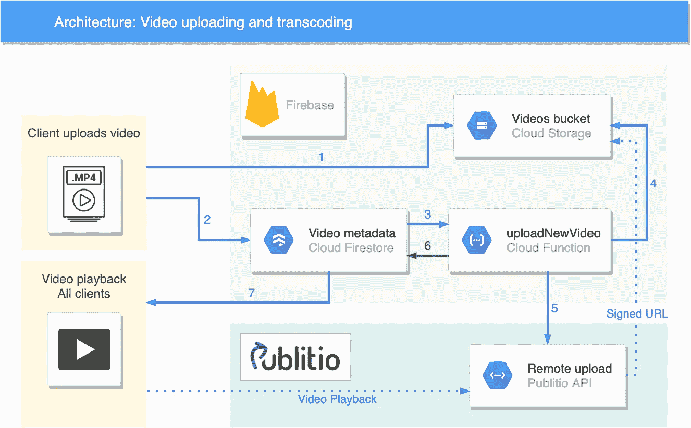
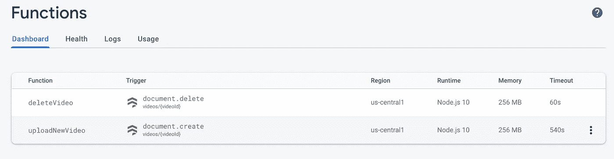
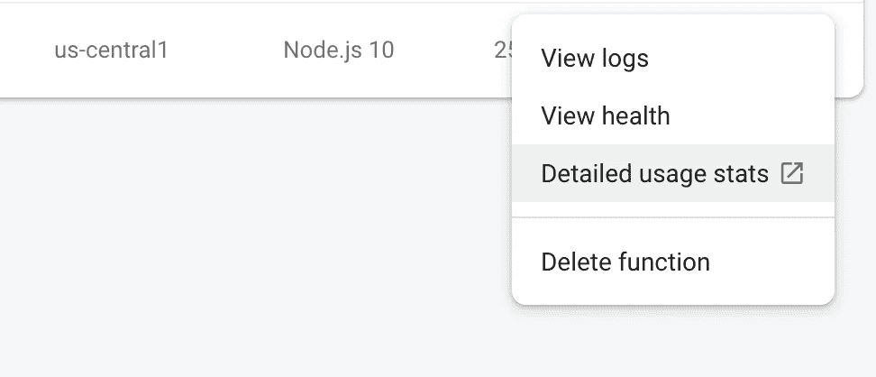
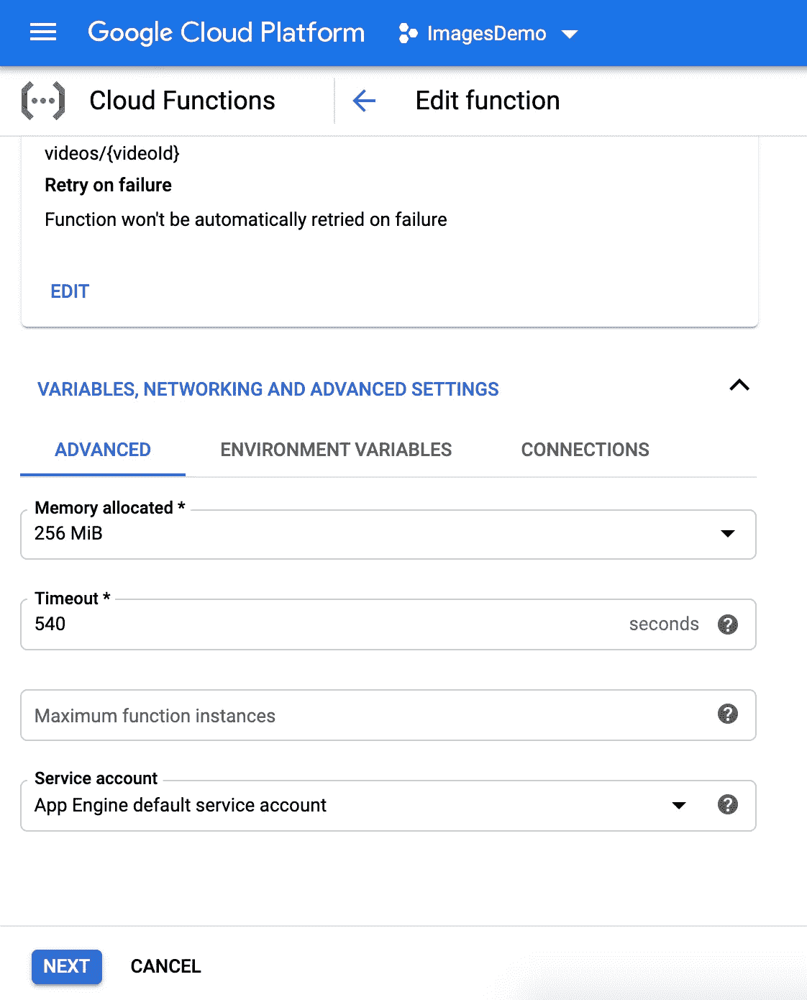
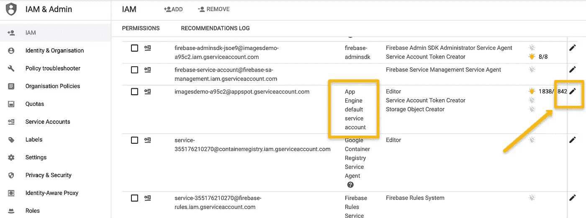
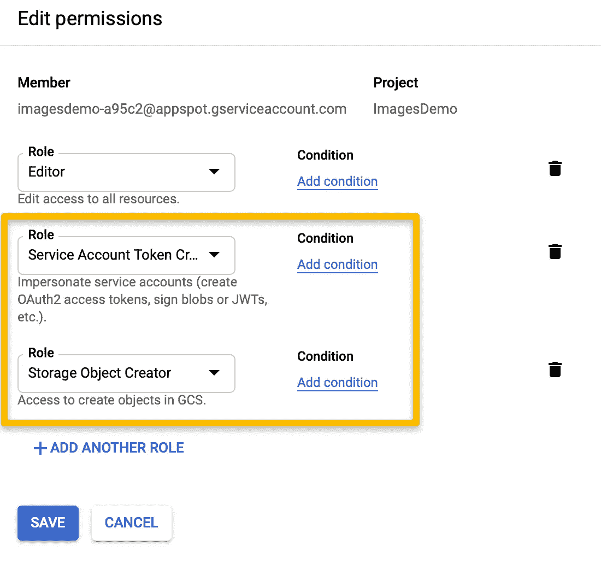

# 使用 Firebase 存储、云功能和 Publitio 进行无服务器视频上传和编码

> 原文：<https://itnext.io/serverless-video-upload-and-encoding-with-firebase-storage-cloud-functions-and-publitio-a4b2997b1508?source=collection_archive---------2----------------------->


# **我们正在建造的东西**

在我的[上一篇文章](/how-to-make-a-serverless-flutter-video-sharing-app-with-firebase-storage-including-hls-and-411e4fff68fa)中，我展示了如何使用*客户端编码*将视频上传到 Firebase 云存储。这种方法将编码负担放在客户端，但是可以节省服务器代码转换成本。

这一次我将展示如何使用*服务器端编码*，结合 [Firebase 云存储](https://firebase.google.com/docs/storage)、 [Firebase 云函数](https://firebase.google.com/docs/functions)和 [Publitio API](https://publit.io?fpr=jonathan43) ，我之前已经就[写过](/how-to-make-a-cross-platform-serverless-video-sharing-app-with-flutter-firebase-and-publitio-900a9fa0dd68)。

> *注意:我们在这里看到的方法解决了我在* [*这篇文章*](/how-to-make-a-cross-platform-serverless-video-sharing-app-with-flutter-firebase-and-publitio-900a9fa0dd68) *中描述的安全问题，因为 API 密钥和秘密根本不在客户端使用。*

# **系统设计**

每个视频文件的处理管道如下:



1.  将文件从客户端上传到 Firebase 云存储。
2.  在 Firestore 中创建状态为“正在处理”的文档。
3.  云功能由文档创建触发。
4.  云函数生成一个临时签名的 url，指向云存储中的文件。
5.  Cloud 函数调用 Publitio 远程文件上传端点，带有签名的 url。(您可以将其切换到任何媒体编码 API)
6.  云功能将 Publitio 视频 id、url、缩略图 URL 和其他元数据保存在 Firestore 中，并将文档“处理中”状态更改为已完成。
7.  更新后的 Firestore 文档会在客户端上即时更新。

为什么不直接从客户端上传到 publitio？

Firebase 云存储在无服务器架构中提供了一种更健壮的上传方式。我们可以使用 firebase 认证，只允许登录用户上传，防止用户删除其他人的视频等。如果我们直接从客户端上传到 publitio，我们必须把 API 密匙和秘密放在客户端。这是一个安全问题，因为我们必须假设客户端上的任何东西都可能被恶意的参与者获取。

为什么不在云函数中编码呢？

造成这个问题的主要原因是 Firebase 对函数执行时间的硬性限制:9 分钟([来源](https://cloud.google.com/functions/docs/concepts/exec#timeout))。如果你想实现良好的压缩，你需要运行一个缓慢的编码过程，这可能需要 9 分钟以上。

另一个原因是，您将重写专用 API 中已经可用的视频编码逻辑。

# **委托人**

客户端是这里最简单的部分。为了简单起见，我基本上使用了与[上一篇文章](/how-to-make-a-serverless-flutter-video-sharing-app-with-firebase-storage-including-hls-and-411e4fff68fa)相同的 Flutter 客户端，没有客户端编码。

我假设你已经有一个 firebase 项目设置。如果没有，可以看看[以前的帖子](/how-to-make-a-serverless-flutter-video-sharing-app-with-firebase-storage-including-hls-and-411e4fff68fa)

**上传文件**

上传过程需要两个部分:

1.保存到 Firebase 存储

我们将使用 [*image_picker*](https://pub.dev/packages/image_picker) 就像在之前的帖子中一样，但是现在文件上传是一个简单的存储 *putFile* :

2.在 Firestore 中保存初始条目

然后，我们将创建一个只包含名称的新 Firestore 文档(我们将在云函数中使用该名称在云存储中查找文件)，并将 *finishedProcessing* 字段设置为 false。

要添加删除选项，我们只需从 Firestore 中删除文档，让云功能触发 Publitio 文件的删除。

**结合客户端和服务器端编码**

当然，您可以在这里混合搭配，在上传之前使用基本的客户端编码，让 API 来完成繁重的工作。为了简单起见，我在这里没有包括代码，但是如果你想看，请留下评论:)

> 只要有云存储上传支持，您就可以将这种方法用于任何客户端框架，无论是移动的还是 web 的。

# **云功能**

这是大部分逻辑发生的地方。在部署之前，有几个设置步骤来配置云功能，但是首先，在 firebase 控制台中转到“功能”并启用云功能特性:


**初始化云功能**

让我们首先在项目根目录下创建一个文件夹，其中包含所有与函数相关的内容，这样就不会与客户端代码混淆。我们将该文件夹命名为`cloud-functions`。

现在，在文件夹中，我们将初始化函数部署环境:

```
cd cloud-functions
firebase login
firebase init functions
```

这将在“cloud-functions”中创建一个新的文件夹“functions”，包含将要部署的实际代码。

> *注意，因为我们想从云函数内部调用第三方 API，所以您必须更改为“Blaze”计划并启用计费，因为 Spark 计划不支持出站网络请求(*[*【https://firebase.google.com/pricing】*](https://firebase.google.com/pricing)*)。这并不意味着你将被收费，你仍然每月获得相同的免费配额。*

**初始化代码**

现在来看实际的功能代码。打开`/cloud-functions/functions/index.js`文件，添加以下代码(顺便说一下，这是 node.js)

这将初始化我们函数中需要的模块:

*   **功能**:定义触发器
*   **admin** :用于访问 Firestore 和云存储。管理环境在云功能环境中预先配置了一个专用的服务帐户。
*   **publitio API**—publitio node SDK。
*   **publitioCredentials** —创建 publitio 凭证文件:`/cloud-functions/functions/publitio_credentials.json`，以简单的 json 结构包含凭证:

```
{
  "key": "<your key>",
  "secret": "<your secret>"
}
```

> *如果您还没有 Publitio 凭据，您可以创建一个* [*自由帐户*](https://publit.io?fpr=jonathan43) *并从仪表板中复制它们。该文件将与我们的功能代码一起部署，在服务器上需要*和*。*

**上传新视频云功能**

我们有两个功能，一个用于上传新视频，一个用于删除视频。`uploadNewVideo`功能由 Firestore `onCreate`事件触发。该函数的作用如下:

1.  使用 Firestore 文档的 id 获取对云存储文件的引用
2.  获取指向存储文件的具有“读取”权限的临时签名 URL，该 URL 将在一小时后过期。
3.  用已签名的 URL 调用 publitio 的`uploadRemoteFile`端点。
4.  上传返回成功状态后，用视频 URL 和其他元数据更新 Firestore 文档。

> *注:我们发送的是* `*option_hls: 1*` *。这启用了由 Publitio 生成的 HLS(包括加密)。*

**删除视频云功能**

这个函数只是调用`/files/delete/` publitio API，由 Firestore `onDelete`事件触发。根据您的使用情况，您可能希望保留文件进行备份，而只删除元数据。

**部署**

现在我们可以运行`firebase deploy`命令了。成功部署后，您会看到控制台的“功能”部分出现了两个新功能:



**增加功能超时**

现在我们已经部署了函数，我们可以配置超时了。云函数的默认超时时间为 60 秒。这对于我们的目的来说可能是不够的，所以让我们改变它。

点击`uploadNewVideo`功能旁边的三个点，然后转到`Detailed Usage Stats`:



这将打开 GCP 的功能设置。现在转到编辑->高级，并更改超时字段:



> *注意:最大超时是 540 秒— 9 分钟。*

**编辑 IAM 角色**

我们还需要添加最后一项配置。为了使用`getSignedUrl`，我们需要启用 IAM(身份和访问管理)，它控制对云存储中的存储桶和对象的访问。在 GCP 控制台打开 [IAM &管理页面](https://console.cloud.google.com/iam-admin/iam?pli=1):



现在向这个服务帐户添加两个角色:`Service Account Token Creator`和`Storage Object Creator`:



现在，该函数应该有权限获取已签名的 url。

> 信用:[这个 SO 问题](https://stackoverflow.com/questions/53305784/signingerror-with-firebase-getsignedurl)

# **运行代码**

现在，你可以在 Android / iOS 设备上运行代码，上传视频，并在上传后直接从 Publitio 播放编码/转码后的文件。

感谢阅读！

完整的源代码可以在 [GitHub](https://github.com/syonip/flutter_cloud_function_publitio) 上找到。

如果您有任何问题，请留下您的评论！