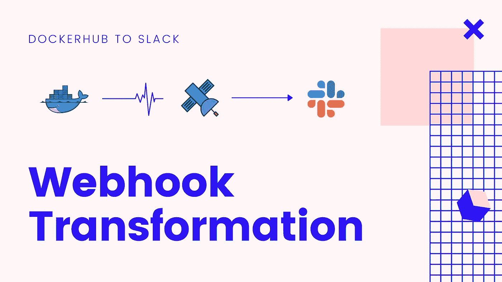
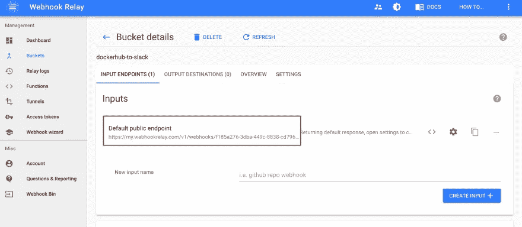
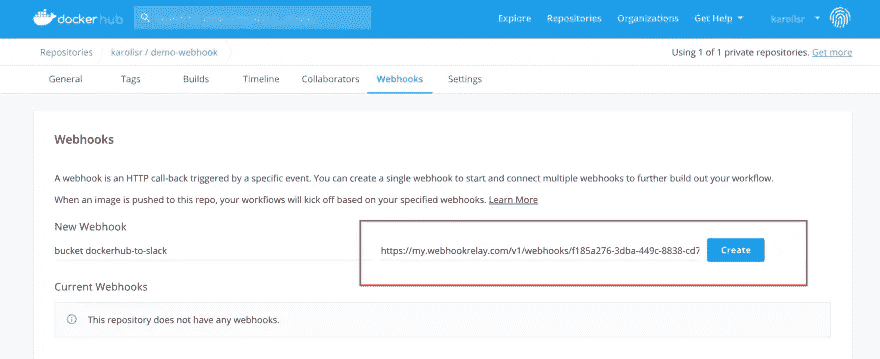
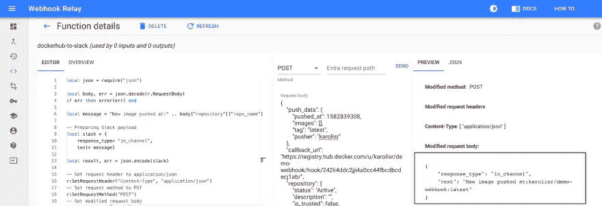
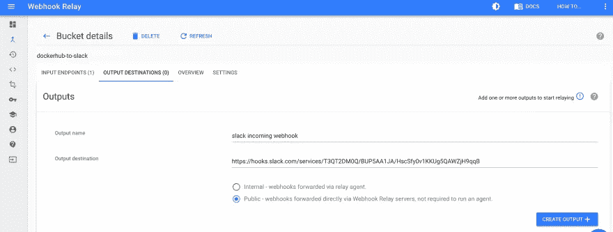
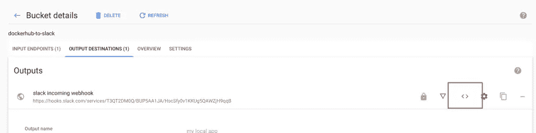
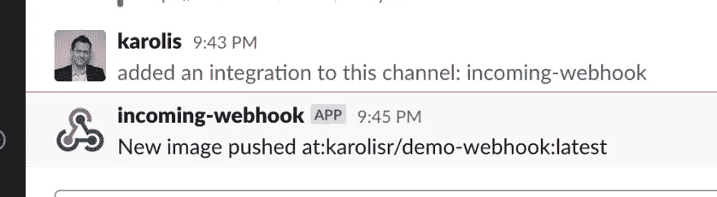

# 无服务器 webhook 转换(DockerHub 到 Slack)

> 原文：<https://itnext.io/serverless-webhook-transformation-dockerhub-to-slack-a2fc40a4cfff?source=collection_archive---------3----------------------->



许多 Docker 注册表提供了一种方式，当新的图像被推送时(如果你正在等待构建完成)，可以在聊天频道中通知团队。让我们将这一功能添加到官方 DockerHub 注册表中！:)

我们将使用新发布的 [Webhook 中继函数](https://webhookrelay.com/v1/guide/functions.html)来转换正在通过服务的 Webhook。

先决条件:

*   [Webhook 中继账户](https://my.webhookrelay.com/)
*   [DockerHub 账户](https://hub.docker.com/)
*   码头工人

# 创建存储桶并配置 DockerHub 通知

1.  在这里创建一个桶[https://my.webhookrelay.com/buckets](https://my.webhookrelay.com/buckets)
2.  一旦你有了它，在输入部分你会找到你的公共输入端点，复制它:



输入端点

3.添加一个指向公共输入端点( [DockerHub docs](https://docs.docker.com/docker-hub/webhooks/) )的新 DockerHub webhook 设置:



dockerhub webhook 配置

# 获取 DockerHub webhook 的示例

推送新的 Docker 图像:

```
$ docker push karolisr/demo-webhook:latest The push refers to repository [docker.io/karolisr/demo-webhook] 48bd38e03c42: Mounted from karolisr/webhook-demo fd9f9fbd5947: Mounted from karolisr/webhook-demo 5216338b40a7: Mounted from karolisr/webhook-demo latest: digest: sha256:703f2bab2ce8df0c5ec4e45e26718954b09bf4a625ab831c6556fd27d60f1325 size: 949
```

我们应该可以看到一个新的 webhook。看起来是这样的:

```
{
    "push_data": {
        "pushed_at": 1582839308,
        "images": [],
        "tag": "latest",
        "pusher": "karolisr"
    },
    "callback_url": "https://registry.hub.docker.com/u/karolisr/demo-webhook/hook/242ii4ddc2jji4a0cc44fbcdbcdecj1ab/",
    "repository": {
        "status": "Active",
        "description": "",
        "is_trusted": false,
        "full_description": "",
        "repo_url": "https://hub.docker.com/r/karolisr/demo-webhook",
        "owner": "karolisr",
        "is_official": false,
        "is_private": true,
        "name": "demo-webhook",
        "namespace": "karolisr",
        "star_count": 0,
        "comment_count": 0,
        "date_created": 1524557040,
        "repo_name": "karolisr/demo-webhook"
    }
}
```

# 创建一个函数来转换 webhook

转到[功能页面](https://my.webhookrelay.com/functions)并点击“创建功能”按钮。输入名称，例如“dockerhub-to-slack ”,然后单击“提交”。

> *对于这个例子，我们使用的是* [*Lua 语言*](https://www.lua.org/start.html) *，它提供了一种解析、转换有效载荷的简单方法。Webhook 中继函数也支持 WebAssembly 模块，但是它们目前正在开发中，只能使用中继 CLI 添加/更新。*

现在，您可以将 webhook 有效负载复制/粘贴到“请求正文”区域，以供以后测试使用。在代码编辑器中，让我们添加一个函数来获取存储库名称并准备一个 Slack webhook 有效负载:

```
local json = require("json")

local body, err = json.decode(r.RequestBody)
if err then error(err) end

local message = "New image pushed at: " .. body["repository"]["repo_name"] .. ":" .. body["push_data"]["tag"]

-- Preparing Slack payload
local slack = {
    response_type= "in_channel", 
    text= message}

local result, err = json.encode(slack)

-- Set request header to application/json
r:SetRequestHeader("Content-Type", "application/json")
-- Set request method to PUT
r:SetRequestMethod("POST")
-- Set modified request body
r:SetRequestBody(result)
```

点击“保存”,然后尝试用“发送”按钮进行测试:



函数执行响应

# 将一切联系在一起

1.  导航到 https://api.slack.com/messaging/webhooks 的[并点击“创建你的 Slack 应用程序”。选择您的工作区，输入一个您会记住的名称。](https://api.slack.com/messaging/webhooks)
2.  创建一个新的传入 webhook 配置，复制“Webhook URL”(它以`https://hooks.slack.com/services/T3...`开头)，我们需要将它提供给 Webhook 中继。
3.  打开您的存储桶详情(通过[https://my.webhookrelay.com/buckets](https://my.webhookrelay.com/buckets)
4.  打开“OUTPUT DESTINATIONS”选项卡，使用步骤 2 中的 Slack URL 创建一个名为“Slack”的新输出:



webhook 目的地为 Slack

5.创建完成后，点击“代码”符号，并从下拉菜单中选择`dockerhub_to_slack`功能:



选择我们新创建的函数

将新图像推送到 DockerHub，您应该会在 Slack 频道中看到新的通知:



收到你的信息

就是这样，可以随意继续修改 Lua 函数，加入 pusher 的名字和消息格式。按照这个过程，你可以将任何一个 webhook 转换成任何其他的 webhook。

玩得开心！

*原发布于*[*https://webhook relay . com/v1/examples/convert-docker hub-web hook-to-slack . html*](https://webhookrelay.com/v1/examples/convert-dockerhub-webhook-to-slack.html)