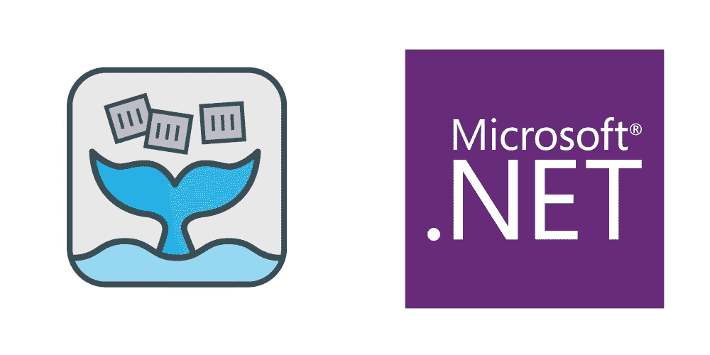

# 无服务器，带 OpenFaaS 和。网

> 原文：<https://itnext.io/serverless-with-openfaas-and-net-6a66b5c30a5f?source=collection_archive---------0----------------------->



今天，我们很可能至少听说过无服务器计算。然而，市场上最流行的选项与平台紧密相关，如果我们想与不同的提供商或多个提供商合作，这可能是一个问题。

OpenFaaS 改变了这一点，从某种意义上说，in 几乎可以在任何地方运行；Kubernetes，Docker Swarm 甚至单机。这意味着你可以使用 Azure、Google Cloud、Digital Ocean、bare metal 或 Raspberry Pi 部署你的功能。

当谈到你想使用的编程语言时，OpenFaaS 也非常灵活；Go，Python，Java，C#只是少数。你甚至可以使用 Dockerfile 文件。今天我们将关注。NET 和 C#，但我们最后会触及 F#支持。

# **设置环境**

安装 OpenFaaS 有多种选择，包括与云提供商如 Azure、Google 或 AWS 合作的托管 kubernetes 集群。为了简单起见，今天我们将使用 [minikube](https://minikube.sigs.k8s.io/) 。

## 阿尔凯德

Arkade 是 OpenFaaS 社区开发的一个很棒的工具，它极大地简化了我们将舵图安装到 kubernetes 集群中的方式。我们还可以用它下载各种 CLI 工具，比如`kubectl`、`helm`甚至`minikube`。我们将在这里使用它。

## **OpenFaaS**

此时，我将假设`kubectl`指向 minikube 集群。所以，我们用 Arkade 安装 OpenFaaS 吧。

```
$ arkade install openfaas
```

为了验证 OpenFaaS 是否已经启动，我们使用下面的命令，正如安装脚本所建议的那样。

```
$ kubectl -n openfaas get deployments -l “release=openfaas, app=openfaas”
```

接下来，我们需要安装`faas-cli`。我们也可以对阿卡德这样做。

```
$ arkade get faas-cli
```

然后，按照 OpenFaaS 安装脚本的建议，我们转发网关。这需要部署网关，所以我们可以先检查一下。

```
$ kubectl rollout status -n openfaas deploy/gateway
deployment “gateway” successfully rolled out$ kubectl port-forward -n openfaas svc/gateway 8080:8080 &
Forwarding from 127.0.0.1:8080 -> 8080
Forwarding from [::1]:8080 -> 8080
```

接下来，我们用`faas-cli`登录 OpenFaaS 网关。同样，按照安装脚本的建议。

```
$ PASSWORD=$(kubectl get secret -n openfaas basic-auth -o jsonpath=”{.data.basic-auth-password}” | base64 — decode; echo)$ echo -n $PASSWORD | faas-cli login — username admin — password-stdin
Calling the OpenFaaS server to validate the credentials…
Handling connection for 8080
WARNING! Communication is not secure, please consider using HTTPS. Letsencrypt.org offers free SSL/TLS certificates.
credentials saved for admin [http://127.0.0.1:8080](http://127.0.0.1:8080)
```

至此，我们的 OpenFaaS 集群已经可以使用了。

# 你好世界

我们的测试环境已经准备好了，所以…让我们用 C#来做我们的 Hello World。我们将从社区提供的官方模板开始。

```
$ faas-cli new — lang csharp hello
```

这将创建一个`hello.yml` YAML 文件和一个`hello`文件夹。快速浏览一下 YAML 的档案…

```
version: 1.0
provider:
  name: openfaas
  gateway: [http://127.0.0.1:8080](http://127.0.0.1:8080)
functions:
  hello:
    lang: csharp
    handler: ./hello
    image: hello:latest
```

因为我们需要一个 Docker 注册中心来发布我们的图像，所以让我们更改*图像*标签并添加所需的前缀。这可以是私有或公共注册表。在这种情况下，我只是添加我的 Docker Hub 用户名作为前缀。

```
functions:
  hello:
    lang: csharp
    handler: ./hello
    image: goncalooliveira/hello:latest
```

快速看一下旧的`hello`里面的`FunctionHandler.cs`…

```
using System;
using System.Text;namespace Function
{
    public class FunctionHandler
    {
        public string Handle(string input) {
            return $"Hi there - your input was: {input}\n";
        }
    }
}
```

现在让我们以最快的方式发布这个……`up`命令将构建、推送和部署。

```
$ faas-cli up -f hello.yml
...
Deployed. 202 Accepted.
URL: [http://127.0.0.1:8080/function/hello.openfaas-fn](http://127.0.0.1:8080/function/hello.openfaas-fn)
```

如果一切顺利，我们会看到一个已部署的消息和该函数的 URL。那么，让我们试试我们的功能。

```
$ curl -d 'hello' [http://127.0.0.1:8080/function/hello.openfaas-fn](http://127.0.0.1:8080/function/hello.openfaas-fn)
Handling connection for 8080
Hi there - your input was: hello
```

就是这样！我们在 C#中的第一个函数。

# **ASP.NET 功能**

尽管商店提供的`csharp`模板可以工作，但它没有提供太多的功能或控制，并且它使用了经典[版本的看门狗。对于更高吞吐量的情况，应使用新一代](https://github.com/openfaas/classic-watchdog)[看门狗。官方模板中又多了两个 C#模板:](https://github.com/openfaas/of-watchdog) [csharp-kestrel](https://github.com/burtonr/csharp-kestrel-template) 和 [csharp-httprequest](https://github.com/distantcam/csharp-httprequest-template) 。第一个不再维护，最后一个已经有一段时间没有更新了，尽管它添加了一个`HttpRequest`来获得更多的控制，但它使用了一个笨拙的元组`<int,string>`响应。

还有一个模板还不是商店的一部分。不过是 2020 年末提交的，所以以后可能会。 [ASPNET 函数](https://github.com/goncalo-oliveira/faas-aspnet-template)使用最新版本的看门狗，它内置了。NET 5 和 ASP.NET，并为那些习惯与 ASP.NET 一起工作的人提供了一个更容易识别的环境。此外，它支持依赖注入、配置、路由模板、认证和授权以及…调试。

## 装置

即使模板不是商店的一部分，它还是被安装了`faas-cli`。

```
$ faas-cli template pull [https://github.com/goncalo-oliveira/faas-aspnet-template](https://github.com/goncalo-oliveira/faas-aspnet-template)
```

## 你好 ASPNET 世界

现在模板已经安装好了，我们像以前一样创建一个新函数，这一次是用`aspnet`模板。

```
$ faas-cli new --lang aspnet hello-aspnet
```

查看已创建的`hello-aspnet.yml` YAML 文件，基本相同。

```
version: 1.0
provider:
  name: openfaas
  gateway: [http://127.0.0.1:8080](http://127.0.0.1:8080)
functions:
  hello-aspnet:
    lang: aspnet
    handler: ./hello-aspnet
    image: hello-aspnet:latest
```

我们像以前一样做同样的事情，并更改图像名称，以匹配我们的公共或私有注册表。

```
functions:
  hello-aspnet:
    lang: aspnet
    handler: ./hello-aspnet
    image: goncalooliveira/hello-aspnet:latest
```

查看`hello-aspnet`文件夹，我们现在有两个文件，`Function.cs`和`Startup.cs`。我们从查看函数代码开始。

```
using Microsoft.AspNetCore.Http;
using Microsoft.AspNetCore.Mvc;
using OpenFaaS;
using System;
using System.Threading.Tasks;namespace OpenFaaS
{
    public class Function : HttpFunction
    {
        [HttpGet]
        [HttpPost]
        public override Task<IActionResult> HandleAsync( HttpRequest request )
        {
            var result = new
            {
                Message = "Hello!"
            };return Task.FromResult<IActionResult>( Ok( result ) );
        }
    }
}
```

我们立刻看到三个我们认识的东西。`HttpRequest`输入，提供对请求的完全控制，`IActionResult`响应和 HTTP 方法属性(默认为 GET 和 POST)。

现在让我们快速看一下`Startup.cs`。

```
using Microsoft.Extensions.Configuration;
using Microsoft.Extensions.DependencyInjection;namespace OpenFaaS
{
    public class Startup
    {
        public Startup( IConfiguration configuration )
        {
            Configuration = configuration;
        }public IConfiguration Configuration { get; }// This method gets called by the runtime. Use this method to add services to the container.
        public void ConfigureServices( IServiceCollection services )
        {
            services.AddHttpFunction<Function>();// add your services here.
        }
    }
}
```

再说一次，我们认识一些东西。一个`IConfiguration`实例和一个`IServiceCollection`实例的 DI 设置。

让我们像第一个例子那样做，然后发布函数。

```
$ faas-cli up -f hello-aspnet.yml
...
Deployed. 202 Accepted.
URL: [http://127.0.0.1:8080/function/hello-aspnet.openfaas-fn](http://127.0.0.1:8080/function/hello-aspnet.openfaas-fn)
```

同样，如果一切顺利，我们会看到一个已部署的消息和该函数的 URL。让我们试一试。

```
$ curl [http://127.0.0.1:8080/function/hello-aspnet.openfaas-fn](http://127.0.0.1:8080/function/hello-aspnet.openfaas-fn)
Handling connection for 8080
{"message":"Hello!"}
```

仅此而已。我们的功能起作用了。

## 为什么我应该使用 ASPNET 函数？

那么这个模板到底能给我们带来什么呢？

**更新完毕**

该模板使用最新的看门狗版本，更适合高吞吐量的场景。它还使用最新版本的。NET 和 ASPNET。

**可以辨认**

因为它在幕后使用 ASPNET，所以熟悉它的人可以认出许多东西。HTTP 方法属性、`IActionResult`和`Ok()`、`NoContent()`或`BadRequest()`响应方法…

**依赖注入**

我们大多数使用 ASPNET 的人都使用依赖注入。`Startup.cs`文件允许我们非常容易地配置 DI 容器，就像我们使用 ASPNET 应用程序一样。

**配置**

还提供了 ASPNET 配置模型。`Startup.cs`中的`IConfiguration`实例由环境变量和 OpenFaaS *秘密*填充。在本地运行时，它还会读取一个`config.json`文件(如果存在)。

**认证和授权**

因为它在幕后使用 ASPNET，所以可以在`Startup.cs`中配置认证。function 类也可以用`Authorize`属性来修饰，这样只有经过身份验证的请求才能执行它。

```
namespace OpenFaaS
{
    [Authorize]
    public class Function : HttpFunction
    {
        ...
    }
```

**本地运行**

该功能可以通过 [FaaS 转轮](https://github.com/goncalo-oliveira/faas-run)在本地执行。这对于在没有 Kubernetes、Docker Swarm 或 [faasd](https://github.com/openfaas/faasd) 的环境中测试、调试(通过附加到进程)甚至运行该函数非常有用。

```
$ dotnet build hello-aspnet/
...
$ faas-run hello-aspnet/bin/Debug/netstandard2.0/function.dll
OpenFaaS ASPNET Function LoaderTo debug attach to process id 95587.Loaded function assembly hello-aspnet/bin/Debug/netstandard2.0/function.dll.Running...
```

**我们可以用 VS 代码**进行调试

使用 FaaS 运行程序，我们可以通过附加到运行函数进程来进行调试。进程 id 显示在顶部。

我们也可以在`launch.json`文件中创建一个配置来自动完成这项工作。下面是从模板自述文件中检索到的一个示例。

```
{
    "name": ".NET Core Launch (faas run)",
    "type": "coreclr",
    "request": "launch",
    "preLaunchTask": "build",
    "program": "faas-run",
    "args": ["bin/Debug/netstandard2.0/function.dll", "--no-auth"],
    "cwd": "${workspaceFolder}",
    "stopAtEntry": false,
    "console": "internalConsole"
},
```

## Hello F#世界

到目前为止，我们已经用 C#做了所有的事情，但是 ASPNET 函数也有一个 F#模板。在引擎盖下，它是完全一样的，功能也是一样的。

所以让我们像以前一样创建一个新函数，这一次，使用`aspnet-fsharp`模板。

```
$ faas-cli new --lang aspnet-fsharp hello-fsharp
```

看着创建的`hello-fsharp.yml` YAML 文件，差不多就是这样。

```
version: 1.0
provider:
  name: openfaas
  gateway: [http://127.0.0.1:8080](http://127.0.0.1:8080)
functions:
  hello-fsharp:
    lang: aspnet-fsharp
    handler: ./hello-fsharp
    image: hello-fsharp:latest
```

我们像以前一样做同样的事情，并更改图像名称，以匹配我们的公共或私有注册表。

```
functions:
  hello-fsharp:
    lang: aspnet-fsharp
    handler: ./hello-fsharp
    image: goncalooliveira/hello-fsharp:latest
```

所以现在我们来看一下`hello-fsharp`文件夹。我们可以看到它的结构非常相似。我们的函数在`Library.fs`文件中，还有一个`Startup.fs`文件。让我们看看我们的功能。

```
namespace OpenFaaSopen Microsoft.AspNetCore.Http
open Microsoft.AspNetCore.Mvc
open OpenFaaS
open System
open System.Threading.Taskstype Function() =
    inherit HttpFunction()[<HttpGet>]
    [<HttpPost>]
    override this.HandleAsync( request : HttpRequest ) =
        let result = {| Message = "Hello" |}
        Task.FromResult( this.Ok( result ) :> IActionResult )
```

差不多吧，不过加了 F#。让我们发表它。

```
$ faas-cli up -f hello-fsharp.yml
...
Deployed. 202 Accepted.
URL: [http://127.0.0.1:8080/function/hello-fsharp.openfaas-fn](http://127.0.0.1:8080/function/hello-fsharp.openfaas-fn)
```

同样，如果一切顺利，我们会看到一个已部署的消息和该函数的 URL。让我们试一试。

```
$ curl [http://127.0.0.1:8080/function/hello-fsharp.openfaas-fn](http://127.0.0.1:8080/function/hello-fsharp.openfaas-fn)
Handling connection for 8080
{"message":"Hello!"}
```

仅此而已。我们的 F#函数正在工作。

# 最后的话

OpenFaaS 是一个很棒的无服务器功能框架，也是 Azure Functions 或 AWS Lambda 的优秀替代品。有了 ASPNET 函数，我们可以释放。NET，用它的 C#和 F#。

这篇文章仅仅触及了表面，因此我强烈建议看看项目页面，包括 [OpenFaaS 框架](https://www.openfaas.com/)和 [ASPNET 函数](https://github.com/goncalo-oliveira/faas-aspnet-template)。如果你喜欢他们，给他们一颗星。