# 借助 SuperGloo 和服务网格中心，服务网格管理变得轻而易举

> 原文：<https://itnext.io/service-mesh-management-a-breeze-with-supergloo-service-mesh-hub-ffbcee280f2e?source=collection_archive---------3----------------------->

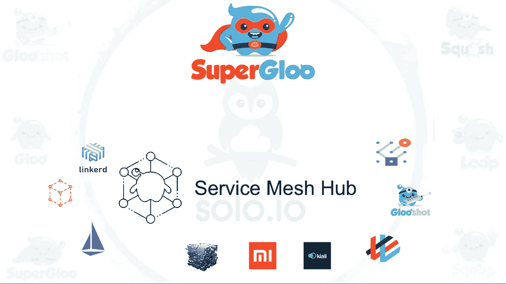

简化的服务网格操作和流程编排

服务网格空间是一个迅速出现的技术和商业机会，目前有大量的选项可供选择，将来还会有更多的选项。这对于应用程序开发人员来说可能听起来令人兴奋，但是转向网格技术的开发人员必须选择一个提供者并直接编写这些 API。因此，开发人员被束缚在服务网格实现中。没有通用接口，开发人员将失去可移植性、灵活性，并限制他们从广泛的生态系统创新中获益的能力。

SuperGloo 项目提供了一个抽象层来统一和自动化从安装到运营的任何网格的管理生命周期，无论最终用户是从一个或多个提供商为其环境选择单个还是多个集群网格。这为多网格体系结构打开了大门，在这种体系结构中，同一组织内的不同组或同一集群上的同一用户可能喜欢不同的服务网格产品，而这些产品最适合他们的特定需求和使用情形。SuperGloo 具有 API,用于分别使用“安装”和“网格”配置对象来安装和发现服务网格的能力。

超级格洛进化成了一个通晓多种语言的人。任何服务网格都可以通过与入口控制器集成来受益于这种架构，以便对北/南和东/西流量进行组合管理，并允许用户将任何服务网格与具有 SuperGloo 处理安装和配置的任何入口配对。最近，Solo.io 宣布了另一个名为“服务网状中枢”的项目，该项目使用网络门户简化了 SuperGloo，并实现了一个类似市场的平台，便于供应商提供他们的产品作为扩展。

服务网格枢纽[源于](http://medium.com/solo-io/introducing-the-service-mesh-hub-everything-you-need-for-your-service-mesh-environment-679225a566b0) [SuperGloo](https://github.com/solo-io/supergloo) 的发布，统一了服务网格生命周期管理。该中心建立在 SuperGloo 之上，为服务网格技术的协作和管理提供了一个集中的场所。

# SuperGloo API 规范并扩展到 CRD 的 Kubernetes

SuperGloo 是用 Solo-Kit 生成的代码构建的，它为编写基于事件的系统提供了一个框架。每个实体(如路由、网格等。)来管理多个服务网格体系结构是一个 go-proto，它将数据结构转换为协议缓冲区的有线格式，或者从有线格式转换数据结构。

用户可以使用“同步程序”来扩展 SuperGloo 的功能。与“翻译器”一起工作的同步功能负责执行一些动作，以响应用户配置或一些发现的信息的改变。如下所示，所有的 api 扩展都是通过使用 Kubernetes-CRD 的来提供给 Kubernetes 环境的。

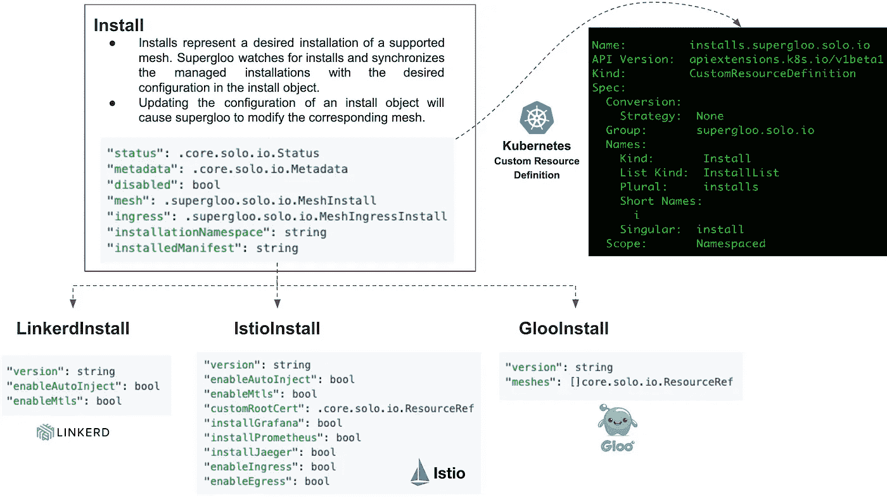

安装基础架构以使用 SuperGloo 安装多个服务网格

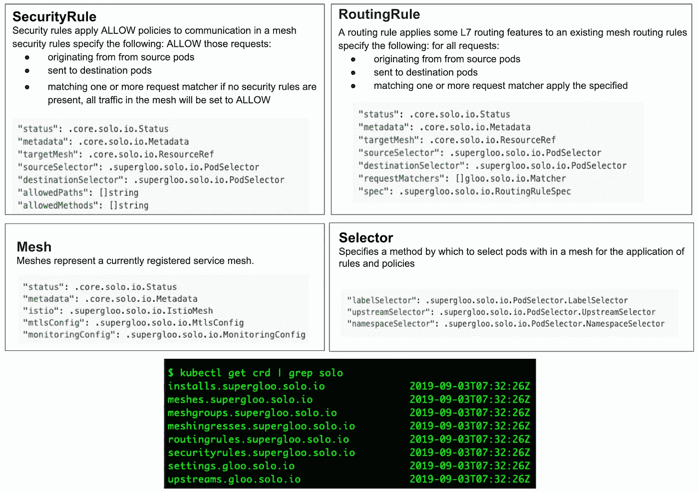

使用 SuperGloo API 管理多个服务网格提供商

# 超级 Gloo 组件

## 超级 Gloo CLI

SuperGloo 提供了一套全面的 CLI 来安装 SuperGloo 本身、安装服务网格、注册现有网格并操作它们。

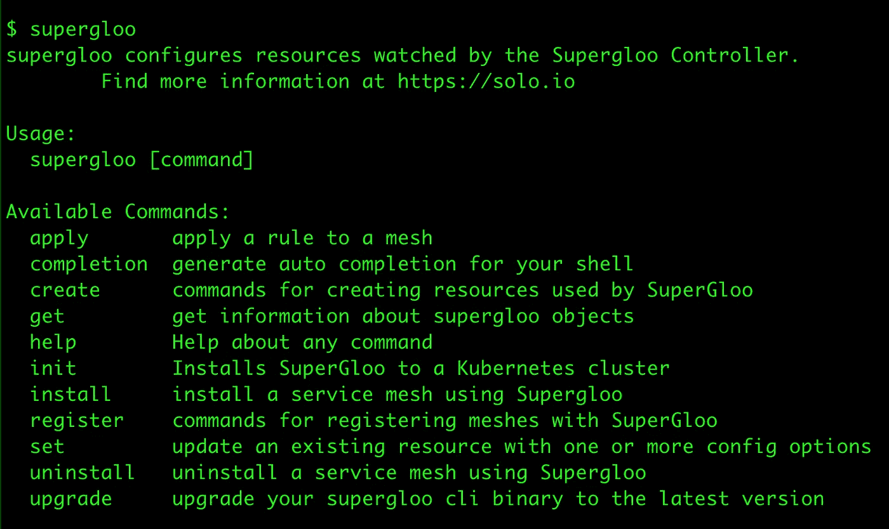

SuperGloo CLI

Kubernetes 上的 SuperGloo 安装基于使用“supergloo init”或通过 Helm 的单一命令:

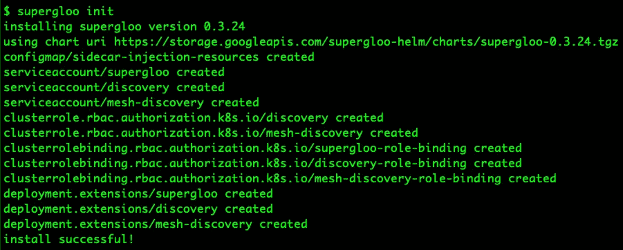

超级 Gloo 安装

## 控制器

SuperGloo 控制平面包括三个组件，部署为 Kubernetes 部署。

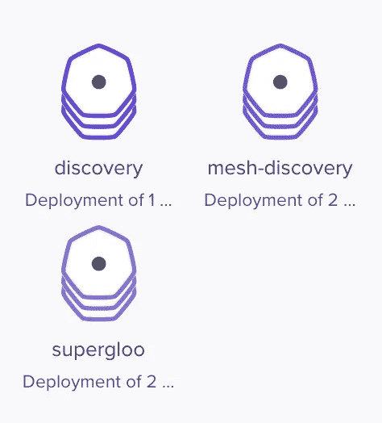

超级 Gloo 控制平面

1.  超级 Gloo 控制器

观察事件，维护用户配置或发现的配置中的事件循环，并管理配置同步。

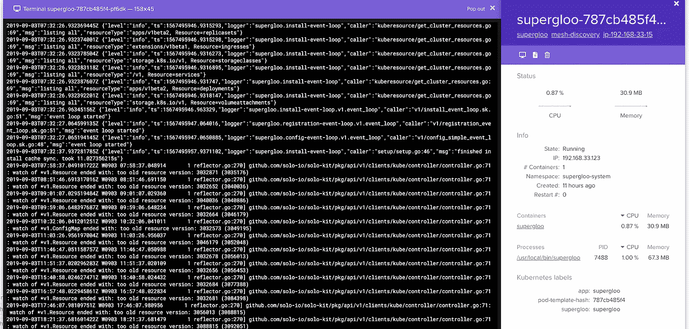

2.网格发现

观察现有网格和安装了 SuperGloo 的网格。网格发现提供了发现在部署了网格发现的集群中运行的服务网格的能力。

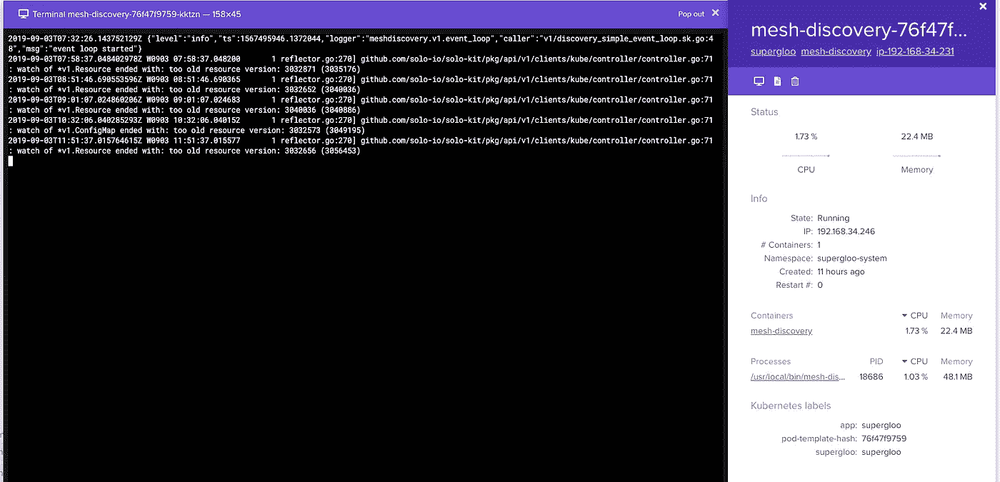

3.发现

发现服务是本机 Gloo 的功能发现机制，它可以自动发现功能，以方便路由。

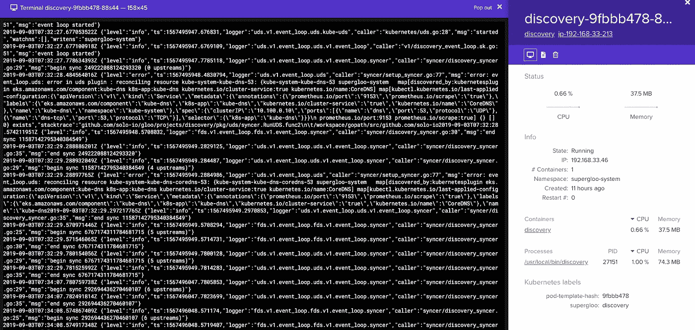

# 使用 SuperGloo 安装和管理 Istio

一旦 SuperGloo 如上所示被初始化，具有配置参数的安装 CRD 将可用于触发 SuperGloo 安装网格。

Istio 可以使用 SuperGloo CLI(或)通过 YAML 配置片段安装，该配置片段使用 Kubectl(本地 Kubernetes 创建对象的方式)应用

## 使用 SuperGloo CLI 安装 Istio

```
supergloo install istio --name istio --installation-namespace istio-system --mtls=true --auto-inject=true
```

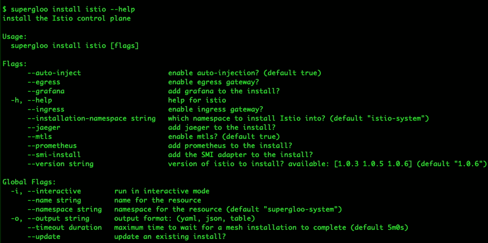

Istio 安装选项— SuperGloo CLI

## 使用 YAML 安装 Istio 超级 CRD

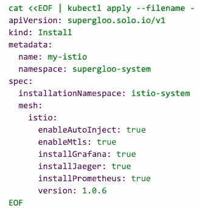

Istio 装置— YAML

以上任何一种方法都可以无缝安装所有 Istio 组件。

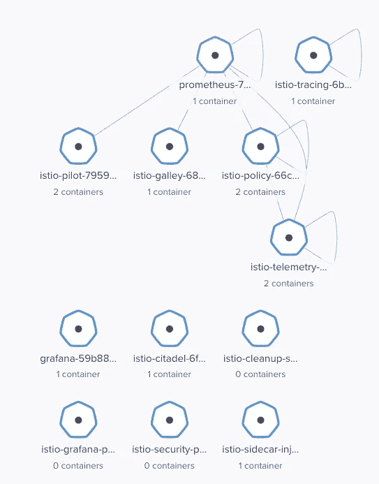

Istio 已安装— SuperGloo

SuperGloo 控制器发现、同步和转换所有本机 Istio 对象，如下所示:

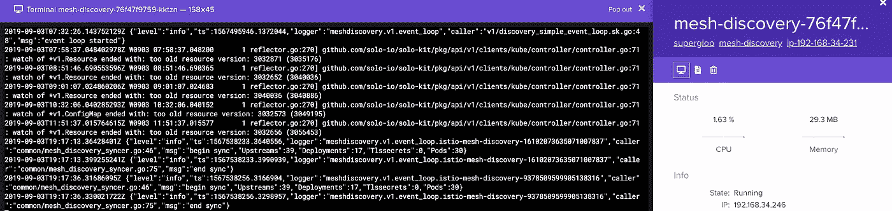

超级网格发现

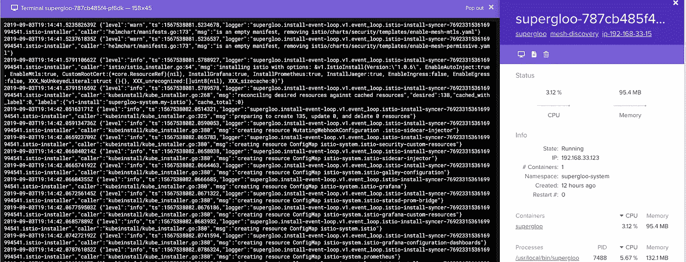

SuperGloo 控制器同步 Istio 组件

# 使用 SuperGloo 配置 Istio:

SuperGloo 使用户能够配置和管理安装在任何 Istio 功能之上的 Istio，如流量转移、提供认证机构、故障注入等。可以在交互和非交互模式下使用 SuperGloo CLI 轻松配置。

## 配置流量转移 Istio-SuperGloo

以 Bookinfo 应用程序为例，使用 SuperGloo 配置典型的流量转移配置。用户可以使用 SuperGloo CLI 配置流量转换规则，而无需提供 Istio 配置。SuperGloo 无缝地将所有需要的规则转换为 Istio，从而提供一个统一的控制实体来管理用户服务网格(在这个场景中为 Istio)。

在这个例子(Bookinfo)中，review 包括三个版本:v1、v2、v3。由于没有指定路由规则，书评在黑色、红色和根本不显示之间交替。


Bookinfo 应用示例

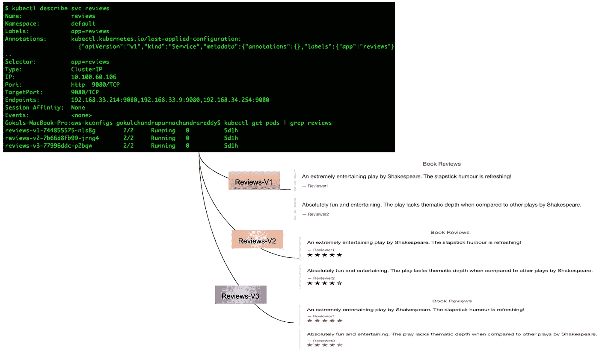

版本化审查— v1、v2、v3

在交互模式下配置流量转移规则，将所有流量转移到 Reviews-V3:

```
$ supergloo apply routingrule trafficshifting --interactive
```

1.  命名 routing_rule 并选择名称空间:

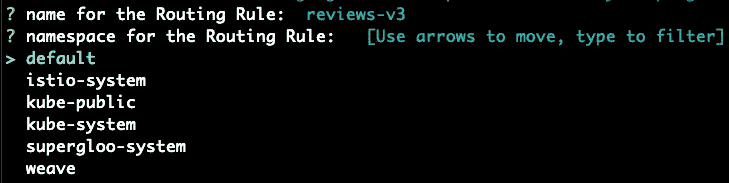

交互模式—命名空间和名称

2.配置源和目的选择器:

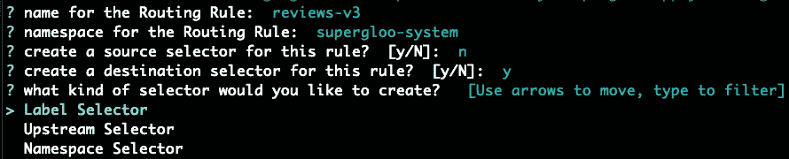

配置选择器

3.选择上游:

Discovery 通过以下方式创建 Kubernetes 服务的上游:

*   对于每个 kubernetes 服务
*   对于服务上的每个端口
*   对于在支持该服务的 pod 上找到的标签的每个唯一子集，创建一个名为`<service-namespace>-<service-name>-<label-values>-<service-port>`的上游

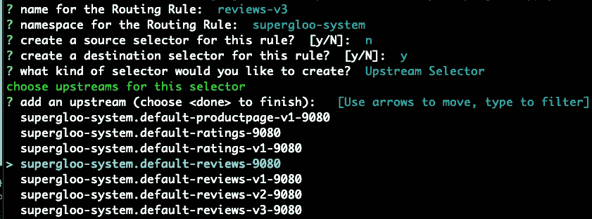

选择要关联的上游

4.选择目标网格:

SuperGloo 支持并发现环境中的多个网格。例如，Istio 和 Linkerd 可以在同一个 Kubernetes 集群上共存，配置可以跨网格无缝隔离。

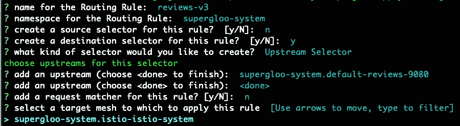

指定目标网格

5.选择上游将流量转移到:

在这个例子中选择“评论-v3”

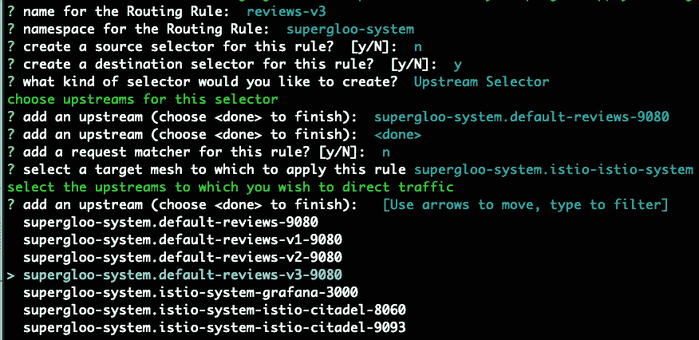

流量转移目的地

这将创建一个路由规则，将 100%的流量转移到 reviews-v3。此处指定的权重参数为“1”，如下所示:

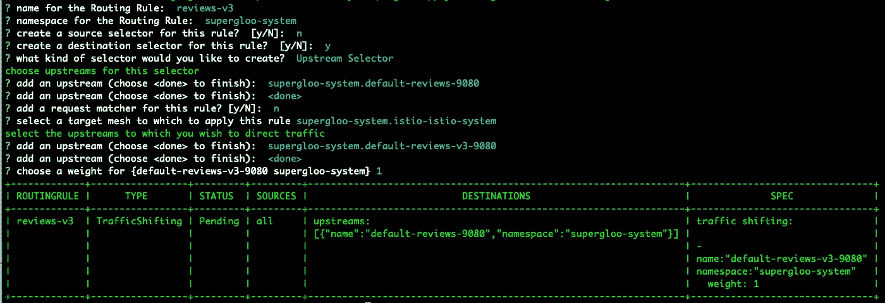

使用 SuperGloo 创建的路由规则

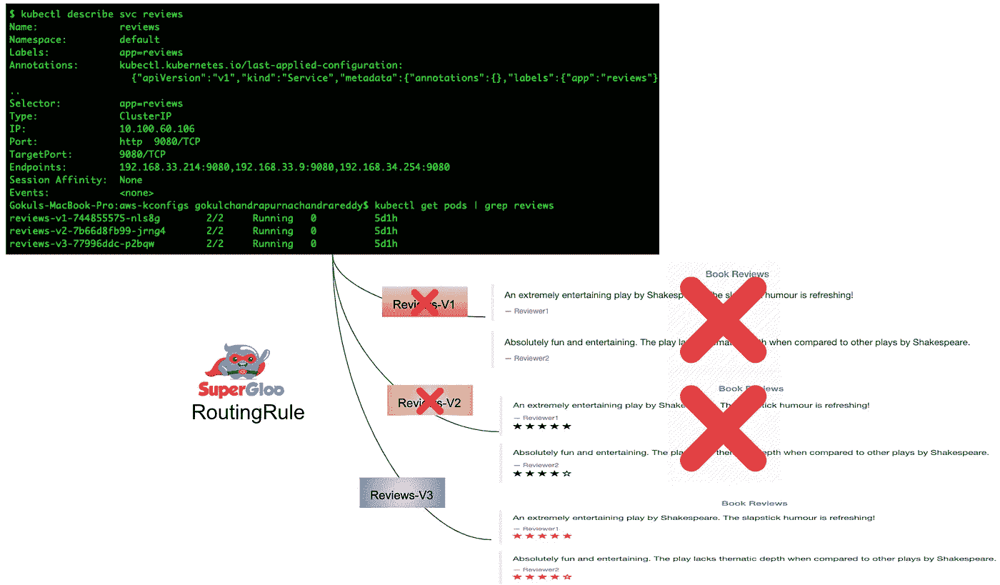

规则实施将所有流量转移到 reviews-v3

上述配置创建了一个路由规则，并将其作为虚拟服务转换/同步到 istio-system 名称空间中的 Istio:

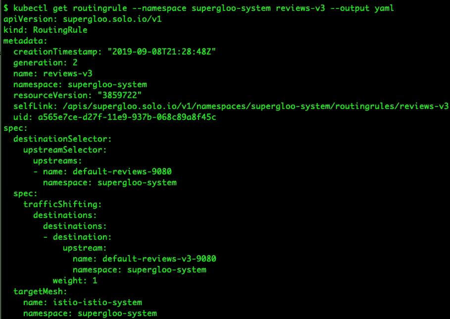

SuperGloo 路由规则对象

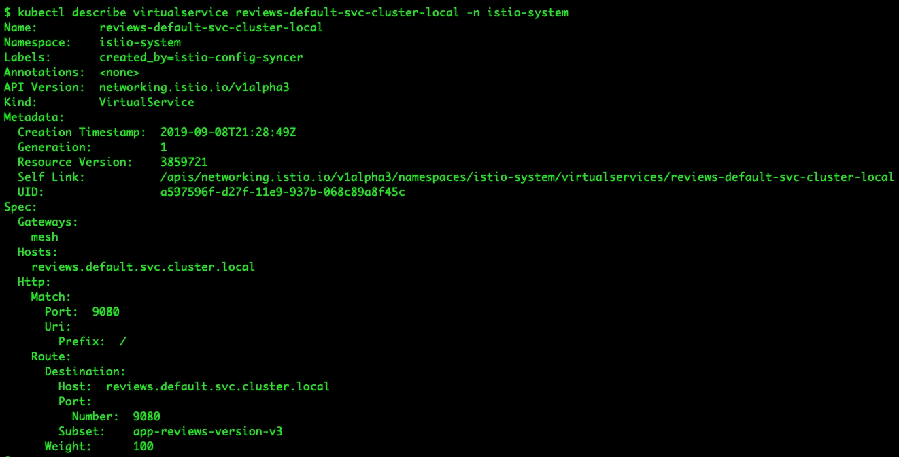

Istio 虚拟服务对象

上述配置也可以在非交互模式下完成，也可以通过 Kubectl 应用的 YAML 配置文件来完成。

```
supergloo apply routingrule trafficshifting **\
**    --name reviews-v3 **\
**    --dest-upstreams supergloo-system.default-reviews-9080 **\
**    --target-mesh supergloo-system.istio-istio-system **\
**    --destination supergloo-system.default-reviews-v2-9080:1 **\
**    --destination supergloo-system.default-reviews-v3-9080:1
```

如上所述，用户可以使用 SuperGloo 无缝地配置各种特定于 Istio 的结构，而无需提供任何特定于 Istio 的信息。集群中的所有上游都是使用 SuperGloo 发现自动发现的。

# 使用 SuperGloo 管理多个服务网格(Isito、Linkerd ):

SuperGloo 支持在同一个集群中安装和运行多个网格的多个入口。例如，使用 Istio 和 Linkerd 的集群，SuperGloo 可以发现网格，用户可以在应用任何配置时选择目标网格。

在带有 Istio 的同一集群上安装带有 SuperGloo 的 Linkerd:

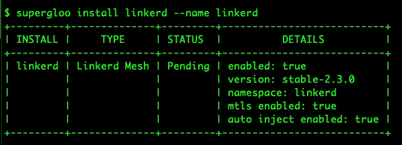

安装 link erd-super gloo

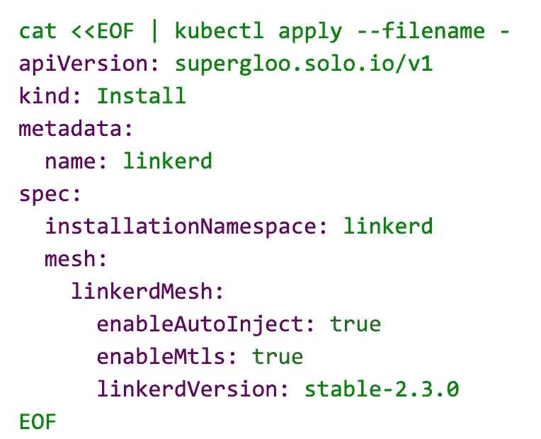

安装 Linkerd-YAML

SuperGloo mesh 发现，发现 Istio 和 Linkerd:

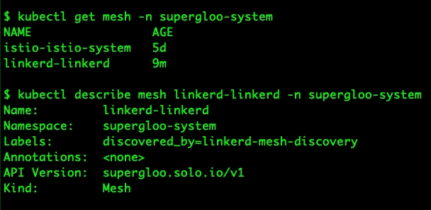

多重网状发现—超级 Gloo

选择目标网格，在具有多个网格的环境中使用 SuperGloo 将配置应用到特定网格。

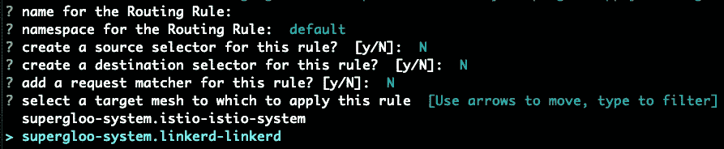

目标网格选择 SuperGloo

# 服务网状集线器

该中心建立在 SuperGloo 之上，为服务网格技术的协作和管理提供了一个集中的场所。服务网格中心是一个仪表板，它允许用户在一个门户中管理和操作有关网格的一切。除了服务网格之外，服务网格中心还提供了一个扩展目录，其中列出了可用于向网格添加更多功能的工具。

扩展空间是一个集中的地方，让公司添加他们正在使用的不同服务网格工具，了解网格内发生的交互，并从一种扩展应用商店为每个工具添加扩展。

安装服务网状集线器还会安装上一节中讨论的所有 SuperGloo 组件。除了 SuperGloo 组件之外，还部署了两个额外的组件:SMM-ui——服务网格集线器 web 门户和 SMM-API server——与 SuperGloo 交互。

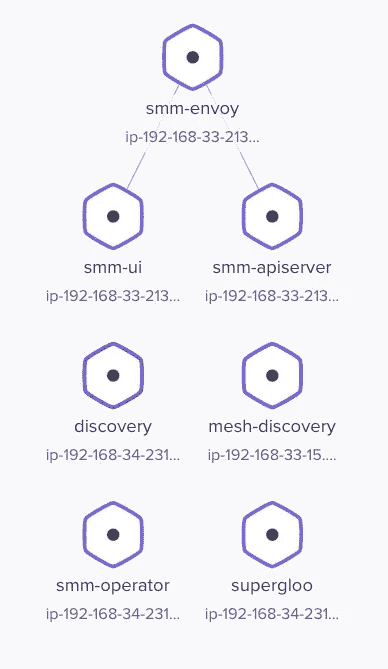

服务网状集线器组件

服务网格集线器 Web-UI 包括三个标签:网格—可以使用 SMH 安装的各种支持的服务网格提供程序，2。扩展—各种扩展可供用户随已安装的服务网格和 3 一起安装。演示——提供者提供演示，用户可以使用这些演示来理解工作模式和架构(实际操作)。

**扩展**

Service Mesh Hub 使开发人员能够编写和分发新的服务网格扩展，解决与强制执行依赖关系要求和基于已部署到集群的网格定制安装清单相关的问题。

## 使用服务网格集线器安装服务网格和扩展

通过服务网格中心门户安装服务网格:

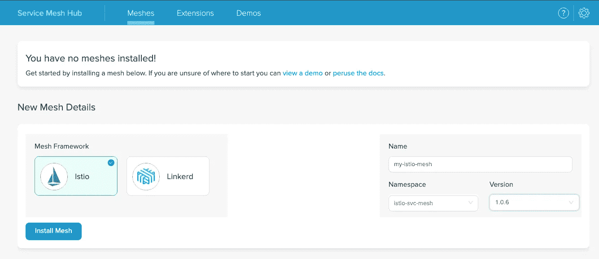

从服务网状网络中心安装网状网络—门户网站

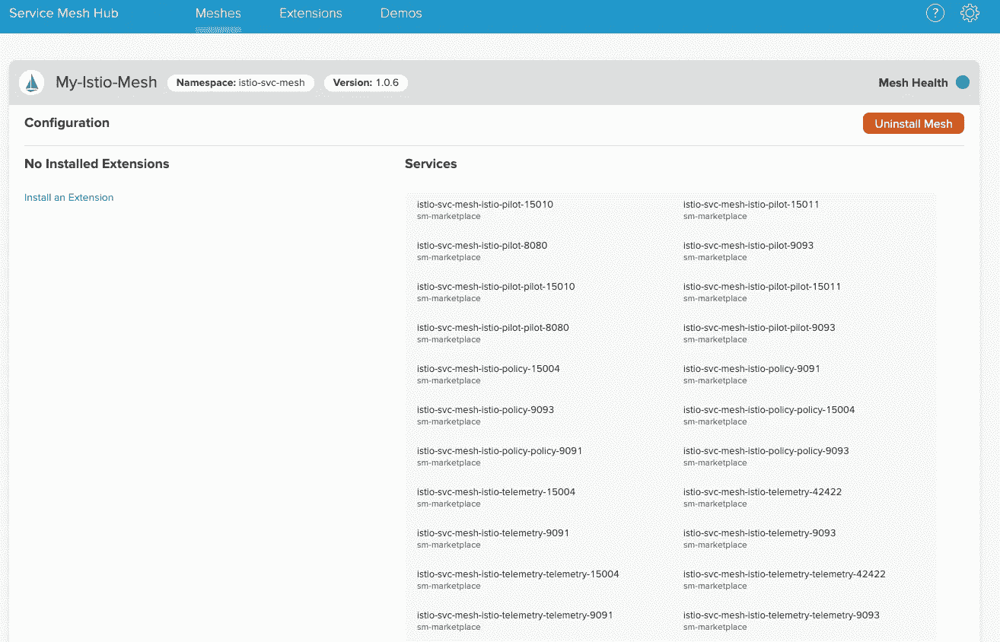

服务网状网络中心的网状网络状态—门户网站

服务网格集线器允许在同一个集群中安装多个网格。如下所示，Linkerd 也可以安装在同一个集群上:

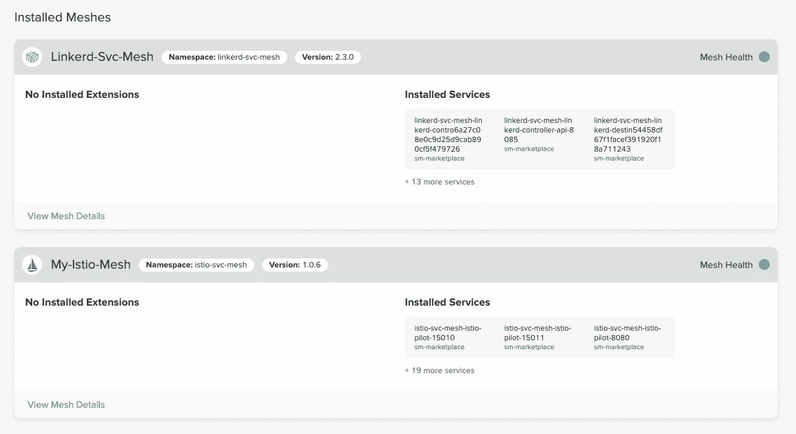

Linkerd 和 Istio 与服务网状集线器一起安装

安装与已安装的服务网格兼容的扩展:


扩展目录

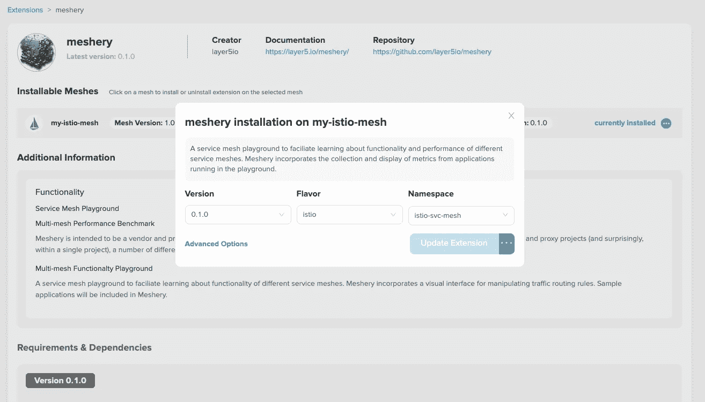

网格扩展安装示例

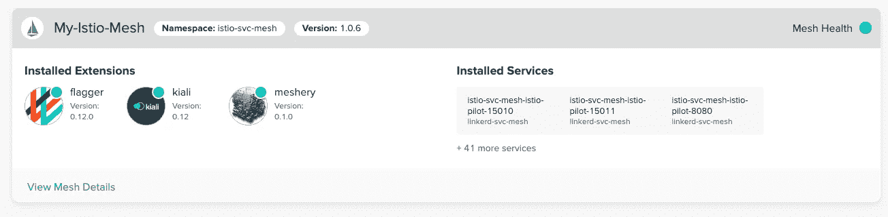

使用服务网状集线器安装的 Istio 扩展

所有网格和扩展组件都将通过单击从指定名称空间下的 Kubernetes 集群上的服务网格中心无缝安装。

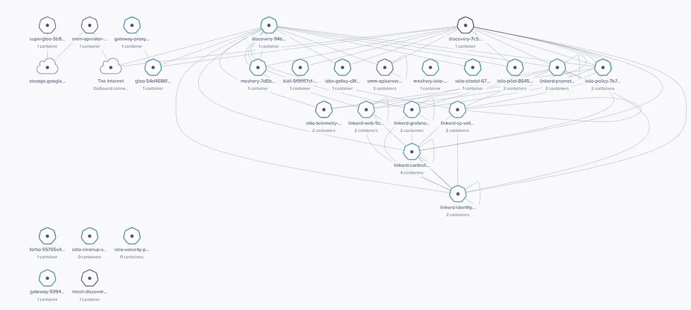

使用服务网状集线器在 Kubernetes 集群上安装的 Istio、Linkerd 和其他 Istio 扩展

对于像服务网格这样蓬勃发展的技术来说，一个通用标准对于保持最佳的最终用户体验至关重要。这是 SuperGloo 背后的愿景——创建一个抽象层来保持不同网格之间的一致性。微软的服务网格中心旨在类似的框架。

另一方面，Service Mesh Hub 提供统一的仪表板来安装、发现或操作任何网格，并提供扩展目录来构建、共享和安装扩展网格环境功能的工具。它建立在 SuperGloo 的基础功能之上，并对其进行了扩展，以提供出色的最终用户体验和生态系统协作。随着服务网格变得越来越主流，我们可以预计许多企业将会寻找一个平台来统一运营和管理。