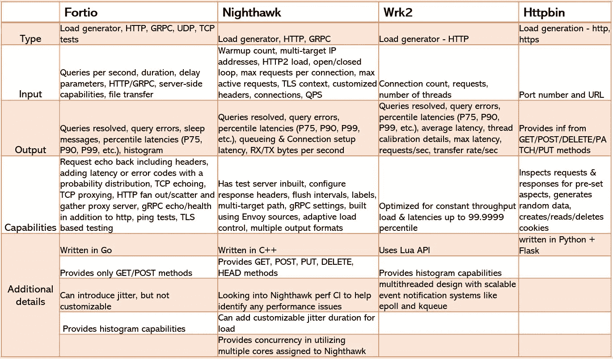
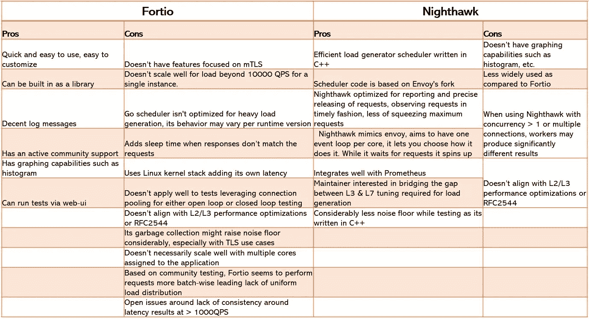
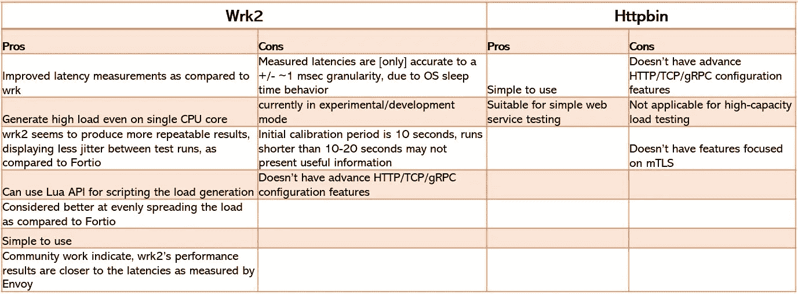
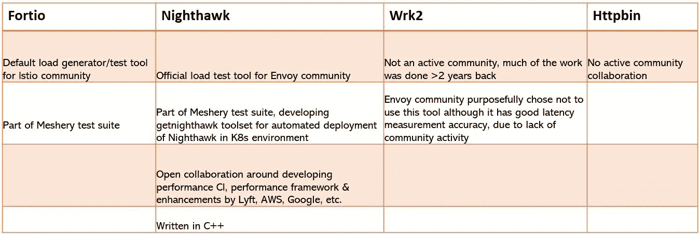
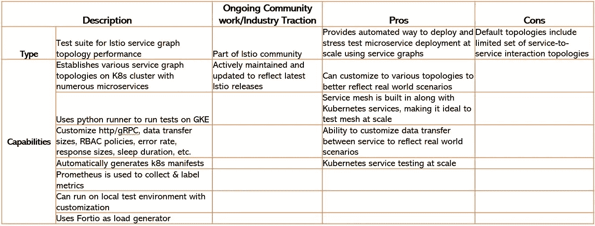
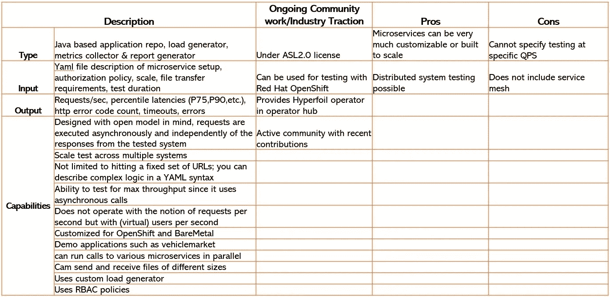
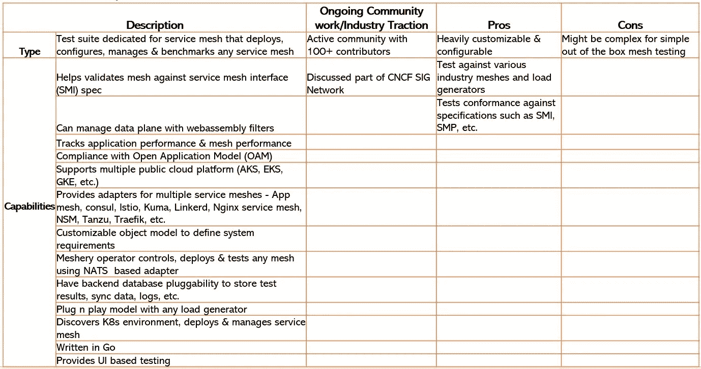
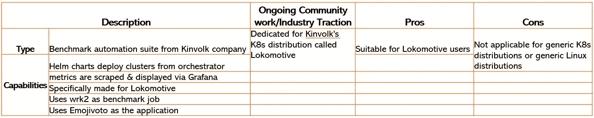
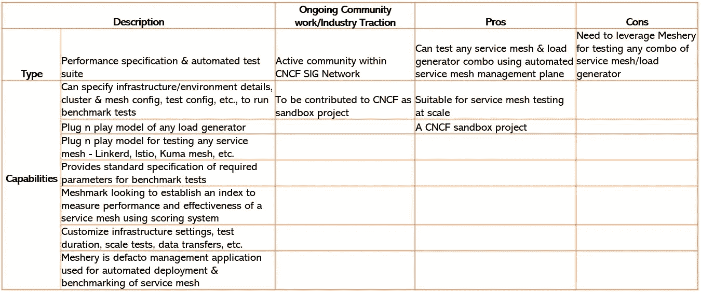

# 服务网格测试—工具和框架(开源)

> 原文：<https://itnext.io/service-mesh-testing-tools-frameworks-open-source-7904ee222298?source=collection_archive---------3----------------------->

服务网格在 OSI 第 4 层到第 7 层之间运行，而 Kubernetes 容器网络接口(CNI)为第 2 层和第 3 层网络提供基础设施。在使用服务网格部署应用程序时，我们需要测试、确保和衡量应用程序不会受到服务网格的负面影响。工具和测试套件在理解部署应用程序的环境的影响方面起着至关重要的作用。随着向微服务的转移，工具集的分布式特性对于跨分布式应用部署(在同一集群内或集群间)使用第 3 层到第 7 层流量进行规模测试变得更加重要。

有相当多的开源工具集已经接受了测试和测量服务网格性能影响的挑战。使用以下工具探索特性功能的描述和比较:

*   福蒂奥
*   夜鹰
*   Wrk2
*   Httpbin
*   网状结构
*   同位素
*   超油
*   服务网格基准
*   蝗虫
*   服务网格性能

# 理想特征集

在我们开始测试或测量服务网格影响之前，我们需要清楚应用程序部署的环境。话虽如此，有助于研究基于微服务的应用部署的服务网格的理想功能集是什么？列出了几个项目:

*   从第 3 层到第 7 层提供吞吐量和延迟方面的性能
*   能够利用 HTTP 1/1.1/2 和/或 gRPC 特性
*   提供调整设置的能力，如加密类型、连接数、同时用户数、套接字规模、内部发送/接收的数据包等。
*   能够提供可插拔和可扩展的接口，以添加额外的测试功能
*   周围有一个活跃的开源社区
*   理想情况下，符合 RFC 设定的要求，例如针对第 3 层测试的 RC2544。
*   在各种负载产生条件下具有低噪声基底，因此对测试结果增加最小的抖动/延迟或不增加抖动/延迟
*   最重要的是，在多次运行中提供一致的可重复结果

这里提供的工具集和测试套件基于源代码、社区讨论和提到的每个项目的文档描述了每个工具集和测试套件的亮点。

在开始测试之前，要了解服务网格的基准测试和测试考虑事项的详细信息，请查看[关于服务网格性能的 5 件事](https://sunkur.medium.com/5-things-to-know-about-service-mesh-performance-a8331765e995)

# 负载发生器:

图 1 提供了可用的开源负载生成器的高级描述。对比的负载发电机有 [Fortio](https://github.com/fortio/fortio) 、[夜鹰](https://github.com/envoyproxy/nighthawk)、 [Wrk2](https://github.com/giltene/wrk2) 和 [Httpbin](https://github.com/postmanlabs/httpbin)

图 1:开源负载生成器的高级描述

# 利弊

图 2 和图 3 从优点和缺点方面提供了特性的高级比较。请注意，这种比较并不是否定开源社区所做的令人难以置信的工作，它仅仅是比较每个工具集的特性/功能/性能属性。

图 Fortio 和 Nightwak 的对比

图 Wrk2 和 Httpbin 的比较

这些细节的来源很少:

*   Fortio 与 Wrk2 对比:[https://docs . Google . com/document/d/10 xequejujdmffq 36 kgrxi 6v 78 gkhspqn _ n b-pohKfOo/edit？ts=5dc9b15a & pli=1#](https://docs.google.com/document/d/10xeQuEjUjdmfFq36kGrxI6v78GKHspqn_Nb-pohKfOo/edit?ts=5dc9b15a&pli=1#)
*   夜鹰表演框架设计:[https://docs.google.com/document/d/14Iz8j-MVB 06 qfb 8 rurtylwmy 657 ybavfqdr-jKgtaQ/edit # heading = h . grkfe 6 onmtgv](https://docs.google.com/document/d/14Iz8j--Mvb06QFB8RurtYlwmy657YbAVfqDr-jKgtaQ/edit#heading=h.grkfe6onmtgv)
*   特使需求 OSS 基准测试:[https://docs . Google . com/document/d/1 mama-ksrn 0 oibinozkudjdaihk 2 ntqxfncujq 2 fki 4 e/edit](https://docs.google.com/document/d/1mAma-ksRN0OIBInoZKUdjdaIhK2nTQxFnCujq2fKi4E/edit)
*   Wrk2 vs. Fortio 对比:[https://docs . Google . com/document/d/10 xequejujdmffq 36 kgrxi 6v 78 gkhspqn _ n b-pohKfOo/edit？ts=5dc9b15a & pli=1#](https://docs.google.com/document/d/10xeQuEjUjdmfFq36kGrxI6v78GKHspqn_Nb-pohKfOo/edit?ts=5dc9b15a&pli=1#)
*   http bin:[https://httpbin.org/](https://httpbin.org/)

# 持续的社区牵引

Github activity 通常为任何项目提供关于开源社区牵引力的见解。图 4 对这些开源社区的活动提供了很少的见解。

图 4:开源社区牵引

# 服务网格测试框架

虽然开源负载生成器可以用作测试工具，但框架提供了额外的测试功能，如分布式测试、可伸缩性、进一步定制等。同位素、Hyperfoil、网格、蝗虫、服务网格基准和服务网格性能等框架如下所述。

## 同位素

同位素 GitHub:[https://github.com/istio/tools/tree/master/isotope](https://github.com/istio/tools/tree/master/isotope)

要详细查看同位素和服务图表，请检查 Istio 的[同位素](https://sunkur.medium.com/isotope-for-istio-41dd3c218996)

图 5:同位素框架细节

## 超油

Hyperfoil 是一个面向微服务的分布式基准框架。

更多详情:【https://hyperfoil.io/ 

图 6: Hyperfoil 框架细节

## 网状结构

网格为服务网格提供了一个管理平面。

更多详情:[https://meshery.io/](https://meshery.io/)

图 7:网格框架细节

## 蝗虫

Locust 为负载测试等提供了框架。

更多详情:[https://locust.io/](https://locust.io/)

图 8:蝗虫框架细节

## 服务网格基准

服务网格基准是一个用于配置和测试服务网格的测试套件

服务网格基准 GitHub:[https://github.com/kinvolk/service-mesh-benchmark](https://github.com/kinvolk/service-mesh-benchmark)

图 9:服务网格基准详细信息

## 服务网格性能框架

跨各种网格使用模式部署和测试各种服务网格的框架

更多详情:[https://smp-spec.io/](https://smp-spec.io/)

图 10:服务网格性能框架

这里还有其他可以添加的工具或者框架吗？是否有过与上述不一致的经历？

很想听听你对它们的看法。

*注:此处表达的观点为个人观点，不代表任何实体。*