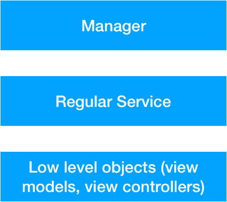
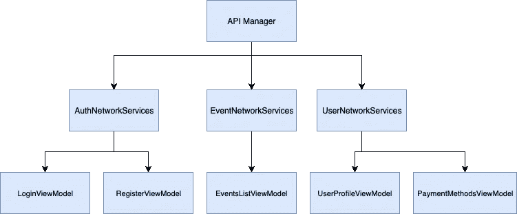
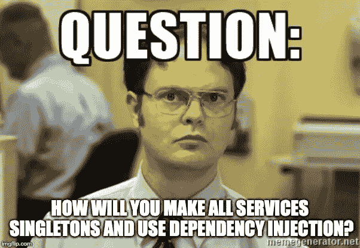

# 如何使用 swift 实施面向服务的架构

> 原文：<https://itnext.io/service-oriented-architecture-in-swift-362dc454fc09?source=collection_archive---------1----------------------->

当谈到软件架构时，没有什么灵丹妙药。然而，每个系统都应该遵循一些原则。其中一些原则是干净的、可重用的和可测试的代码。面向服务的架构(SOA)可以为我们提供这些，并且很容易实现。

## 什么是面向服务的架构？

SOA 是[软件设计](https://en.wikipedia.org/wiki/Software_design)的一种风格，其中服务由[应用组件](https://en.wikipedia.org/wiki/Application_components)通过网络上的[通信协议](https://en.wikipedia.org/wiki/Communications_protocol)提供给其他组件。面向服务架构的基本原则独立于供应商、产品和技术。

## 什么是服务？

服务是在网络中运行的逻辑单元，具有以下特征:

*   它处理业务流程
*   它可以访问另一个服务
*   它相对独立于软件
*   它只有一个责任

您应该将服务视为工具。我们将在其他类中导入它们，并用它们来构建特性。这种结构将给我们带来前面提到的好处。这些工具将帮助我们处理 API、核心数据、位置、任何第三方代码或业务流程。

## 两种服务

在我们的 SOA 实现中，我们使用两种类型的服务:管理器和常规服务。从结构上看，它们是相同的，但管理者具有以下属性:

*   它是围绕一些框架核心数据构建的服务
*   通用和简单——只知道获取、保存、更新和删除数据，不处理特定的数据
*   易于替换——如果我们想用 Realm 替换核心数据，我们只需要更换一个经理
*   管理器只能由常规服务导入，而不能由低级对象(如视图控制器或视图模型)导入
*   应该在另一个项目中重用——因为这些好处，我们可以很容易地在其他项目中重用这些工具

另一方面，定期服务具有以下特点:

*   代码不是通用的——从核心数据中获取特定的对象
*   它们应该在低级对象和其他常规服务中导入
*   不能在其他项目中重用-有特定的任务

## SOA 实现

我们将实现 APIManager 和 API 服务。我已经写了关于 APIManager 的文章，如果你想知道更多的细节，可以看看。那个有点不同(在那个例子中 APIManager 被初始化为一个 singleton)，然后是我们将要创建的那个，但是原理是相同的。

这是我们想要的结构。我们的网络服务将导入 API 管理器，我们的视图模型将导入网络服务。

我们将在阿拉莫菲尔周围建造我们的 APIManager。我们希望代码是松散耦合的。因此，如果我们想用其他库或我们的自定义网络管理器来更改 AlamoFire，我们唯一需要更改的类是 APIManager。此外，如上所述，我们可以在其他项目中重用这个实现。

我们使用依赖注入来初始化 APIManager。我们将在常规服务的所有经理中使用依赖注入。我们必须使用它，因为它使我们的代码松散耦合，更容易测试，更容易扩展和重用。我不会深入讨论依赖注入的细节，因为这是一个庞大的话题，如果你想了解更多，你可以在这里阅读。

我们的 APIManager 将只知道如何获取和解析数据。这就是它需要做的一切。在现实生活中的例子，它应该上传一张照片或一个文件，但我想尽可能简单，所以我们不会添加代码。

如你所见，我们没有进口 AlamoFire。现在让我们转到网络服务。我们将实现用户网络服务。同样，我们将在初始化时使用依赖注入。

UserServices 是一个为我们存储用户的对象。在真实的例子中，它应该能够访问核心数据或另一个类似的框架，这样它就可以在初始化之前获取用户。同样，因为这只是概念证明，我们不会将核心数据添加到项目中。

我们将添加两个公共方法来获取和更新用户。

现在，我们只在一个地方实现了这些 API 调用。如果后端团队改变了一些东西，例如，添加了一个新的参数，我们将只需要改变这个类。

在 UserProfileViewModel 中，我们使用 UserNetworkServices 作为工具来完成该功能。此外，我们将在其他视图模型中重用该工具。我们再次使用依赖注入来为类提供服务。

在 AddPaymentOptionViewModel 中，我们使用相同的服务。我们已经重用了我们的代码，updateProfile 方法在两种用例中都可以使用我们需要的任何参数。

通过实现管理器和常规服务，我们现在有了干净的、可重用的、可测试的和松散耦合的代码。然而，我们仍然可以改进我们的 SOA。我们可以节省内存。我们应该对每个服务只实例化一次。当我们可以重用它们时，拥有多个实例没有任何好处。所以让我们把他们变成单身。

## 依赖容器

依赖项容器是一个管理项目中所有依赖项的对象。因为它的生命周期应该与我们将在 AppDelegate 中创建的应用程序的生命周期相同。

正如你所看到的，所有的依赖都是懒惰的，所以我们不会初始化它们，直到需要它们的时候。我们将在创建低级对象时使用这些引用。如果有人试图在依赖容器之外创建一个新的服务实例，并创建一个拉请求，我们应该拒绝它。如果我们坚持这个规则，我们将会有单例的好处(在生命周期中只有一个实例)，并且我们可以在初始化服务时使用依赖注入。

## 如何使用依赖容器中的服务？

依赖容器负责创建视图控制器和视图模型。它可以访问所有的服务，所以它会使用依赖注入将它们插入控制器和视图模型。我们将使用工厂模式来创建它们。

首先，我们将定义实例化控制器的协议。

依赖容器将实现这些协议。我们将对视图模型使用构造函数注入，对服务使用属性注入(构造函数注入和属性注入是依赖注入模式)。

依赖容器也将处理协调器。对于导航，我们将使用[流量协调模式](https://medium.com/@pavlepesic/flow-coordination-pattern-5eb60cd220d5)。我就不讨论了，因为我已经写过了。在这里你可以找到[如何使用协调器](https://medium.com/@pavlepesic/coordinator-custom-transitions-b08cce1da8fd)进行定制转换，以及[如何使用 MVVM 和流协调器](https://medium.com/@pavlepesic/how-to-implement-delegation-pattern-using-mvvm-and-flow-coordinators-d1f6c3fcbe6)实现委托模式。

我们完了！下面是[项目示例](https://github.com/pakisha/Medium6)。我希望你能好好利用它。

## 结论

SOA 依赖服务- *处理业务流程，独立的，可以访问另一个服务*和依赖容器- *实例化所有服务并提供给底层对象*。我们使用服务作为构建特性的工具和为我们的类提供这些工具的容器。SOA 让我们的代码变得干净、可重用、可测试和松散耦合。我强烈建议你尝试一下。

如果你喜欢这篇文章，你想听到更多类似的话题，请鼓掌，分享，订阅或评论。谢谢！

## 资源

*   [项目实例](https://github.com/pakisha/Medium6)
*   [Alamofire API 管理器](https://medium.com/@pavlepesic/alamofire-api-manager-5b30c89477a1)
*   [流量协调模式](https://medium.com/@pavlepesic/flow-coordination-pattern-5eb60cd220d5)
*   [依赖注入](http://ilya.puchka.me/dependency-injection-in-swift/)