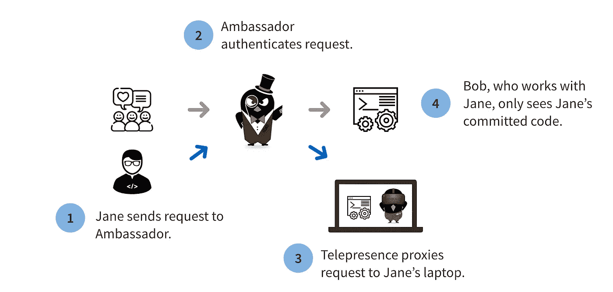

# 服务预览:通过大使和远程呈现加速您的设计代码测试周期

> 原文：<https://itnext.io/service-preview-accelerating-your-design-code-test-cycle-with-ambassador-and-telepresence-a7d069d66273?source=collection_archive---------3----------------------->

开发微服务的开发人员面临着一个与设计-编码-测试周期相关的常见挑战:在开发过程中针对其他服务进行集成测试。例如，工程师经常被迫创建(潜在的脆弱和不现实的)模拟，或者试图在本地构建一个完整的堆栈。基于[网真](https://www.telepresence.io)本地到远程 Kubernetes 项目的 [Ambassador Pro](https://www.getambassador.io/pro) 的新服务预览功能旨在帮助开发人员解决这个问题，加速他们的设计代码测试周期。

# 当前微服务开发的挑战

假设 Jane Developer 正在她的笔记本电脑上编写 API 服务。该服务使用来自其他几个后端服务的数据。Jane 想用后端服务对她的代码更改进行集成测试。在传统的开发环境中，Jane 有以下选择:

1.  本地测试。Jane 可以在本地设置所有后端服务。这使得她的本地开发环境更加复杂，并确保她的环境是最新的，而没有不断更新服务的维护难题。此外，如果她的后端服务需要大量内存/CPU，这个选项可能不实用。
2.  在远程 Kubernetes 集群上进行测试。Jane 可以远程部署所有服务。这使得测试变得更加麻烦，因为她必须提交代码并等待 CI 系统为集群构建和部署新的 Docker 映像。此外，出于测试目的，Jane 必须维护她自己的私有集群(或名称空间),因为其他开发人员也不想看到她的更改。

# 服务预览简介

今天，我们将推出服务预览版，作为 Ambassador Pro 的一部分。有了服务预览，Jane 有了更快、更简单的选择。在这个模型中，Jane(和她团队中的其他工程师)使用一个共享的环境，比如 staging。来自 Jane 的请求被路由到 Jane 的笔记本电脑，因此 Jane 可以预览这些更改。重要的是，来自其他工程师的请求不会被路由到她的笔记本电脑，而是被路由到运行在临时环境中的 Jane 服务的稳定版本。

因此，Jane 的开发工作流程变成了:

1.  在开发环境中，在她的笔记本电脑上本地运行服务，使用她最喜欢的 IDE 进行更改。
2.  在提交之前，运行服务预览来查看 Jane 的服务所依赖的其他服务的这些变化。这些其他服务部署在共享环境中，例如，暂存。
3.  Jane 可以向 Ambassador 发送测试请求，Ambassador 会通过 Telepresence 将她的请求动态地发送到她的笔记本电脑上。其他用户将看不到她的任何更改。
4.  一旦对她的更改感到满意，Jane 就提交她的代码，并允许 CI 将这些更改部署给其他所有人。

# 为什么要服务预览？

我们构建了 Service Preview，为应用程序开发人员提供本地和云开发的优势。服务预览*不是*CI/CD 的替代品——相反，它有助于加速开发的“[内循环](https://mitchdenny.com/the-inner-loop/)”(如果你对更多背景感兴趣， [Phil Lombardi 在 KubeCon NA 2018](https://www.slideshare.net/datawire/kubecon-na-2018-effective-kubernetes-develop-turbocharge-your-dev-loop-philip-lombardi) 上就此发表了演讲)。

1.  你得到了本地开发的好处:使用你喜欢的 IDE，快速迭代反馈，热重装。
2.  您可以获得云开发的好处:无限的计算/内存，真实的测试环境。
3.  您的组织可以采用一个**共享开发/集成测试环境** *，*，其中每个开发人员都能够针对其他人的最新服务版本进行测试。这也可以减少为您的工程团队维护开发基础设施的成本。

这最后一点可能是我们在您的团队中采用服务预览的最大好处。在微服务应用程序中，服务被持续部署，导致应用程序成为不断移动的目标。借助 Service Preview，开发人员可以在一个共享环境中测试其他所有人服务的最新版本。

# 入门指南

服务预览版还在测试阶段，是 Ambassador Pro 的核心功能之一，还有单点登录和速率限制。要开始，请查看[服务预览教程](https://www.getambassador.io/docs/dev-guide/service-preview/)。

*本文原载于* [*大使博客*](https://blog.getambassador.io/service-preview-accelerating-your-design-code-test-cycle-with-ambassador-and-telepresence-4e560d9872c5) *。*