# 使用 Amazon Connect 在 30 分钟内建立一个虚拟呼叫中心

> 原文：<https://itnext.io/set-up-a-virtual-call-centre-in-30-minutes-with-amazon-connect-2771bbc52ee?source=collection_archive---------5----------------------->

*这是关于如何在 30 分钟内设置 Amazon Connect 的分步指南*

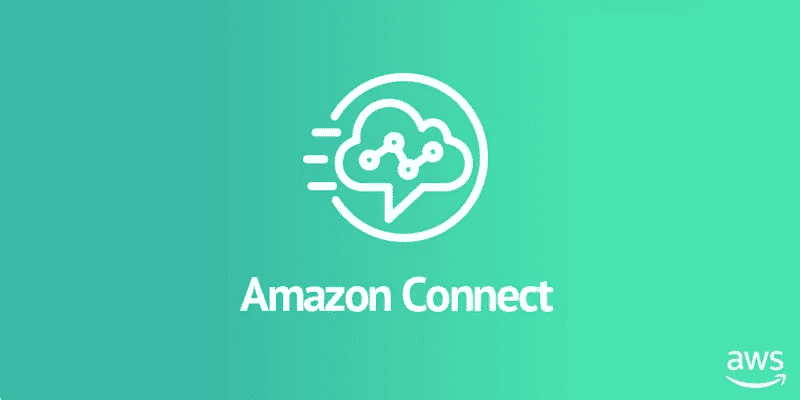

Amazon Connect 使您能够拥有自己的虚拟呼叫中心，在这里，代理可以只使用一副耳机，通过网络门户登录并接收客户的呼叫。

如果这是你第一次听说 Amazon Connect，那么我建议你先看看我最近的[高层总结](https://manta-innovations.co.uk/2020/06/30/Interested-in-a-virtual-call-centre-Try-AWS-Connect/)。

本演示要求您已经设置了一个 AWS 帐户，最好具有管理员级别的权限来提供所需的服务。

如果你已经知道了，那么登录 AWS 控制台，进入 Amazon Connect 页面，我们就可以开始了。如果没有，您需要在这里创建一个账户[。](https://signin.aws.amazon.com/signin?redirect_uri=https%3A%2F%2Fportal.aws.amazon.com%2Fbilling%2Fsignup%2Fresume&client_id=signup))

# 1.首先，您要设置您的身份访问管理。

如果您想在 Amazon Connect 中管理您的代理，请使用第一个选项*“使用 Amazon Connect 存储用户”*，并个性化 URL。

如果您已经有并希望使用 Active-Directory，您可以使用后两个选项；分别通过 AWS AD 管理用户，或通过 SAML 管理非 AWS AD。

此阶段还将为您提供代理登录时使用的 URL。

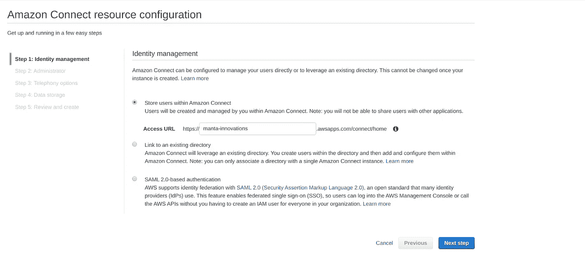

# 2.接下来，您可以选择创建一个管理员用户。

我建议在本演练中跳过这一步，因为您可以使用 IAM 用户，但是如果您愿意，也可以利用这个机会在这里添加其他管理员。

# 3.接下来，您将为入站和出站呼叫配置电话选项。

我在这里选择了两个选项，因为我想接听和拨打电话。

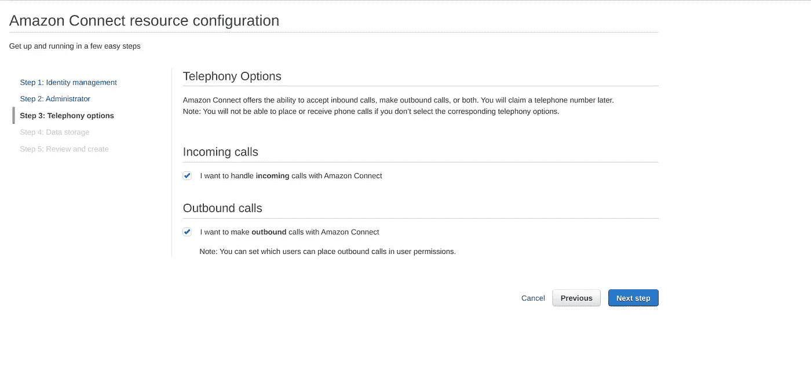

# 4.初始设置的最后一步是配置您的数据存储；其中包含通话和聊天记录。

默认情况下，Amazon Connect 会生成自己的 S3 桶和 KMS 密钥，用于安全数据加密，但是如果您愿意，您可以将其设置为使用预先存在的桶和密钥。

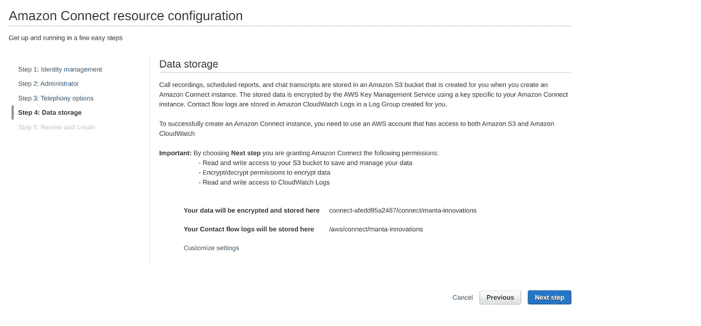

# 5.现在您已经完成了初始设置，您将看到一个摘要屏幕。

检查选项，如果一切正常，就创建实例。

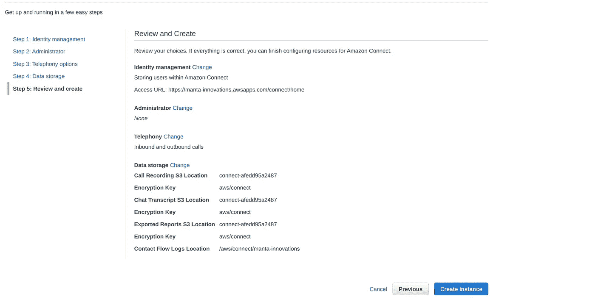

# 6.一旦创建了 Amazon Connect 实例，您就可以登录仪表板，定制您的虚拟呼叫中心。

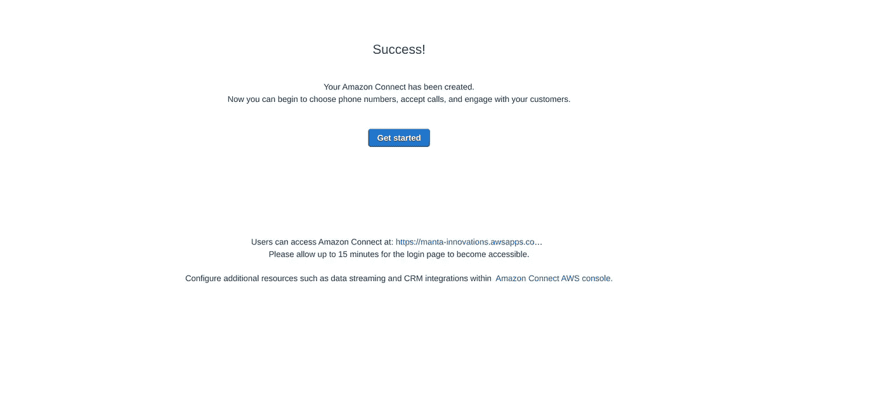

# 7.你需要做的第一件事是申请一个电话号码来接听电话。

这可以来自 Amazon Connect 支持的任何国家，不管我们的实例位于哪个地区。

我目前在加拿大，所以我选择了一个北美号码，并选择了“免费”。

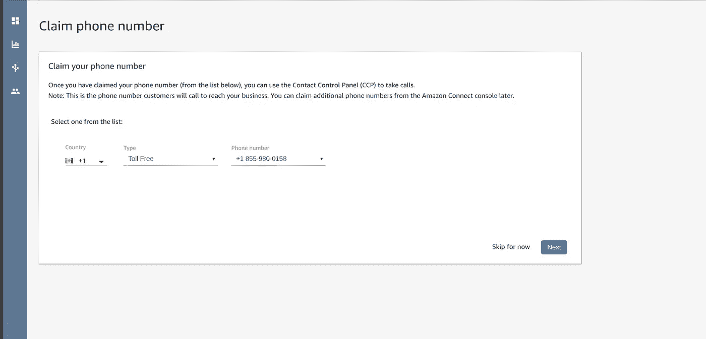

# 8.接下来，您将看到一个屏幕，建议您认领该号码。

它建议你拨打这个号码，但是根据我在 Amazon Connect 上的经验，所有的配置更改可能需要 15 分钟才能完成。

如果你在这个阶段打电话，你可能无法接通，但这并不妨碍你继续设置。

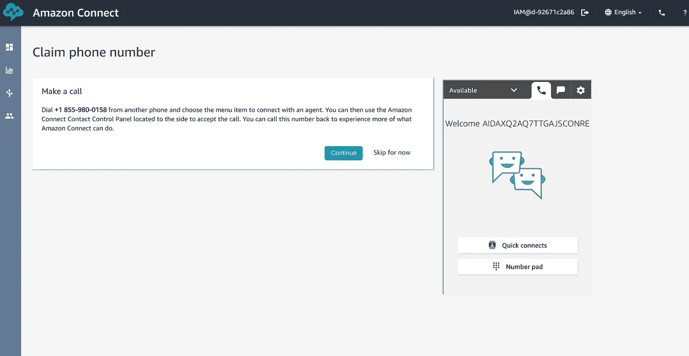

# 9.接下来，您可以设置工作时间；也就是你希望代理能够接听电话的时候。

如果您想代表多个组或按时区对远程团队进行分组，您可以有多个小时的操作。

我把我所有的工作时间都设定为太平洋标准时间，并把时间延长到晚上。

如果你的呼叫中心在周末不工作，你可以把它们从工作时间中去掉。

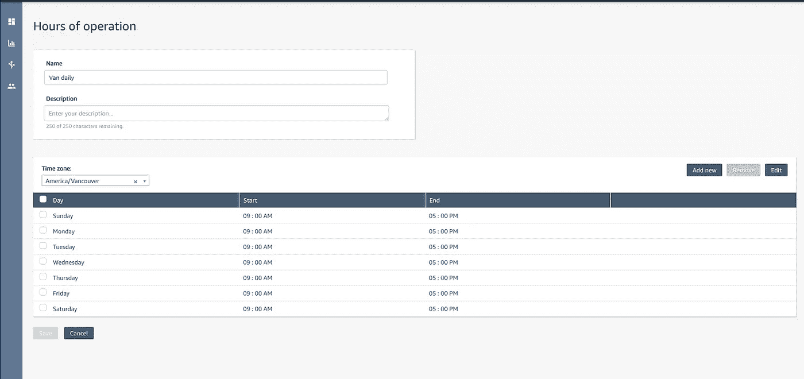

# 10.接下来，您需要做的下一件事是设置队列。

这里的队列不是等待队列，而是调用者将要经过的工作流队列。

与工作时间一样，每个呼叫中心可以有多个队列，用于不同的工作流程，呼叫者可以在队列之间转移，就像您传统上在部门之间转移呼叫者一样。

如果您的呼叫中心需要多个工作流程，使用*“添加新队列”*按钮添加额外的队列。我创建了一个名为*“van queue”*的额外队列。

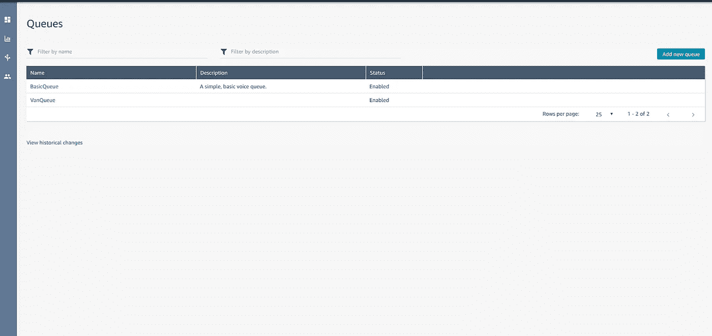

# 11.接下来，您可以选择创建或上传您自己的提示，这是您可能希望向呼叫者播放的音频文件。

我不想使用任何自定义的音频提示，所以我跳过了这一阶段，但我觉得可以检查一下，或者添加您自己的音频提示并将其应用到您的联系人流程中，说到这…

# 12.下一个阶段是最大和最复杂的位—接触流。

这就是你如何设计客户可能采用的流程，它可以是一个完整的端到端流程，也可以是一个可以组成一个更大流程的小流程。

通过这种方式，你可以使用软件工程的合成和干燥原则(不要重复你自己)来创建可重用的流程元素。

作为一个例子，我已经创建了一个单独的端到端流；

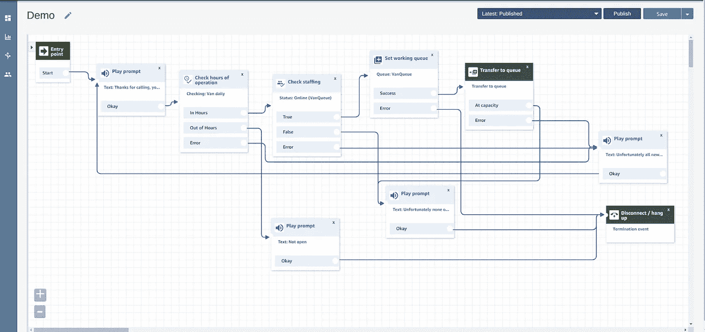

在这里，我刚刚设置了一个非常简单的流程，通过这个流程，我检查我已经配置的基本设置(营业时间、员工可用性和队列可用性)，并尝试将客户转移到代理。

如果其中任何一项失败，系统会在终止通话之前回复客户，让他们知道原因(例如，在营业时间之外)。

如果由于队列已满而无法立即转移，我实现了一个循环，等待 5 分钟后再试。

通过这种方式，我已经能够使用简单的拖放 UI 为呼叫中心建立一个非常简单完整的端到端流程。

流程可以变得更加复杂，我可以使用诸如键盘输入、lex 技能之类的东西，甚至触发一个 AWS Lambda(它反过来可以用于通过 SDK 调用触发许多其他 AWS 服务)。

# 13.接下来，您需要设置一个路由配置文件。

路由配置文件充当我们的代理和应答队列之间的链接。

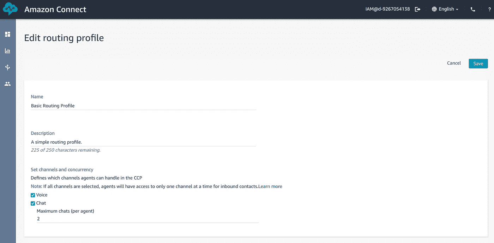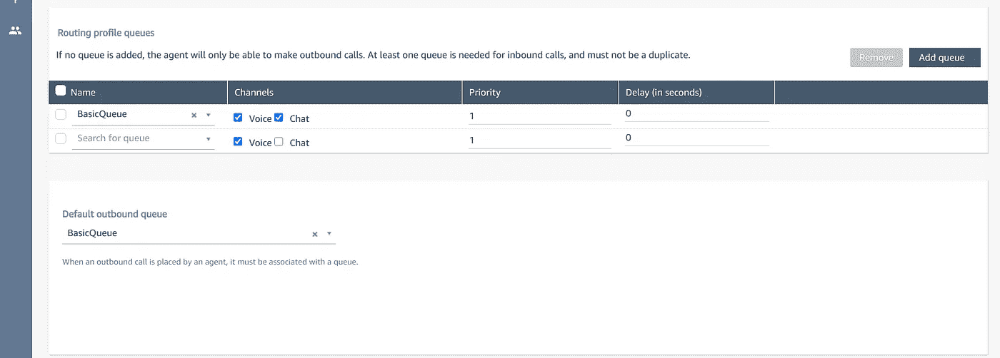

# 14.一旦路由配置文件就绪，您现在就可以开始创建用户并将他们分配到该配置文件。

创建代理/用户时，您需要为他们分配一个路由配置文件(我们刚刚在上面讨论过)和一个安全配置文件。

安全配置文件规定了代理在 AWS Connect 中的访问控制，可以从默认选项 *Admin、agent、CallCenterManager 或 QualityAnalyst* 中选择。

或者，您可以创建我们自己的安全配置文件，并为其分配代理。

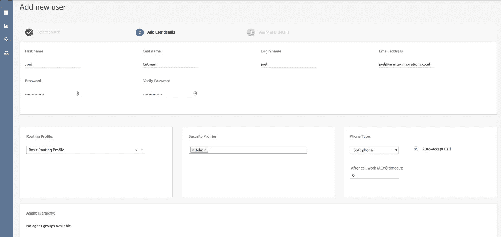

# 15.您需要做的最后一件事是将您的入站号码切换到正确的联系流程。

最后这样做的原因是为了确保与该联系流相关的一切都已设置好，并且在激活该流之前代理都可用。

如果您在开始时将号码切换到流上，但尚未创建要应答的代理或正确的工作时间，则客户可能会开始呼叫并接收意外的响应，或者等待代理。

我们只需返回到电话号码管理屏幕，并将其附加到我们的新联系流程中。

例如，我将它从“示例入站流”切换到“演示”,这是我给我的演示联系人流起的名字。

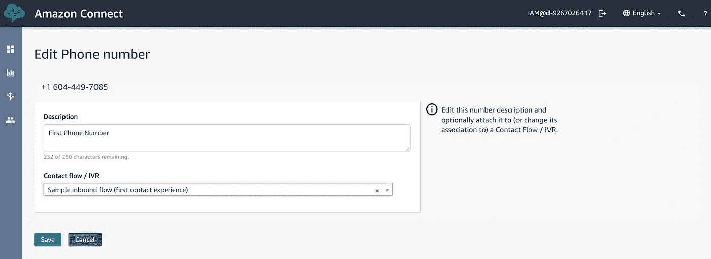

# 16.一旦完成，你就可以开始了。

您已经成功地在(希望)30 分钟内建立了一个虚拟呼叫中心。客户现在可以拨入，并通过我们的联系流程后，将连接到一个可用的代理。

你可以通过点击右上角的电话标志登录到你的虚拟呼叫中心。

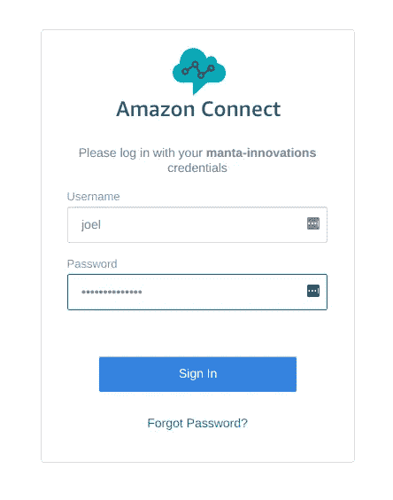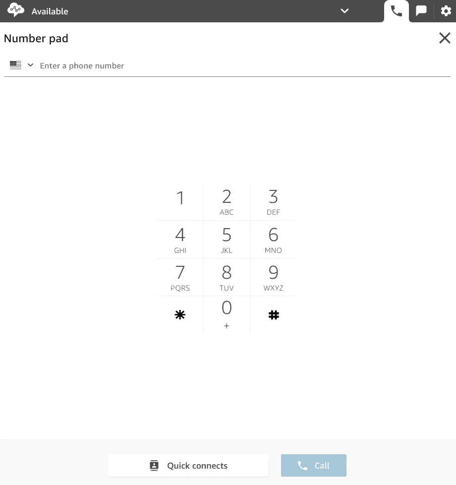

这只是设置 Amazon Connect 的一个简单快速的演练。

Amazon Connect 是一个强大的工具，当我们开始使用一些更有趣的功能，如 AWS Lex 和 Lambda 支持时，它会变得复杂。

如果你发现自己需要一些建议或者只是想了解更多，那么请随时在 Twitter ( [@joellutman](http://twitter.com/joellutman) )、电子邮件[joel@manta-innovations.co.uk](mailto:joel@manta-innovations.co.uk)或者通过我的[网站](http://manta-innovations.co.uk/)联系我..