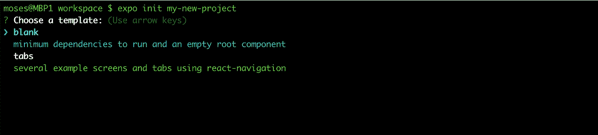
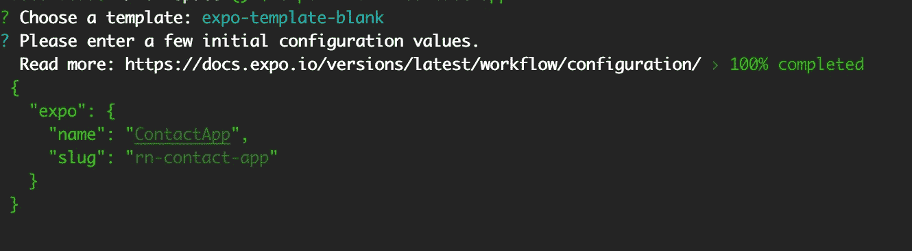
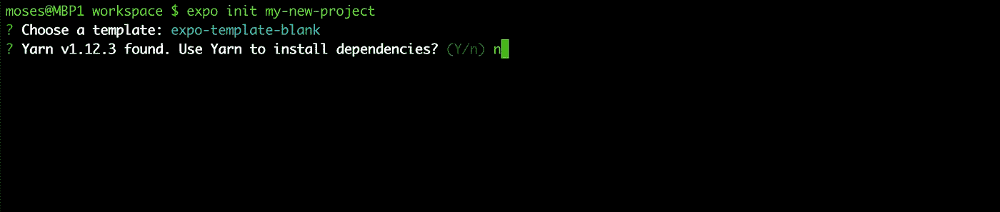
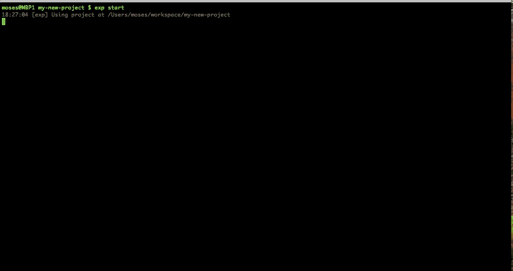
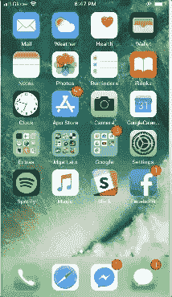

# 建立反应本地与博览会

> 原文：<https://itnext.io/set-up-react-native-with-expo-1e63a82d01ac?source=collection_archive---------0----------------------->

这是一个快速指南——教程如何创建和设置 react native with **Expo。**在 Android 或 iOS 设备上安装并运行。

(*这也解决了 iOS 最新版世博客户端应用的问题，其中二维码扫描已被移除)*

> 2019 年 3 月更新


## 创建我们的 React 本地项目

1.  安装[节点。JS](https://nodejs.org/en/)
2.  安装 expo cli

```
npm install expo-cli --global
```

3.创建您的 react 本地项目

```
expo init my-new-project
```

*您将被要求选择一个模板。按* ***回车*** *选择* ***空白*** *。*



按回车键选择空白



输入你的应用名称



**Y** 如果你安装了纱线。如果没有。

4.运行您的 react 本机项目

```
cd my-new-project
expo start
```

> 更新:根据提示运行`expo start`后登录您的 expo 帐户。如果你还没有注册

*您应该会看到终端中生成的类似 QR 码的内容*



## 在 Android 或 iOS 设备上运行 react native

这一步将分为两部分:Android & iOS 部分。

1.  **安卓**

点击 [**此处**](https://play.google.com/store/apps/details?id=host.exp.exponent&hl=en) 将世博客户端 app 下载到您的安卓设备上。

打开博览会，然后点击*“扫描二维码”*和**扫描我们终端中的二维码。**


一旦二维码被扫描，它将自动加载和捆绑/编译您的项目，以便在您的设备上运行。

2. **iOS — iPhone**

点击 [**此处**](https://itunes.apple.com/us/app/expo-client/id982107779?mt=8) 将最新的世博客户端 app 下载到您的 iOS 设备上。

在 iOS 11 中，相机现在增加了扫描功能。我们可以用这个扫描二维码，打开世博客户端 app。

打开您的相机应用程序，然后扫描我们终端中的二维码，直到顶部弹出一个通知徽章，告诉我们可以在世博会客户端中打开它。



> *iOS 版 Expo 中的 QR 扫描已被移除*

然而，如果你不在 iOS 11 中，还有一种替代方法，但不是扫描:

—打开您的 Expo 客户端应用程序并注册/登录。

—在终端中打开另一个新选项卡，导航到 react-native 项目目录并运行。

```
cd my-new-project
expo send -s emailyou@usedinexpo.com
```

*使用您在 expo 应用程序中登录的电子邮件。*

这将向您发送一封带有链接的电子邮件，单击此链接将打开 expo 中的应用程序。然后它会让你的项目在你的 iPhone 上运行。

> 就是它了！你让你的 react-native 在 Android/iOS 设备上运行。


> 您可以按住“鼓掌”按钮来留下许多掌声！\m/谢谢！