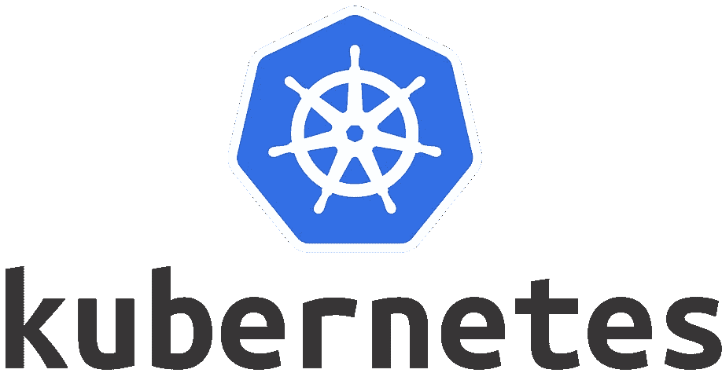
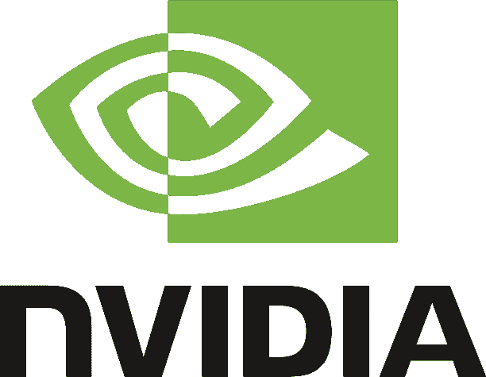

# 设置 GPU 使 Kubernetes 能够进行深度学习

> 原文：<https://itnext.io/setting-up-a-gpu-enabled-kubernetes-for-deep-learning-aef8e198931b?source=collection_archive---------5----------------------->



[*点击这里在 LinkedIn 上分享这篇文章*](https://www.linkedin.com/cws/share?url=https%3A%2F%2Fitnext.io%2Fsetting-up-a-gpu-enabled-kubernetes-for-deep-learning-aef8e198931b)

Kubernetes 在 2017 年像野火一样蔓延，不开玩笑！以下是来自斯科特帖子的一些数字:

> *“对于拥有超过 5000 名员工的公司，48%的公司使用 Kubernetes，33%的公司使用主要协调工具。”*
> 
> *“79%的样本选择 Docker 作为他们的主要容器技术。”*

乘着 Kubernetes 的浪潮，2017 年对于基础设施/开发人员来说是特别有趣的一年。经过多年的黑暗之后，我们终于有了一些很酷的工具可以玩了。我们开始思考如何应对这种范式转变。我们试图用 [Jenkins 和 Helm Chart](https://overflow.buffer.com/2017/08/31/buffer-deploy-code-kubernetes/) 以及其他更多即将到来的:D 来优化开发者速度

我心中最珍视的一件事是为数据团队民主化 Kubernetes。众所周知，为了保持生产力和竞争力，当今的数据团队必须采用一系列尖端技术。几年前，MapReduce 被广泛使用，现在仍然如此。即使以今天的标准来看，基础设施要求也不是在公园里散步。快进到 2018 年，我们看到深度学习再次发生同样的事情。对我来说，数据团队不应该因为基础架构挑战而分心，不得不重新发明轮子。公司的系统团队应该与他们并肩工作。

受 KubeCon 2017 上 [Lachlan Evenson](https://twitter.com/LachlanEvenson) 关于他如何帮助数据团队使用 Kubernetes 的[演讲](https://kccncna17.sched.com/event/CU6U/democratizing-machine-learning-on-kubernetes-i-joy-qiao-lachlan-evenson-microsoft)的启发，我决定进行我的小实验，建立一个 GPU 就绪集群。

# 创建集群

首先，让我们创建一个带有 GPU 加速节点的 k8s 集群。在这个例子中，我们将使用 AWS `p2.xlarge` EC2 实例，因为它是这个 PoC(概念验证)的最便宜的可用选项。如果您也在尝试这种方法，我建议您使用这种实例类型，以避免严重影响您的账单。

同样，在这个例子中，我使用 [kops](https://github.com/kubernetes/kops) 在 AWS 上创建一个 k8s 集群，有 1 个主节点和 2 个 GPU 节点。

```
$ kops create cluster \ 
--name steven.buffer-k8s.com \ 
--cloud aws \ 
--master-size t2.medium \ 
--master-zones=us-east-1b \ 
--node-size p2.xlarge \ 
--zones=us-east-1a,us-east-1b,us-east-1c,us-east-1d,us-east-1e,us-east-1f \ 
--node-count=2 \ 
--kubernetes-version=1.8.6 \ 
--vpc=vpc-1234567a \ 
--network-cidr=10.0.0.0/16 \ 
--networking=flannel \ 
--authorization=RBAC \ 
--ssh-public-key="~/.ssh/kube_aws_rsa.pub" \ 
--yes
```

# 添加 GPU 节点

kops 成功创建集群后，k8s 上将有一些 GPU 加速的节点。但这并不意味着你可以从 Kubernetes 访问 GPU 资源。为了让它工作，我们必须通过几道关卡，我发现这对大多数人来说可能很棘手。

首先，我们需要更新节点，以正确配置 k8s。这个`kops`命令将为默认的 minion 节点配置打开一个编辑器。

```
$ kops edit ig nodes
```

我们将把默认 AMI 改为`kope.io/k8s-1.8-debian-stretch-amd64-hvm-ebs-2018-01-05`，因为`nvidia-docker`需要某个版本的包，而`stretch`有，而`jessie`没有。

然后我们为`kublet`添加一个配置来启用`DevicePlugins`。稍后详细介绍。

完成配置编辑后，执行此操作以应用更新。

```
$ kops update cluster steven.buffer-k8s.com --yes
```

Kubernetes 现在可以通过 Docker 访问 GPU 了。但是等等，Docker 运行时还没有准备好从主机访问 GPU。继续读下去，我会告诉你怎么做。

# 配置节点

因为`kops`的默认 AMI 没有安装 CUDA 驱动。我们将不得不在每个节点中使用 SSH 来管理这一部分。

复制这些命令来安装驱动程序。

# 安装 CUDA 潜水员

```
$ wget https://developer.nvidia.com/compute/cuda/9.1/Prod/local_installers/cuda_9.1.85_387.26_linux $ sudo apt-get update && sudo apt-get install -y \ 
build-essential$ sudo sh cuda_9.1.85_387.26_linux // Verify 
$ nvidia-smi
```

# 安装 docker-ce 和 nvidia-docker2

现在我们需要正确设置 Docker 来通过 CUDA 访问 GPU。为此，让我们安装`nvidia-docker`和`docker-ce`，更改一些配置并重启。

正如你所看到的，有一个铁环要跳过。我将告诉你让它工作的具体步骤。

1-25 行是关于安装`docker-ce`和`nvidia-docker`。第 27 行打开了 docker 的配置文件。将`ExecStart`改为`ExecStart=/usr/bin/dockerd -H fd:// -s=overlay2`。第 36 - 46 行将默认的 docker 运行时切换到使用`nvidia`，这样就可以从 docker 容器中访问 GPU。第 48 - 50 行重启`kublet`，这样 Kubernetes 可以正确访问新的`nvidia`运行时。最后一个命令将验证 docker 能够从容器访问 CUDA。我们现在非常接近了！

# 配置 Kubernetes

# 安装设备插件

不确定最后一部分结束后你是否还在？我知道这很残忍。如果您有任何问题，请随时在 [Twitter](https://twitter.com/stevenc81) 上联系我。现在，Kubernetes 需要最后一件事，最后一部分非常简单。似乎从 Kubernetes 1.8 GPU 设备是通过插件访问的。运行下面的命令将插件安装为 DaemonSet，这样就设置好了。

```
# For Kubernetes v1.8 
$ kubectl create -f https://raw.githubusercontent.com/NVIDIA/k8s-device-plugin/v1.8/nvidia-device-plugin.yml # For Kubernetes v1.9 
$ kubectl create -f [https://raw.githubusercontent.com/NVIDIA/k8s-device-plugin/v1.9/nvidia-device-plugin.yml](https://raw.githubusercontent.com/NVIDIA/k8s-device-plugin/v1.9/nvidia-device-plugin.yml)
```

# 请求 GPU

现在我们有了一个完全支持 GPU 的 Kubernetes 集群。想象力是你唯一的限制:D 要利用 GPU 的力量，pod 需要知道 GPU 是可用的，并请求它。这不像内存或 CPU 等其他资源那样直观。但这可能是一件好事，因为看一眼 pod 模板就知道它对 GPU 的要求。搞清楚总是件好事。pod 模板演示了如何请求集群中现在可用的 GPU。

# 结束语

*   数据团队的速度不应受到基础设施需求的限制
*   越来越多的数据技术需要不容易组装的专门设置
*   支持 GPU 的 k8s 集群就是一个例子。以下是如何为深度学习工作负载创建一个。

*最初发表于*[T5【gist.github.com】](https://gist.github.com/stevenc81/1cad3a0ebca9303923d1cd4c3641f8bc)*。*