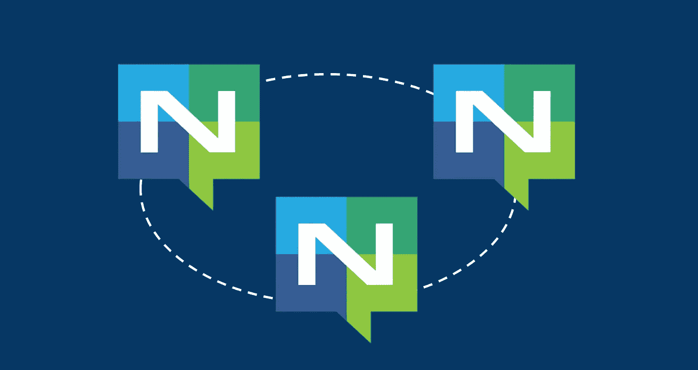
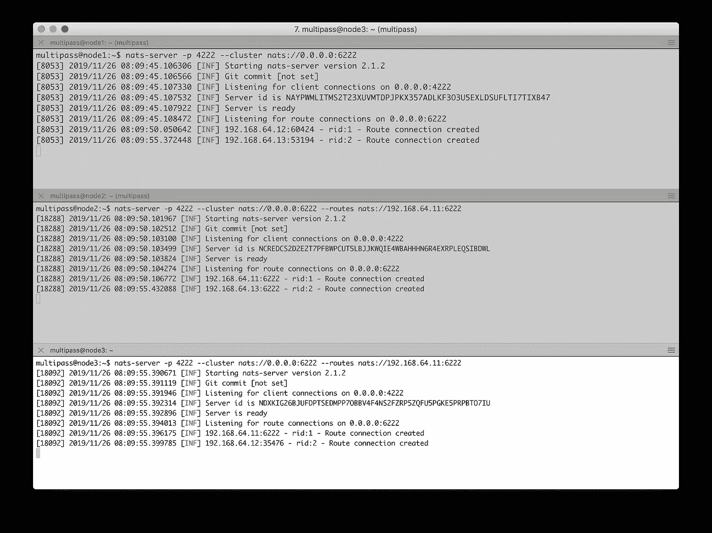
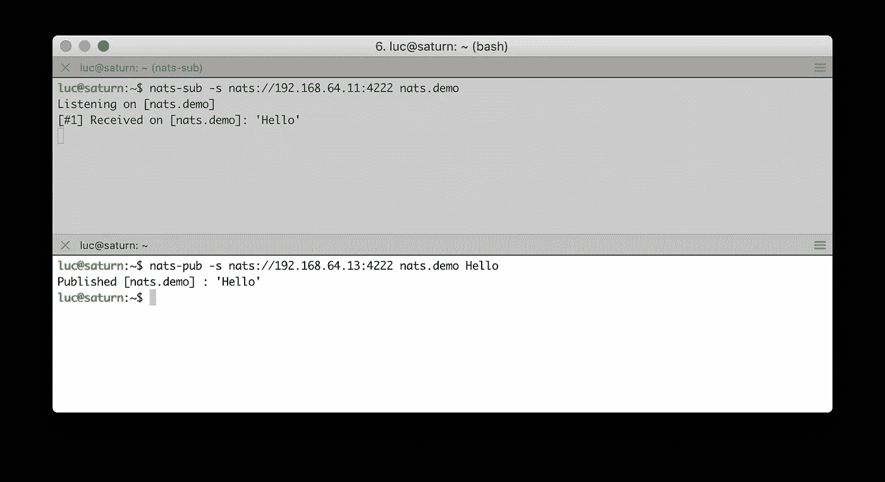
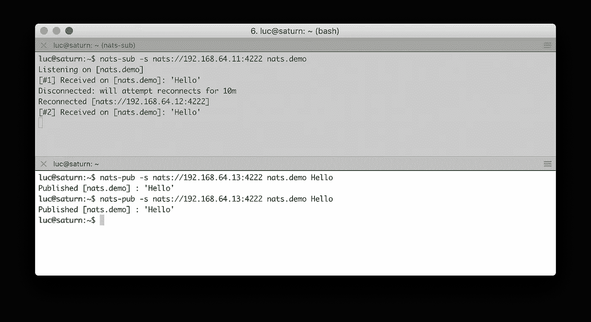

# 设置 NATS 集群

> 原文：<https://itnext.io/setting-up-a-nats-cluster-92ca8fd6a6e1?source=collection_archive---------11----------------------->

## 使用 3 个 Ubuntu 虚拟机的简单示例



运行 NATS 服务器非常简单，既可以直接从 Go 二进制文件中运行，也可以通过官方容器映像来运行。设置 NATS 集群需要运行第一个 NATS 服务器，然后加入其他服务器以形成集群。在这篇短文中，我们将演示一个 3 节点集群的设置，每个服务器运行在一个专用的虚拟机上。

## 启动 3 台虚拟机

首先，为了简单起见，我们使用[多路](https://multipass.run/)在本地创建 3 个虚拟机。

注意:根据您的操作系统，Multipass 使用 Hyper-V、HyperKit、KVM 或 VirtualBox 来实现最快的启动时间。例如，在 MacOS 上，它使用 HyperKit 作为底层管理程序来启动 Ubuntu 虚拟机。

```
luc@saturn:~$ multipass launch -n node1
luc@saturn:~$ multipass launch -n node2
luc@saturn:~$ multipass launch -n node3
luc@saturn:~$ multipass list
Name         State             IPv4             Image
node3        Running           192.168.64.13    Ubuntu 18.04 LTS
node2        Running           192.168.64.12    Ubuntu 18.04 LTS
node1        Running           192.168.64.11    Ubuntu 18.04 LTS
```

## 在每个服务器上安装 Go

接下来，我们在每个虚拟机上安装 go，因为我们将从 Go 二进制文件运行 NATS 服务器:

```
sudo apt-get update
sudo apt-get -y upgrade
wget [https://dl.google.com/go/go1.13.3.linux-amd64.tar.gz](https://dl.google.com/go/go1.13.3.linux-amd64.tar.gz)
sudo tar -xvf go1.13.3.linux-amd64.tar.gz
sudo mv go /usr/local
export GOROOT=/usr/local/go
export GOPATH=$HOME/Projects
export PATH=$GOPATH/bin:$GOROOT/bin:$PATH
```

## 正在初始化集群

一旦节点准备就绪，我们就从节点 1 初始化集群:

```
multipass@**node1**:~$ nats-server -D \
                   -p 4222 \
                   --cluster nats://0.0.0.0:6222
```

*   -p 定义客户端将用于通过节点 1 连接到群集的端口
*   - cluster 定义了其他节点将用来加入集群的 URL，在本例中，它们可以使用 node1 的任何网络接口上的端口 6222

## 加入其他节点

然后，从节点 2 和节点 3，我们可以运行额外的 NATS 服务器:

```
multipass@**node2**:~$ nats-server -D \
                   -p 4222 \
                   --cluster nats://0.0.0.0:6222 \
                   --routes nats://192.168.64.11:6222multipass@**node3**:~$ nats-server -D \
                   -p 4222 \
                   --cluster nats://0.0.0.0:6222 \
                   --routes nats://192.168.64.11:6222
```

*   -p 定义客户端将用于通过当前节点连接到群集的端口
*   - cluster 定义了其他节点可以用来加入集群的 URL，在这些示例中，每个节点都在任何网络接口上显示端口 6222
*   - routes 定义了当前节点用于加入集群的 URL，在这些示例中，两个服务器都通过节点 1(如我们指定的节点 1 的 IP 地址)加入集群

下面的屏幕截图显示了集群设置期间服务器的日志。从上到下:

*   从节点 1 初始化集群
*   节点 2 加入节点 1
*   节点 3 加入节点 1



设置 3 节点 NATS 集群

从日志中的 IP 地址可以看出，集群的每个节点都知道其他节点(*路由连接已创建*)

## 酒吧/订阅示例

现在让我们使用 nats-sub 和 nats-pub 客户端(在[https://github . com/NATs-io/go-NATs-examples/tree/master/tools](https://github.com/nats-io/go-nats-examples/tree/master/tools)中都有)连接到集群。

下面的屏幕截图说明了以下流程:

*   一个消费者(上图)连接到 node1 并订阅了 *nats.demo* 主题
*   一个发布者(底部面板)连接到节点 3，并向主题*发送消息*
*   消费者(上图)从节点 1 接收消息



订户接收从另一个节点发布的消息

现在让我们停止在 node1 上运行的 NATS 服务器，看看会发生什么。下面的截图说明了这一点:

*   用户(顶部面板)断开，因为节点 1 不再可用(*断开:将尝试重新连接 10m* )。但是，由于该客户端知道其他集群的节点(信息通过 NATS 协议传播到客户端)，因此它会自动重新连接到另一个节点(从 IP 地址可以看到节点 2)
*   发布者(底部面板)在 *nats.demo* 上发送另一条消息
*   消费者(顶部面板)从节点 2 接收该消息



自动重新连接到集群的另一个节点

## 摘要

这篇短文展示了一个 3 节点 NATS 集群的创建过程。接下来的步骤是创建 TLS 证书来保护节点之间以及客户端和节点之间的通信。此外，NATS 2.0 安全功能可用于对客户端进行身份验证/授权。