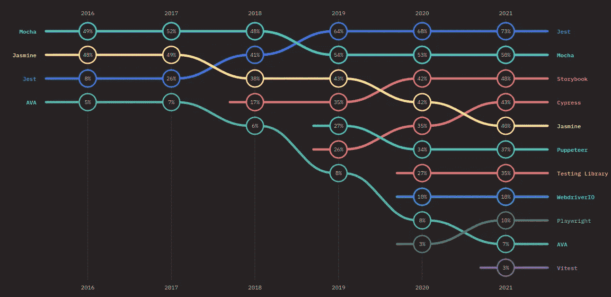
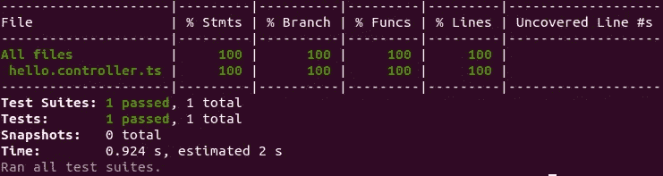
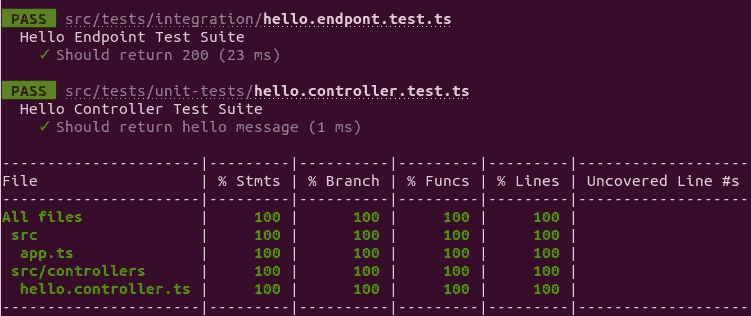

# 用 TypeScript 设置 NodeJS API:第 2 部分

> 原文：<https://itnext.io/setting-up-a-nodejs-api-with-typescript-part-2-42e4c12f1fe7?source=collection_archive---------6----------------------->

## 测试、安全和集装箱化

乔纳森·法伯在 [Unsplash](https://unsplash.com?utm_source=medium&utm_medium=referral) 上拍摄的照片

本文是系列文章的第 2 部分，查看[用 TypeScript 设置 NodeJS API:第 1 部分](https://medium.com/@tudor.ioan.marin/setting-up-a-nodejs-api-with-typescript-part-1-9f7c152b2af6)。我们将从那里开始构建代码库。你可以在这里找到完整的代码。从介绍来看:

> 使用 TypeScript 开发 API 时，有许多风格可供选择。[…]但是，如果您想设置一个快速服务器，使其在不使用包含电池的框架的情况下即可投入生产，该怎么办呢？本文的目的是帮助您快速获得一个简约而完整的服务器并运行。

# 测试案例

即使严格的测试被认为是最佳实践，为你的应用程序编写自动化测试也是一种权衡。编写测试套件需要时间，一旦代码的复杂性增加，可预测的上市时间将变得更加重要，您将真正感受到好处。然而，自动化测试将增加你的开发经验和速度。也就是说，让我们开始建立一个测试框架。

测试框架的 JavaScript Surevey 结果的状态

根据 JavaScript 调查的最新[状态，Jest 仍然是当今使用最多的测试框架，并且在兴趣和满意度方面排名前三。要设置框架并使其与 TypeScript 一起工作，我们需要安装以下包，并在应用程序的根目录下创建一个配置文件:](https://2021.stateofjs.com/en-US/libraries/testing)

我们服务器的 Jest 配置非常简单。我们将把**详细**参数设置为**真**，以便报告每个单独的测试。此外，我们将从 **ts-jest** 加载一个**预设**配置，以便能够在 TypeScript 中运行我们的测试。最后，将 **dotenv/config** 添加到 **setupFiles** 数组将允许在测试中使用环境变量，因为数组中的任何文件将在每个测试文件中运行一次。

现在是时候编写一个简单的测试来确保一切正常。

既然我们只有一句“你好，世界！”端点，它在应用程序文件中，我们需要重构代码并调整文件夹结构。

将我们的端点拆分成一个处理字符串生成的 **hello.controller.ts** 将使我们能够轻松地为它编写测试。**你好控制器**将如下所示:

app 文件现在将导入这个控制器，并使用它来获取响应消息。

现在，简单的测试应该导入控制器，模拟预期结果，然后将方法的实际输出与预期结果进行比较。

要运行测试套件，我们需要向 package.json 和 Makefile 添加以下命令。**测试**命令将运行所有的测试套件，而**测试:观察**命令将观察文件的变化，并重新运行与变化的文件相关的测试。它还会用一些 CLI 选项提示您只运行测试的子集，例如失败的测试或者基于正则表达式模式的测试。

运行测试套件，我们可以看到没有由 TypeScript 语法引起的错误，并且测试通过了。

## 输入超级测试

在本系列的第一部分中，我们将 express 应用程序从 HTTP 服务器中分离出来。这一点现在变得很重要，因为我们可以使用 [SuperTest](https://github.com/visionmedia/supertest) 来模拟一个 HTTP 调用，并在不执行网络调用的情况下测试 API。让我们快速安装软件包。

现在，我们可以在测试中使用它来确保端点相应地工作。SuperTest 提供了许多 HTTP 断言，请务必检查它们的文档。出于本文的目的，我们将检查一些标题和状态代码。

现在我们有了端点的单元和集成测试，并且 100%覆盖。

# 减轻攻击

所以你计划在野外部署你的新服务器。当然，一旦公开，它现在很容易受到攻击。幸运的是，你可以通过一些安全包和一些管道规则获得相当不错的保护。当然，安全性是一个可以深入探讨的主题，但这不在本文的讨论范围之内。我们将只为一些众所周知的攻击奠定基础。

让我们首先安装一些依赖项。它们都在你的应用中作为中间件工作，每个请求在到达你的端点之前都要经过它们。

[**头盔**](https://www.npmjs.com/package/helmet) 实际上是捆绑成单个的一系列中间件。根据您打算开发的内容，通过使用缺省值或只是一个子集来启用它们是有用的。例如，返回 HTML 的 web 服务器将受益于所有这些。然而，对于 REST API 来说，只使用这些中间件的子集是有意义的。

[**速率限制**](https://www.npmjs.com/package/express-rate-limit) 对一个人在一定时间内重复一个动作的频率设置了上限。这将有助于防范 DDoS。请确保根据您对流量的估计来调整您的配置。在这个例子中，我们将它设置为`1k req / 10 min`。

**CORS 将允许你把你所接受方法类型、头文件和来源列入白名单。简而言之，任何不符合这些规则的请求都将失败。因为我们没有任何客户端应用程序来支持我们正在构建的 API，所以让我们使用默认的 CORS:**

## **其他规则:**

*   **验证客户输入。这里有一个[验证器列表](https://openbase.com/categories/js/best-nodejs-data-validation-libraries)。**
*   **经常扫描您的包中的漏洞。可以使用`npm audit`**
*   **使用一般的错误消息，这样你就不会透露太多，并记录具体的错误。**
*   **使用强身份验证。**

# **将应用程序归档**

**Docker 有很多潜在的好处。这取决于您和您对它的使用，以确定它是否会有所帮助或只是增加开销。它的一些亮点是:**

*   **在不同的环境中运行您的软件**
*   **水平扩展您的软件以处理更多的用户**
*   **如果您使用多个服务或微服务**

**因此，让我们为服务器编写 docker 文件。你需要先在你的机器上安装 docker。首先，您需要在项目的根目录下创建一个名为 Dockerfile 的文件:`touch Dockerfile`。该文件将如下所示:**

**Dockerfile 文件是不言自明的。我们从 Node 的一个基本映像开始，我选择了 **Alpine** ，设置了一个工作目录，并在捆绑应用程序源代码之前复制了我们需要的文件。我还安装了 **Make** util，因为它不在映像中。然后，我们安装 npm 依赖项，导出一个端口并启动应用程序。之后，您将构建映像并运行容器。**

**最后一个命令将机器上的`49160`端口映射到容器上的`8080`端口。因此，运行 curl 命令或在浏览器中打开`localhost:49160`应该会到达服务器上的`/`路径。**

**要启动和关闭容器，您可以运行以下命令:**

# ****结论****

**因此，随着测试、安全性和容器化的完成，NodeJS API 就完成了。当然，目前它没有做任何事情，因为我觉得仅仅为了展示一个想法而编写业务逻辑没有什么真正的价值。我们仍然有可以探索的途径，比如 API 架构、持久化数据和缓存。如果你想了解更多关于这些话题的内容，请务必关注。**

**如果你觉得这篇文章有帮助，鼓掌并分享它，这样它会帮助更多的人。有问题吗？在 LinkedIn 上给我留言。**