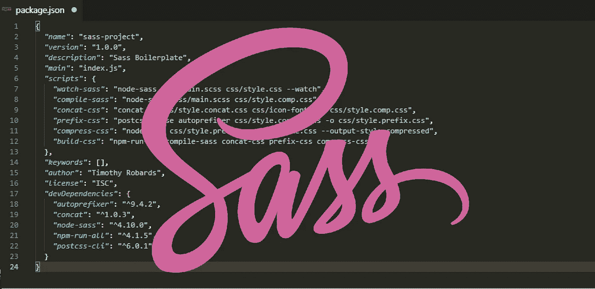
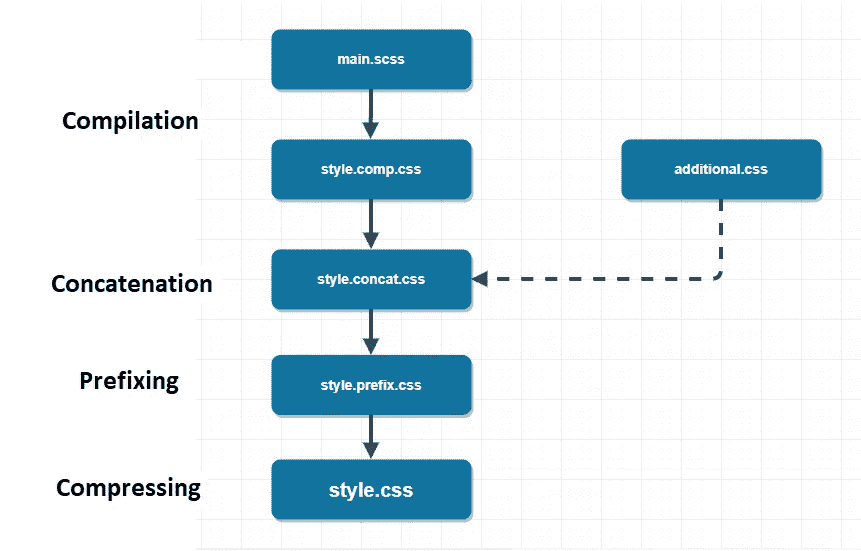

# 设置 Sass 构建流程

> 原文：<https://itnext.io/setting-up-a-sass-build-process-aa9fd92fa585?source=collection_archive---------0----------------------->



让我们看看如何使用 npm 脚本来设置 Sass 构建流程，并推进我们的开发工作流程。

**什么是构建流程？**

它本质上只是一系列自动执行的任务——我们在项目完成后运行它们。我们的生产文件已经生成，并准备好部署到 web 服务器上。

🤓*想了解最新的网站开发信息吗？*
🚀想要将最新的新闻直接发送到您的收件箱吗？
🎉加入一个不断壮大的设计师&开发者社区！

**在这里订阅我的简讯→**[**https://ease out . EO . page**](https://easeout.eo.page/)

# 构建过程

*请注意:*下面的过程假设您已经有了一个 Sass 项目并正在运行！如果没有，请参阅文章[从 Sass](https://medium.com/@timothyrobards/starting-with-sass-116f4ecb682d) 开始，其中我介绍了设置 Sass 开发环境的步骤。

**好吧！那么我们要实现什么构建过程呢？**

我们将编译、连接、前缀和压缩我们的样式表，如下图所示..



`main.scss` —我们从我们的主 sass 文件开始，它执行**到 CSS 的编译**。

接下来我们要看看**串联**。在这个过程中，我们想把所有的 CSS 文件合并成一个。为了测试这个过程，我创建了一个名为`additional.css`的文件。

然后我们将会看到**在**前面加上自动前缀。前缀会自动将厂商前缀(-webkit，-moz 等)添加到我们的代码中，以帮助确保它在主流浏览器中的功能。

我们流程的最后一步是**压缩**。我们将在这个阶段压缩所有的代码，以最大限度地提高性能。

让我们继续用 NPM 脚本创建我们的构建过程。

# 创建构建过程

## 汇编

打开你的 **package.json** 文件。在 Sass 项目目录中运行`npm init`时生成的文件。

添加以下脚本..

```
*"scripts"*: {
  ***"watch-sass"*: "node-sass sass/main.scss css/style.css --watch",
  *"compile-sass"*: "node-sass sass/main.scss css/style.comp.css"**
},
```

让我们确保编译正在工作。在终端中，打开您的 Sass 项目文件夹并运行:

```
npm run compile-sass
```

它应该完成渲染并将 style.comp.css 文件输出到您的 css 文件夹中。我们将在项目结束时运行这项任务，以完成我们的最终构建！

当我们开发项目时，我们用以下方式运行观察任务:

```
npm run watch-sass
```

这告诉编译器在每次保存 Sass 文件时观察源文件的变化，并自动重新编译成 CSS 只是要确保在工作时任务一直在运行！

## 串联

下一步是添加脚本来连接我们现有的 CSS 文件。如前所述，我已经为我们的合并创建了`additional.css`文件。在它里面有一些额外的样式。继续在你的 CSS 文件夹中创建一个新的 CSS 文件。只要给它一些额外的风格——什么都不重要。然后添加下面的脚本，就像这样:

```
*"scripts"*: {
  *"watch-sass"*: "node-sass sass/main.scss css/style.css --watch",
  *"compile-sass"*: "node-sass sass/main.scss css/style.comp.css"**,
  *"concat-css"*: "concat -o css/style.concat.css css/additional.css css/style.comp.css"** },
```

`*concat-css:*` 是我们的剧本名称。
`concat -o css/style.concat.css` 我们的包输出文件。
`css/additional.css css/style.comp.css` 是我们要串接的 CSS 文件。

我们需要安装 [concat](https://www.npmjs.com/package/concat) npm 包，运行以下命令:

```
npm install concat --save-dev
```

一旦安装完成，你会看到它列在你的**包的*“dev dependencies”*下面。**

现在运行 concat 以确保它正常工作..

```
npm run concat-css
```

你现在会在你的 CSS 目录中看到`style.concat.css`输出文件！打开它，看看你的 CSS，你会看到你的`additional.css`和你的`style.comp.css`的内容已经合并成一个——甜！

## 加前缀

我们现在继续在我们的构建中添加前缀。添加以下脚本:

```
*"scripts"*: {
  *"watch-sass"*: "node-sass sass/main.scss css/style.css --watch",
  *"compile-sass"*: "node-sass sass/main.scss css/style.comp.css"**,** *"concat-css"*: "concat -o css/style.concat.css css/additional.css css/style.comp.css",
  ***“prefix-css”:* “postcss --use autoprefixer -b 'last 5 versions' css/style.concat.css -o css/style.prefix.css”**
},
```

`*prefix-css*:`是我们的脚本名。
`postcss --use autoprefixer` autoprefixer 被选中。我们指定希望我们的自动前缀覆盖哪些浏览器版本。
`css/style.concat.css`是我们输入的文件。
`-o css/style.prefix.css`我们指定我们的输出文件。

我们使用的是 npm [autoprefixer](https://www.npmjs.com/package/autoprefixer) 包，需要通过运行以下命令来安装:

```
npm install autoprefixer --save-dev
```

我们还需要安装 [PostCSS](https://www.npmjs.com/package/postcss) (autoprefixer 是这个插件的一部分)。我们使用以下命令:

```
npm install postcss-cli --save-dev
```

然后运行脚本，如下所示:

```
npm run prefix-css
```

它将生成我们的`css/style.prefix.css`文件。看一下这个文件中的代码，您会看到已经为您添加了浏览器前缀。这很好，因为我们现在可以忘记前缀，专注于编写干净的代码！

## 压缩

我们现在处于构建过程的最后一步。让我们在脚本中添加下面一行:

```
*"scripts"*: {
  *"watch-sass"*: "node-sass sass/main.scss css/style.css --watch",
  *"compile-sass"*: "node-sass sass/main.scss css/style.comp.css"**,** *"concat-css"*: "concat -o css/style.concat.css css/additional.css css/style.comp.css",
  *“prefix-css”:* “postcss --use autoprefixer -b 'last 5 versions' css/style.concat.css -o css/style.prefix.css”**,
  "compress-css": "node-sass css/style.prefix.css css/style.css --output-style compressed"** },
```

这是一个很简单的问题！这里我们所做的就是告诉我们的`css/style.prefix.css`输入文件，输出到`css/style.css`。`--output-style compressed` 选项会压缩代码！

让我们测试一下..

```
npm run compress-css
```

现在看看你的`style.css`文件。你会发现你所有的风格都被压缩成了一行代码！所有空白和注释都已删除。您可以将您的`style.prefix.css`输入文件的文件大小与新生成的`style.css`文件进行比较，以查看压缩后的文件大小。通过这个简单的步骤，我们大大减少了页面负载！

## 建设

现在让我们编写最后一个脚本来一次运行所有的东西！添加以下内容:

```
*"scripts"*: {
  *"watch-sass"*: "node-sass sass/main.scss css/style.css --watch",
  *"compile-sass"*: "node-sass sass/main.scss css/style.comp.css"**,** *"concat-css"*: "concat -o css/style.concat.css css/additional.css css/style.comp.css",
  *“prefix-css”:* “postcss --use autoprefixer -b 'last 5 versions' css/style.concat.css -o css/style.prefix.css”**,** "compress-css": "node-sass css/style.prefix.css css/style.css --output-style compressed"**,** ***"build-css"*: "npm-run-all compile-sass concat-css prefix-css compress-css"**
},
```

在这里，我们简单地添加了所有任务`compile-sass`、`concat-css`、`prefix-css`、&、`compress-css`，在执行构建命令时运行。

我们使用 [npm-run-all](https://www.npmjs.com/package/npm-run-all) 包来确保它可以在所有平台上工作。输入以下命令:

```
npm install npm-run-all --save-dev
```

让我们进行最后一次测试，以确认一切正常。从 CSS 文件夹中删除所有文件(除了`additional.css`)。完成后，运行构建命令..

```
npm run build-css
```

这就对了。所有的 CSS 文件都是用这条命令生成的——非常强大！

为了在未来的项目中得到这个构建设置，你需要做的就是从这个项目中复制*脚本*和 *devDependencies* ，到你的新项目&的 **package.json** 中，运行一个`npm install`。

如果您准备好提高您的前端技能并构建更快、更有组织和可维护的代码。查看[变得时髦:时髦实用指南](https://gum.co/getting-sassy)。

我的交互式初学者友好指南将带您了解 SASS 的所有重要信息，包括:

*   从变量、嵌套、混合到 for/each 循环等所有基础知识！
*   深入了解如何构建您的 SASS 项目
*   如何创建生产就绪的构建过程

最后，您将能够迁移现有的 CSS 代码库，并从头开始建立整个项目！


*现已上市！👉*[gum.co/getting-sassy](https://gum.co/getting-sassy)

# 结论

我们现在已经为我们的 Sass 项目创建了一个构建过程！我们可以用一个命令编译、合并、前缀和压缩我们的样式表。因此，我们已经大大改进了我们的开发工作流程。

我希望这篇文章对你有用！你可以在媒体上关注我。我也在[推特](https://twitter.com/easeoutco)上。欢迎在下面的评论中留下任何问题。我很乐意帮忙！

# 关于我的一点点..

嘿，我是提姆！👋我是一名开发人员、技术作家和作家。如果你想看我所有的教程，可以在[我的个人博客](http://www.easeout.co)上找到。

我目前正在构建我的[自由职业者完整指南](http://www.easeout.co/freelance)。坏消息是它还不可用！但是如果这是你可能感兴趣的东西，你可以[注册，当它可用的时候会通知你](https://easeout.eo.page/news)👍

感谢阅读🎉