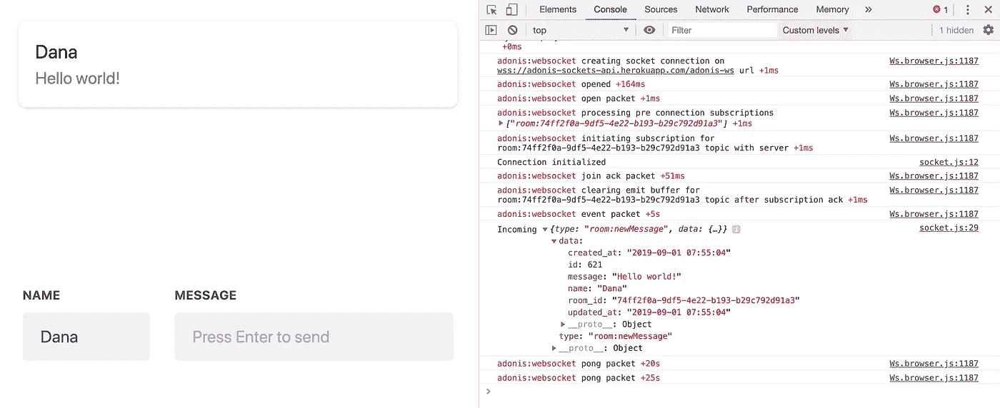
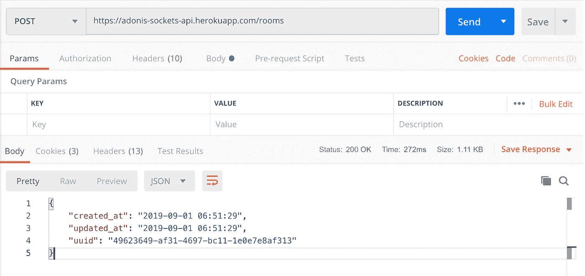

# 设置 AdonisJs websockets(带 React 应用程序演示)

> 原文：<https://itnext.io/setting-up-adonisjs-websockets-with-react-app-demo-27bb0bb7500f?source=collection_archive---------0----------------------->



*本文致力于设置 AdonisJs websocket 客户端&服务器 API。最后，您会发现一个 monorepo 的链接，其中包含工作示例代码(以及 CI/CD 脚本！)和一个现场演示应用程序。*

*它是为那些已经对 AdonisJs(或 Node.js)有经验并有所反应的读者而写的。这里不解释基础，只解释 websocket 相关逻辑。*

—

让 AdonisJs 套接字运行起来并不是世界上最容易的事情，但是当尝试新事物时却是如此。我觉得文档有点薄，因此这篇文章有例子。我希望我能帮助那些像我一样挣扎的人。

我们不会一步一步地创建新的 REST API。相反，我将介绍我对这个演示应用程序的想法:

> 假设你有多个聊天室。每个聊天室都有多条消息，用户当然可以发布新消息。前端通过 websocket 通信接收由服务器广播的新消息。

这为我们带来了一个基本的 REST API 结构(无认证):

*   帖子`/rooms` —创建一个新聊天室
*   GET `/rooms/:uuid` —选择并返回一个现有聊天室及其消息
*   POST `/rooms/:uuid` —在房间中创建新消息，**根据房间 ID 向主题广播消息**(意味着只有房间 ID 的订阅者收到消息)



你可以使用邮递员使用[https://adonis-sockets-api.herokuapp.com/rooms](https://adonis-sockets-api.herokuapp.com/rooms)来尝试一下

# 准备后端以广播消息

我将参考 AdonisJs 的官方文档。我们希望您已经生成了 AdonisJs 项目，因为我们将遵循该结构。

## 安装依赖项

要安装 WebSocket Provider，您需要在 adonis 项目根目录下运行
`adonis install @adonisjs/websocket`。

(抄袭自[https://adonisjs.com/docs/4.1/websocket](https://adonisjs.com/docs/4.1/websocket))

1.  `config/socket.js`包含 WebSocket 服务器**配置**。
2.  `start/socket.js`启动 WebSocket 服务器并注册**通道**。
3.  `start/wsKernel.js` **注册中间件**执行频道订阅。

接下来，在`start/app.js`文件中注册提供者:

```
const providers = [
  '@adonisjs/websocket/providers/WsProvider'
]
```

最后，指示[点火器](https://adonisjs.com/docs/4.1/ignitor)引导根`server.js`文件中的 WebSocket 服务器:

```
const { Ignitor } = require('@adonisjs/ignitor')new Ignitor(require('@adonisjs/fold'))
   .appRoot(__dirname)
   .**wsServer()** // boot the WebSocket server
   .fireHttpServer()
   .catch(console.error)
```

—

## 实际代码

您可以在`start/socket.js`文件中注册套接字通道。我的看起来像这样:

```
**'use strict'

const *Ws*** = **use**(**'Ws'**)

***Ws*** .**channel**(**'room:*'**, **'RoomUpdateController'**)
  *// .middleware(['auth'])*
```

如你所见，我指的是一个控制器，而不是在`socket.js`文件中写所有的逻辑。这是可选的，我更喜欢控制器结构来保持我的项目逻辑分离，易于回溯。

需要注意的是`.channel('room:*')`部分——这是您将订阅的频道。由于我将订阅不同的房间(基于他们的 ID)，我需要`:*`动态参数。

还有一条评论线写着`// .middleware(['auth'])`。**我们不会做任何授权用户检查**，但是如果你想做这些，这是你如何在[https://adonisjs.com/docs/4.1/websocket-server](https://adonisjs.com/docs/4.1/websocket-server)注册中间件的进一步说明。

—

接下来，让我们生成我们引用的控制器—

`adonis make:controller RoomUpdate --type=ws`

我的 RoomUpdateController 的内容如下所示:

*   `constructor()`将通过控制台日志提醒我们已经进行了新的订阅——其中`socket.topic`将是我们订阅的房间 ID。
*   当从客户端接收到**消息时,`onMessage()`会提醒我们——我们不会从客户端应用程序发出消息，只会从服务器发出消息。如果你想测试它，它就在那里。**
*   每当客户端关闭连接时,`onClose()`会提醒我们。用这个来测试你是否真的关闭了连接。

## 广播本身

我们的 websocket 逻辑似乎已经设置好了——我们已经安装了所有的东西，我们已经在`start/socket.js`文件中注册了通道，我们已经将它链接到一个控制器，并在其中编写了一些基本的监听逻辑。现在我们去广播新消息吧！

由于本文演示了单向 websocket 通信(服务器→客户端)，**一旦用户在房间**发布新消息，我们就会广播消息。您可以在本文末尾链接的示例源代码中找到所有的 API 逻辑。现在，我将只关注 createMessage 端点。

app/controller/Http/room controller . js

这是从我的包含 API 逻辑的`RoomController.js`文件中摘录的。我只展示了`createMessage()`方法，因为它是唯一一种广播方法。

`createMessage()`返回结果(创建的消息对象)，但我们将在客户端应用程序中忽略它，而是通过套接字通信接收新消息。如果您删除这一行并返回一个简单的 200 代码，应该没有什么变化。

注意被调用的`broadcast()`函数——它是从执行大部分魔法的`socket.utils`文件中导出的。让我们深入研究一下。

—

这个`broadcast`功能是根据我们的需求量身定制的。它预计:

*   一个`id`作为第一个参数，这将是我们的房间 ID (uuid) —我们需要它作为动态主题参数，因为我们只想将消息广播到一个房间。
*   一个允许客户端分离处理逻辑的`type`字符串——我们在控制器中使用了`room:newMessage`字符串。这可以很容易地扩展到各种类型，如`room:deleteMessage`或`room:editMessage`，允许前端根据类型决定如何处理传入的数据(我们将在后面看到这一点)。
*   一个将被广播的`data`，在我们的例子中是`message`对象。

1.  我们想要访问我们主题的频道，即`room:*`。如果没有频道，我们就无法继续，因为我们找不到我们的话题。
2.  我们根据收到的`id`找到主题。同样，如果没有主题，我们就不能继续(这意味着客户端没有正确连接，或者根本没有连接)。
3.  一旦我们有了主题，我们就广播数据—我们可以从 3 种方式中选择通信:
    - *发出* —仅将消息发送给产生请求的客户端
    - *广播* —将消息发送给除之外的所有人，产生请求的客户端
    - *广播给所有人* —将消息发送给收听所述主题的**所有人**。

> 我们使用的是`broadcastToAll`方法，因此无论您是否在房间里制作消息，客户端都没有区别。它只是接收一条消息并显示它。

现在，所有 3 种方法都需要两个参数— `event`和`data`。

*   我总是使用字符串“message”作为`event`参数。我发现这更容易，因为我总是听客户端的`message`，不必担心过于复杂的事情。
*   我的`data`参数是一个连接的对象——由类型属性(`room:newMessage`)和由`broadcast()` socket util 函数接收的数据组成。

由`broadcastToAll()`函数接收的`data`对象一旦被连接，看起来就像这样:

客户端收到消息后会看到什么

—

# 准备客户端接收消息

*我不会深入研究 GET 和 POST 请求来与 API 通信，也不会深入研究 React 语法。最后，您的前端是用什么创建的并不重要，重要的是如何接收消息，这在所有框架中都非常相似。*


运行演示前端应用程序，`cd frontend`、`yarn install`和`yarn start`。如果你想创建自己的应用程序，用`npx create-react-app frontend`生成一个。

我的演示前端的流程如下:

1.  我们创建一个房间并等待响应。成功创建聊天室后，用户将被重定向到新的空聊天室。
2.  一旦你进入这个聊天室，一个套接字连接就被初始化了。
3.  信息表单希望您填写您的**姓名**和您想要发送的**信息**。除非这两个都填写了，否则邮件不会发送到服务器。
4.  一旦您发送了一条消息(按下回车键)，**消息**字段将被清除。**名称**字段保持填充状态。
5.  来自服务器**的响应被忽略**。
6.  由于这个连接，您应该会收到一个传入的套接字消息。这就是前端处理传入数据的方式，忽略来自服务器的响应，不等待任何数据。
7.  *你可以在各种选项卡上打开房间，打开你的浏览器控制台观看数据流。*

## 实际代码

我们最感兴趣的是发生连接的`Room.js`组件文件。由于处理程序链接和 useEffect()以及穷举 dep 的性质，我们将使用传统的`React.Component`。

让我们一步一步来:

1.  我们正在从`lib/socket`文件夹导入一个`connection`变量。尽可能外包不同的逻辑是我的习惯。
2.  我们在组件外部定义了一个`subscription`变量。我们需要它在组件的任何地方都可以访问，这样我们就可以关闭连接。
3.  在`componentDidMount()`时，我们通过运行`connection.connect()`连接到我们的 websocket 服务器。
4.  然后我们通过运行`connection.subscribe()`进行订阅，并将结果存储在`subscription`变量中。
5.  `connection.subscribe()`需要两个参数——一个*主题*(如`room:123`)和一个*句柄*。
6.  **我们将** `**this.handleMessageAdd**` **作为处理程序参数传递。**这意味着每当接收到所述订阅中的消息时，数据将被传递给处理函数。
7.  我们获取现有的信息，以防我们打开一个已经装满信息的房间。
8.  在`componentWillUnmount()`之后，我们使用存储的订阅变量并关闭连接。
9.  然后是`handleMessageAdd`方法，它期待一条消息，并根据**消息的类型**(您可以看到开关)决定如何处理传入的数据。我们现在只添加了一条新消息(`room:newMessage`)，但是你可以随意扩展。如您所见，有一个`this.setState()`调用，它将新消息添加到旧消息的数组中，这触发了消息的呈现。

—

正如所料，神奇的事情发生在`lib/socket.js`文件中。让我们来看看内容:

lib/socket.js

首先，我们需要安装 adonis websocket 客户端包。输入`yarn add @adonisjs/websocket-client`继续。

## 请注意 connect()方法

我们尝试使用`this.ws = Ws(...).connect()`进行连接。

重要的是，如果您在本地运行后端，套接字协议将是`ws://`，如果您使用演示 heroku 应用程序，协议将是`wss://`。这就是为什么我为它创建了一个单独的 util 函数。

你也可以看到我正在使用的`process.env.REACT_APP_API_URL`是我的**adonis-sockets-api.herokuapp.com**。如果只在本地提供后端服务，也可以使用 env 变量或只使用静态字符串。您需要知道的是，这是连接到 websocket 通道的实际 URL，因此它需要是正确的。

我的完整网址是这样的:**WSS://Adonis-sockets-API . heroku app . com/***(也可以用这个)*。

在您的情况下，如果您在本地运行它，它可能类似于: **ws://localhost:3333/**

还有注释的`// .withApiToken()`行，如果您想使用 auth socket 中间件，可以使用它。您需要提供存储的令牌，以便它作为服务器 websocket 连接的一部分发送。

—

## 下一件有趣的事情是 subscribe()方法

我们接收`channel`和`handler`参数，它们将是我们的“ **room:*uuid** ”(例如“room:123”)字符串和处理函数。

我们将连接存储在一个`result`变量中，并处理传入的事件:

```
**const** result = **this**.**ws**.subscribe(channel); // this is our connection, we retry each second if we don't have it yet

result.on(**'message'**, message => {
  ***console***.log(**'Incoming'**, message);
  handler(message)
});

result.on(**'error'**, (error) => {
  ***console***.error(error)
});

**return** result
```

如果你还记得，我说过我把所有东西都叫做“消息”服务器端。我决定这样做，这样我就可以在一个单独的处理程序中拥有我所有的逻辑，这个处理程序就是`result.on('message', data => handler(data))`。这使得将数据传递给我的组件`handleMessageAdd`处理程序并在所述处理程序中分离不同的消息类型逻辑变得容易。

当然，采用哪种方法取决于你自己。

我们将在*传入的*消息和*错误*上显示 console.log()。

> 前端这边应该就这样了。最重要的是处理连接的`lib/socket.js`文件和连接并处理接收消息的组件，当然可以是多个组件。

您可以根据自己的意愿扩展这个应用程序，提供身份验证、消息删除、房间名称、房间编辑等功能。

—

有用的来源:

*   演示应用—[https://adonis-sockets-frontend.herokuapp.com/](https://adonis-sockets-frontend.herokuapp.com/#/)(打开你的控制台！)——*你可能会经历 10 秒钟的加载时间，因为这些应用程序是托管在 Heroku 上的。*
*   单一回购来源—[https://gitlab.com/djanoskova/adonisjs-sockets-monorepo](https://gitlab.com/djanoskova/adonisjs-sockets-monorepo)
*   套接字上的 AdonisJs 文档—[https://adonisjs.com/docs/4.1/websocket](https://adonisjs.com/docs/4.1/websocket)，[https://adonisjs.com/docs/4.1/websocket-server](https://adonisjs.com/docs/4.1/websocket-server)
*   评论！问你需要什么，给别人提建议。

感谢您的阅读。一如既往，祝你好运，鼓励你继续努力！🎉