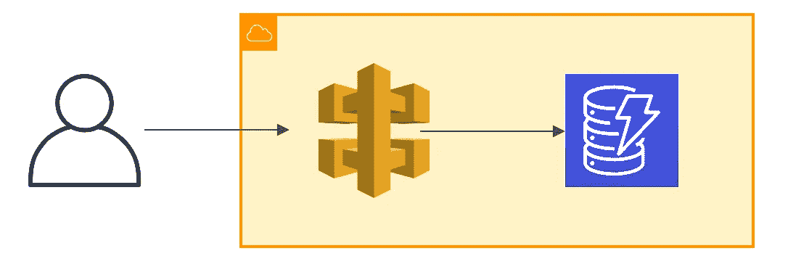

# 使用 Cloudformation 通过 DynamoDB 设置 API 网关

> 原文：<https://itnext.io/setting-up-api-gateway-with-dynamodb-using-cloudformation-a8ab3e70f494?source=collection_archive---------1----------------------->

通常，为 DynamoDB 构建 API 时，会使用 lambda 函数。我想看看没有 lambda 是怎么做到的。在这篇文章中，我将为包含龙的信息的数据库构建一个简单的 API。



我们将要实现的架构

我使用嵌套的堆栈设置，以便更容易将数据库和 API 集成到现有的基础设施中，或者在以后进行扩展。

根栈由下面的`template.yaml`定义:

```
AWSTemplateFormatVersion: 2010-09-09
Transform: AWS::Serverless-2016-10-31
Description: Root stack
Resources:
  Application:
    Type: AWS::Serverless::Application
    Properties:
      Location: application/template.yaml
    Parameters:
      Stage: prodOutputs:
  EndpointUrl:
   Value: !GetAtt Application.Outputs.Url
```

DynamoDB 和 API 以及`EndpointUrl`在`application/template.yaml`中定义。模板的前几行如下:

```
AWSTemplateFormatVersion: 2010-09-09
Transform: AWS::Serverless-2016-10-31
Description: >-
  Creates API Gateway and sets up a dynamodb
Parameters:
  Stage:
   Type: String
```

部署的阶段，在这种情况下`prod`是从根栈传递到应用程序的参数。

这个模板中定义了 3 个资源，DynamoDB 表、AIM 角色和 API 网关，以及一个输出。让我们从桌子开始:

```
Resources:
  DragonsTable:
    Type: AWS::DynamoDB::Table
    Properties:
      TableName: dragons
      AttributeDefinitions:
        - AttributeName: id
          AttributeType: S
      KeySchema:
        - AttributeName: id
          KeyType: HASH
      ProvisionedThroughput:
        ReadCapacityUnits: 1
        WriteCapacityUnits: 1
```

DynamoDB 龙表将包含所有关于龙的信息，例如:它们的名字、大小、颜色和年龄。在模板中，表只有一个定义的属性:`id`。该属性对于`KeySchema` 是必需的，并且是一个分区键。使用的其他属性确实需要添加到模板中，因为它们不是模式或二级索引的一部分。DynamoDB 表的默认计费模式是预配的。

```
 APIRole:
    Type: AWS::IAM::Role
    Properties:
      AssumeRolePolicyDocument:
        Version: 2012-10-17
        Statement:
         - Effect: Allow
           Principal:
             Service:
             - apigateway.amazonaws.com
           Action:
            - sts:AssumeRole
      Policies:
       - PolicyName: APIPolicy
         PolicyDocument:
           Version: 2012-10-17
         Statement:
          - Effect: Allow
            Action:
             - "dynamodb:PutItem"
             - "dynamodb:UpdateItem"
             - "dynamodb:DeleteItem"
             - "dynamodb:GetItem"
             - "dynamodb:Scan"
            Resource: !GetAtt DragonsTable.Arn
```

api 角色将确保 API 网关被允许访问数据库。我们将允许以下操作:添加新项目(put)、更新项目、删除项目、获取特定项目和扫描整个数据库。

```
Api:
   Type: AWS::Serverless::Api
   Properties:
     StageName: !Ref Stage
     OpenApiVersion: 3.0.2
     DefinitionBody:
       Fn::Transform:
         Name: AWS::Include
         Parameters:
           Location: openapi.yaml
```

第三个资源是 API 网关服务，在另一个模板`openapi.yaml`中定义。在这个 yaml 中，我们将定义端点。

```
Outputs:
  Url:
   Description: Endpoint URL
   Value: !Sub https://${Api}.execute-api.${AWS::Region}.amazonaws.com/${Stage}
```

模板的输出是我们在根栈中引用的 api 端点 url。这个端点供用户或应用程序访问我们的 API。

现在我们来看一下`openapi.yaml`模板。我们定义了两条路径:`dragons`和`dragon`。`dragons`端点有两种方法:`POST`和`GET`。post 方法用于向数据库中添加新项，而 get 方法用于列出数据库中的所有项。`dragon/dragonId`接收数据库中项目的`id`并处理特定项目。我们在这里实现的方法有:`GET`，获取特定龙的详细信息，`PUT`，更新特定龙的名称，`DELETE`，从数据库中删除一条龙。

```
openapi: 3.0.2
info:
  title:
    Dragons Api
  description:
    Lambdaless api to get data from DynamoDB
  version: 1.0.0
paths:
  /dragons:
    post:
      consumes:
        - 'application/json'
      produces:
        - 'application/json'
      requestBody:
        content:
          application/json:
            schema:
              $ref: '#/components/schemas/Dragon'
      responses:
        200:
          $ref: '#/components/responses/Dragon'
      x-amazon-apigateway-integration:
        description: Add a new dragon to the database
        credentials:  { 'Fn::GetAtt': APIRole.Arn }
        uri: { 'Fn::Sub': 'arn:aws:apigateway:${AWS::Region}:dynamodb:action/PutItem' }
        requestTemplates:
          application/json: 
            Fn::Sub:
              - |- 
                { 
                  "TableName": "${tableName}",
                  "Item": {
                    "id": {
                      "S": "$context.requestId"
                    },
                    "name": {
                      "S": "$input.path("$.name")"
                    },
                    "size": {
                      "S": "$input.path("$.size")"
                    },
                    "age": {
                      "N": "$input.path("$.age")"  
                    },
                    "color": {
                      "S": "$input.path("$.color")"  
                    }
                  }
                }
              - { tableName: { Ref: DragonsTable } }
        responses:
          default:
            statusCode: 200
            responseTemplates:
              application/json: '#set($inputRoot = $input.path("$"))
                {
                    "id": "$context.requestId"
                }'
        passthroughBehavior: 'when_no_match'
        httpMethod: POST
        type: AWS
```

该方法根据模板底部定义的模式使用 json 数据，这些数据将被添加到数据库中。端点还生成一个 json 响应，并返回添加到数据库中的龙的 id。从我们之前定义的 API 角色中获取的凭证。本例中的 uri(统一资源标识符)是 dynamodb 操作 put 项。

请求模板用于解析 json 并将项目添加到表中。表名由先前定义的表替换。

我们在这个路径上定义的下一个方法是 get 方法，它将使用 dynamodb 表上的扫描操作来获取表中的所有项目:

```
 get:
      consumes:
        - 'application/json'
      produces:
        - 'application/json'
      responses:
        200:
          $ref: '#/components/responses/Dragon'
      x-amazon-apigateway-integration:
        description: Retrieve all dragons in the database
        credentials:  { 'Fn::GetAtt': APIRole.Arn }
        uri: { 'Fn::Sub': 'arn:aws:apigateway:${AWS::Region}:dynamodb:action/Scan' }
        requestTemplates:
          application/json:
            Fn::Sub:
              - |-
                {
                  "TableName": "${tableName}"
                }
              - { tableName: { Ref: DragonsTable } }
        responses:
          default:
            statusCode: 200
            responseTemplates:
              application/json: '#set($inputRoot = $input.path("$"))
                          {
                            "dragons": [
                              #foreach($elem in $inputRoot.Items) {
                                "id": "$elem.id.S",
                                "name": "$elem.name.S",
                                "size": "$elem.size.S",
                                "age": "$elem.age.N",
                                "color": "$elem.color.S"
                              }#if($foreach.hasNext),#end
                              #end
                            ]
                          }'
        passthroughBehavior: 'when_no_match'
        httpMethod: POST
        type: AWS
```

接下来，我们定义一个需要路径变量`dragonId`的路径。这条路径上的第一个方法是 get 方法，用于从数据库中获取特定的项。

```
 /dragon/{dragonId}:
    get:
      consumes:
        - 'application/json'
      produces:
        - 'application/json'
      parameters:
        - name: 'dragonId'
          in: 'path'
          required: true
          schema:
            type: string
      responses:
        200:
          $ref: '#/components/responses/Dragon'
      x-amazon-apigateway-integration:
        description: Retrieve a specific dragon from the database 
        credentials:  { 'Fn::GetAtt': APIRole.Arn }
        uri: { 'Fn::Sub': 'arn:aws:apigateway:${AWS::Region}:dynamodb:action/GetItem' }
        requestTemplates:
          application/json:
            Fn::Sub: 
              - |-
                { 
                  "TableName": "${tableName}",
                  "Key": {
                          "id": {
                            "S": "$input.params("dragonId")"
                          }
                        }
                }
              - { tableName: { Ref: DragonsTable } }
        responses:
          default:
            statusCode: 200
            responseTemplates:
              application/json: '#set($inputRoot = $input.path("$"))
                {
                    "id": "$inputRoot.Item.id.S",
                    "name": "$inputRoot.Item.name.S",
                    "size": "$inputRoot.Item.size.S",
                    "age": "$inputRoot.Item.age.N",
                    "color": "$inputRoot.Item.color.S"
                }'
        passthroughBehavior: "when_no_match"
        httpMethod: POST
        type: AWS

    put:
      consumes:
        - 'application/json'
      produces:
        - 'application/json'
      parameters:
        - name: 'dragonId'
          in: 'path'
          required: true
          schema:
            type: string
      responses:
        200:
          $ref: '#/components/responses/Dragon'
      x-amazon-apigateway-integration:
        description: Update the name of a specific dragon
        credentials:  { 'Fn::GetAtt': APIRole.Arn }
        uri: { 'Fn::Sub': 'arn:aws:apigateway:${AWS::Region}:dynamodb:action/UpdateItem' }
        requestTemplates:
          application/json: 
            Fn::Sub: 
              - |-
                { 
                  "TableName": "${tableName}",
                  "Key": {
                          "id": {
                            "S": "$input.params("dragonId")"
                          }
                        },
                  "ExpressionAttributeValues": {
                    ":n": {"S": "$input.path("$.name")"}
                        },
                  "ExpressionAttributeNames": {
                    "#n": "name"
                  },
                  "UpdateExpression": "SET #n = :n",
                  "ReturnValues": "ALL_NEW"
                }
              - { tableName: { Ref: DragonsTable } }
        responses:
          default:
            statusCode: 200
            responseTemplates:
              application/json: '#set($inputRoot = $input.path("$"))
                {
                  "updated": {
                    "id": "$inputRoot.Attributes.id.S",
                    "name": "$inputRoot.Attributes.name.S"
                  }
                }'
        passthroughBehavior: 'when_no_match'
        httpMethod: POST
        type: AWS

    delete:
      consumes:
        - 'application/json'
      produces:
        - 'application/json'
      parameters:
      - name: 'dragonsId'
        in: 'path'
        required: true
        schema:
            type: string
      responses:
        200:
          content:
            application/json:
              schema:
                '$ref': '#/components/responses/Dragon'
      x-amazon-apigateway-integration:
        description: Delete a specific dragon from the database
        credentials: { 'Fn::GetAtt': APIRole.Arn}
        uri: { 'Fn::Sub': 'arn:aws:apigateway:${AWS::Region}:dynamodb:action/DeleteItem' }
        requestTemplates:
          application/json:  
            Fn::Sub: 
              - |-
                {
                  "TableName": "${tableName}",
                    "Key": {
                      "id": {
                        "S": "$input.params("dragonId")"
                      }
                    },
                  "ReturnValues": "ALL_OLD"
                }
              - { tableName: { Ref: DragonsTable } }
        responses:
          default:
            statusCode: 200
            responseTemplates:
              application/json: '#set($inputRoot = $input.path("$"))
                {   
                  "deleted" : {
                    "id": "$inputRoot.Attributes.id.S",
                    "name": "$inputRoot.Attributes.name.S",
                    "size": "$inputRoot.Attributes.size.S",
                    "age": "$inputRoot.Attributes.age.N",
                    "color": "$inputRoot.Attributes.color.S"
                    }
                }'
        passthroughBehavior: 'when_no_match'
        httpMethod: POST
        type: AWS
```

最后，我们定义模式的:

```
components:
  schemas:
    Empty:
      type: object
      description: Empty Schema
    Dragon:
      type: object
      description: Dragon
      properties:
        id:
          type: string
        name:
          type: string
        size:
          type: string
        age:
          type: number
        color:
          type: string
  responses:
    Dragon:
      description: Dragon
      content:
        application/json:
          schema:
            type: object
            properties:
              id:
                type: string
              name:
                type: string
              size:
                type: string
              age:
                type: number
              color:
                type: string
```

现在是时候部署 api 了。将这些值替换为与您的设置相匹配的值。

```
$ export profile="demo"
$ export region="eu-central-1"
$ export stackname="dragons-api"
$ export bucket="bucket-medium-article"
```

首先，我们在 aws 上创建 bucket 来存储我们的 cloudformation 模板。如果你已经有一个桶，你可以跳过这个。

```
$ aws s3api create-bucket --bucket ${bucket} --create-bucket-configuration LocationConstraint=${region} --profile ${profile}
```

接下来，我们将本地工件打包并上传到 S3。

```
$ aws cloudformation package --profile ${profile} --template-file template.yaml --s3-bucket ${bucket} --output-template-file ./build/template-generated.yaml
```

然后我们部署 cloudformation 模板并创建或更新堆栈。

```
$ aws cloudformation deploy --profile ${profile} --template-file ./build/template-generated.yaml --stack-name ${stackname} --capabilities CAPABILITY_AUTO_EXPAND CAPABILITY_IAM
```

要获取 API 的端点，我们可以使用以下命令:

```
$ export endpointUrl=$(aws cloudformation describe-stacks --profile ${profile} --stack ${stackname} --query "Stacks[0].Outputs[?OutputKey=='EndpointUrl'].OutputValue" --output text)
```

现在，让我们通过向表中添加一条龙来测试 API:

```
$ curl -X POST ${endpointUrl}/dragons -H "Content-Type: application/json" -d '{"name":"Mushu","size":"small","color":"red","age":"123"}'
```

这将返回数据库中新创建的龙的 id，例如:`{ “id”: “d1c89d37–5d1d-4fba-9e01–7a83f4387f0c” }`

要获得数据库中的所有龙，我们可以使用以下代码:

```
$ curl -X GET ${endpointUrl}/dragons 
```

这将返回龙的列表:

```
{ “dragons”: 
  [ 
    { “id”: “d1c89d37–5d1d-4fba-9e01–7a83f4387f0c”, 
      “name”: “Mushu”, 
      “size”: “small”, 
      “age”: “123”, 
      “color”: “red” 
    }, 
    { “id”: “2fd695eb-b50a-476a-8e17–3676238b63e8”, 
      “name”: “Toothless”, 
      “size”: “medium”, 
      “age”: “15”, 
      “color”: “black” 
    }
  ] 
}
```

要更新其中一条龙的名称:

```
$ curl -X PUT ${endpointUrl}/dragon/2ca9cb67–5d27–49be-aec1–128606d3f899 -H “Content-Type: application/json” -d ‘{“name”:”Meatlug”}’{ “updated”: { “id”: “2ca9cb67–5d27–49be-aec1–128606d3f899”, “name”: “Meatlug”} }
```

要从表格中删除龙:

```
$ curl -X DELETE ${endpointUrl}/dragon/2fd695eb-b50a-476a-8e17-3676238b63e8 { "deleted" : { "id": "2fd695eb-b50a-476a-8e17-3676238b63e8", "name": "Toothless", "size": "medium", "age": "15", "color": "black" } }
```

要获得特定龙的详细信息:

```
$ curl -X GET ${endpointUrl}/dragon/d1c89d37-5d1d-4fba-9e01-7a83f4387f0c { "id": "d1c89d37-5d1d-4fba-9e01-7a83f4387f0c", "name": "Mushu", "size": "small", "age": "123", "color": "red" }
```

就是这样。我希望您对这个用例感兴趣！