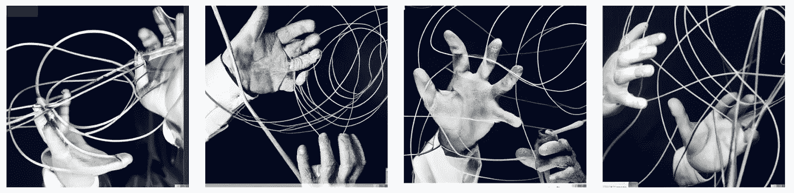
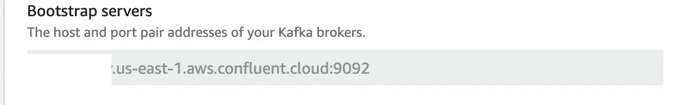
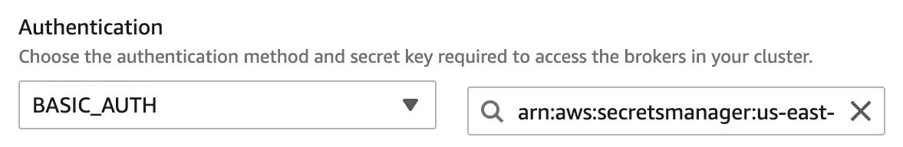

# 用融合云 Kafka 设置自动气象站 Lambda

> 原文：<https://itnext.io/setting-up-aws-lambda-with-confluent-kafka-a6072fbabc52?source=collection_archive---------2----------------------->

技术演练

无服务器是一个全新的计算模式，lambda 是一个伟大的工具，但直到最近，它还与 AWS 服务紧密耦合，你想从 SQS 开发 Lambda 吗？简单，API 网关？不言而喻。S3 事件？当然可以。和大量其他可用的选项。但对我来说，至少在 AWS 服务的触发器上有所欠缺——特别是缺少 Kafka 集成。

当我需要对排序和持久性有高保证的分区消息流时，Kafka 是我的首选解决方案。合流是我的首选 Kafka 提供商(尤其是“无服务”合流云产品)。但是，当我需要将一个无服务器 Lambda 连接到一个融合的云 Kafka 主题时，会发生什么呢？直到最近还没有“AWS 优先”的解决方案(例如，Confluent 为 lambda 提供了一个内置的“sink”连接器，作为其托管 Kafka connect 产品的一部分)。

由 OpenAI DALL-E 生成

请看:最近 AWS 宣布 Lambda 现在支持 Kafka。但是阅读[文档](https://docs.aws.amazon.com/lambda/latest/dg/with-kafka.html)主要是关于支持内置的 AWS Kafka 产品:MSK，并缺乏关于如何与融合的 Kafka 一起工作的文档。Serverless 是一个流行的框架，它抽象了 lambda 以用于常见用例，现在也有了与 Kafka 一起使用的[文档](https://www.serverless.com/framework/docs/providers/aws/events/kafka)。不幸的是，这两个文档都有些含糊不清，尤其是在认证方面。不同身份验证选项的含义是什么？我们应该如何构造引用的 secret manager 机密？我想不通。找不到融合的卡夫卡的例子。

所以我冒险尝试，并设法在一个私人项目中建立了它。几个星期后，我们在工作中遇到了这种情况，虽然我很高兴我有一个工作示例，但我决定记录这个(简单但没有记录的)过程。

让我们来看一下设置的过程。我将重点介绍如何设置 Kafka lambda 触发器，因为其余部分非常简单，文档提供了预期数据结构的良好工作示例。

# 设置 Kafka 触发器:

首先，让我们指定引导服务器(从汇合 UI 或 CLI 粘贴的副本)并输入主题名称。

如果您需要对消费者组 id 进行特定控制，那么选择它，大多数情况下不会这样，您可以跳过它

现在是棘手的部分。认证，如果你使用的是无服务器框架(或者其他 Cloudformation 之上的抽象)，它在 *accessConfiguration* 下。或者在身份验证下的 UI 中

您应该从 UI 中选择 BASIC_AUTH，或者( *saslPlainAuth* 用于代码描述的路径)并且作为一个值，您应该提供一个[AWS secrets manager](https://aws.amazon.com/secrets-manager/)“secret”的 ARN。请注意，如果您是用代码来做这件事，您还需要为特定的 lambda 角色提供相关的 IAM 策略，允许它读取这个秘密。

现在是棘手的部分，这不是很好的记录。在 Amazon Secrets manager(应该在设置 lambda 之前就存在)中，您应该以这种格式创建一个秘密:

> { "用户名":"汇合用户名"，"密码:"汇合密钥" }

在这里，您可以用在融合 UI 或 [CLI](https://docs.confluent.io/cloud/current/access-management/user-service-example.html#step-5-create-service-accounts-and-api-key-secret-pairs) 中创建用于访问集群的服务帐户和密钥时提供的用户名和密钥来替换“融合用户名”和“融合密钥”。

这就是全部，现在你有一个 AWS 无服务器 lambda 与融合的独立 Kafka 设置连接。

资源:

*   [无服务器 kafka 文档](https://www.serverless.com/framework/docs/providers/aws/events/kafka)
*   [带 kafka 触发器文档的 AWS lambda](https://docs.aws.amazon.com/lambda/latest/dg/with-kafka.html)