# 使用 Codemagic 为颤振设置 CI/CD

> 原文：<https://itnext.io/setting-up-ci-cd-for-flutter-with-codemagic-725ae63e9be0?source=collection_archive---------2----------------------->

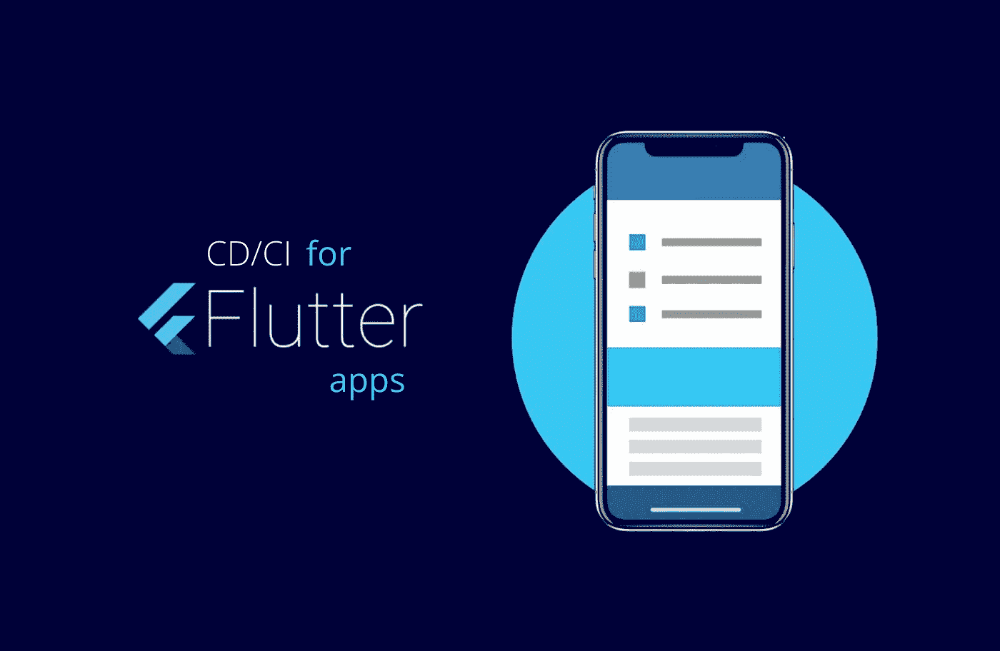

颤振应用的 CI/CD

正如一些程序员所声称的那样，构建好的软件并快速编写代码来实现业务目标似乎是一种两难的选择。开发人员希望更快地构建产品，同时也能写出好的软件。有了 CI/CD(持续集成/持续交付)，这不再是一个问题，是的，每个人都赢了😊 😊 😊。

CI/CD 的目的是不断地将工作产品版本合并到主开发分支和频繁的构建执行中，以发现潜在的 bug 并解决集成问题。CI 在每个开发周期中都提高了产品的稳定性，因为每次推送代码时，都会触发自动构建并运行集成测试，以确保添加的新单元不会“破坏”之前成功构建的应用程序。如果测试失败，构建也会失败，从而确保应用程序保持稳定。当涉及到准备应用程序的发布时，这就是“持续交付”，因为“持续部署”负责自动部署到生产中。我想现在很清楚了😉 😉 😉。

今天，有很多工具可以为许多编程语言设置 CI/CD。我将用 [CodeMagic](https://codemagic.io/) 为一个 [Flutter](https://flutter.dev/) 应用程序设置 CI/CD。

【https://blog.codemagic.io/getting-started-with-codemagic/ 

CodeMagic 是一个 CI/CD 工具，和其他 CI/CD 工具一样，它从 Git 库或者至少是一些分散的库开始。当代码被推送到这个存储库时，它会触发一个新的构建过程。如果构建在任何一点失败，它将停止 CI/CD 过程的任何进一步的进展，并给出日志，以便我们确切地知道问题来自哪里。成功的构建交付了 iOS 和 Android 的应用程序工件，以便安装在各自的设备上。Codemagic 允许测试和发布 Flutter 应用程序，没有问题，没有配置。作为开发人员，您可以运行自定义脚本并为您的应用程序创建自定义工作流。酷吧😎😎😎？让我们开始…

# **要求**

在 Codemagic 上设置你的 Flutter 应用，你需要几样东西。

1.  显然，你的 Flutter 应用程序经过了一些测试。
2.  Flutter app 应该托管在 GitHub、GitLab 或者 Bitbucket 上。
3.  可选的代码签名详细信息，如证书和预置描述文件，如果您想要发布到 App Store 或 Play Store。
4.  可选的空闲工作空间，用于发送构建报告和工件。

现在，我们准备将 CI/CD 添加到我们的 Flutter 应用程序中。然而，这篇文章不会涉及代码签名和发布。

## 创建一个 Github 项目

创建您的 flutter 应用程序，并将其推送到 GitHub。出于本教程的目的，我将使用我上一篇文章中构建的 WhatsApp 状态保护程序。这些代码可以在 Github 上找到。点击[此处](https://github.com/Mastersam07/wa_status_saver)获取代码。你可以在这里阅读之前的文章[，在这里](/whatsapp-status-saver-downloader-using-flutter-ff5ff897e56)阅读之前的文章[，跟随开发进程。](/whatsapp-status-saver-downloader-using-flutter-ii-aa99b1206c48)

## 注册 CodeMagic

访问 [codemagic.io](https://codemagic.io/) 并使用您的 GitHub、Bitbucket 或 GitLab 帐户注册。你可以用一个 Codemagic 帐户连接所有这些存储库，这样你就可以在一个地方拥有所有的应用程序。

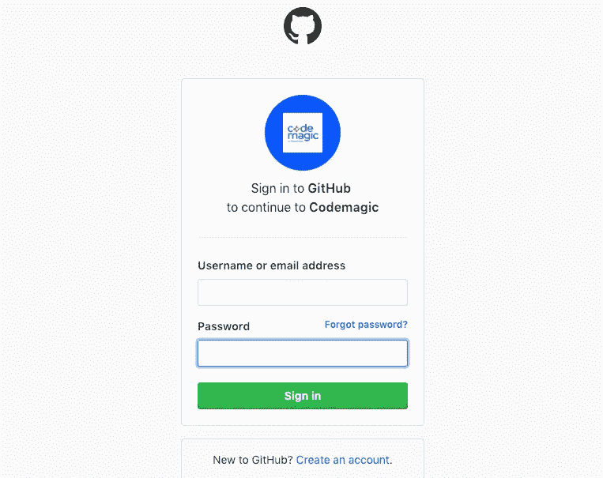

登录 Codemagic

## 你的第一次建造

登录后，您将看到 Codemagic 仪表盘和应用程序存储库。你可以过滤列表或搜索应用来找到你的 Flutter 应用。

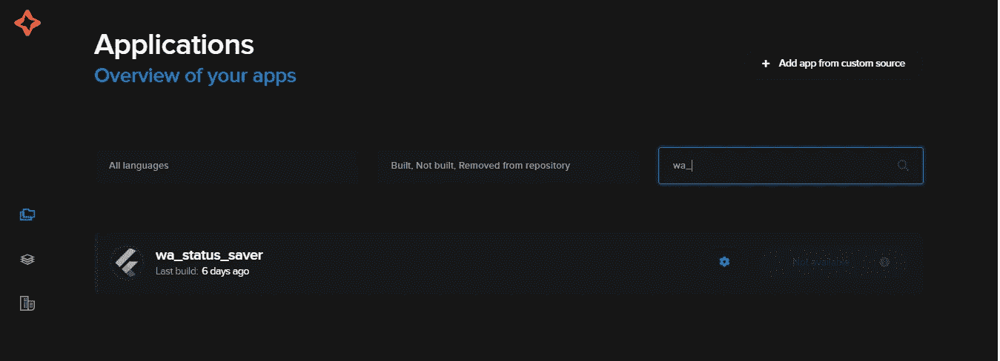

应用概述

对于您第一次配置的应用程序，您可以通过单击“开始您的首次构建”按钮开始。在上面的截图中，我们有一个不适用的按钮，因为这个应用程序已经建成。

## 构建工作流

当您开始构建时，Codemagic 将为您的 Flutter 项目创建一个工作流。您也可以自定义它来满足您的需求。

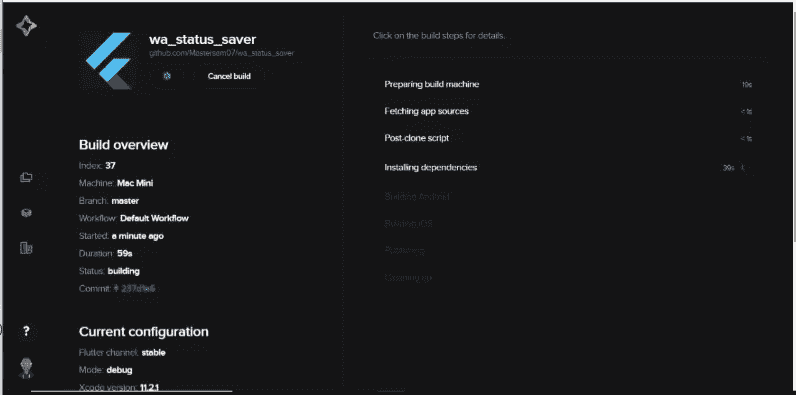

构建工作流

从上面我们可以看到，默认的工作流将通过以下步骤开始构建——准备构建机器、获取应用程序源代码(检查源代码)、安装 Flutter 依赖项、运行测试、构建应用程序和发布工件。

## 构建报告

下面是构建完成后的细节概述。

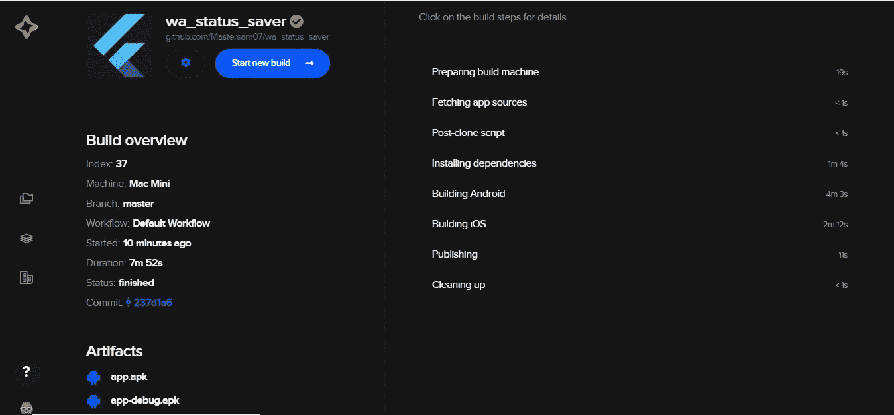

构建报告

我们还会向您发送一封包含所有这些详细信息的电子邮件。您还可以设置 Slack 通道来接收构建报告。您收到的邮件应该是这样的:

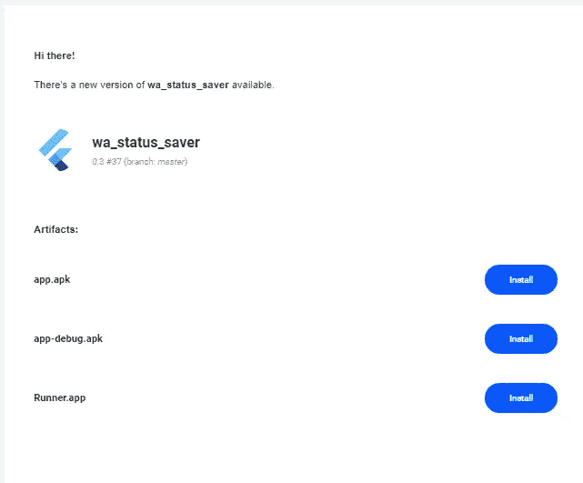

是的，我们刚刚为我们的 Flutter 应用程序添加了 CI/CD 支持，无需任何配置😋 😋 😋。这就是代码的魔力——魔力😁😁😁。

但是等等，如果你的构建失败了呢？😪 😪 😪。不要担心，它不会以眼泪结束😉。

## 构建失败

不是所有的构建都是成功的。我自己也经历过失败的构建😪 😪 😪但是我们总是可以解决它，因为 Codemagic 提供了每个步骤的非常详细的日志，不管它是通过还是失败😃 😃 😃。这里我们可以看到一个失败的单元测试，所有的细节都记录在构建失败中。

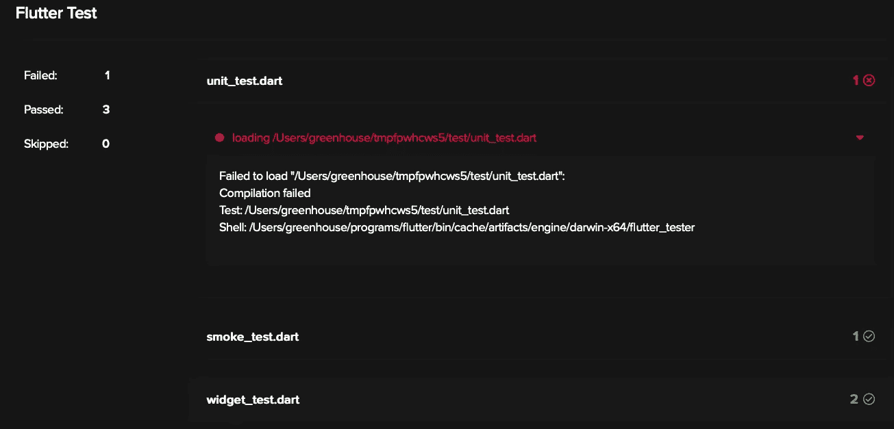

[blog.codemagic.io](https://blog.codemagic.io/)

如上所述，集成测试和小部件测试通过了，但是单元测试失败了。然后我们可以解决问题来修复构建。当测试失败时，您还会收到一封关于测试失败的电子邮件，其中包含构建日志的链接。我将在另一篇文章中介绍集成、单元和小部件测试🤓 🤓**🤓**。

# 默认工作流和自定义工作流

默认流程涵盖了 CI/CD 所需的所有基础知识，但是接下来，您会想要添加一些定制的东西作为构建过程的一部分。您可能想要将构建状态发送到某个第三方通信渠道，例如 Slack。让我们深入定制一个工作流。

## 构建阶段

Flutter 应用程序的 Codemagic 构建阶段有各种选项来定义构建过程。您可以从选择要构建的分支以及如何触发构建开始。

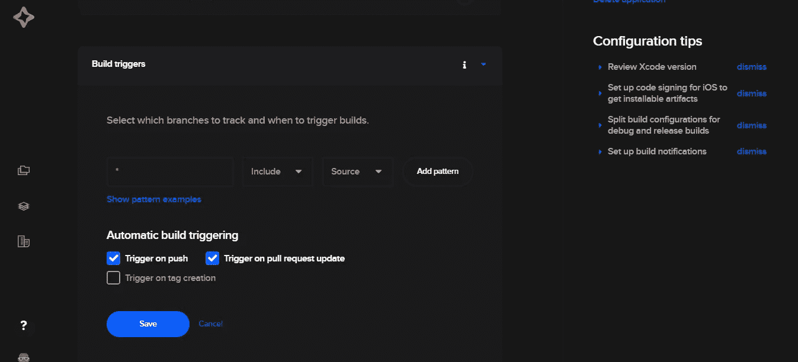

您还可以选择其他类别，如 Flutter 版本、构建配置、平台、Xcode 版本和自定义构建参数。

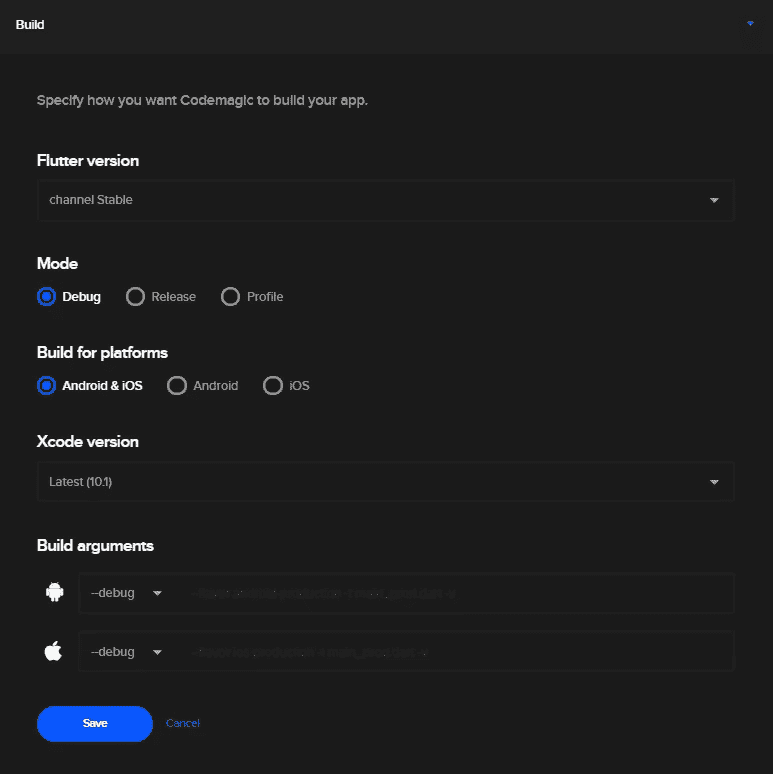

以上是默认的工作流程设置。您可以通过更改默认行为来自定义构建过程。此外，您可以在每个阶段之前添加自定义脚本。这很容易设置。只需点击每个阶段顶部的+号。请参见下图，了解您期望看到的内容。

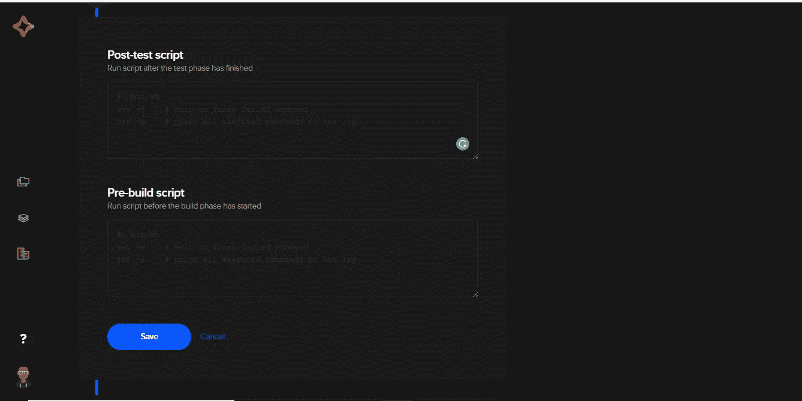

您可以在预构建脚本中添加任何命令，比如您想要安装一些依赖项。

## 测试阶段

在这里，您可以启用或禁用执行。这个阶段有两个部分，一个是单元和小部件测试，另一个是集成测试。测试设置有点简单。您设置测试如何影响构建。您可以启用颤振分析器，启用颤振测试，在您的应用程序中运行单元测试。您可以在这里停用由失败的测试导致的自动构建失败，尽管这不是一个推荐的选项，至少对于要投入生产的构建来说是这样的。始终保存每个单独部分的设置，因为没有保存所有设置的通用按钮。Codemagic 自动识别小部件、单元和集成测试，并默认启用它们，如下所示。

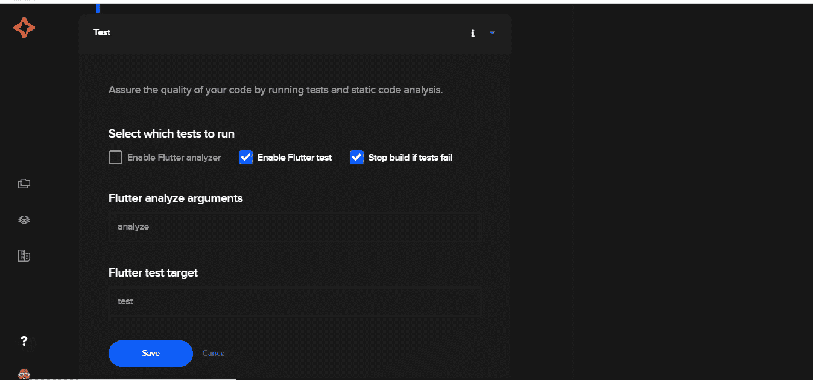

我们可以通过禁用默认行为来使用自定义测试命令。例如，假设我们只想从命令行运行 UI 测试，我们可以使用命令添加一个预测试阶段:
`$flutter drive --target=test_driver/main.dart`

## 发布阶段

默认情况下，如果您提供了 GitHub/Bitbucket/GitLab，则只配置电子邮件，因为我们必须显式配置发布阶段的任何其他方面，包括:

1.  上传 Android 和 iOS 的代码签名资产
2.  设置松弛时间
3.  提供用于发布的 Google Play 和 App Store Connect 详细信息

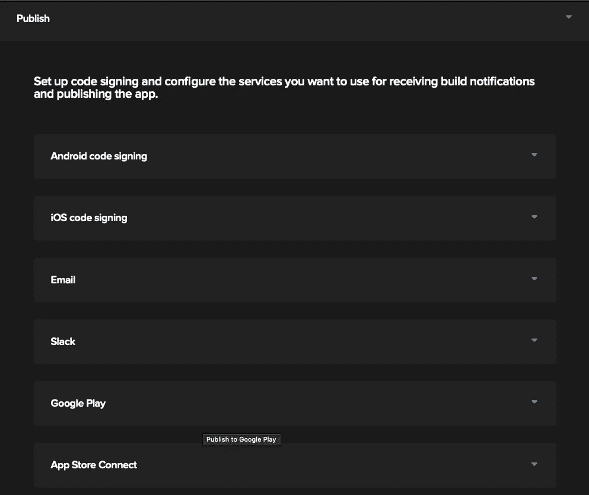

即使有了这些，您也可以编写一些定制脚本来将工件部署到第三方服务。借助脚本的力量，我们可以在 Codemagic 中配置自定义工作流，为 Flutter 应用程序定义更强大的构建过程。

# 多个工作流程

Codemagic 允许我们创建多个工作流，以满足各种配置和软件版本的不同要求。通过复制现有工作流并对其进行重命名来创建新的工作流。为此，请遵循以下简单步骤:

1.  转到应用程序设置。
2.  在“工作流设置”部分，单击“复制工作流”。选择工作流程并给它重新命名。

## 构建状态徽章

你想在你的 GitHub repo 中包含一个构建状态徽章，这样你的构建状态就会显示出来？不要再说了。单击 Codemagic 构建中的设置图标。应该会出现如下所示的屏幕。

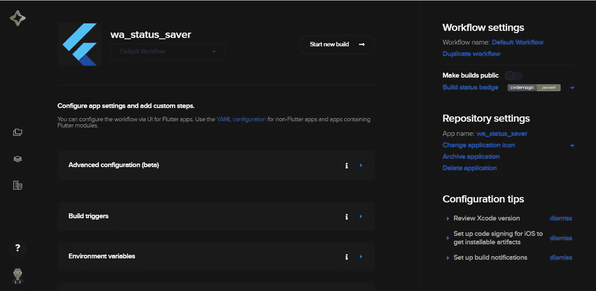

在右侧，我们可以看到一个构建徽章。对于通过的构建，颜色为绿色，对于失败的构建，颜色为红色。您可以选择公开发布构建版本。您还可以通过减价或徽章 URL(可添加到您的 README.md 中)将徽章添加到您的回购协议中。单击徽章旁边的箭头/下拉按钮，您应该会看到徽章 URL 和减价。复制它，并在必要的地方使用。在 Github 库中，我们应该有一个闪亮的徽章，如下所示。

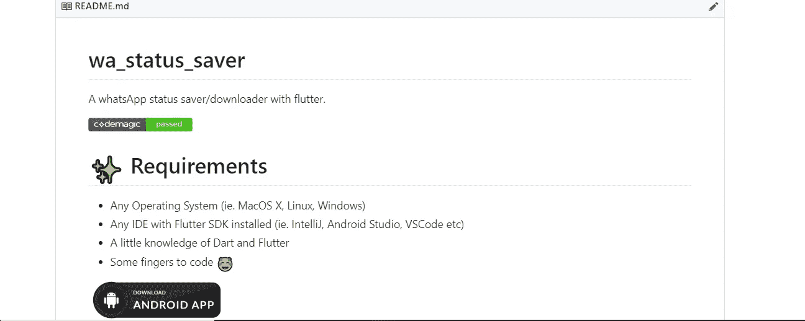

[https://github.com/Mastersam07/wa_status_saver](https://github.com/Mastersam07/wa_status_saver)

就这样，你的工作流程设置好了，所有的触发器都就位了😍 😍 😍。当你推送代码时，提出一个拉取请求，它将触发魔法，然后你的应用程序将通过预设的渠道被交付和部署到所有感兴趣的各方。

前往 [codemagic.io](https://codemagic.io/) 并尝试一下。用户体验是💥 💥 💥。

您也可以访问 Codemagic 博客—【https://blog.codemagic.io/getting-started-with-codemagic/ 