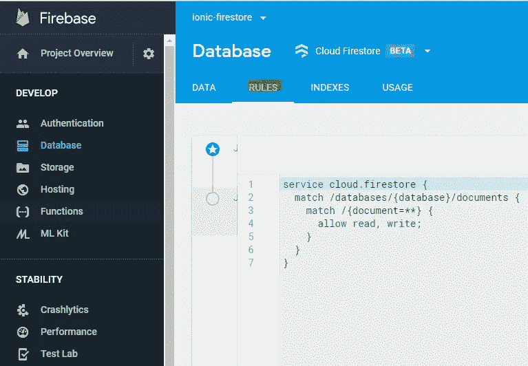
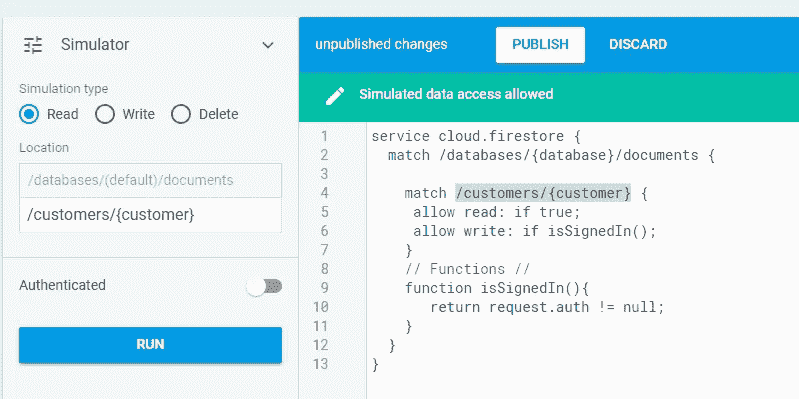
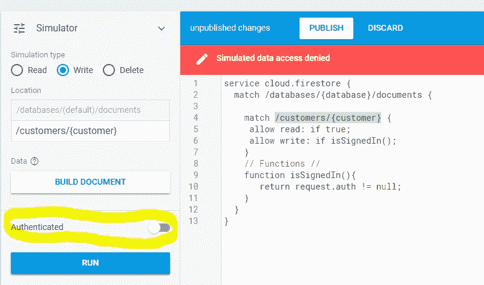
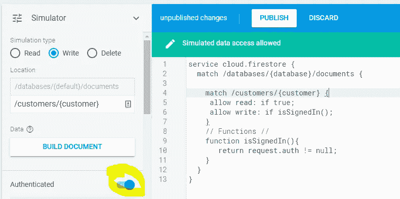
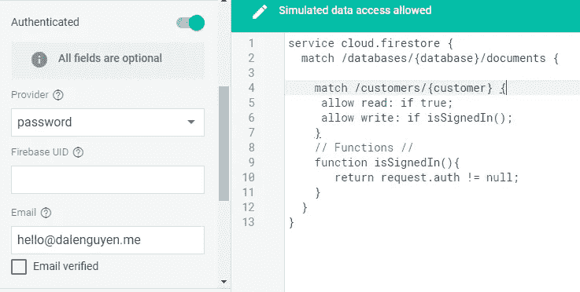

# 设置云 Firestore 安全规则

> 原文：<https://itnext.io/setting-up-cloud-firestore-security-rules-1ad24438805a?source=collection_archive---------0----------------------->


你设计了一个使用云 Firestore 作为数据库平台的应用程序或 web 应用程序，这太棒了。它工作得很好，直到有一天，你的整个数据库都不见了或被破坏。这是一场灾难，没有人希望它发生。这就是为什么我们需要安全规则！

1.  **如何设置云 Firestore 的规则？**

你登录到你的 **Firebase 控制台> Firestore >规则**，然后你会看到你当前的安全规则。



安全性也有版本控制，所以你可以随时回到以前的规则。上述规则将允许任何人读写您的云 Firestore。

2.**如何设置安全规则**

```
service cloud.firestore {
  match /databases/{database}/documents {
    // All rules goes here }
}
```

您可以为整个数据库或每个集合本身设置规则

```
// The {document=**} will match any document in the entire database. 
match /{document=**} {
   allow read, write: if <condition>;
}
```

3.**为每个集合设置安全规则**

```
match /customers/{customer} {
   allow read: if true;
   allow write: if request.auth != null;
}
```

上面的规则将允许公众**读取**客户集合中的任何内容，但是，他们需要登录才能**写入(创建、更新和删除)**数据。

您可以使用函数，而不是直接在匹配中给出条件。通过利用函数，您可以在其他规则中重用条件，而不必每次都更改条件。

```
match /customers/{customer} {
   allow read: if true;
   allow write: if isSignedIn();
}// Functions //
**function isSignedIn(){
   return request.auth != null;
}**
```

4.**测试安全规则**

有一种方法可以让您在不发布规则的情况下测试安全规则。通过这样做，您不会弄乱当前的部署。您的客户会对此感到高兴。

我们将使用嵌入式模拟器来测试所有的安全规则。



如您所见，我正在客户集合上测试读取规则。任何人都可以在不登录的情况下评估客户集合。

然而，没有认证就不能编辑数据库——这很好；)



现在，我们将尝试在登录 Firebase 后是否可以写。



如您所见，在认证之后，写规则是 pass。在这个测试中，我尝试使用电子邮件和密码登录。有更多的方法供你测试。



通过这样做，您将减少在部署安全规则时可能犯的错误。

5.**其他有用的招数**

我可能不是一个诡计，它只是一些代码，您可以使用部署到您的安全规则

```
// Check if document is exists
function documentIdExists() {
     return exists(/databases/$(database)/documents/users/$(request.auth.uid));
}// Check if userId exists in the document 
function userExistsInDocument() {
     return resource.data.userId == request.auth.uid;
}// Check if email exists in the document 
function userExistsInDocument() {
     return resource.data.email == request.auth.token.email;
}
```

如果您找不到您想要的内容，请留下评论或阅读[云 Firestore 安全文档](https://firebase.google.com/docs/firestore/security/get-started)。