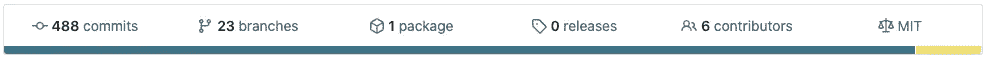

# 为 NPM 设置 GitHub 包

> 原文：<https://itnext.io/setting-up-github-packages-for-npm-2bc9f8e4b11e?source=collection_archive---------1----------------------->

Github 软件包于去年 5 月推出，但直到我开始新工作后，它才出现在我的视野中。因为我们的代码已经存储在 Github 上的仓库中，所以在没有额外成本的情况下，将我们的包也存储在那里是有意义的。

事不宜迟，下面是如何设置。

# 发布包

首先，在你的`package.json`中命名你的包，并添加一个`publishConfig`属性告诉`npm`你正在发布到 Github 的注册表中。最后，确保`repository`字段是正确的，因为它必须匹配您的存储库的 url。

```
{
  "name": "@companyname/package-name"
  "publishConfig": {
    "registry": "https://npm.pkg.github.com/"
  },
  "repository": "git://github.com/companyname/package-name.git" 
}
```

运行 publish，你的包应该成功发布到 github 包！

```
npm publish
```

现在，您应该看到您的包列在项目主页的顶部栏中:



您的存储库栏中有 1 个新包！

# 安装软件包

首先，在你的项目的根目录下添加一个`.npmrc`。

```
@yourcompany:registry=https://npm.pkg.github.com
```

这告诉`npm`安装 Github 包中名称空间为`@yourcompany`的任何包。

要安装，您需要在 Github 中创建一个[个人访问](https://github.com/settings/tokens)令牌。授予它对包的读写权限。如果您的帐户可以访问该组织，那么它将可以访问其软件包。

创建令牌后，运行以下命令:

```
npm login --registry=https://npm.pkg.github.com
```

您的用户名将是您的 github 用户名，您的密码将是令牌。之后，你应该可以安装你的软件包了！

# 在 CI/CD 中运行它

要在您的持续集成/部署设置中运行它，首先在您的平台中添加您的个人访问令牌作为环境变量(在下面的例子中命名为`$GITHUB_ACCESS_TOKEN` )。

然后在安装之前运行以下命令:

```
echo //npm.pkg.github.com/:_authToken=$GITHUB_ACCESS_TOKEN >> ~/.npmrc
```

唯一奇怪的是在环境变量中存储了一个特定于 Github 用户的令牌。到目前为止，看起来该组织自己还不能创造一个可以使用的代币。

# 总结

到目前为止，使用 Github 包是轻而易举的事情，将源代码和包存储在同一个地方也很好。