# (第八部分。)在 Unity 中设置高清晰度渲染管道

> 原文：<https://itnext.io/setting-up-high-definition-render-pipeline-in-unity-68ed41062371?source=collection_archive---------3----------------------->

在本教程中，我将使用 Unity 中的高质量图形模块 HDRP。教程系列的上一部分是[这里是](https://medium.com/@janjilecek/limbo-style-menu-in-unity-4fe3fdee3420)。

# 进口 HDRP

安装 HDRP 软件包

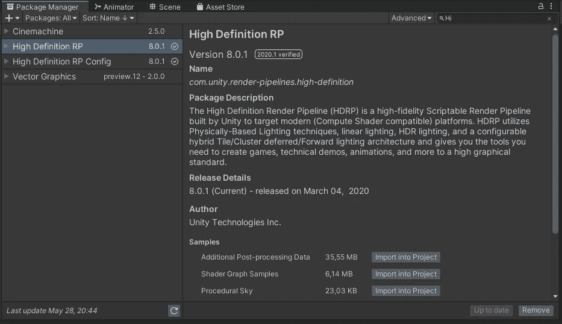

导入所需的包:

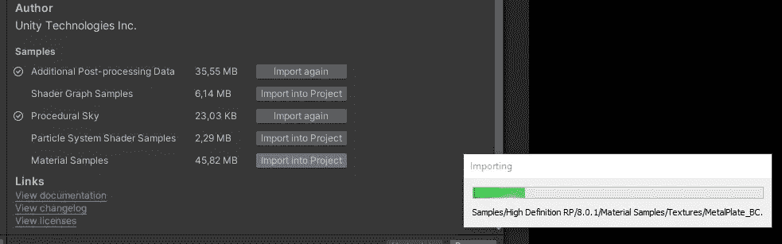

完成安装向导。安装*配置包*。

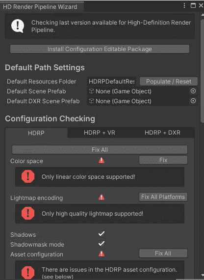

全部修复:

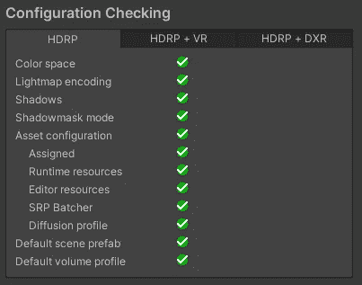

重新导入所有资产(资产|全部重新导入):

Unity 重启后你会看到新的场景。如果将材质着色器设置为“统一/标准”,它应该可以修复颜色，不会有问题。

场景现在将使用 HDRP/光照着色器，因此场景看起来是单色的，如下所示:

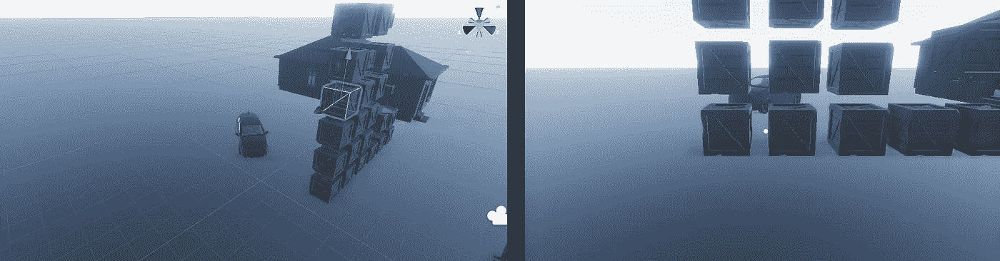

要快速修复它，只需将材质的金属表面增加到约 0.6。这样纹理会得到原来的颜色。在我的情况下，我计划在后期处理中将项目转换为黑白，所以我不在乎原始纹理当时的确切颜色。然而，如果你需要正确的纹理颜色，你需要修改法线贴图和遮罩贴图开关。

# 使用 HDRP

然后和新 HDRP 资产:

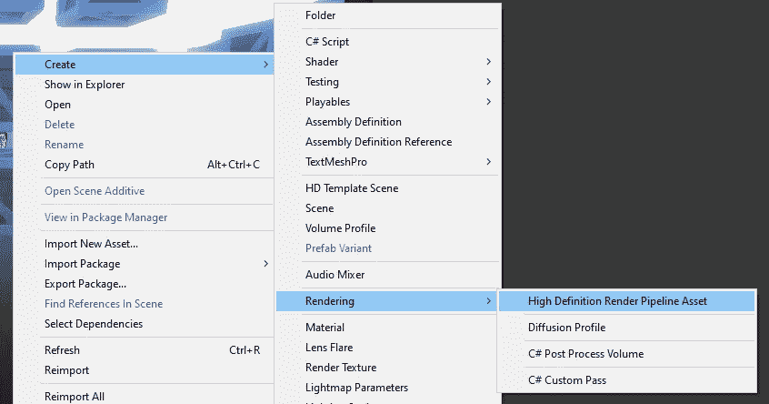

转到编辑|项目设置|图形并分配 HDRP 资产，如下所示:

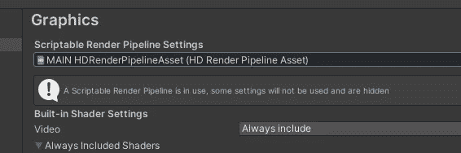

好的做法是创建一个新的游戏对象，专门用于后期处理:

向其添加卷组件，并向其添加新的配置文件:

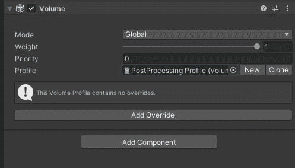

添加您需要的任何效果。我会添加一些后期处理滤镜和雾。

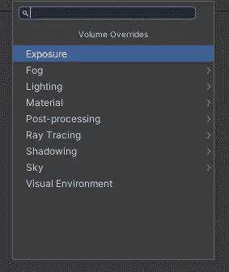

体积雾很容易添加，但它看起来仍然像一个样本场景。没有额外的视觉效果。

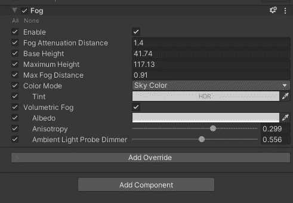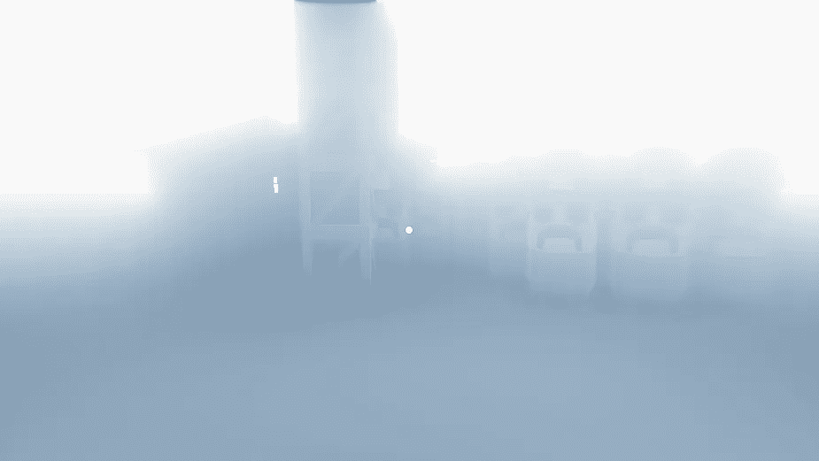

# 本地卷

如果您需要使用体积，您可以单独使用，并根据自己的需要编辑它们的边界框。这样，雾就不是全局的，而只是体积的局部(当你的相机在体积内时):

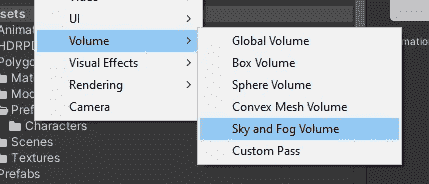

如果你给它添加一个碰撞器，它将更容易直观地设置边界:

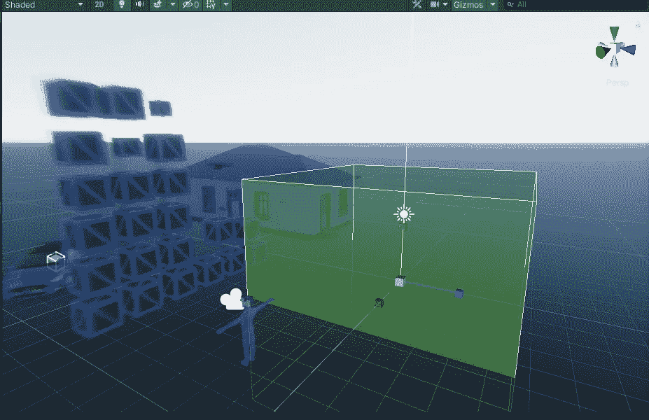

将*音量模式*改为*本地:*

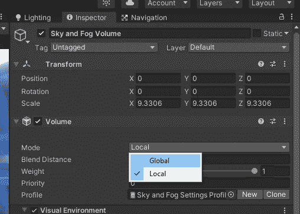

我改变了色调和天顶色为红色。当我进入卷时，后期处理完全改变了。

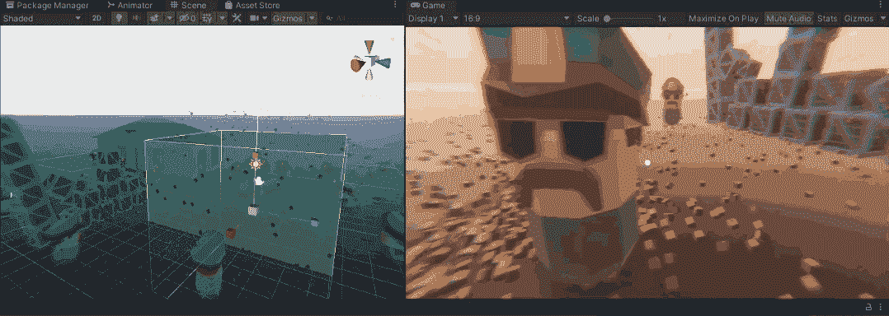

当进入时，本地音量改变效果