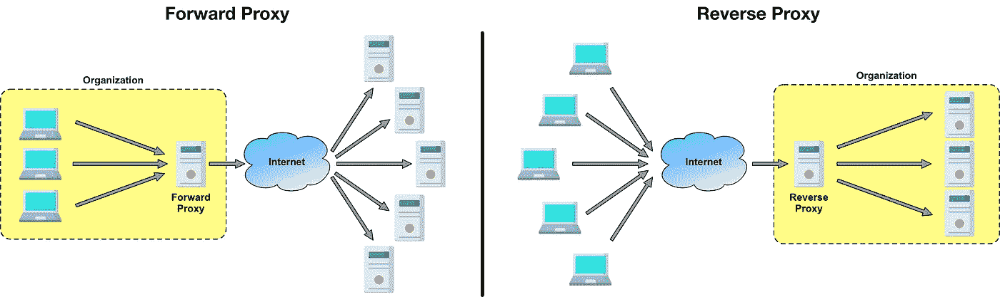
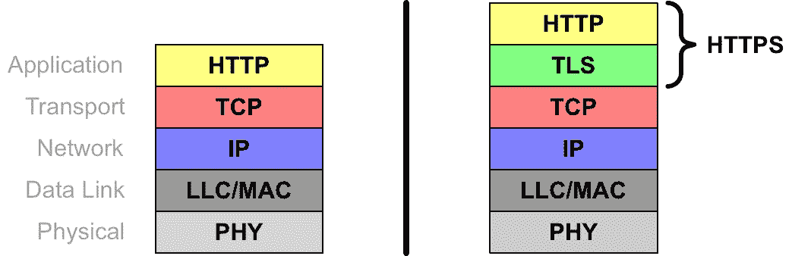
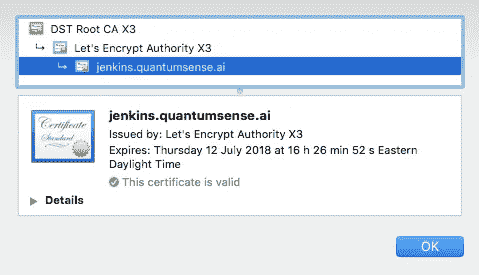
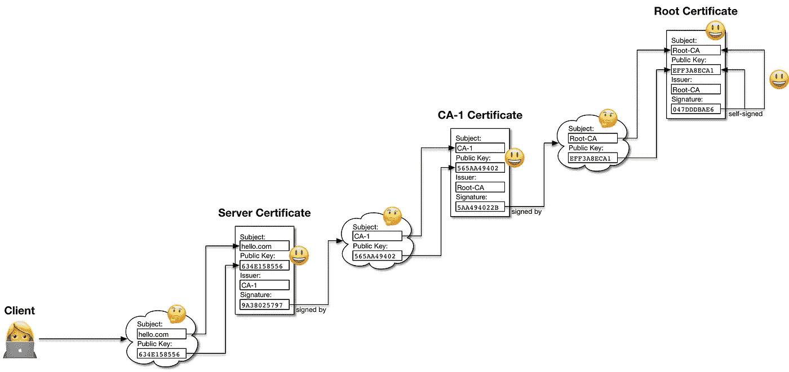
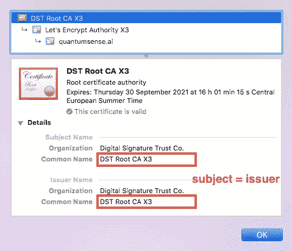
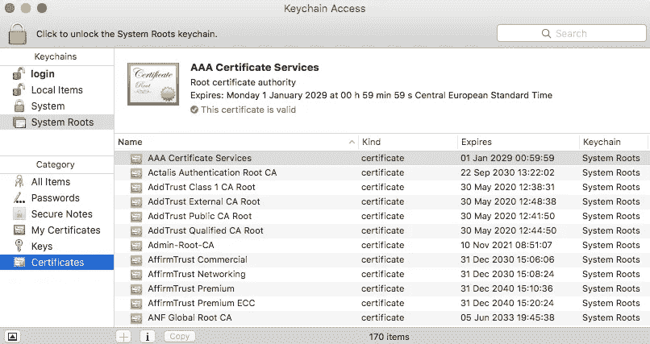
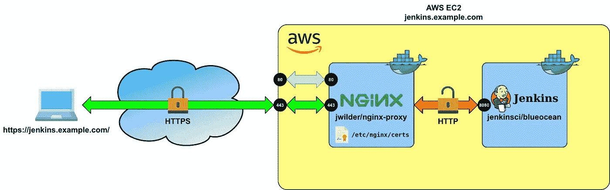

# 詹金斯与 HTTPS 使用 NGINX 和 Docker

> 原文：<https://itnext.io/setting-up-https-for-jenkins-with-nginx-everything-in-docker-4a118dc29127?source=collection_archive---------1----------------------->

例如，在 AWS EC2 实例上运行 Docker 中的 Jenkins 很容易。您只需确保 Docker 已经[安装在 EC2 实例上](https://gist.github.com/weibeld/21fb18497eb78104aa4ef83b0fd27081)，然后运行下面的`docker run`命令，如文档中的[所示:](https://jenkins.io/doc/book/installing/#downloading-and-running-jenkins-in-docker)

```
docker run \
  -d \
  --rm \
  -u root \
  -p 8080:8080 \
  -v jenkins-data:/var/jenkins_home \
  -v /var/run/docker.sock:/var/run/docker.sock \
  jenkinsci/blueocean
```

如果您拥有域`mydomain.com`，那么您可以转到您的 DNS 服务器，为`jenkins.mydomain.com`创建一个 CNAME 记录，将其值设置为您的 AWS EC2 实例的公共域名，您的 Jenkins 安装将在`http://jenkins.mydomain.com`公开访问。

然而，并不是说 URI 方案是`http`而不是`https`。Jenkins ( [Winstone](https://github.com/jenkinsci/winstone) )内置的 web 服务器默认使用 HTTP。这意味着你和 Jenkins 之间的所有通信都是不加密的。那么，如果你想使用 HTTPS 加密你的流量呢？

一种选择是将内置的 Jenkins Winstone 服务器配置为使用 HTTPS。这可能会有一些麻烦，但不推荐，即使是官方的詹金斯医生也不推荐。

有一个更简单的解决方案，即使用一个**反向代理**。在这种情况下，反向代理处理所有 HTTPS 的东西，这允许您在反向代理后面以默认配置(使用 HTTP)运行 Jenkins。在本教程中，我们将使用 [NGINX](https://www.nginx.com/) 反向代理，我们将所有东西作为 Docker 容器运行。

对于此解决方案，以下步骤是必要的:

1.  [了解什么是反向代理。](#4d9a)
2.  [为](#0fa3) `[jenkins.mydomain.com](#0fa3)` [创建一个 TLS 服务器证书。](#0fa3)
3.  [使用正确的配置运行反向代理和 Jenkins 容器。](#c915)

在本文的其余部分，我将逐一描述这些步骤。

# 什么是反向代理？

和往常一样，带有“反向”修饰语的术语不是很直观。基本上，有两种类型的代理，它们被称为**正向代理**和**反向代理**。下图说明了它们的作用:



正向代理(左)与反向代理(右)。

## 正向代理

转发代理是一种服务器，它代表一组明确定义的客户端向互联网上的任意服务器执行请求。

例如，如果你正在使用一个转发代理，并且你从你的浏览器请求[http://google.com](http://google.com,)/，那么你的浏览器本身不做这个请求，而是把它转发给转发代理。转发代理执行对`google.com`web 服务器的请求，获取响应，并将该响应返回到您的浏览器。

在`google.com`的网络服务器不知道这个请求最初来自你。它只能看到转发代理的 IP 地址作为请求的源 IP 地址，而看不到您的笔记本电脑的 IP 地址。因此，对于 web 服务器，看起来请求来自转发代理。

因此，使用转发代理的一个常见用例是对 web 服务器隐藏您的 IP 地址。

## 反向代理

反向代理是一种服务器，它通过互联网接收来自任意客户端的请求，并将这些请求转发给一组定义明确的服务器之一。

例如，如果你有一个反向代理在你的网站`[http://mydomain.com](http://mydomain.com)`的 web 服务器前运行，那么任何对`http://mydomain.com`的请求实际上都是由你的反向代理接收，而不是由你的 web 服务器接收。然后，反向代理将这个请求转发到您的 web 服务器，web 服务器处理它，将响应返回给您的反向代理，反向代理将响应返回给客户端。

发出请求的客户机不知道它实际上是在与一个反向代理交互，而不是直接与您的 web 服务器交互。

反向代理的一个常见用例是让它处理某些任务，这样反向代理背后的应用服务器就不需要处理这些任务。这种任务的一个例子是处理 **TLS** 网络层(例如，实现 HTTPS)。这就是我们在这篇文章中要做的。

反向代理也可用于**负载平衡**。例如，如果您的反向代理后面有多个 web 服务器为同一个网站服务，那么反向代理可以在这些 web 服务器上平均分配传入的请求，从而降低单个 web 服务器过载的风险。

# 获取 TLS 服务器证书

为了使用 HTTPS，我们需要为要用于我们的 web 服务器的域获取一个公钥证书。但要做到这一点，我们首先需要了解 HTTPS 到底是什么。

## 什么是 HTTPS？

HTTPS 可以重新表述为**“通过 TLS 的 HTTP”**。TLS 代表**传输层安全**，是一个加密网络协议层，可以插在网络协议栈的传输层(如 TCP)和应用层(如 HTTP)之间。下图说明了这一点:



HTTP(左)与 HTTPS(右)协议栈。

*注意:你可能经常听到术语 SSL(安全套接字层)。事实上，术语 SSL 经常与 TLS 互换使用，但这是错误的。SSL 是 TLS 的前身协议，现在已被弃用。*

所以，如果单独使用 HTTP，我们就说 HTTP。如果在 TLS 之上使用 HTTP，我们就谈论 HTTPS。更详细地说，如果我们使用 HTTP，那么 HTTP 层以纯文本的形式将消息向下传递到 TCP 层(接收消息时也是同样的方式)。另一方面，如果我们使用 HTTPS，那么 HTTP 层将纯文本消息传递给 TLS 层，TLS 对这些消息进行加密，并将它们作为密文传递给 TCP(接收消息时也是同样的方式)。

TLS 使用对称加密算法来加密邮件。该算法以及对称密钥在初始握手期间在客户端和服务器之间进行协商。对称加密提供了通信的**机密性** 。

除了保密性，TLS 还提供**服务器** **认证**。这意味着服务器(例如 web 服务器)必须向客户端(例如浏览器)证明其身份。这是通过公钥加密和 TLS 服务器证书来完成的。我将在下一节解释这是如何工作的。

TLS 还定义了**客户端认证**。这意味着客户端(例如浏览器)必须通过 TLS 客户端证书向服务器(例如 web 服务器)证明其身份。然而，这一功能在实践中很少使用。

## TLS 服务器身份验证

想要向其客户端验证自身身份的服务器需要有一个私钥和一个公钥，以及一个公钥证书。在与客户机连接时，客户机向服务器发送一个所谓的质询，即一段任意的数据，并请求服务器用服务器的私钥加密这段数据。

然后，服务器将加密的质询连同服务器证书一起发送回客户端。然后，客户端用服务器的公钥(在证书中)解密加密的质询。如果解密成功，客户端就知道它正在与之对话的服务器确实是证书中列出的主体。这是因为只有*这个*主体应该拥有与证书中的公钥相对应的私钥。

## 什么是公钥证书？

下面是对公钥加密的简短介绍。它解释了证书如何工作，包括**信任链**和**根证书**的概念。

如果你不想了解证书是如何运作的，只是想获得一个，可以直接跳转到[***“如何获得证书？”***](#8d39) 。

[**公钥证书**](https://en.wikipedia.org/wiki/Public_key_certificate) 是包含三条信息的文本文档:

*   一个**主题**的描述(例如，一个个人、一家公司或一个由域名标识的网络服务器)
*   一个**公钥**
*   可信第三方的**数字签名**，证明**该公钥属于该主体**

事实上，证书所做的只是确认给定的公钥属于给定的主体。

举个例子，如果一个 subject 叫做 *Google* ，有一个公钥 *P* ，那么对应的证书会说:“我确认公钥 *P* 属于 *Google* ”。

证书的可信度依赖于确认证书内容的可信第三方的数字签名。该数字签名由证书的颁发者提供。证书的发行者被称为[](https://en.wikipedia.org/wiki/Certificate_authority)**认证机构。**

****

**由三个证书组成的信任链(在 Chrome 中查看)。自下而上:1)由加密认证中心颁发的域名证书。2)让我们加密由根证书颁发机构颁发的自己的证书。3)根证书机构的根证书。**

**文档的 [**数字签名**](https://en.wikipedia.org/wiki/Digital_signature) 通常只不过是用签名者的私钥加密的文档的散列。如果这个签名可以用签名者的公钥解密，那么我们知道这个签名一定是由这个签名者制作的，因为这个签名者是唯一可以访问这个私钥的主体。**

**当客户端验证服务器的证书时，它还必须验证该证书上 CA 的数字签名。如前所述，这是通过尝试用 CA 的公钥(众所周知)解密签名来实现的。但是现在客户机似乎又回到了起点:它有一个主题(CA)和一个公钥，该公钥声称是 CA 的公钥，但是没有证据证明这个公钥确实属于这个 CA。**

**解决方案是另一个证书。即由另一个 CA，比如说 *CA-2* 颁发的证书，该证书确认声称是第一个 CA，比如说 *CA-1* 的公钥，实际上是 *CA-1 的*公钥。此证书有 *CA-2* 的数字签名。但作为客户，我们仍不能止步于此。我们还必须核实该证书上 *CA-2* 的签名。为此，我们需要 *CA-2 的*公钥(它是公开可用的)。现在，我们又有了一个主题( *CA-2* )和一个公钥，但是没有证据证明这个公钥真的属于 *CA-2* 。解决方案是…再一个证书。即由 *CA-3* 签发的证书，确认所讨论的公钥确实是 *CA-2* 的公钥。而且这个证书有 *CA-3* 的数字签名，我们反过来需要验证。**

**下图说明了这一过程:**

****

**由三个证书组成的信任链，包括根证书。**

**您可以看到，这产生了一个称为 [**信任链**](https://en.wikipedia.org/wiki/Chain_of_trust) **的证书链。理论上，信任链可以无限长，但实际上并非如此。典型的网站信任链由三到四个证书组成。****

**那么信任链的终点在哪里呢？答案是用一个所谓的 [**根证书**](https://en.wikipedia.org/wiki/Root_certificate) 。根证书是其签名不需要验证的证书。特别是根证书是自签名的，也就是说，数字签名是由颁发证书的同一个 CA 制作的。**

**根证书是由根 CA 颁发的，根证书通常确认根 CA 声称是他们的公钥，实际上是根 CA 的公钥。而且这个确认不是别人做的，是 root-CA 自己做的。您可以在下图中看到，根证书的主题和颁发者是相同的。**

****

**在一个根证书中，主体和签发者是相同的，签名也是由他们做出的。**

**那么，我们如何信任根 CA 和根证书呢？答案是它们在人类术语下是可信的，而不是在密码术语下。根-CA 受到监管并接受公众审查，根证书通常由浏览器和操作系统供应商精心挑选，并包含在他们的产品中。例如，在 macOS 上，您可以在“钥匙串访问”中看到受信任的根证书集(这些根证书也被 Google Chrome 使用):**

****

**macOS 上“钥匙串访问”中的根证书。**

**这种对信任链和根证书的探索只是为了提供信息。你通常不需要处理它。唯一的例外是，如果您必须验证系统不知道的根证书(例如，您的浏览器或操作系统)。在这种情况下，您必须在您的系统上安装这个根证书(当然，如果您信任它)。**

**然而，你需要知道的是如何为你自己的域名获得一个证书，以便为你的网络服务器设置 HTTPS。这是下一节的主题。**

## **怎么拿证？**

**那么，我们怎样才能得到一个公钥证书来设置詹金斯和 HTTPS 呢？一般来说，为了获得证书，你必须带着你的公钥和你自己(主体)的一些信息去证书颁发机构(CA)，请求 CA 为你创建一个证书(你做一个所谓的[证书签名请求](https://en.wikipedia.org/wiki/Certificate_signing_request))。**

**CA 随后会验证您确实是您所声称的那个人。如果成功，他们会创建您的证书并将其连同信任链中的所有证书(根证书除外)一起返回给您。也就是说，您不仅可以取回自己的证书，还可以取回 CA 的证书，以及签署该 CA 证书的 CA 的证书，等等。**

**不幸的是，大多数传统的 ca 都是商业实体，获得证书不是免费的。此外，证书签名请求是一个手动过程，可能需要很长时间才能完成。**

**但是，有一个替代解决方案。**

## **免费的解决方案**

**[**我们来加密**](https://letsencrypt.org/) 是一个完全免费颁发证书的非营利性 CA。此外，他们使用[自动证书管理环境(ACME)](https://en.wikipedia.org/wiki/Automated_Certificate_Management_Environment) 协议，该协议自动化了身份验证和证书颁发过程。有了这个解决方案，获得证书不仅是免费的，而且只是几分钟的事情。**

**从 Let's Encrypt 获取证书的推荐方式是使用 ACME 客户端的[**cert bot**](https://certbot.eff.org/)**。****

****在我们的例子中，我们希望使用该证书作为 TLS 服务器证书，通过我们的域名`jenkins.mydomain.com`访问 HTTPS 的 Jenkins。在这种情况下，证书的主题将只是域名`jenkins.mydomain.com`，我们必须向 Let's Encrypt 证明我们是这个域名的所有者。****

****所有这些都将由 Certbot 通过我们必须为该域创建的 DNS 记录来完全自动地完成。****

****从 Let's Encrypt 获得 Certbot 证书的一般说明是这里的。它基本上由以下步骤组成:****

1.  ****在您的 DNS 服务器上，为域名`jenkins.mydomain.com`创建一个 CNAME 或别名记录，指向您有权访问的主机。****
2.  ****登录到该主机并安装 Certbot。****
3.  ****运行`certbot certonly`。****

****就是这样！Certbot 为您创建一个公钥/私钥对，通过 DNS 记录进行域所有权验证，并从 Let's Encrypt 获得主题`jenkins.mydomain.com`的公钥证书。****

****Certbot 将证书保存在本地主机的以下目录中:****

```
**/etc/letsencrypt/live/jenkins.mydomain.com**
```

****特别是，该目录将包含以下相关文件(以及其他一些不需要的文件):****

*   ****`fullchain.pem`:包含您的证书(不包括根证书)的信任链。****
*   ****`privkey.pem`:你的私钥。****

****这些文件是你用 NGINX 反向代理为 Jenkins 设置 HTTPS 所需要的，下一节将会解释。****

# ****在 Docker 中设置 NGINX 和 Jenkins****

****我们有以下目标:****

*   ****在 Docker 中运行 Jenkins。****
*   ****和 HTTPS 一起去见詹金斯。****
*   ****通过反向代理处理 HTTPS，让 Jenkins 使用默认的 HTTP 配置。****

****下图说明了该解决方案的体系结构:****

********

****在 Jenkins Docker 容器前面运行 NGINX Docker 容器，以便允许 HTTPS 访问 Jenkins。****

****我们运行两个独立的 Docker 容器，一个使用 NGINX，一个使用 Jenkins。对于 nginx，我们使用了[**jwilder/NGINX-proxy**](https://hub.docker.com/r/jwilder/nginx-proxy/)**容器，大大方便了容器内部 NGINX 反向代理的配置。******

******jwilder/nginx-proxy 容器将 nginx 与 [docker-gen](https://github.com/jwilder/docker-gen) 文件生成器结合起来。docker-gen 是一个工具，它允许基于主机上运行的容器的元数据来创建文件。在 jwilder/nginx-proxy 容器的情况下，docker-gen 能够为运行在同一容器中的 nginx 自动生成一个配置文件。******

******这些其他容器的元数据以环境变量的形式提供，这些变量由`docker run`命令的`-e`选项指定。用 jwilder/nginx-proxy 设置 HTTPS 的官方说明是[这里](https://github.com/jwilder/nginx-proxy#ssl-support)。******

******在我们的例子中，我们希望指示 NGINX 将所有对`jenkins.mydomain.com`的请求路由到 Jenkins 容器的端口 8080(这是 Jenkins 监听的默认端口)。下面是启动 Jenkins 容器的命令:******

```
****docker run \
  -d \
  --rm \
  -u root \
  -v /var/run/docker.sock:/var/run/docker.sock \
  -v jenkins-data:/var/jenkins_home \
  -v "$HOME":/home \
  -e VIRTUAL_HOST=jenkins.mydomain.com \
  -e VIRTUAL_PORT=8080 \
  jenkinsci/blueocean****
```

******与正常运行 Jenkins 的主要区别是出现了`VIRTUAL_HOST`和`VIRTUAL_PORT`环境变量，它们允许 jwilder/nginx-proxy 容器中的 docker-gen 为 nginx 生成适当的配置文件。此外，上面的命令没有向主机发布任何端口(通常用`-p`选项来完成)，这是因为 Jenkins 将隐藏在 NGINX 反向代理后面，不需要处理任何对主机本身的外部请求。******

******jwilder/nginx-proxy 容器需要我们在上一节中生成的证书和私钥。这些文件必须以某种方式命名，并通过`-v`选项传递给绑定挂载卷中的容器。******

******为此，将最后一节中的`fullchain.pem`和`privkey.pem`复制到当前主机，并重命名为:******

*   ******`fullchain.pem` → `jenkins.mydomain.com.crt`******
*   ******`privkey.pem` → `jenkins.mydomain.com.key`******

******在下面，我将假设这些文件在本地主机的目录`/home/you/certs`中。******

******一旦这些文件准备就绪，使用以下命令运行 jwilder/nginx-proxy 容器:******

```
****docker run \
  -d \
  --rm \
  -p 80:80 \
  -p 443:443 \
  -v /var/run/docker.sock:/tmp/docker.sock:ro \
  -v /home/you/certs:/etc/nginx/certs \
  jwilder/nginx-proxy****
```

******就是这样！现在 NGINX 被正确配置为代表 Jenkins 处理 HTTPS。******

******如果您在浏览器中访问`[https://jenkins.mydomain.com](https://jenkins.mydomain.com/.)`，您应该会看到类似这样的内容:******

************

******HTTPS 为詹金斯实现了一个 NGINX 反向代理。******

******注意，在这个解决方案中，HTTP 请求被自动强制到 HTTPS。也就是说，如果有人请求`http://jenkins.mydomain.com`，该请求仍然被作为 HTTPS 处理(并出现在浏览器中，如上图所示)，这通常是一种期望的行为。******