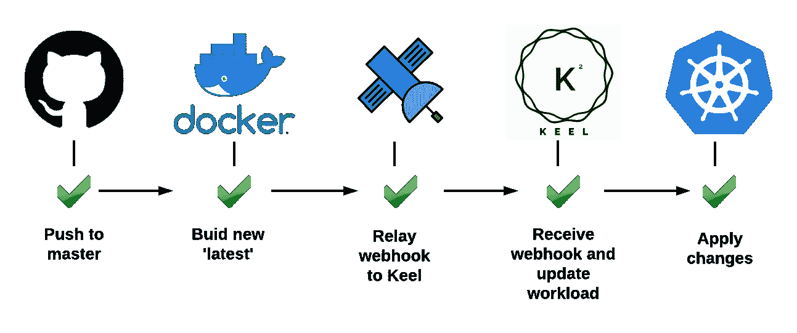
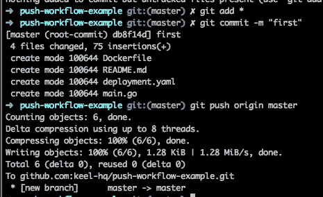
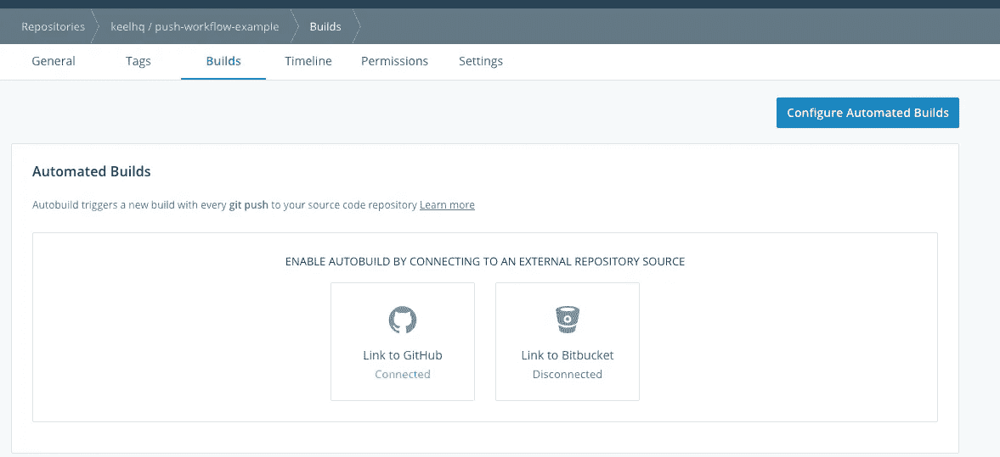
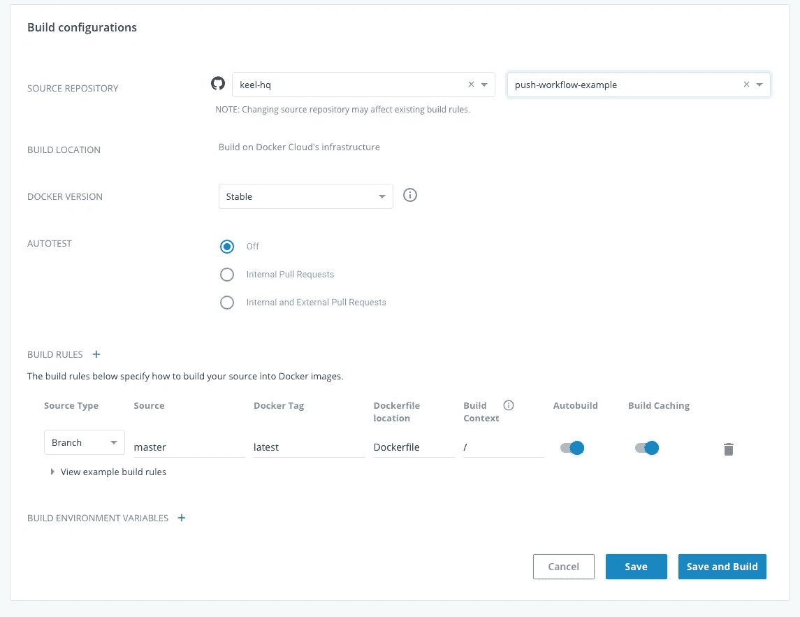
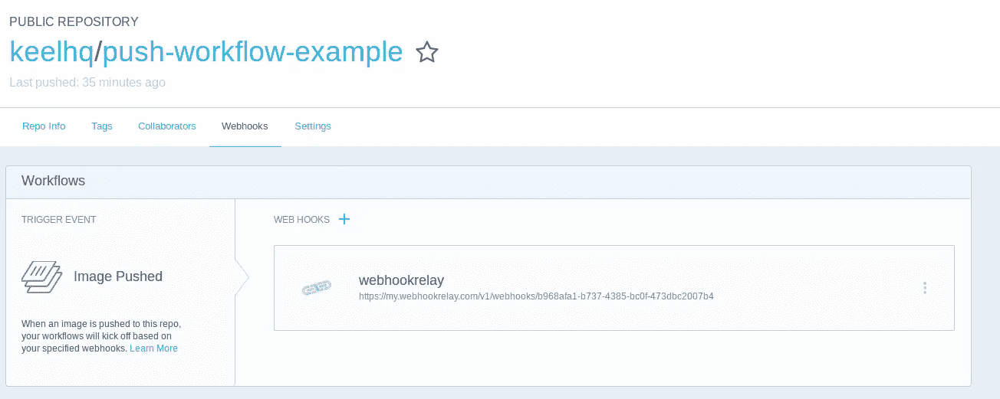
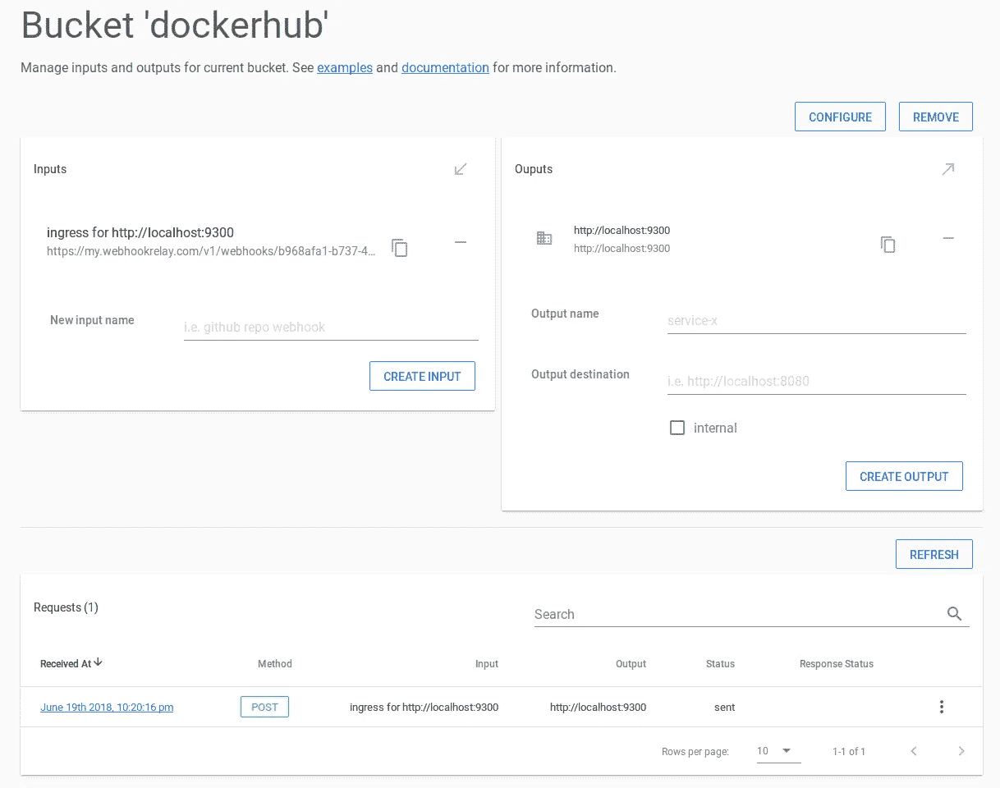

# 使用 Github 和 Keel 设置“推送部署”Kubernetes 工作流

> 原文：<https://itnext.io/setting-up-push-to-deploy-kubernetes-workflow-with-github-and-keel-43173d996587?source=collection_archive---------3----------------------->

在本教程中，我们将配置几个工具来实现 Git 推送上的 Kubernetes 自动更新。这个工作流程在为 Kubernetes 开发应用程序时非常有用。对于产品，我建议使用标记方法，标记发布将触发映像构建，而 Keel 更新策略将增加版本。



一旦工作流准备就绪，主分支的任何推送(或来自开发/功能分支的合并请求)都将更新您在 Kubernetes 中运行的应用程序。

在本教程中，我们将使用:

*   [Minikube](https://github.com/kubernetes/minikube#what-is-minikube) —我们在当地开发 Kubernetes 环境。Mac 用户可以在 Kubernetes 的支持下免费使用 Docker for Mac，效果很好！
*   GitHub——我们将在这里存储我们的代码
*   Docker hub——我们的 Docker 图像将在这里构建和存储
*   Webhook 中继——将公共 web hook 中继到我们内部的 Kubernetes 环境，这样我们就不必将 Keel 暴露给公共互联网

# TL；速度三角形定位法(dead reckoning)

1.  按下 GitHub 开始在 DockerHub 中自动构建
2.  当 DockerHub 完成构建时，通过 webhook 中继向 Keel 发送一个 Webhook
3.  Keel 会找到使用该映像的任何受影响的工作负载，并更新它们。

优点:

*   易于设置，尽管这个指南看起来很长，但它只是一个虚拟应用程序的许多截图和代码片段。
*   没有对任何云提供商工具的锁定(我使用 Google Cloud builder 而不是 DockerHub 自动构建，因为它更快)
*   轻量级基础设施——不需要运行像 Spinnaker 这样会让你的钱包化为灰烬的东西，Keel 使用大约 12-20MB 的 RAM，几乎没有 CPU。
*   一旦成立，将为您服务多年。我已经使用这个设置一年多了，通过它发布了大约 250 个版本，从来没有让你失望过。

# 设置 GitHub 存储库

首先，让我们建立我们的版本控制系统。让我们为我们的示例应用程序创建一个本地 repo，并将其推送到我们的 GitHub 存储库。

我们的示例应用非常非常简单:

提交您的代码并推送到远程:



# 配置 Webhook 中继转发

在这一步中，我们将配置 Webhook 中继来转发我们内部 Kubernetes 环境的 DockerHub webhooks。这在本地 Kubernetes 集群上开发时特别有用，因为从公共服务接收 webhooks 可能稍微复杂一些。

让我们准备配置:

```
$ relay forward -b dockerhub — no-agent [http://localhost:9300](http://localhost:9300)
Forwarding configuration created: 
https://my.webhookrelay.com/v1/webhooks/b968afa1-b737-4385-bc0f-473dbc2007b4 -> [http://localhost:9300](http://localhost:9300)
In order to start receiving webhooks — start an agent: ‘relay forward’
```

在下一步配置 DockerHub webhooks 时，我们将需要这个长 URL。

# 配置 DockerHub(代码库+ webhook)

现在，我们需要告诉 DockerHub 在每次 GitHub 推送到主分支时构建一个新的映像。首先，转到[https://cloud.docker.com](https://cloud.docker.com/)，然后转到`Repositories`并点击`Create`按钮。一旦你创建了资源库，将它链接到你的 GitHub 账户，然后点击`Configure Automated Builds`:



选择您的 GitHub 存储库并创建一个触发器，它将:

*   对`master`分支上的变化做出反应
*   将图像标记为`latest`

确保`autobuild`已打开，并点击“保存并构建”。你将准备好你的第一张照片。



此外，我们将需要通过 Webhook 中继设置 DockerHub webhooks 到 Keel。出于某种原因，这种配置在 https://cloud.docker.com 的[上不可用，我们必须去 https://hub.docker.com 的](https://cloud.docker.com/):



# 部署 Keel 和你的应用

首先，我们需要用 Webhook Relay sidecar 部署 Keel。这是一次性的事情，之后当您向 Kubernetes 环境添加更多应用程序时，您不需要重复这一步。

Webhook 中继守护程序需要身份验证详细信息才能连接。我们可以使用`relay` CLI 来配置并将 secret 插入到我们的 Kubernetes 环境中:

```
kubectl create namespace keel
```

现在，让我们创造一个秘密:

```
relay ingress secret --name webhookrelay-credentials --namespace keel
```

## 展开龙骨

现在，如果您的群集启用了 RBAC，请使用此模板(如果您使用的是 Minikube，则默认情况下它应该是启用的):

```
kubectl create -f [https://raw.githubusercontent.com/keel-hq/keel/master/deployment/deployment-rbac-whr-sidecar.yaml](https://raw.githubusercontent.com/keel-hq/keel/master/deployment/deployment-rbac-whr-sidecar.yaml)
```

如果集群中没有 RBAC，请使用:

```
kubectl create -f [https://raw.githubusercontent.com/keel-hq/keel/master/deployment/deployment-norbac-whr-sidecar.yaml](https://raw.githubusercontent.com/keel-hq/keel/master/deployment/deployment-norbac-whr-sidecar.yaml)
```

> *提示:可以随意在本地保存部署清单，并添加 Slack 或其他聊天提供者通知、批准等内容。为了简单起见，我们在本教程中省略了这些步骤。*

因此，当我们创建它时，Kubernetes 应该对现有的名称空间有所抱怨，但这是意料之中的:

```
$ kubectl create -f [https://raw.githubusercontent.com/keel-hq/keel/master/deployment/deployment-rbac-whr-sidecar.yaml](https://raw.githubusercontent.com/keel-hq/keel/master/deployment/deployment-rbac-whr-sidecar.yaml)
serviceaccount “keel” created
clusterrolebinding.rbac.authorization.k8s.io “keel-clusterrole-binding” created
clusterrole.rbac.authorization.k8s.io “keel-clusterrole” created
deployment.extensions “keel” created
Error from server (AlreadyExists): error when creating “https://raw.githubusercontent.com/keel-hq/keel/master/deployment/deployment-rbac-whr-sidecar.yaml": namespaces “keel” already exists
$ kubectl get pods -n keel
NAME READY STATUS RESTARTS AGE
keel-f8b5959cc-jrgcd 2/2 Running 0 8s
```

## 部署您的应用

现在，我们需要创建应用程序的部署文件:

将其另存为`deployment.yaml`并通过 kubectl 创建它:

```
kubectl create -f deployment.yaml
```

检查它是否正在运行:

```
$ kubectl get pods
NAME READY STATUS RESTARTS AGE
pushwf-8476855f97-nw4st 1/1 Running 0 1m
$ kubectl logs pushwf-8476855f97-nw4st
App is starting, version: v0
```

现在，将您的 Go 程序的版本字符串更新为`v1`:

提交和推送。一两分钟后(取决于 DockerHub 构建图像的速度),我们的应用程序应该会更新。因为它使用 webhooks，所以更新应该是即时的。

如果您访问 Webhook 中继`dockerhub` bucket 的页面，它应该显示中继的 webhook:



让我们检查一下我们的部署部署历史:

```
$ kubectl rollout history deployment/pushwf
deployments “pushwf”
REVISION CHANGE-CAUSE
1 <none>
2 keel automated update, version latest -> latest
```

和日志，只是为了确保我们的应用程序运行的是最新的代码:

```
$ kubectl get pods
NAME READY STATUS RESTARTS AGE
pushwf-74c574f9cf-l6lq2 1/1 Running 0 4m
$ kubectl logs pushwf-74c574f9cf-l6lq2
App is starting, version: v1
```

# 结论

虽然设置 Keel 和 Webhook 中继会占用您宝贵的几分钟时间，但它会节省大量的时间。您不仅可以根据策略获得应用程序的即时更新，还可以确保不会错误地更新错误的群集或环境。当然，您甚至不需要使用`kubectl`来更新您的应用程序。

一旦在集群中设置了 Keel，就可以管理许多(所有)应用程序。当您将下一个应用程序添加到集群时，只需指定策略并将 DockerHub webhook 指向同一个 webhook 中继端点。Keel 会根据 webhook 有效载荷筛选出相关部署，并进行更新。

如果你有任何问题或者发现本教程的某些部分不正确，请在 Keel 的资源库[这里](https://github.com/keel-hq/keel/issues)提出问题

*最初发表于* [*keel.sh*](https://keel.sh/v1/examples/push-to-deploy.html) *。*