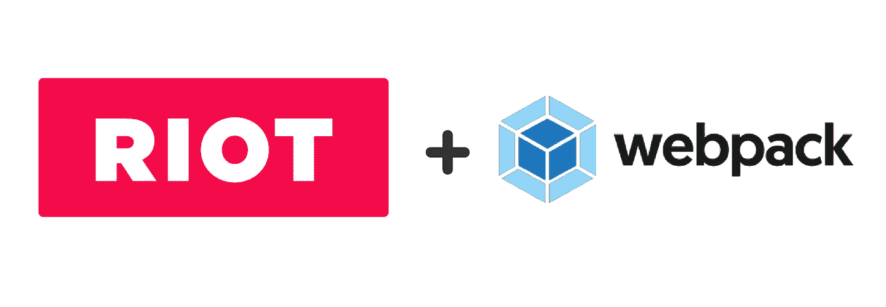
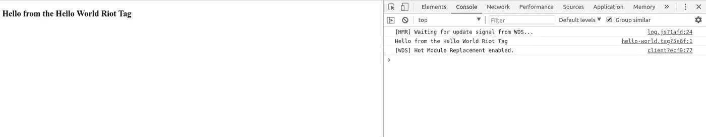

# 使用 Webpack 设置 RiotJS 项目

> 原文：<https://itnext.io/setting-up-riotjs-project-with-webpack-854df3f3f093?source=collection_archive---------8----------------------->



> [点击这里在 LinkedIn 上分享这篇文章](https://www.linkedin.com/cws/share?url=https%3A%2F%2Fitnext.io%2Fsetting-up-riotjs-project-with-webpack-854df3f3f093)

嘿，伙计们，很久以前我就想发这篇文章了，但是很忙，没能做到。所以对于那些不知道什么是骚乱的人来说，

> Riot 是面向所有人的 Web 组件。想想 React +聚合物，但没有膨胀。它使用起来很直观，而且几乎没有重量。今天仍然有效。没有重新发明轮子，而是取其精华，使最简单的工具成为可能。[ [来源](http://riotjs.com/)

所以我想，你们中的大多数人已经了解了暴乱的目的。它用极简、快速和易于理解的 API 交付微小的可重用组件。

我们大多数人都希望通过使用任何**模块捆绑器**和**热重新加载**功能来节省时间，这就是 **Webpack** 发挥作用的地方。我们将在这里实现，如何一起设置`RiotJS`项目和`Webpack`。

> TL；DR:你可以在这里查看源代码:[ [源代码](https://github.com/shashank7200/riot-webpack-starter)

# 🔰设置您的 NPM 项目

转到项目目录，打开您的**终端**，键入以下命令:

```
# this will create a directory named riot-plus-webpack
mkdir riot-plus-webpack# this will change your directory to your newly created directory
cd riot-plus-webpack# this will initialize your NPM project with default rules
npm init -y
```

我们现在已经成功地创建了一个 NPM 项目，是时候为我们的项目添加`**webpack**`配置了。

# 👷设置我们的 Webpack 配置

添加 Webpack 将会为我们节省大量时间，因为我们每次都需要修改代码。因此，将 webpack 添加到我们的项目中解决的问题是:

*   将所有的暴动`tags`编译为原生`javascript`代码。
*   模块热重装等等，但这是节省开发人员大量时间的两个关键点。

> 在设置这个配置之前，只需添加一些`npm`包，我们将需要中间的:

```
# this will add the packages we will need
npm i -D babel-core babel-loader babel-preset-es2015-riot riot-hot-reload riot-tag-loader webpack
webpack-cli webpack-dev-servernpm i -S riot
```

最终的`package.json`文件将类似于:

```
{
  "name": "riot-plus-webpack",
  "version": "1.0.0",
  "description": "Starter setup for a riotjs project with webpack",
  "main": "index.js",
  "scripts": {
    "start": "./node_modules/.bin/webpack-dev-server --inline --watch --hot --colors -d --port 3000"
  },
  "keywords": [
    "riotjs",
    "webpack"
  ],
  "author": "Shashank Shekhar [shashank7200.github.io]",
  "license": "MIT",
  "devDependencies": {
    "babel-core": "^6.26.0",
    "babel-loader": "^7.1.3",
    "babel-preset-es2015-riot": "^1.1.0",
    "riot-hot-reload": "^1.0.0",
    "riot-tag-loader": "^2.0.2",
    "webpack": "^4.1.0",
    "webpack-cli": "^2.0.10",
    "webpack-dev-server": "^3.1.0"
  },
  "dependencies": {
    "riot": "^3.9.0"
  }
}
```

*要设置 webpack* ***配置*** *，新建一个文件:*

```
# this will create a webpack config file
touch webpack.config.js
```

**复制**和**粘贴**如下所示的代码到该文件中:

```
// webpack.config.jsconst path = require('path');
const webpack = require('webpack');module.exports = {
  entry: './src/index.js',
  output: {
    path: path.resolve(__dirname, 'public'),
    publicPath: '/public/',
    filename: 'main.js'
  },
  devtool: 'inline-source-map',
  module: {
    rules: [
      {
        test: /\.tag$/,
        exclude: /node_modules/,
        loader: 'riot-tag-loader',
        query: {
          type: 'es6', // transpile the riot tags using babel
          hot: true
        }
      },
      {
        test: /\.js$/,
        exclude: /node_modules/,
        loader: 'babel-loader'
      }
    ]
  }
}
```

这将使用该项目初始化 **webpack** 配置。你已经注意到，我们在这里使用了`**babel-loader**`，所以我们需要定义一个`babel`配置文件，这样，webpack 就可以告诉 babel 使用该配置文件来获得预置，它将需要把`**tag**`文件编译成`**javascript**`代码。

```
touch .babelrc
```

**复制** & **粘贴**下面的代码到那个文件中:

```
{
  "presets": [ "es2015-riot" ]
}
```

# 🚦设置项目目录

现在我们已经为 npm 项目准备好了 webpack 配置，用于我们的 **riot** 项目，我们将设置我们的项目**结构**以拥有一些**初始**文件。我们的项目目录将类似于:

```
|____webpack.config.js
|____package-lock.json
|____src
| |____index.js
| |____tags
| | |____hello-world.tag
|____.babelrc
|____public
|____index.html
|____package.json
```

按照这个项目结构，如果文件夹和文件不存在，您需要创建它们。如果你没有得到它，不要担心，一旦完成，你会得到它。

首先，我们需要创建一个`**hello-world.tag**`文件来保存我们的 riot 标签代码。

因此创建一个 riot 标签`**src/tags/hello-world.tag**`，并放入如下所示的代码，以显示程序员传统的 hello world 输出。

```
<!--  src/tags/hello-world.tag  -->
<hello-world>
  <h3>Hello from the Hello World Riot Tag</h3><script>
    console.log("Hello from the Hello World Riot Tag");
  </script>
</hello-world>
```

在`**index.html**`中，放入如下所示的源代码:

```
<!DOCTYPE html>
<html lang="en">
<head>
  <meta charset="UTF-8">
  <meta name="viewport" content="width=device-width, initial-scale=1.0">
  <meta http-equiv="X-UA-Compatible" content="ie=edge">
  <title>Riot and Wepack Setup</title>
</head>
<body>
  <!-- Your tags goes here -->
<hello-world></hello-world>
  <!-- This script will contain all the compiled tags -->
  <script src="public/main.js" charset="utf-8"></script>
</body>
</html>
```

在`**src/index.js**`中放入这段源代码:

```
import riot from 'riot';
import 'riot-hot-reload';
import './tags/hello-world.tag';riot.mount('hello-world');
```

如果你遵循了这篇文章，那么你的 RiotJS 和 Webpack 的设置就差不多完成了。现在是检验它的时候了。

# 👔试映

[ [源代码](https://github.com/shashank7200/riot-webpack-starter) ]

要预览应用程序，只需在项目目录中打开您的`terminal`,并键入以下命令-

`**npm Start**`

如果一切顺利，应用程序将在`**localhost:3000**`启动(您的端口可能不同，请检查您的控制台日志)。

现在您将能够看到您的`**RiotJS**`和`**Webpack**`设置的预览。这将类似于下图。



这是 *RiotJS* 和 *Webpack* 的一个非常**基本的**设置，如果你愿意，你可以添加更多。这是为了你完成这篇文章，你真棒！


#你的摇滚

🔔这篇文章**最初** **发表**在我的博客[上用 Webpack](https://shashank7200.github.io/blog/setting-up-riotjs-with-webpack/) 建立 RiotJS 项目。

> 💚*如果你喜欢这篇文章，请****share it****如果你对 RiotJS、Webpack 和这个设置有任何疑问，请* ***评论*** *出来。*