# 使用 Azure DevOps 设置 Scalr 添加 Azure 凭据

> 原文：<https://itnext.io/setting-up-scalr-with-azure-devops-add-azure-credentials-979ddc17d90d?source=collection_archive---------3----------------------->

要开始在 Azure DevOps 中使用 Scalr，需要经历 3 个初始阶段。在这一系列 3 篇关于使用 Scalr 和 Azure DevOps 的文章中，我将一步一步地介绍每个阶段。

这是本系列的第二篇文章，主要关注阶段 2 — **如何添加 Azure 凭证**并将它们链接到一个环境。

**如果你错过了该系列的第一篇文章，** [**点击这里查看——挑选工作流程。**](/setting-up-scalr-with-azure-devops-picking-a-workflow-d91124a4748c)

最后，本系列的第 3 篇文章将重点介绍如何使用 PR automation 和通过将 CLI 插入 Azure DevOps 来执行 Terraform 代码和创建工作空间。还有第三种方法可以使用模块注册表来创建工作区，但是这仍然使用 VCS 连接。

## 提供商凭据

为了向我们的云提供商(Microsoft Azure)进行认证，我们需要向 Scalr 提供一些凭证。凭证可以存储在 Scalr 中的一个中心位置，使您能够在工作区之间共享它们。它们也可以跨环境共享，但是对于每个环境，每个提供者类型只能有一组凭证(我被告知这个限制将很快被取消，同一个提供者的多个凭证将能够被添加到每个环境中。)凭证被加密并被安全地存储。凭证作为 shell 变量传递给环境中的所有工作区。通过这样做，团队可以限制谁可以真正访问凭证，并且所有新的工作区将自动继承它们，使得凭证的管理变得非常容易。

在这篇文章中，我们还将展示如何在 Azure 中创建必要的凭据作为 Azure Active Directory 应用程序注册，并为其分配适当的角色。

由于我们将使用 Terraform 和 Scalr 将基础设施部署到 Azure，在本系列的第三篇也是最后一篇文章中，我们将展示当在工作区中执行 Terraform 运行时，提供者凭证如何作为 shell 变量自动传递给运行。

## 向 Scalr 添加凭证

1.  登录 Scalr，点击左上角的图标。在下拉菜单中选择“管理账户”。

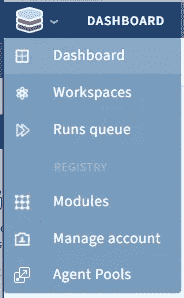

2.如果这是您要添加的第一组凭据，您将看到“入门”屏幕和“添加云凭据”按钮。

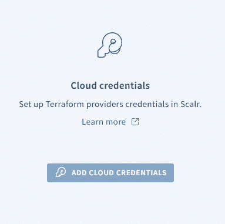

或者，如果您已经添加了凭据，请再次点击左上方的图标，并从下拉列表中选择“提供商凭据”。

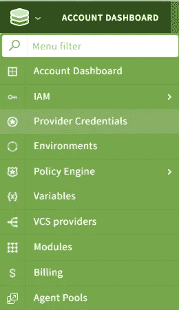

3.选择“添加凭据”，然后从下拉菜单中选择 Azure 提供商。注意，如果您想使用一个在 Scalr 中没有选项的提供者，您可以使用 shell 变量选项来实现类似的功能。

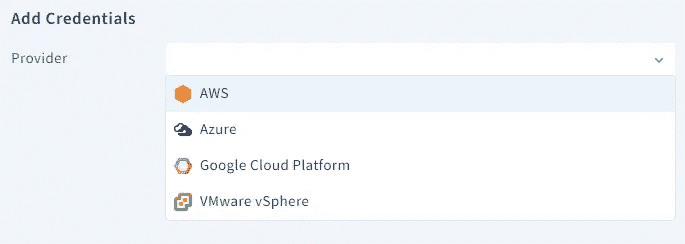

4.此时，跳转到 Azure 门户网站并登录你的账户。点击 Azure Active Directory →应用注册。

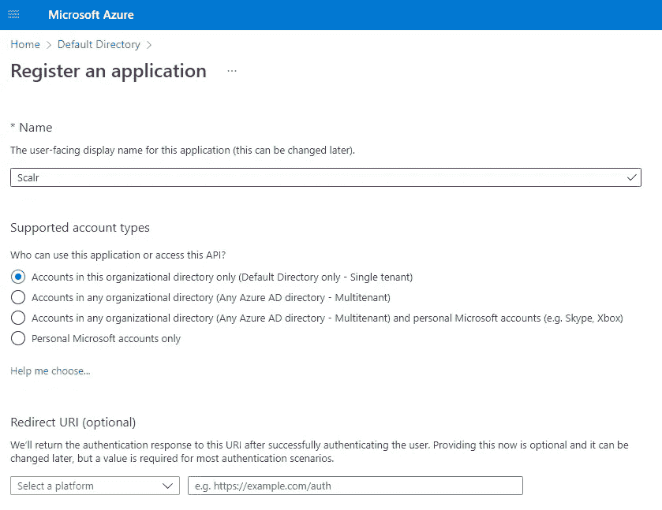

记者登记。在下一个屏幕上，复制要点部分中显示的详细信息。

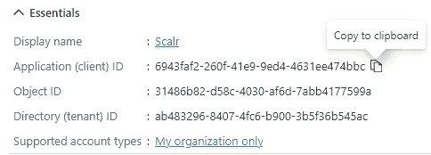

接下来点击秘密->新客户秘密

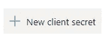

输入描述和到期日期。

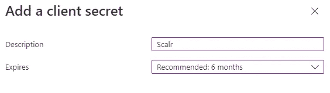

按下添加按钮，然后复制机密值。你只能看一次。

接下来，我们需要向我们希望与 Scalr 一起使用的 Azure 订阅授予应用程序注册权限。浏览到您的订阅，并点击访问控制(IAM)。

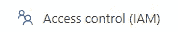

单击角色分配，然后添加->添加角色分配。

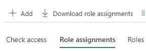

在这里，我选择 contributor(对订阅有完全访问权限，但不能更改权限)，然后单击 next。

选择“选择成员”,然后在搜索栏中输入您之前设置的应用注册名称。

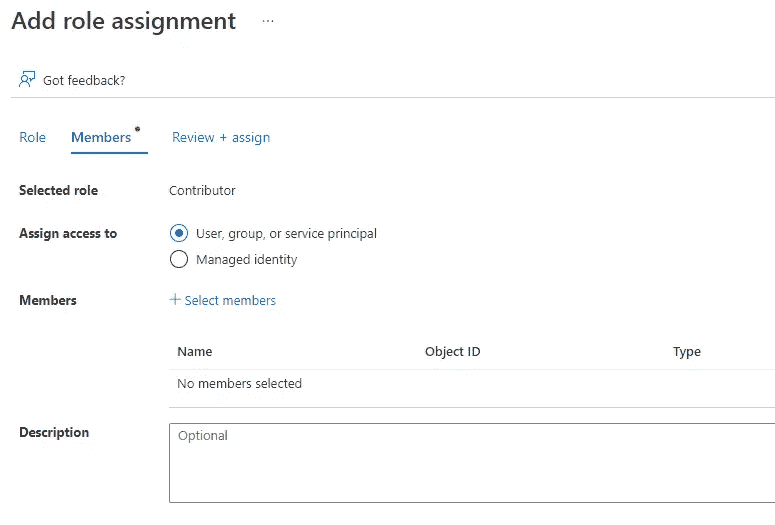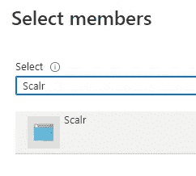

按选择，然后查看和分配。

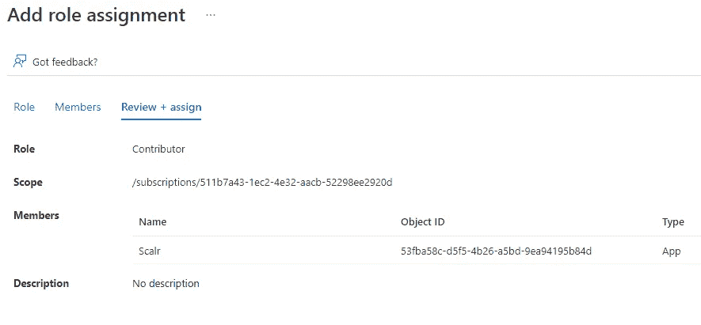

5.回到 Scalr，添加您从应用程序注册中复制的详细信息:

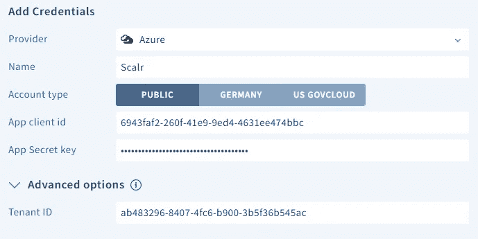

按保存。如果连接成功，您的订阅将显示在下拉订阅菜单中。选择它并按保存。

6.通过单击左上角的 Scalr 图标，然后单击 environments，将提供者凭证链接到所需的环境。

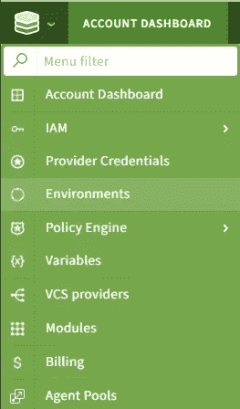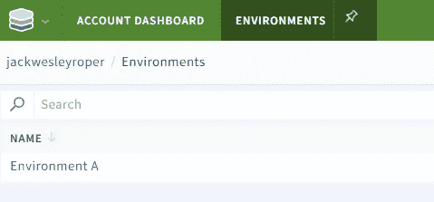

选择环境，然后选择提供者凭据选项卡。

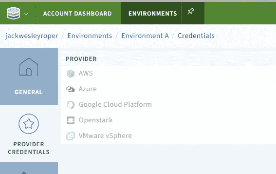

在 Azure provider 的对面，点击 Link，然后选择我们之前创建的提供者凭证旁边的复选框。

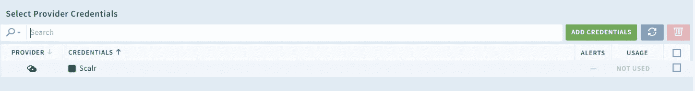

最后，按保存！

## 摘要

在这篇文章中，我们展示了如何在 Azure 中创建一个应用注册，在订阅中为它分配一个角色，并成功地将其作为提供者凭证添加到 Scalr 中。然后，我们将提供者凭证链接到 Scalr 环境。

在[之前的帖子中，我们将 Scalr 链接到我们的 Azure DevOps VCS 提供商](/setting-up-scalr-with-azure-devops-picking-a-workflow-d91124a4748c)。

在下一篇文章中，我们将执行一些 Terraform 代码来将基础设施部署到 Azure！

干杯！🍻

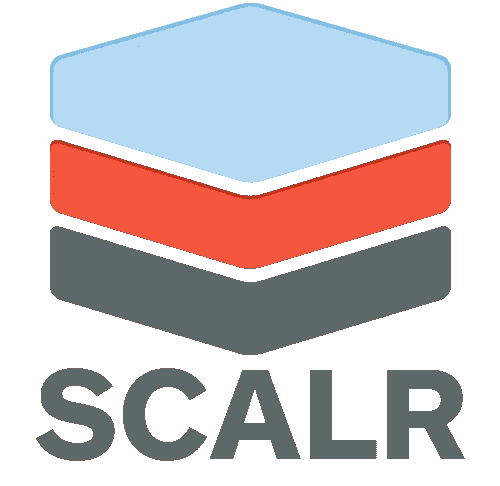 [## Jack Roper 正在 Azure、Azure DevOps、Terraform、Kubernetes 和 Cloud tech 上写博客！

### 希望我的博客能帮到你，你会喜欢它的内容！我真的很喜欢写技术内容和分享…

www.buymeacoffee.com](https://www.buymeacoffee.com/jackwesleyroper)