# 使用 Azure DevOps 设置 Scalr 如何执行 Terraform 代码并创建工作空间

> 原文：<https://itnext.io/setting-up-scalr-with-azure-devops-how-to-execute-your-terraform-code-and-create-a-workspace-6b54fa686fd3?source=collection_archive---------4----------------------->

要开始在 Azure DevOps 中使用 Scalr，需要经历 3 个初始阶段。在这一系列 3 篇关于使用 Scalr 和 Azure DevOps 的文章中，我将一步一步地介绍每个阶段。

这是该系列的第三篇也是最后一篇文章，将重点关注如何使用 PR automation 和通过将 CLI 插入 Azure DevOps 来执行 Terraform 代码和创建工作空间。注意，还有第三种方法可以使用模块注册表来创建工作区，但是这仍然使用 VCS 连接。

**如果你错过了这个系列的第一篇文章，** [**在这里查看一下**](/setting-up-scalr-with-azure-devops-picking-a-workflow-d91124a4748c)**——挑选一个工作流程。**

**和这里的** [**第二篇**](/setting-up-scalr-with-azure-devops-add-azure-credentials-979ddc17d90d) **—如何添加 Azure 凭证并链接到环境。**

# 执行 Terraform 代码并创建工作空间

## 现有环境

在前两篇文章中，我们将 Azure DevOps 实例和 Azure 订阅链接到我们的 Scalr 环境。让我们探索一下当前的环境设置！

选择提供商凭据将显示我们链接的 Azure 帐户。

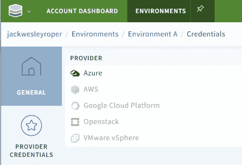

选择“VCS ”,我们看到我们的 Azure DevOps 项目已链接。

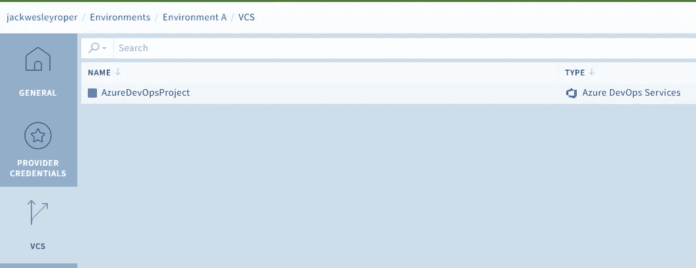

选择变量将显示从之前设置的云凭据继承的变量。

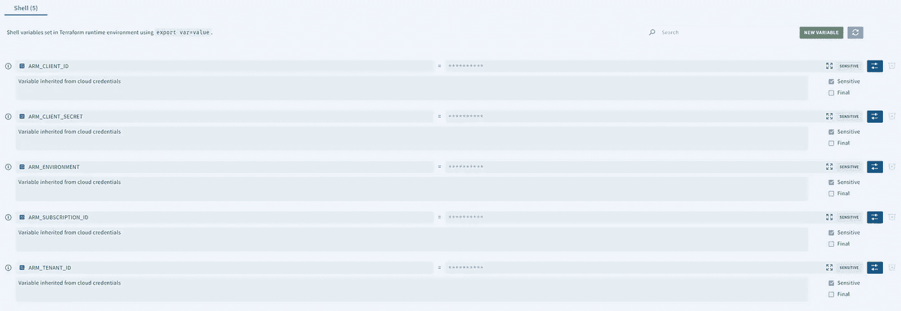

## Terraform 代码示例

我的 Github 页面上包含的 Terraform 代码包含了向 Azure Active Directory 添加一些组的配置文件。如果你想继续学习，可以在这里下载！欢迎在 GitHub 上关注我！

 [## GitHub-jackwesleyroper/az-ad-组-模块

### 此时您不能执行该操作。您已使用另一个标签页或窗口登录。您已在另一个选项卡中注销，或者…

github.com](https://github.com/jackwesleyroper/az-ad-group-module) 

## 创建 VCS 集成工作区

下一步是创建一个**工作空间**。工作区是存储和管理与 Terraform 托管资源相关的所有对象的地方。

1.  在环境中，选择“创建工作区”按钮。

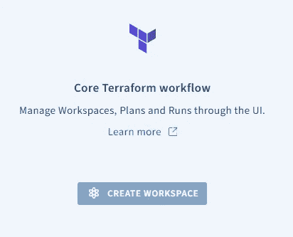

2.我们将创建一个链接到我们的 Azure DevOps VCS 提供商的工作区。从下拉列表中选择它，选择保存代码的适当回购和分支机构。您可以在此指定 Terraform 版本，并在 terraform 计划运行成功时自动应用更改(如果需要)。

启用 VCS 驱动的试运行使 Scalr 能够在检测到针对分支打开的拉请求时自动开始试运行。

Terraform 目录设置了 Terraform 实际运行和执行命令的位置。它是一个相对路径，必须是存储库顶层的子目录，或者是子目录(如果指定)的子目录。

也可以只在某些子目录上触发运行，要启用此选项，需要设置工作目录。

最后，自定义挂钩选项可用于在 Terraform 工作流程的不同阶段调用自定义操作。这些可以在计划阶段之前或之后设置，也可以在应用阶段之前或之后设置。

例如，定制脚本或 API 调用可以在应用阶段之后执行，或者`terraform validate`命令可以在计划阶段之前执行。我将把`terraform fmt --check`命令添加到我的工作流中，以验证我的代码的格式是一致的。甚至可以使用`wget`在这里下载脚本，或者使用`curl`运行测试。相当酷！

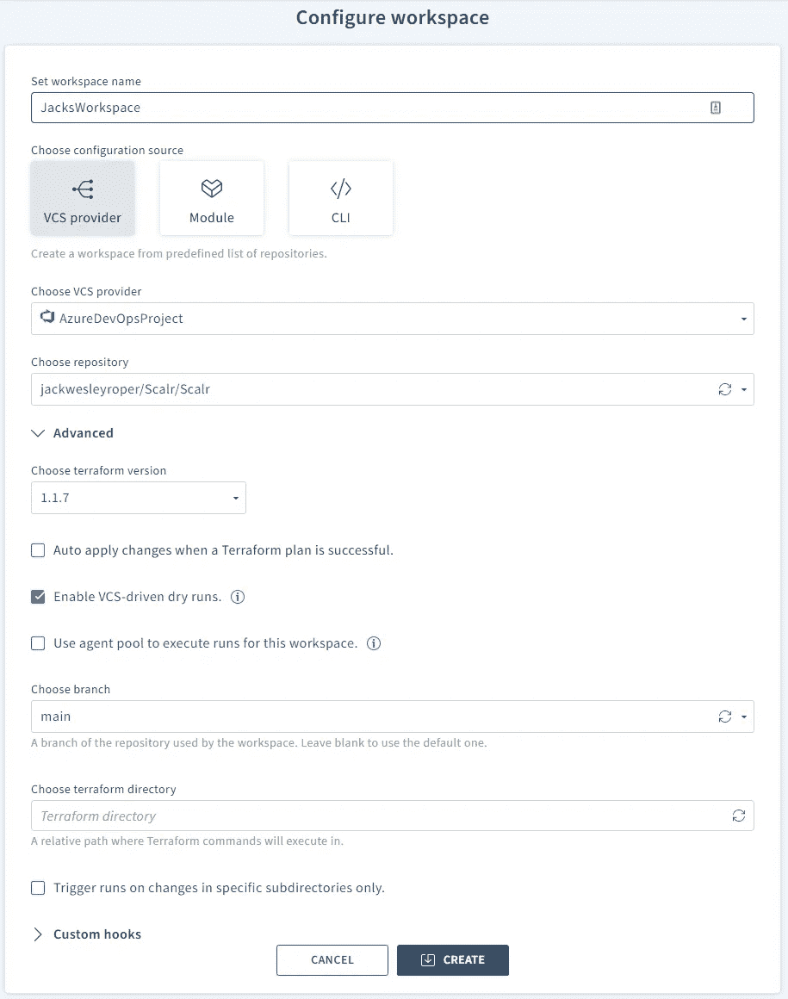

3.填写完所有选项后，按创建。

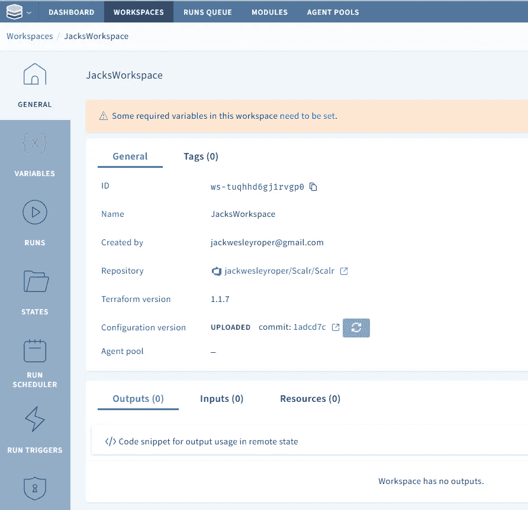

请注意，我们现在需要设置一些变量。Scalr 检测 Terraform 代码中哪些变量是需要设置的(那些没有值的)，并将自动创建它们。变量可以在 Terraform 代码或 Scalr UI 中设置。对于我的例子，我需要填写 ad_group_names 变量。

> 如果本地工作空间包含任何`*.auto.tfvars`文件，这些文件将提供 Terraform 将自动使用的默认变量值。如果`*.auto.tfvars`文件中的变量与工作空间中指定的变量同名，将使用预定义的工作空间值。对于地图变量，`*.auto.tfvars`中的值与工作空间中相同命名变量的值合并。

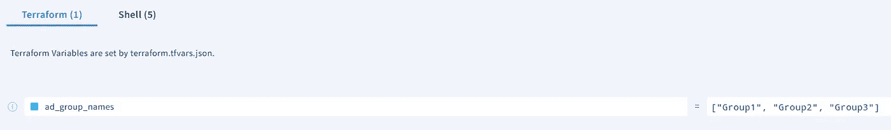

如果您的 Terraform 配置需要使用 Shell 变量，也可以在这里添加。请注意，我们之前用来为 Azure 订阅设置云凭据的变量是自动继承的。

> 如果 Terraform 配置使用外壳变量(`export var=value`)，例如用于凭证或使用`TF_VAR_{variable_name}={value}` (-parallelism，-var-file 等)设置 Terraform 输入变量的值。
> 
> Shell 变量可以在 Scalr 中的所有级别设置，并由较低级别继承。对多个工作区或环境中需要的 shell 变量使用环境或帐户级别。将工作空间级别用于特定于单个 Terraform 配置的外壳变量。
> 
> 还可以使用 Scalr provider 从一个工作区中提取输出，并将其作为环境或 account shell 变量发布，以便其他所有工作区都能轻松使用。

## 执行地形代码

现在一切就绪，我们可以继续运行代码了。

导航至运行->队列运行，输入运行原因，然后点击队列运行。

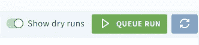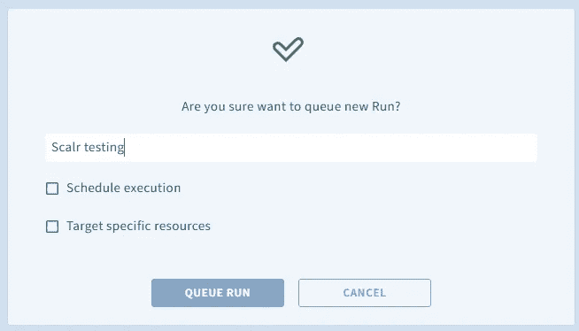

我的第一次跑步出错了！我之前设置的自定义挂钩检测到我的代码格式不正确，并以错误代码 3 退出。如果配置被格式化，我使用的检查选项以代码 0 退出。

> -check 检查输入是否格式化。如果所有的
> 输入被正确格式化，退出状态将为 0，否则为非零。

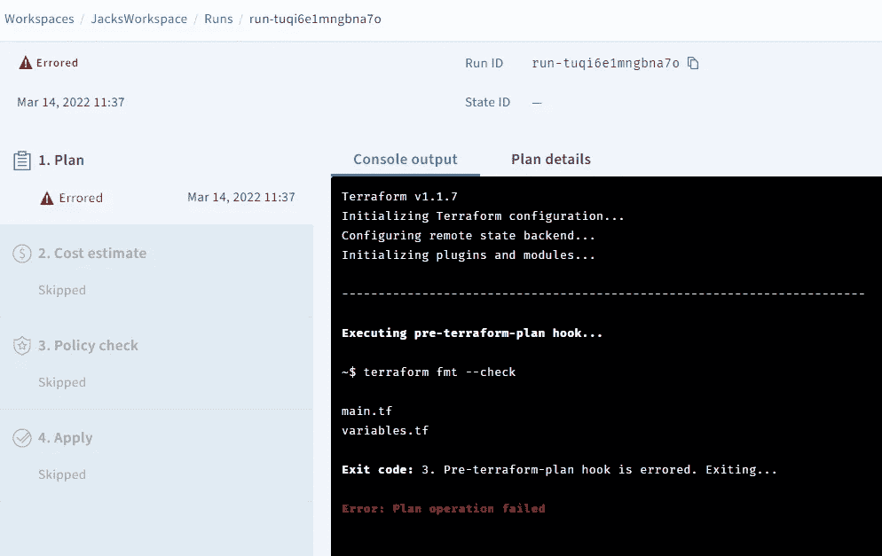

在 Azure DevOps 上，我还注意到我的 repo 上有一条错误消息:

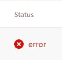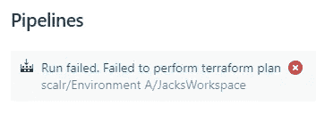

我在我的代码上运行了`terraform fmt`并执行了运行。

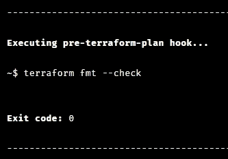

运行确认了我的 3 个组将在 AzureAD 中创建，并且配置格式正确。在 Azure DevOps，我可以看到正在进行的计划:

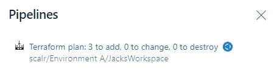

显示“需要确认”警告，在运行屏幕的底部，我点击“批准”

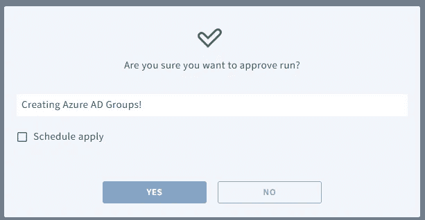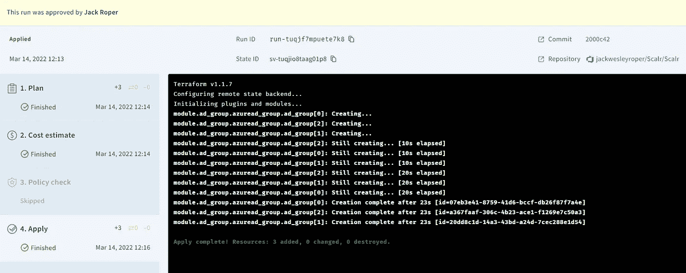

请注意，存储库链接和提交链接会将您带到 Azure DevOps 中的适当位置。

工作区经历以下阶段:

> **计划**，允许用户通过标准的控制台输出或详细的计划视图查看资源的计划创建、更新或销毁。详细计划将提醒用户破坏性的变化，并在有许多资源受到影响时使搜索计划变得更容易。它也是检查谁批准了申请以及与批准相关的备注的部分。
> 
> **成本估计**，它将显示正在创建的资源的估计成本。该信息可用于将策略写入[检查成本](https://github.com/Scalr/sample-tf-opa-policies/blob/master/cost/limit_monthly_cost.rego)
> 
> **策略检查**，用于对照开放策略代理策略检查 Terraform plan JSON 输出。这一步可以用来执行你的公司标准。
> 
> **应用**，它将根据 Terraform 配置文件实际创建、更新或销毁资源。

注意，在我的例子中，我创建的 Azure 广告组不会产生任何成本，所以 Scalr 只是报告说它没有检测到任何资源。此外，我还没有定义任何策略，因此跳过了这一阶段。

## 创建 CLI 驱动的工作区

考虑到我在 Azure DevOps 中已经有了一个工作流设置，它使用了我想与 Scalr 一起使用的 Terraform CLI。Scalr 将在 Scalr 后端的容器中执行运行，但是日志和输出将被发送回控制台。

在第 1 篇文章中，我们展示了如何使用本地 Terraform CLI 获得一个 API 令牌来利用 Scalr 作为远程支持。这是交互完成的。当使用 Azure DevOps Pipeline 时，这是一个自动化的过程，因此登录阶段需要自动化，而不是交互式的。

1.  生成一个 API 令牌。如果您没有保存第一篇文章中生成的文件，那么继续从 Scalr UI 生成一个新的文件。

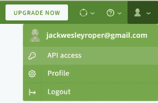

2.创建新的工作区。单击新建工作区，然后选择 CLI。配置所需选项，然后按创建。

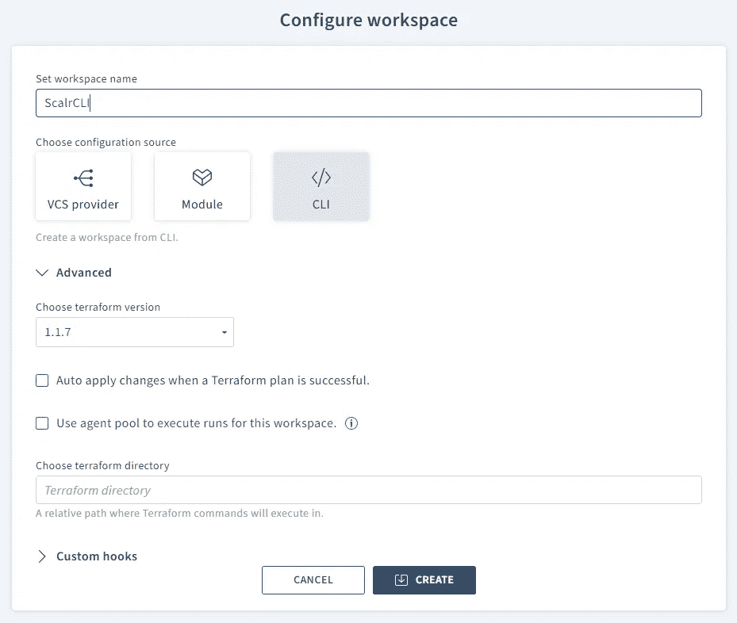

3.单击“基本后端配置”。

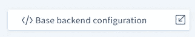

这将显示 Terraform 配置使用 Scalr 作为远程后端所需的配置。更新配置文件，将 Scalr 设置为远程后端。

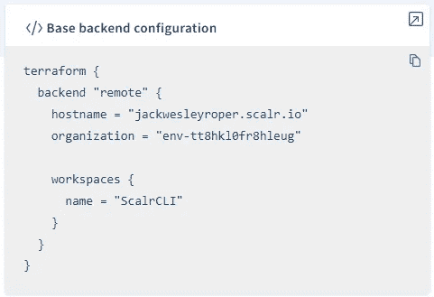

4.接下来，为了连接到 Scalr，我们需要提供 API 令牌。根据[平台文档](https://www.terraform.io/cli/config/config-file#credentials-1)，这必须是用户令牌或团队令牌，不能是组织令牌。

在 Azure DevOps 中，在管道->库->添加一个新的变量组。

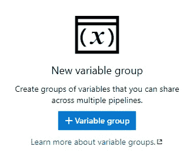

将令牌作为秘密值添加，名称为 scalr-api-token。

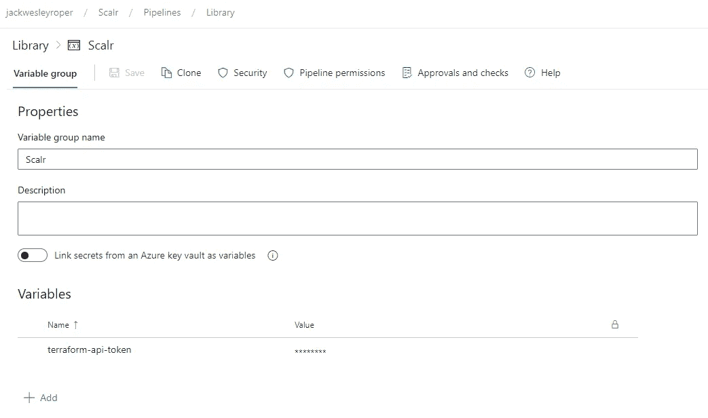

5.在管道 YAML 文件的开头添加一个步骤，用于生成 CLI 配置文件。可以使用`TF_CLI_CONFIG_FILE`环境变量指定文件的位置。这将创建一个名为`terraformrc`的文件，其中包含 API 令牌。这正是使用 CLI 与 Scalr 交互认证时发生的情况，这里这个过程是自动的。

一旦通过认证，管道继续运行`terraform init`、`terraform plan`和`terraform apply.`

请注意，在使用远程后端时，当前不支持“运行”变量(即，您不能使用-var= <variable>或-var-file= <file>选项。如果您指定这些，将会收到以下错误:</file></variable>

> “远程”后端此时不支持设置运行变量。目前，将变量传递到远程后端的唯一方法是创建一个“*.auto.tfvars”变量文件。当工作空间配置为使用 Terraform v0.10.0 或更高版本时，该文件将由“远程”后端自动加载。

在执行过程中，您将看到管道贯穿每个阶段，另外还可以在应用阶段结束时为您提供成本估算。

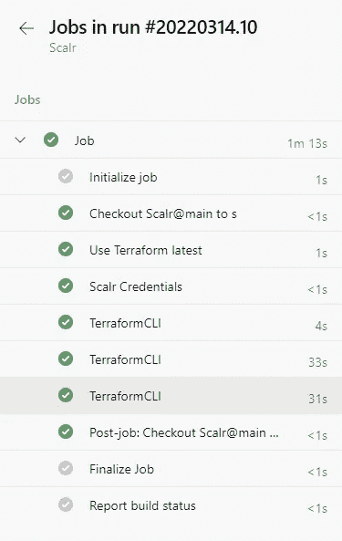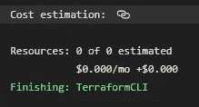

## 摘要

在这一系列的最后一篇文章中，我们展示了如何创建一个工作场所，包括 VCS 集成的和 CLI 驱动的，并执行了我们的 Terraform 代码。我们使用 Azure DevOps 管道来自动化 CLI 驱动的工作区上的工作流，使用 Scalr 作为远程后端。

请注意，工作区和变量可以使用 Scalr Terraform 提供程序来创建！

干杯！🍻

 [## Jack Roper 正在 Azure、Azure DevOps、Terraform、Kubernetes 和 Cloud tech 上写博客！

### 希望我的博客能帮到你，你会喜欢它的内容！我真的很喜欢写技术内容和分享…

www.buymeacoffee.com](https://www.buymeacoffee.com/jackwesleyroper)