# 使用 Azure DevOps 设置 Scalr 选择工作流

> 原文：<https://itnext.io/setting-up-scalr-with-azure-devops-picking-a-workflow-d91124a4748c?source=collection_archive---------3----------------------->

要开始在 Azure DevOps 中使用 Scalr，需要经历 3 个初始阶段。在这一系列 3 篇关于使用 Scalr 和 Azure DevOps 的文章中，我将一步一步地介绍每个阶段。

本系列的第一篇文章将关注第一阶段— **选择工作流。**

[系列文章第二篇](/setting-up-scalr-with-azure-devops-add-azure-credentials-979ddc17d90d)将描述 [**如何添加 Azure 凭证**](/setting-up-scalr-with-azure-devops-add-azure-credentials-979ddc17d90d) 并将它们链接到一个环境。

最后，[系列文章 3](/setting-up-scalr-with-azure-devops-how-to-execute-your-terraform-code-and-create-a-workspace-6b54fa686fd3) 将重点关注 [**如何执行您的 Terraform 代码并创建一个工作区**](/setting-up-scalr-with-azure-devops-how-to-execute-your-terraform-code-and-create-a-workspace-6b54fa686fd3) **，**两者都使用 PR 自动化，并通过将 CLI 插入 Azure DevOps。还有第三种方法可以使用模块注册表来创建工作区，但是这仍然使用 VCS 连接。

我们走吧！

## Scalr 是什么？

Scalr 是 Terraform Automation and Collaboration(TACO)软件，支持拉请求自动化、原生 Terraform CLI 或模块驱动的工作流。Scalr 通过其分层模型帮助各种规模的组织进行扩展，该模型通过 OPA、操作视图和私有模块注册表集中管理操作(如 RBAC)、策略控制，从而实现 Terraform 操作的受控分散化，允许开发人员在环境中独立执行 Terraform 工作流。

同样来自[https://docs.scalr.com/en/latest/introduction.html](https://docs.scalr.com/en/latest/introduction.html):

> Scalr 是 Terraform 的远程操作后端。用基本术语来说，这意味着什么？它执行 Terraform 操作，并在 Scalr 中存储状态，而不管工作流是什么，这使得跨组织的协作变得容易。这意味着您可以轻松地将现有的 GitOps 或原生的基于 Terraform CLI 的工作流加载到 Scalr 中，只需对您的实际代码进行很少甚至没有修改。

## 入门指南

根据您的工作流程，有两种方法可以开始使用 Scalr:

1.  添加版本控制系统(VCS)提供者，在本例中是 Azure DevOps。
2.  在 Azure DevOps 管道中使用 Terraform CLI。

## 使用 Azure DevOps 向 Scalr 认证

首先，我们需要在 Azure DevOps 中选择您想要与 Scalr 链接的项目。我做了一个测试:

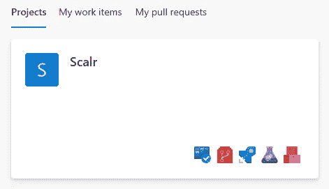

在我的项目中，我有一个名为 Scalr 的 repo，其中包含一些基本的 terraform 文件。应用时，该配置将创建给定数量的 Azure AD 组。

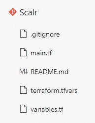

## main.tf

## 变量. tf

## terraform.tfvars

## 使用 web 界面设置 Azure DevOps 集成

Scalr 可以与几个 **VCS 提供商**集成，以自动化您的 GitOps 工作流。让我们一步一步地通过我们的 Azure DevOps repo 设置它！

当您第一次登录您的 Scalr 帐户时，您会看到以下信息:

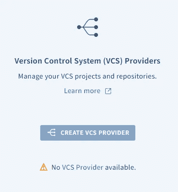

点击“创建 VCS 提供商”,然后点击“Azure ”,会出现以下选项:

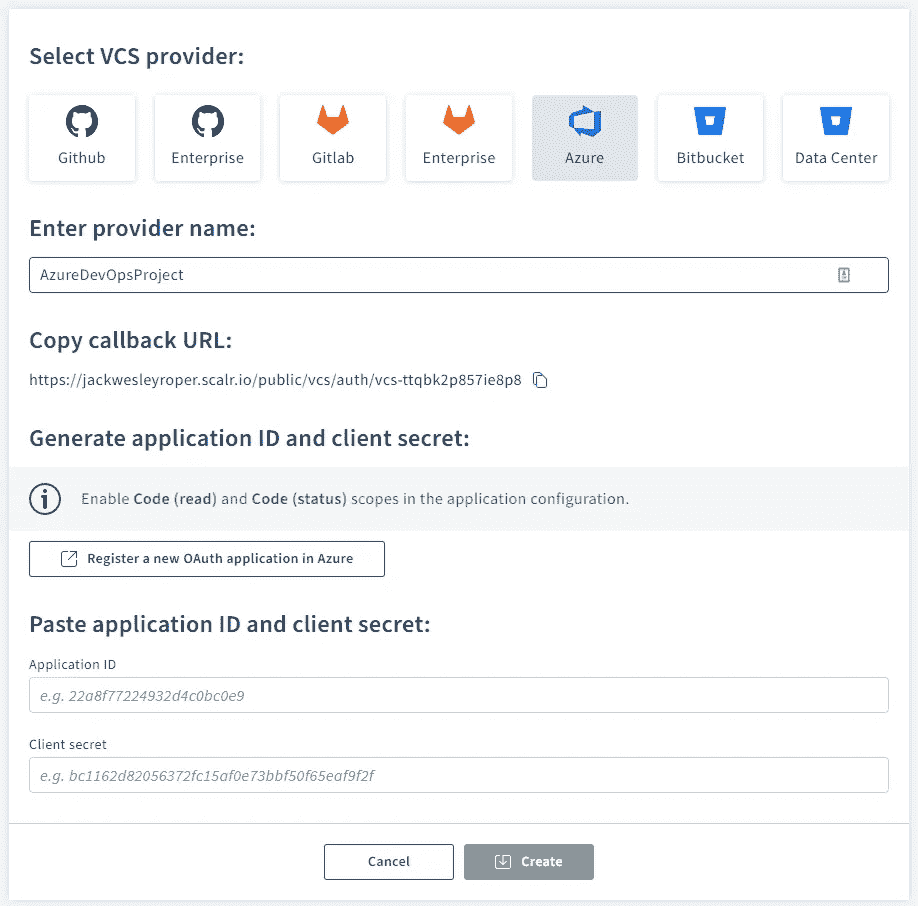

1.  输入您的提供商名称(例如 AzureDevOpsProject)
2.  点击“在 Azure 中注册一个新的 OAuth 应用程序”按钮，这将带你在 Azure DevOps 中注册一个应用程序—[https://aex.dev.azure.com/app/register](https://aex.dev.azure.com/app/register)

3.复制回调 URL 并将其粘贴到 Azure DevOps 页面中的授权回调 URL 中

4.在授权范围下，勾选代码(已读)和代码(状态)。

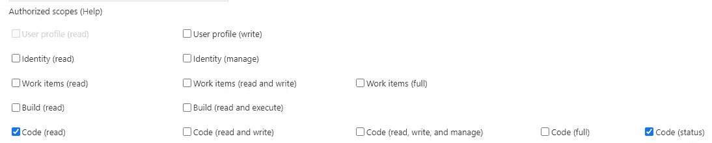

5.填写公司名称、应用程序名称和应用程序网站字段，然后点击“创建应用程序”。将显示您的应用程序设置:

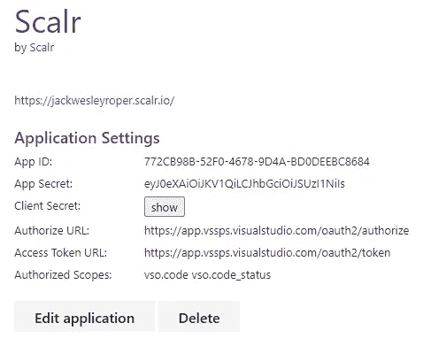

6.回到 Scalr，粘贴你的应用 ID 和客户端密码，然后按“创建”:

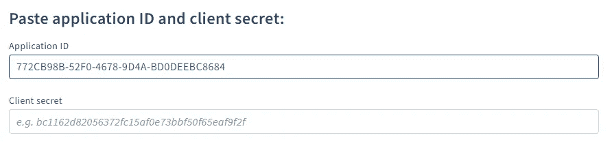

7.点击接受:

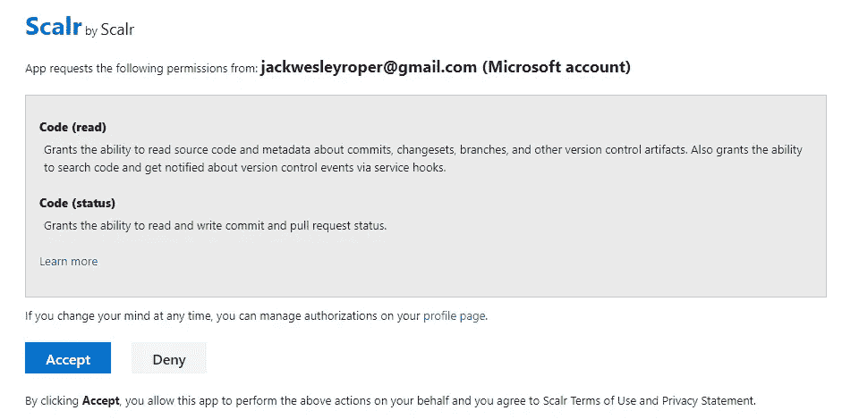

8.Scalr 现在将显示 Azure DevOps 已连接。

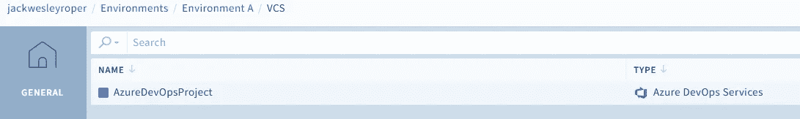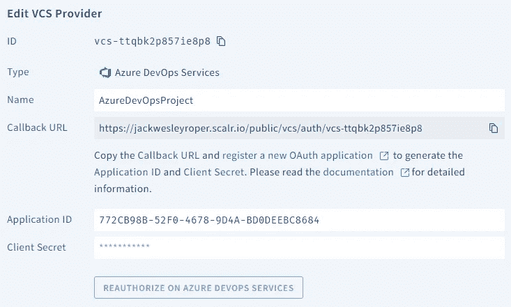

## 使用 Terraform CLI 向 Scalr 认证

> 如果已经存在使用原生 Terraform CLI 的工作流，或者您只是想灵活地使用它，您可以继续使用 Terraform CLI，因为它在 Scalr 中完全受支持。Scalr 将在 Scalr 后端的容器中执行运行，但是日志和输出仍然会发送回您的控制台。要将 Scalr 用作远程支持，有几个简单的步骤:

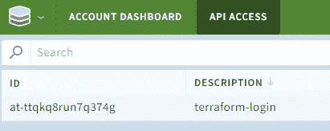

> 1.通过运行`terraform login <account-name>.scalr.io`获得 API 令牌
> 
> 2.创建工作区
> 
> 3.执行`terraform init`

1.  `terraform login jackwesleyroper.scalr.io`

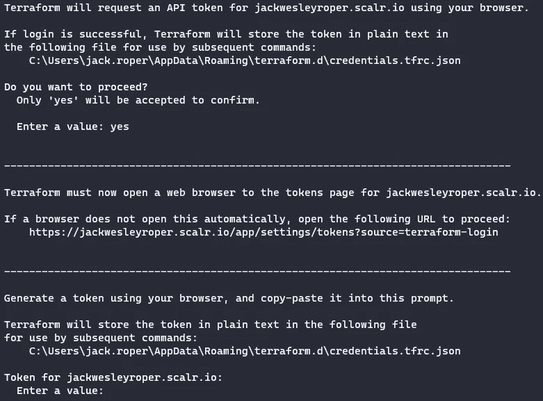

2.按“创建 API 令牌”，然后复制生成的 ID 和令牌。

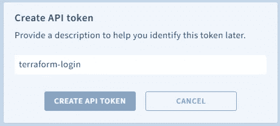

令牌应该显示在 Scalr 中。

3.将令牌粘贴回命令窗口:

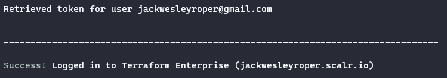

## Scalr Terraform 提供程序

注意，Scalr Terraform 提供程序可用于管理 Scalr 中的组件。这将允许您自动创建工作区、变量、VCS 提供者等等。

## 摘要

我们已经将我们的 VCS 提供商(Azure DevOps)连接到 Scalr，并展示了如何使用 Terraform CLI 向 Scalr 进行身份验证。

接下来,[Scalr 系列的第 2 部分](/setting-up-scalr-with-azure-devops-add-azure-credentials-979ddc17d90d)将关注**如何添加 Azure 凭证**并将它们链接到一个环境。

干杯！🍻

 [## Jack Roper 正在 Azure、Azure DevOps、Terraform、Kubernetes 和 Cloud tech 上写博客！

### 希望我的博客能帮到你，你会喜欢它的内容！我真的很喜欢写技术内容和分享…

www.buymeacoffee.com](https://www.buymeacoffee.com/jackwesleyroper)  [## Scalr Terraform Provider - TACO 8.0 文档

### Terraform 自动化和协作软件

docs.scalr.com](https://docs.scalr.com/en/latest/scalr-terraform-provider/index.html)