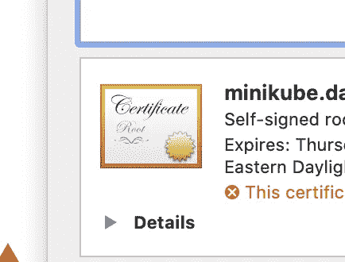
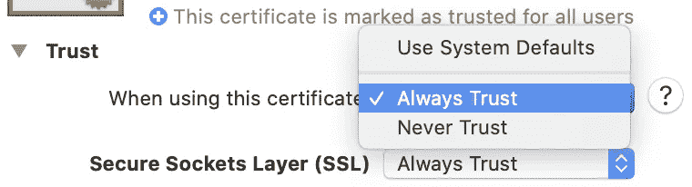

# 在 Minikube 中设置对本地 Dev K8s 群集的自签名 HTTPS 访问

> 原文：<https://itnext.io/setting-up-self-signed-https-access-to-local-dev-k8s-cluster-in-minikube-539bc62ad62f?source=collection_archive---------0----------------------->


照片由[Isis frana](https://unsplash.com/@isisfra?utm_source=medium&utm_medium=referral)在 [Unsplash](https://unsplash.com?utm_source=medium&utm_medium=referral) 拍摄

# 为什么 HTTPS 在本地开发集群上

自从 [Google 的 SameSite Cookie 改变推出](https://www.chromium.org/updates/same-site)以来，你会发现测试一个本地 Web UI 客户端变得越来越困难，API 后端运行在一个本地 K8s 开发集群中。首先，您需要将 cookie 的 [SameSite](https://developer.mozilla.org/en-US/docs/Web/HTTP/Headers/Set-Cookie/SameSite) 设置为“None ”,以便启用跨源请求。然而，只有`SameSite=None`设置的 cookie 也会被谷歌浏览器拒绝，除非你将`[Secure=true](https://developer.mozilla.org/en-US/docs/Web/HTTP/Headers/Set-Cookie#Secure)`设置为只能通过 HTTPS 连接使用。这使得 HTTPS 访问成为测试您的本地集群的“必备”工具。

# 安装证书管理器

要为您的集群颁发自签名证书，您需要首先安装 [cert-manager](https://cert-manager.io/docs/) :

*   使用 kubectl 安装证书管理器 [CRDs](https://kubernetes.io/docs/concepts/extend-kubernetes/api-extension/custom-resources/) (v1.7.3)

```
kubectl apply -f https://github.com/cert-manager/cert-manager/releases/download/v1.7.3/cert-manager.crds.yaml
```

*   使用 Helm 安装证书管理器

```
# If you haven't install jetstack helm chart repo yethelm repo add jetstack https://charts.jetstack.io# Create namespace for cert-managerkubectl create namespace cert-manager# install cert manager v1.7.3helm upgrade --namespace cert-manager --version 1.7.3 --install cert-manager jetstack/cert-manager
```

# 创建自签名证书颁发者

已安装的 cert-manager [CRDs](https://kubernetes.io/docs/concepts/extend-kubernetes/api-extension/custom-resources/) 允许我们创建一个定制的 K8s 资源—‘cluster issuer ’,它代表一组 cert-manager 配置，决定如何处理证书请求。这里，我们需要创建一个自签名证书颁发者，如下所示:

```
apiVersion: cert-manager.io/v1
kind: ClusterIssuer
metadata:  
  name: selfsigned-issuer
spec:  
  selfSigned: {}
```

您可以使用“kubectl”从 YAML 文件创建 ClusterIssuer:

```
kubectl apply -f [https://gist.githubusercontent.com/t83714/51440e2ed212991655959f45d8d037cc/raw/7b16949f95e2dd61e522e247749d77bc697fd63c/selfsigned-issuer.yaml](https://gist.githubusercontent.com/t83714/51440e2ed212991655959f45d8d037cc/raw/7b16949f95e2dd61e522e247749d77bc697fd63c/selfsigned-issuer.yaml)
```

请注意:`ClusterIssuer`是一个集群范围(非命名空间)的资源，您只需要为整个集群创建一个。

# 设置入口

首先，如果您还没有这样做，您应该通过以下方式启用内置的 [minikube 入口控制器](https://kubernetes.io/docs/tasks/access-application-cluster/ingress-minikube/#enable-the-ingress-controller):

```
minikube addons enable ingress
```

要使用创建的 ClusterIssuer 发布新证书，我们只需在创建入口时添加一个注释— `cert-manager.io/cluster-issuer: selfsigned-issuer`来公开集群中的 HTTP 端点/服务。这里，`selfsigned-issuer`是集群发布者的名称。例如:

```
apiVersion: networking.k8s.io/v1 
kind: Ingress 
metadata: 
  annotations: 
    cert-manager.io/cluster-issuer: selfsigned-issuer 
  name: local-ingress 
spec: 
  rules: 
  - host: test-app.com 
    http: 
      paths: 
      - backend: 
          service:
            name: "my-app-service"
            port: 
              number: 80 
        path: "/"
        pathType: "Prefix" 
  tls: 
  - hosts: 
    - test-app.com 
    secretName: test-app-cert-tls
```

上面的 ingress 配置使用 Ingress 来公开一个 [k8s 服务](https://kubernetes.io/docs/concepts/services-networking/service/) (`my-app-service `)并用域`test-app.com`的自签名证书来保护它。

要应用入口清单，您可以运行:

```
kubectl -n [my-namespace] apply -f ingress.yaml
```

测试域名`test-app.com`不需要向任何域名注册商注册。但是您需要将以下条目添加到您的本地机器/etc/hosts 文件中(在 windows 上，它是` c:\ Windows \ System32 \ Drivers \ etc \ hosts ` ),以使域解析到您的` minikube `群集 IP:

```
# Here 192.168.64.1 is your minikube cluster IP. 
# You can use command `minikube ip` to find it out.
192.168.64.1    test-app.com
```

>请注意:当您将 minikube 与 [docker 驱动程序](https://minikube.sigs.k8s.io/docs/drivers/)一起使用时(例如在苹果 M1 机器上)，您将无法通过 minikube IP 访问 ingress exposed 服务。你需要运行`minikube tunnel`来通过本地 ip `127.0.0.1`提供服务。您还需要在`/etc/hosts`中将`minikube.data.gov.au`映射到 IP `127.0.0.1`。

# 信任自签名证书

由于用于保护您的 HTTPS 端点的证书是自签名证书，您的 web 浏览器不会识别它，除非您更改系统设置，使您的本地计算机信任该证书。

在 Mac 上，您可以执行以下步骤:

*   导航谷歌浏览器到你的测试域
*   一旦看到不可信证书的警告，您可以单击地址栏中的“不安全”按钮，然后从弹出菜单中单击证书项目。
*   将证书图标(见下文)拖放到桌面上以下载证书文件。



拖放证书图标以下载证书

*   从“实用工具”文件夹中打开“钥匙串访问”应用程序。
*   在左侧面板的“钥匙串”标题下选择“系统”，并在“类别”标题下选择“证书”。
*   将之前下载的证书文件拖放到右侧面板。
*   选择证书并点按“简介”按钮。


获取信息按钮

*   从“信任”部分选择“总是信任”。



证书信息弹出窗口

在 Windows 上，你可以按照下面的文章让 Chrome 接受 windows 10 上的自签名证书:

[](https://www.pico.net/kb/how-do-you-get-chrome-to-accept-a-self-signed-certificate) [## 如何让 Chrome 接受自签名证书？

### 以下步骤基于用户提供的答案:kgrote，适用于 Windows 10 上的 Chrome 68:导航至…

www.pico.net](https://www.pico.net/kb/how-do-you-get-chrome-to-accept-a-self-signed-certificate) 

# 解决纷争

如果在完成上述设置后，您仍然无法使用 HTTPS 协议访问本地测试域。您可以运行以下命令来获取证书颁发过程中涉及的所有对象的信息:

```
kubectl get Issuers,ClusterIssuers,Certificates,CertificateRequests,Orders,Challenges --all-namespaces
```

这将使您对证书颁发过程有一个全面的了解，并帮助您确定问题。