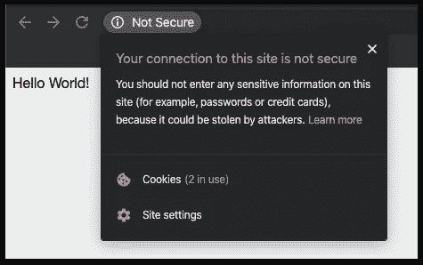
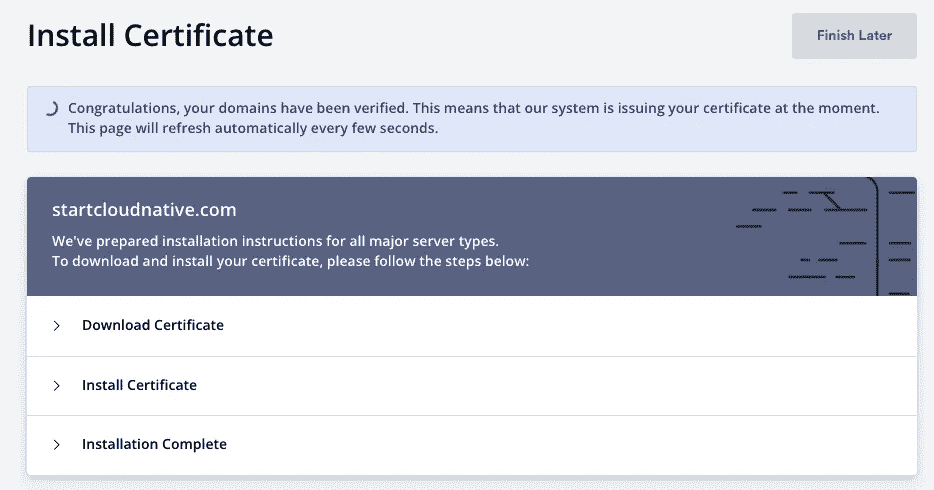
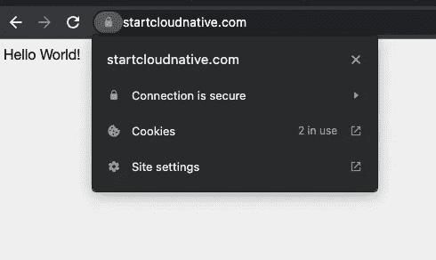

# 使用 Istio 网关设置 SSL 证书

> 原文：<https://itnext.io/setting-up-ssl-certificates-with-istio-gateway-a3ac16043ea6?source=collection_archive---------3----------------------->


照片由[克莱顿](https://unsplash.com/es/@ibidsy?utm_source=medium&utm_medium=referral)在 [Unsplash](https://unsplash.com?utm_source=medium&utm_medium=referral) 上拍摄

如今 SSL 证书是必须的。它们通过加密帮助保护在服务器和客户端之间发送的数据，这给了你的网站更多的可信度。在这篇博文中，我将探索几种不同的方法来获得 SSL 证书，并配置 Istio 网关来使用它们。

在第一部分中，我将向您展示如何手动创建自签名证书，然后获取一个实际的 SSL 证书并进行设置。正如您将看到的，设置这一切并不太复杂。在以后的一篇文章中，我还会解释如何在证书自动过期之前检索和刷新它们。

您将需要一个实际的、云托管的 Kubernetes 集群，因为您需要一个外部 IP 地址来连接您的域。我已经使用 Istio 1.13.3 的演示配置文件安装测试了这些步骤。

先决条件:

*   云托管的 Kubernetes 集群
*   [Istio 1.13.3](https://istio.io/latest/docs/setup/getting-started/) (如`istioctl install`)，命名空间`default`标记为 Istio 边车注射

# 部署示例应用程序

为了确保工作正常，我们将从部署一个简单的 Hello World web 应用程序开始。如果你有自己想要使用的应用程序/服务，请随意使用。

让我们来定义 Kubernetes 服务帐户、服务和部署:

helloworld.yaml

将上述文件保存到`helloworld.yaml`，并使用以下命令进行部署:

```
kubectl apply -f helloworld.yaml
```

因为我们将在公共域上公开`helloworld`应用程序，所以我们需要创建一个网关资源:

将上述内容保存到`gateway.yaml`，并使用`kubectl apply -f gateway.yaml`进行部署。

查看下面的推文，它解释了`hosts`字段中的`*`是什么意思，以及网关资源如何与虚拟服务相关联。

我们还需要一个附加到网关资源的虚拟服务，并将流量路由到`helloworld` Kubernetes 服务:

将上述 YAML 保存到`virtualservice.yaml`，并使用`kubectl apply -f virtualservice.yaml`进行部署。

我们可以列出 VirtualService，以查看它连接到哪个网关以及它监听哪些主机:

```
$ kubectl get vsNAME       GATEWAYS            HOSTS AGE
helloworld [“public-gateway”] [“*”]  106s
```

部署所有这些资源后，我们现在可以获得 Istio 入口网关的外部 IP，并将其存储在`GATEWAY_URL`环境变量中:

```
GATEWAY_IP=$(kubectl get svc -n istio-system istio-ingressgateway -ojsonpath=’{.status.loadBalancer.ingress[0].ip}’)
```

如果在浏览器中打开`GATEWAY_IP`，会看到类似下图的东西。



您确实从应用程序得到了响应，但您也从浏览器得到了“不安全”的消息，这告诉用户连接不安全，不会对您的网站产生信心。

# 自签名证书和手动设置

让我们从最简单的场景开始，手动获取证书。首先，选择一个您想要使用的域名，注意，要测试这个，您不必拥有域名:

```
export DOMAIN_NAME=mysuperdomain.com
```

作为第一步，您将创建根证书(`$DOMAIN_NAME.crt`)和用于签署证书的私钥(`$DOMAIN_NAME.key`):

```
openssl req -x509 -sha256 -nodes -days 365 -newkey rsa:2048 -subj ‘/O=$DOMAIN_NAME Inc./CN=$DOMAIN_NAME’ -keyout $DOMAIN_NAME.key -out $DOMAIN_NAME.crt
```

接下来，您需要创建私钥:

```
openssl req -out helloworld.$DOMAIN_NAME.csr -newkey rsa:2048 -nodes -keyout helloworld.$DOMAIN_NAME.key -subj “/CN=helloworld.$DOMAIN_NAME/O=hello world from $DOMAIN_NAME”
```

证书是:

```
openssl x509 -req -days 365 -CA $DOMAIN_NAME.crt -CAkey $DOMAIN_NAME.key -set_serial 0 -in helloworld.$DOMAIN_NAME.csr -out helloworld.$DOMAIN_NAME.crt
```

我们可以创建 Kubernetes 秘密来存储证书和密钥。我们可以随意命名这个秘密，只要我们将它放在运行它的入口网关所在的名称空间中。默认情况下，这是`istio-system`名称空间。

```
$ kubectl create secret tls mysuperdomain-certs -n istio-system — key helloworld.$DOMAIN_NAME.key — cert helloworld.$DOMAIN_NAME.crtsecret/mysuperdomain-certs created
```

有了这个秘密，我们需要更新网关资源，告诉它使用这个证书:

将上述 YAML 保存到`gateway.yaml`，并使用`kubectl apply -f gateway.yaml`进行部署。我们将覆盖之前使用`apply`命令创建的网关资源。

同样，我们需要更新 VirtualService 中的`hosts`字段:

将上述 YAML 保存到`virtualservice.yaml`，并使用`kubectl apply -f virtualservice.yaml`覆盖现有的虚拟服务。

测试这种工作方式的最简单方法是使用带有`--resolve`标志的`curl`。resolve 标志的格式为`[DOMAIN]:[PORT]:[IP]`，它将所有与`[DOMAIN]:[PORT]`部分匹配的请求路由到指定的 IP 地址。这样，你就不需要去你的 DNS/域名注册商那里进行修改就可以测试了。

下面是 curl 命令，您可以使用它来测试 SSL 证书是否得到验证和使用:

```
curl -v — resolve helloworld.$DOMAIN_NAME:443:$GATEWAY_IP — cacert $DOMAIN_NAME.crt [https://helloworld.$DOMAIN_NAME](https://helloworld.$DOMAIN_NAME)
```

使用上面的命令，我们告诉 curl 将任何对`helloworld.mysuperdomain.com:443`的请求解析到入口网关的外部 IP 地址。此外，我们还提供了之前创建的 CA 证书的名称。

从输出中，您将能够看到服务器证书的详细信息和一行表示证书已被验证的内容，以及来自`helloworld` pod 的实际响应:

```
...* Server certificate:
*  subject: CN=helloworld.mysuperdomain.com; O=hello world from mysuperdomain.com
*  start date: Nov 30 22:27:11 2019 GMT
*  expire date: Nov 29 22:27:11 2020 GMT
*  common name: helloworld.mysuperdomain.com (matched)
*  issuer: O=mysuperdomain.com Inc.; CN=mysuperdomain.com
*  SSL certificate verify ok.
...<link rel="stylesheet" type="text/css" href="css/style.css" />
<div class="container">
  Hello World!
* Connection #0 to host helloworld.mysuperdomain.com left intact
</div>* Closing connection 0
```

# 使用 ZeroSSL 获取证书

上一节中的自签名证书路线实际上只是为了试验和测试。但是，您需要由您的客户端可以信任的实际证书颁发机构签署的证书。

有几种方法可以获得 SSL 证书，最流行的是[让我们加密](https://letsencrypt.org/)。我将使用 [ZeroSSL](https://www.zerossl.com/) ，它使用 Let's Encrypt 来发布证书。如果你想花钱，你也可以从你的域名注册商或者在 [DigiCert](https://digicert.com) 购买 SSL 证书。

在这一节中，我将使用一个真实的域名和实际的 SSL 证书——这意味着如果您想跟进，请确保您已经准备好了域名。我使用的是[Name.com](https://name.com)，但是你可以使用任何其他域名注册商。

现在您已经有了自己的域，注册并登录到 [ZeroSSL](https://zerossl.com) 获取您的 SSL 证书:

1.  点击**新建证书**按钮开始。
2.  输入域名，点击**下一步**按钮。*我将使用* `*startcloudnative.com*` *作为我的域名*
3.  选择 **90 天证书**，点击**下一步**按钮。
4.  选择**自由**选项，点击**下一步**按钮。

在下载证书和密钥之前，您必须验证您拥有您申请证书的域名。有多种方法可以验证域名所有权。如果你在域名上设置了电子邮件，你可以选择电子邮件验证；否则使用 DNS (CNAME)验证。

DNS 验证将要求您登录到您注册域名的网站，并添加自定义 DNS 记录。完成后，点击**下一步**按钮和**验证域**按钮。



## 设置一个名称记录

当您登录到域名注册商的网站时，请确保您添加了 A 记录。A 记录(IP 地址)会将您的域名指向 Istio 入口网关的外部 IP 地址(T2)。

我已经申请了`startcloudnative.com`和`www.startcloudnative.com`的证书。我的 A 记录将从`startcloudnative.com`指向 IP 地址(T3)。我不会像以前那样使用`helloworld`子域。

一旦颁发了证书，您就可以下载`.zip`文件以及为您的域生成的所有文件。您可以选择多种服务器类型，但保留默认格式是我们想要的。

中会有三个文件。zip 包:

*   `ca_bundle.crt`
*   `certificate.crt`
*   `private.key`

## 用真实的证书重新创建秘密

让我们删除我们创建的最后一个密码，并用实际证书创建一个新密码:

```
kubectl delete mysuperdomain-certs -n istio-system
```

您可以使用从下载的包中获得的实际 SSL 证书和密钥重新创建它。您可以使用您的域名来命名该机密:

```
kubectl create secret tls startcloudnative-certs -n istio-system — key private.key — cert certificate.crt
```

我们还必须更新网关和虚拟服务，以修改主机名并指向我们创建的新密码。

让我们首先更新网关(确保用您的实际域名替换`startcloudnative.com`):

类似地，让我们对 VirtualService 中的`hosts`字段进行更改:

更新这两个资源后，您可以打开您选择的浏览器并导航到您的域。你应该看看“你好，世界！`响应和域名前的挂锁，这表明网站是安全的。如果您点击挂锁并检查证书，您将在证书中看到您的域名、根授权(让我们加密)和到期日期。



## 结论

本文解释了如何配置 Istio 入口网关来服务 HTTPS 流量。我们还介绍了如何创建自签名 TLS 证书，以及如何使用 ZeroSSL 创建一个实际的 SSL 证书。

下一个合乎逻辑的步骤是安装和配置[证书管理器](https://cert-manager.io/)，以便在证书自动过期之前获取和刷新它们。你可以用 Ambassador 检查[保护 Kubernetes 入口，让我们加密](https://learncloudnative.com/blog/2020-06-24-ssl-ambassador-lets-encrypt)来学习如何做到这一点。