# 在 JavaScript 应用程序中设置 Swagger 进行 API 测试

> 原文：<https://itnext.io/setting-up-swagger-in-a-node-js-application-d3c4d7aa56d4?source=collection_archive---------1----------------------->

# Spring Boot 让 Swagger APIs 看起来很容易，Node.js 就不那么容易了。


如果你和我一样，曾经使用过不附带 UI 的 REST API(应用程序接口),你可能不止一次困惑于 API 需要什么输入和标记来返回你所期望的数据，而不是一些神秘的 400 HTTP 错误消息。

有时我不知道是否需要某种授权头(或者如何发送)，API 是否会接受`post`或`put`(以及什么是必需的，什么是可选的)，以及它是否接受`application/json`或其他 XML 格式的编码。

从等式中去掉一些不确定性不是很好吗？如果不是面对一个空空的邮递员或失眠的应用程序等着你去配置它并为它提供它需要的一切，而是一个 API route 告诉你它到底需要什么，这不是很好吗？请求体与查询参数、整数与字符串、JWT 验证头与 cookie——所有这些，只是布局，所有可能的路径都是可见的。

听起来好得难以置信？不是的。

> 在我加入目前的开发团队之前，我不知道有这样一个神奇的 API 助手存在，但它确实存在。而且叫[霸气](https://swagger.io/)。

我将在下面给出所有的细节，但这里有一个例子可以说明 Swagger 可以为您的 web 应用程序的 API 路由提供什么。

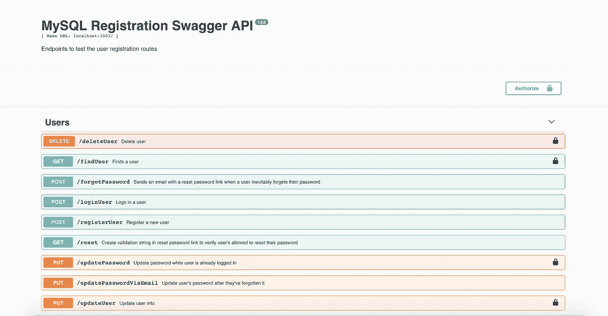

是的，在 Swagger 的帮助下，您的 API 可以如此可爱，按字母顺序排列并进行颜色编码。

# 认识一下斯瓦格，你的 API 的新朋友

斯瓦格的维基百科页面对此做了最好的总结:

> Swagger 是一个开源软件框架，由一个大型工具生态系统支持，帮助开发人员设计、构建、记录和使用 RESTful Web 服务。虽然大多数用户通过 Swagger UI 工具来识别 Swagger，但 Swagger 工具集包括对自动化文档、代码生成和测试用例生成的支持。— [维基百科，Swagger(软件)](https://en.wikipedia.org/wiki/Swagger_(software))

如果现在还不明白，请继续阅读。一旦你在实践中看到它，它就会变得有意义。

Swagger 最可爱的一点是，它可以用于几乎任何编程语言:从 JavaScript 到 Haskell，再到 C++和 Python，再到 Rust，这个列表还可以继续下去。[支持的语言](https://github.com/swagger-api/swagger-codegen)数量实在惊人。

我第一次接触 Swagger 是通过 Java 的 Spring Boot 应用程序。通过在`build.gradle`依赖项中包含一行:`compile(‘io.springfox:springfox-swagger-ui:2.9.2’)`，在 Java 配置文件中包含一个注释:`@EnableSwagger2`，在`application.yml`中包含`swagger.basePackage`的位置，一旦 Spring Boot 应用程序编译并运行，您就拥有了一个漂亮的 API UI。

在浏览器中输入类似于[http://localhost:8081/Swagger-UI . html](http://localhost:8081/swagger-ui.html.)的内容就可以到达 Swagger UI。然后，瞧，您已经为您的 API 服务获得了一个交互式的、基于浏览器的 UI，您可以随心所欲地进行测试。

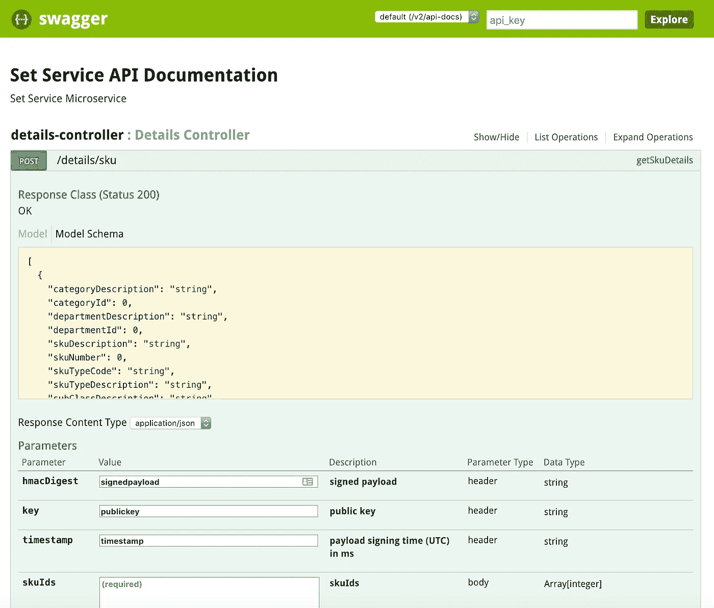

下面是我打开 Spring Boot Swagger HTML 页面时看到的一个例子。

Swagger 向用户展示了项目中的路由，它准确地显示了数据的形状以及每个参数所需的属性类型，它让您知道是否需要标题以及它们的确切类型，请求体或查询参数是可选的还是必需的，以及可能的 HTTP 响应方法和每种方法的含义。这太不可思议了——仅仅对我的 Java 代码做了三点小小的更新。

对于 Spring Boot 来说，这似乎是小菜一碟，我(天真地)认为用我的[全栈、MERN、JavaScript](https://github.com/paigen11/mysql-registration-passport) 应用程序实现 Swagger 会一样容易。我真傻…

# JavaScript 中的 Swagger，有一个 NPM 包可以实现，对吗？

嗯，这个问题的简短答案是:是的。这个问题更长的答案是:有很多包。最长的回答就是我现在要告诉你的。

不像 Spring Boot，它有一个事实上的 Swagger 包，JavaScript 和 Swagger 的世界更加支离破碎。从我对 NPM 和互联网的探索来看，似乎并不只有一个答案可以生成神气活现的文档，并以我熟悉并喜欢的 UI 格式显示它们。

所以我阅读了一些博客，阅读了一些关于 OpenAPI 规范(以前称为 Swagger 规范)的文档，并在了解到没有为 JavaScript 维护的 Swagger 文档生成器时，我最终决定使用 [Swagger JSDoc](https://www.npmjs.com/package/swagger-jsdoc) 来为我的路线创建我的 Swagger 文档，并将其与 [Swagger UI Express](https://www.npmjs.com/package/swagger-ui-express) 相结合，以在浏览器中生成 UI 界面。让我告诉你更多关于这些模块的信息。

## Swagger JSDoc

Swagger JSDoc 自己的话再一次最好地描述了这一点:

> **swagger-jsdoc** 使您能够在代码中使用`[JSDoc](http://usejsdoc.org/)`注释来集成 [Swagger](http://swagger.io/) 。只需在你的文档块上添加`@swagger`并声明你的代码在 YAML 符合 OpenAPI 规范的含义。—NPM 斯瓦格 JSDoc

这意味着，在每个现有的 API 路由之上，您用`@swagger`注释为该路由编写 YAML 风格的 Swagger 规范(所以缩进和冒号都算在内),然后这个模块将把它翻译成由我的第二个模块:Swagger UI Express 呈现的 UI。

这个模块对于已经编写好的 API 也特别好(我的项目恰好就是这样)。我是在事后才添加 Swagger 文档的——而不是在我第一次构建应用程序时作为初始架构的一部分。

> `swagger-jsdoc`项目假设您希望以某种方式记录您现有的/生活的/工作的代码，以“赋予它生命”,生成一个规范，然后可以输入到其他 Swagger 工具中，而不是相反。—NPM 斯瓦格 JSDoc

如果我在这个过程中早点决定添加 Swagger，我会查看 [Swagger 编辑器](http://swagger.io/swagger-editor/)或 [Swagger 节点](http://swagger-node)。

## Swagger UI Express

与 Swagger JSDoc 相比，Swagger UI Express 文档要简单得多，因为真正具有挑战性的部分是编写 Swagger 规范。

正如 Swagger UI Express 的文档所说，它

> 向您的 express 应用程序添加中间件，以服务绑定到您的 Swagger 文档的 Swagger UI。这相当于在应用程序中托管的 API 的动态文档。—NPM 斯瓦格 UI 快递公司

基本上，您按照规定的公式将 Swagger 文档输入到 Swagger UI Express 模块，然后它生成 HTML UI。幸运的是，关于如何做到这一点的文档是最新的，也是准确的。这让事情变得非常简单。

现在，我已经介绍了两个解决方案的更多背景知识，我选择了这两个解决方案来使 Swagger 与 JavaScript 一起工作，更具体地说，是我的 Express/Node.js 服务器应用程序，是时候讨论如何实现它了。

# 让我们用 JavaScript 设置 Swagger，能有多难？

一旦我掌握了如何编写路由规范，实现 Swagger 就不是太难了，但是从最简单的部分开始，我将首先检查 Swagger UI Express 和 Swagger JSDoc 服务器设置。

如果你想下载我的整个项目并在本地运行它，或者只是看看源代码，这里有一个到 [repo](https://github.com/paigen11/mysql-registration-passport) 的链接。

## Server.js 安装程序

`**Server.js**`

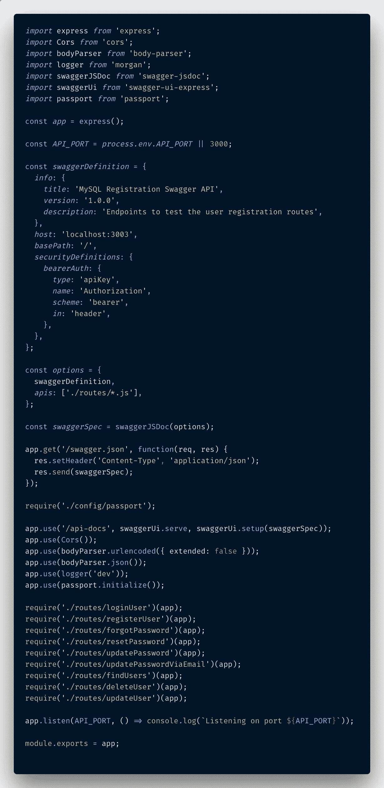

下面是我完整的 server.js 文件，它初始化了 Swagger JSDoc 和 Swagger UI Express。

以上是我的完整`server.js`文件的一个镜头，由 [Polacode](https://marketplace.visualstudio.com/items?itemName=pnp.polacode) 提供。然而，你需要关注的是照片的这一部分。

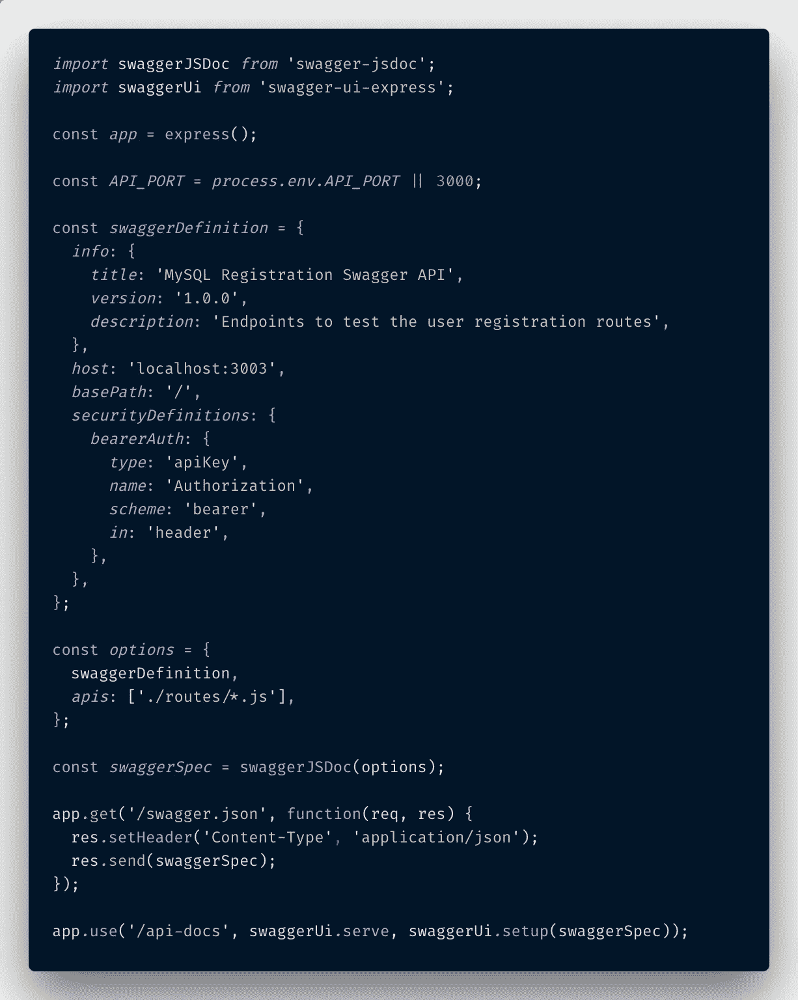

这就是 Swagger UI Express 将 Swagger JSDoc 的 swaggerSpec 转换成一个漂亮的浏览器 UI 的神奇之处。

如你所见，`swaggerJSDoc`和`swaggerUiExpress`都被导入到文件中(如果你像我一样选择不在 Node.js 中使用 ES6 transpiler，也可以用`require`来完成)。

然后创建`swaggerDefinition`对象(这是`swagger-jsdoc`所需设置的一部分)。它的属性包括`info`像 app 的`title`，一个`version`和一个`description`。它还需要一个`host`(在我的例子中，端口 3003 是从我的 Docker 容器为 API 公开的端口)和一个`basePath`。因为我也有一些只有当用户使用有效的 JWT 令牌登录时才可以访问的路由，所以我还必须用`bearerAuth`信息创建一个`securityDefinitions`对象:`type`、`name`、`scheme`和`in`。

下面是我的`swaggerDefinition`的一段代码，供参考。

```
const *swaggerDefinition* ={
  *info*:{
    *title*:'MySQL Registration Swagger API',
    *version*:'1.0.0',
    *description*:'Endpoints to test the user registration routes',
  },
  *host*:'localhost:3003',
  *basePath*:'/',
  *securityDefinitions*:{
    *bearerAuth*:{
      *type*:'apiKey',
      *name*:'Authorization',
      *scheme*:'bearer',
      *in*:'header',
    },
  },
};
```

一旦定义好了，它就被集合到另一个名为`options`的对象中，这个对象包含了路由文件的路径。在我的例子中，我有一个名为`routes`的文件夹，它们都在那里，所以我告诉 Swagger 去那里找。

```
const *options* ={
  swaggerDefinition,
  *apis*:['./routes/*.js'],
};
```

之后，`swaggerSpec`变量被初始化，将`options`对象包装在`swaggerJSDoc()`中。然后，给 Express 服务器一个路径来查看由`swaggerSpec`创建的完整的`swagger.json`模式。

```
const *swaggerSpec* =swaggerJSDoc(options);app*.*get('/swagger.json', function(req, res) {
  res*.*setHeader('Content-Type', 'application/json');
  res*.*send(swaggerSpec);
});
```

但对我来说，这是次要的，因为下面的代码实际上将`swaggerSpec`和`swaggerUi`模块结合在一起，创建了我所熟悉和喜爱的 Swagger UI。

```
app*.*use('/api-docs', swaggerUi*.*serve, swaggerUi*.*setup(swaggerSpec));
```

对，就这样。这比我最初想的要复杂一点，但是正如我所说的，设置这一切的文档很不错，如果你遇到困难，有像这样的教程可以帮助你。

## 用户模式

在我引用我的`User`对象编写我的路由之前，我需要进入实际的对象声明文件，并告诉 Swagger 是什么组成了我的用户。在那之后，我将能够在不同的路径中引用该模式和那些定义属性的模式，以确保一切顺利。

我使用 Sequelize 作为我的 MySQL 数据库的 ORM，因此我为此定义了一个`User`模式。如果你想了解更多关于 Sequelize 的知识，你可以阅读我写的这篇博文。

这是我的`user.js`文件最终的样子。之间的一切

```
/**
 * @swagger 
 * schema definition info goes here...
 */
```

是将在我的路线中引用的模式定义的一部分。

`**user.js**`

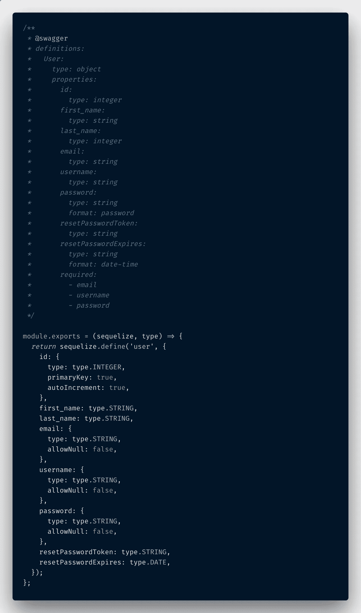

这是我的用户对象和

如您所见，对象的每个属性都被命名为(`id`、`username`、`resetPasswordToken`等)。)，及其数据类型(`string`、`integer`等)。)就定义在它的下面。最后要注意的是`required`对象的属性。对我来说，这些与具有需求`allowNull: false`的实际`User`对象的属性相匹配。那就是我 app 的`username`、`password`、`email`。

## 路线模式

接下来要讨论的是为每条路线编写 Swagger 文档。

我的应用程序中实际上有九条不同的路线，但是我将展示其中三条的文档。

一个是不需要授权的路由，第二个需要 JWT 令牌进行授权，第三个需要一个不同的随机生成的字符串来验证它是合法的。当我到达那里时，我会更详细地解释那一个。

`**loginUser.js**` **—不安全路线**

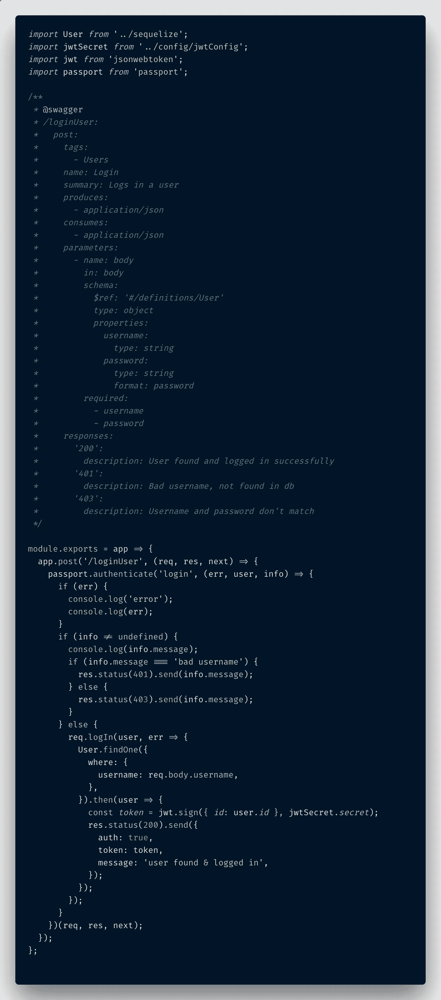

不安全路线的 Swagger 文档示例。

我的第一个 Swagger 文档示例是一个不安全的路由:确切地说，是我的用户登录路由。同样，所有的 Swagger 文档都是以这种方式编写的，并且**要注意:空格/缩进和冒号确实很重要**。

```
/**
 * @swagger
 * documentation for route goes here...
 */
```

Swagger 文档是按照 [YAML 风格](https://docs.ansible.com/ansible/latest/reference_appendices/YAMLSyntax.html)编写的，所以它关心每一行的正确缩进，并且它还关心大多数行都有冒号——如果空格被去掉或者冒号丢失，运行节点服务器代码的终端将抛出错误，直到它被修复(在我浏览的过程中，这让我犯了几次错误)。

这是我完整的 Swagger 文档的代码片段。

```
/**
*** @swagger
** /loginUser:
*   post:
*     tags:
*       - Users
*     name: Login
*     summary: Logs in a user
*     consumes:
*       - application/json
*     parameters:
*       - name: body
*         in: body
*         schema:
*           $ref: '#/definitions/User'
*           type: object
*           properties:
*             username:
*               type: string
*             password:
*               type: string
*               format: password
*         required:
*           - username
*           - password
*     responses:
*       200:
*         description: User found and logged in successfully
*       401:
*         description: Bad username, not found in db
*       403:
*         description: Username and password don't match* */
```

正如您所看到的，首先定义路由(实际的 URL 路由 Swagger 在浏览器中运行时必须命中)，然后定义 HTTP 调用的类型(`get`、`post`等)。).

`summary`部分出现在 UI 中的路线旁边，它很好地描述了路线的用途。

如果定义了许多不同的模式，`tags`部分在组织不同的路由组时会更有用。因为我只有`users`对我来说没多大关系。

如果除了 JSON 之外还有别的东西被生产或消费，那就定义了。

然后用户将要输入的参数被布置在下面。因为我的 JSON 是在请求体中传递的，所以定义了`in: body`。如果在查询参数中传递，它会改为说`in: query`。

用`$ref: '#/definitions/User'`定义和引用的`user`对象仅有的两个属性是`username`和`password`。因为这两者都是该路由工作所必需的，所以在下面设置了`required`字段，并且引用了这两个属性(注意，必须与`schema`列内联，以使必需字段在 Swagger 中生效)。

最后，我们期望从服务器得到的 HTTP 响应都有详细的描述。它们很容易理解。

现在，我已经介绍了一条不安全的路线，让我们继续介绍 JWT 的安全路线。

`**findUsers.js**` **—安全路线**

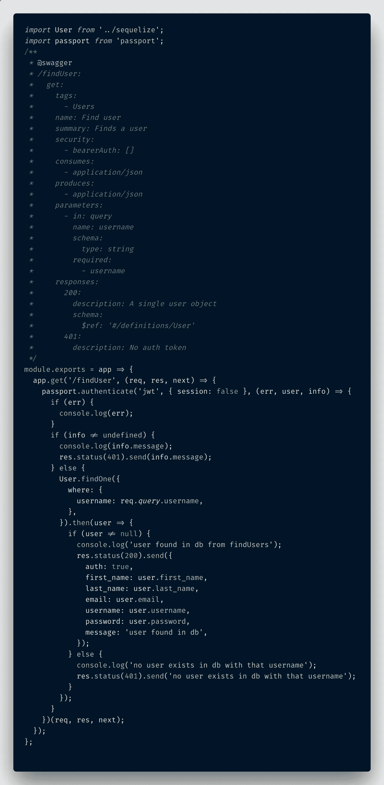

JWT 安全路线的大摇大摆文件。

这条路线是我的`findUser`路线，它在用户登录后被触发，配置文件页面组件开始安装在客户端，从数据库收集所有用户信息。

对于这个路由的 Swagger 文档，它再次定义了 URL 路径、文章类型、标签、摘要、生产/消费规格、参数等。

不同的是，这个路径包含了`security`字段，这是我在`server.js`文件中设置的`securityDefinitions`重新发挥作用的地方。我在客户机和服务器之间来回传递 JWT (JSON Web Token ),以验证用户的权限和授权，因此通过包含

```
/**
 * @swagger
 * ...
 * security:
 *   - bearerAuth: []
 * ...
 */
```

它保护路由，并要求用户在成功拨打电话之前加入 JWT。`bearerAuth`是我在`server.js`文件中命名的对象，你可以随意命名它，这两者只需要在服务器和路由文件中匹配，所以 Swagger 知道如何正确地形成请求。

一旦 JWT 令牌被传入，请求被发送，我拥有的 Passport.js 中间件就获取授权头，解码 JWT 令牌并验证它是好的。如果你想了解更多关于用 Reactjs / Node.js 项目设置 Passport 的信息，你可以在这里阅读我的博客文章。

这是 Swagger 文档的代码片段，我想指出一些与之前不同的地方。

```
/**
*** @swagger
** /findUser:
*   get:
*     tags:
*       - Users
*     name: Find user
*     summary: Finds a user
*     security:
*       - bearerAuth: []
*     consumes:
*       - application/json
*     produces:
*       - application/json
*     parameters:
*       - in: query
*         name: username
*         schema:
*           type: string
*         required:
*           - username
*     responses:
*       200:
*         description: A single user object
*         schema:
*           $ref: '#/definitions/User'
*       401:
*         description: No auth token* */
```

除了`security`选项，另一个区别是参数。正如我在前面提到的，如果用户输入是通过请求的查询参数，而不是请求体，那么参数看起来会有一点点不同。

下面是需要关注的部分——在`parameters`下，`-in`字段变成了`query`而不是`body`。这告诉 Swagger 传递请求的查询参数中需要的任何属性。

```
/** 
 * @swagger
 * ...
 * parameters:
 *   - in: query
 * ...
 */
```

另一件需要注意的事情是在文档底部的`responses`部分。对于 200 HTTP 响应，它实际上会产生一个保存所有用户信息的`application/json`对象。我需要引用用户模式，以便 Swagger 理解如何映射它接收到的响应对象，而不必再次写出所有的对象属性。

```
*/** 
* @swagger 
* ...
*     responses:
*       200:
*         description: A single user object
*         schema:
*           $ref: '#/definitions/User' 
* ...* */
```

很好，现在我已经用 Swagger 详细描述了一条安全路线和一条不安全路线，现在是第三条稍微不同的路线的时候了。一封与密码重置邮件重合的邮件。

`**resetPassword.js**` **—随机生成的字符串路径**

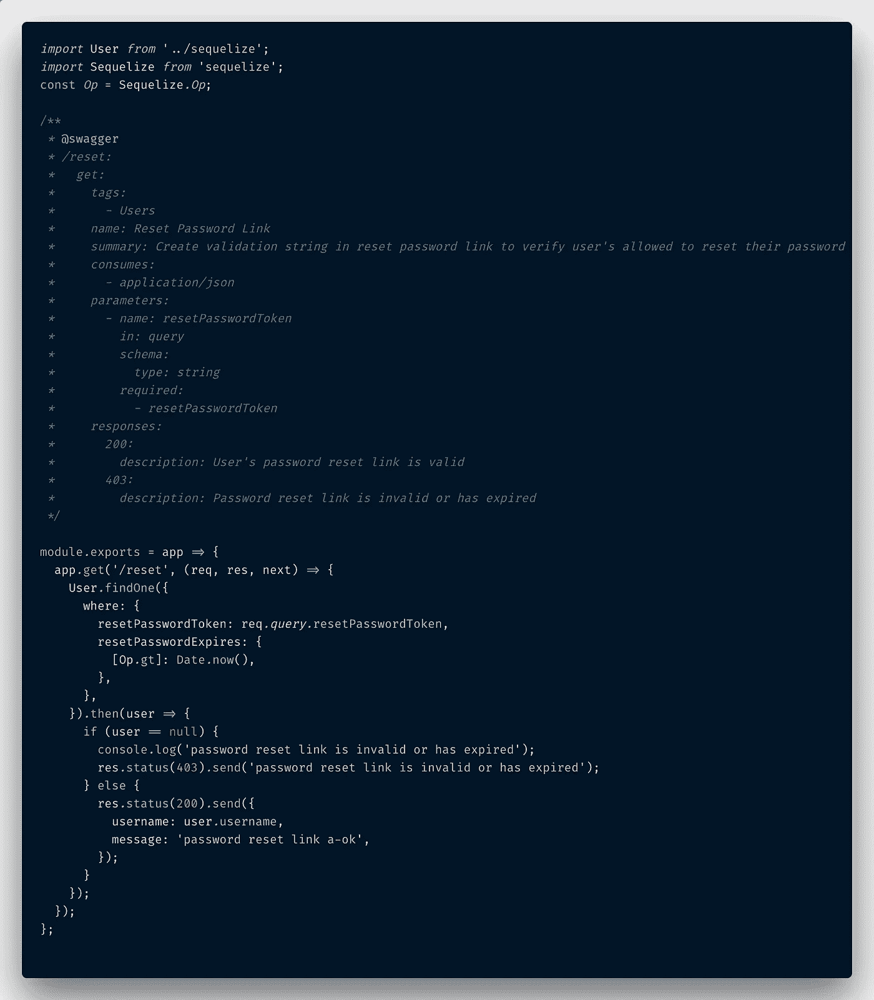

安全路由的 Swagger 文档，需要一个随机生成的字符串。

这是我将在这里介绍的最后一个路由示例，如果您想查看我的所有路由(包括所有基本的 CRUD 功能和一些功能)，您可以查看我的 [Github repo](https://github.com/paigen11/mysql-registration-passport) 。

我之所以包括这个，是因为这个路由实际上需要一个没有过期的随机生成的字符串，如果用户忘记了他们的登录密码，这个字符串将在电子邮件的正文中发送给用户。有点不同，也有点棘手，所以我觉得值得一试。

如果你想了解更多关于使用 Node 发送密码重置邮件的信息，你可以看看我写的这个[博客](/password-reset-emails-in-your-react-app-made-easy-with-nodemailer-bb27968310d7)。

下面是 Swagger 文档的代码片段。

```
/**
*** @swagger
** /reset:
*   get:
*     tags:
*       - Users
*     name: Reset Password Link
*     summary: Create validation string in reset password link to verify user's allowed to reset their password
*     consumes:
*       - application/json
*     parameters:
*       - name: resetPasswordToken
*         in: query
*         schema:
*           type: string
*         required:
*           - resetPasswordToken
*     responses:
*       '200':
*         description: User's password reset link is valid
*       '403':
*         description: Password reset link is invalid or has expired* */
```

你真的看不出有什么大的区别，但是你会注意到，在`parameters`下面的`in`引用了一个`query` param agin，这意味着需要包含发送到用户电子邮件地址的 URL 链接所附带的随机字符串，以验证密码重置是否得到授权。

我将在测试部分展示这个，它应该更有意义。

## 总结一下

现在，您已经看到了如何在 JavaScript 项目中设置`swagger-jsdoc`和`swagger-ui-express`。我修改了主`server.js`文件，向`User`对象模式添加了一个数据模型，并为三个单独的 Node.js 路径编写了 Swagger 文档。

为了达到这一点，我最后参考了大量的 OpenAPI 规范文档和关于两个 NPM 模块的文档。不要害怕使用它们——它们实际上非常好，并且有大量的东西可以添加，使你的 Swagger 文档更加有用。

好了，说完了。让我们继续测试浏览器中的 API。

# 在浏览器中测试 Swagger

通过 Swagger 在浏览器中测试 API 对我来说实际上是一个非常好的练习，因为它发现了我在代码中犯的一些逻辑错误，并迫使我重新思考我是如何处理某些情况的(比如从服务器向客户端发送错误代码和消息)。

因此，首先，启动整个应用程序或 API，无论你选择哪个。我喜欢直接加载全部内容，因为我写了一个单独的`docker-compose.yml`文件，通过在终端中初始的`docker-compose build`之后写`docker-compose up`来处理所有的事情。

一旦 api 启动并运行，您就可以访问浏览器内界面，方法是将这个 URL 放入:[http://localhost:3003/API-docs/](http://localhost:3003/api-docs/)—至少，这是我的 API 的 Docker 容器运行的外部端口，并且“/API-docs/”URL 路径是我在`server.js` Swagger UI Express 设置中指定的。

```
app*.*use('/api-docs', swaggerUi*.*serve, swaggerUi*.*setup(swaggerSpec));
```

如果您使用了不同的东西，请参考该 URL 路由。

现在，如果一切按计划进行，您应该会看到这样的屏幕。


这是我第一次点击 URL 时我的 Swagger 界面的样子。

此时，您可以单击任何链接并测试您的 API 端点。我将首先测试我的`/loginUser`端点。

所以我点击了那个帖子，点击了展开视图右上角的“试用”按钮，然后用有效的用户名和密码替换了两个“字符串”占位符(这将使用`/registerUser`路径在数据库中创建)，并点击了下面的蓝色大“执行”按钮。

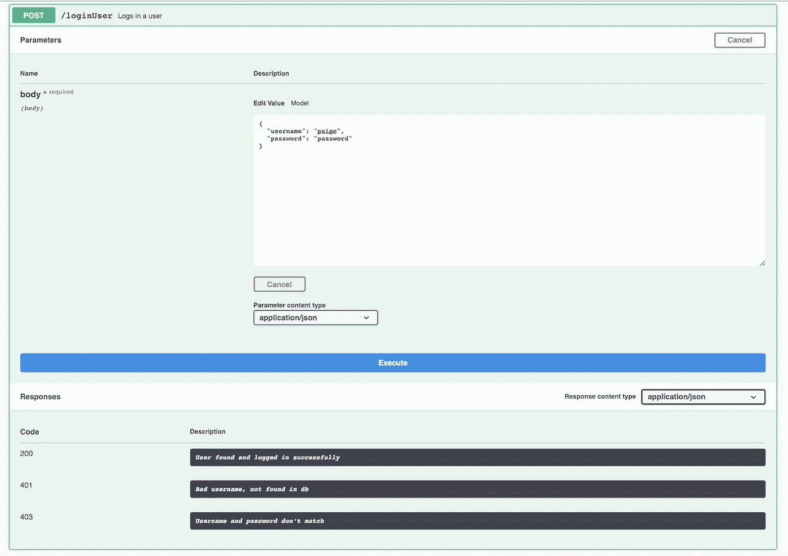

填写请求正文(注意正文旁边的“*required”。

如上图所示，我们的请求主体输入是必需的(“*required”)，因此如果它们保留为空字符串，您将从 API 返回 403“缺少凭据”响应。

我在 Swagger 文档中写下的所有响应代码都是为了解密刚刚发生的事情。下面是一个成功的 200 HTTP 登录响应的样子。

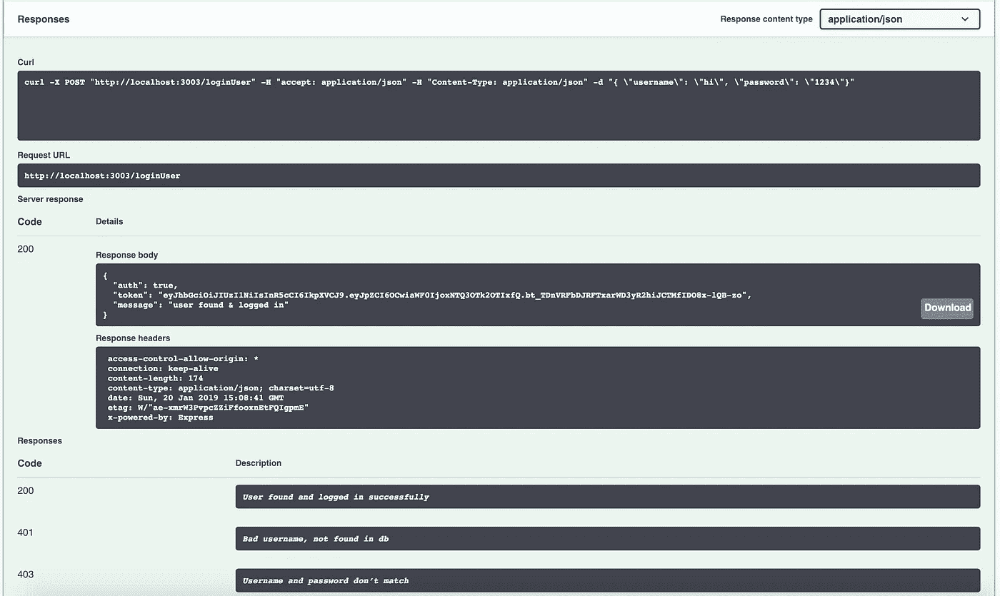

一个成功的 200 HTTP 响应。

当在中输入有效的用户名和密码时，您可以从`Curl`请求框中看到，该框显示了对 API 的确切调用(在调试不工作的调用时很有帮助)，`/loginUser`路由返回一个带有`token`属性的响应主体对象，该属性是 JWT 令牌，将存储在客户端的本地存储中，并在每个安全路由调用的授权头中传回。

我现在将展示如何测试其中一条路线。我会用`/findUser`路线。首先，从登录端点返回的`token`属性中复制值，然后打开`/findUser`输入，单击输入框右上角的小锁。这将为您打开一个输入 JWT 令牌字符串的模式。

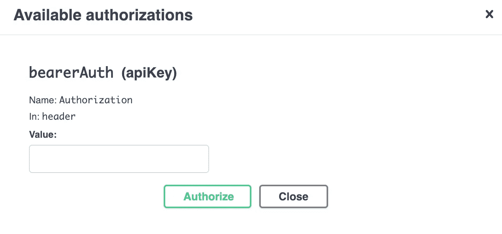

JWT 授权模式

在“值”输入框中输入`JWT <token string>`。

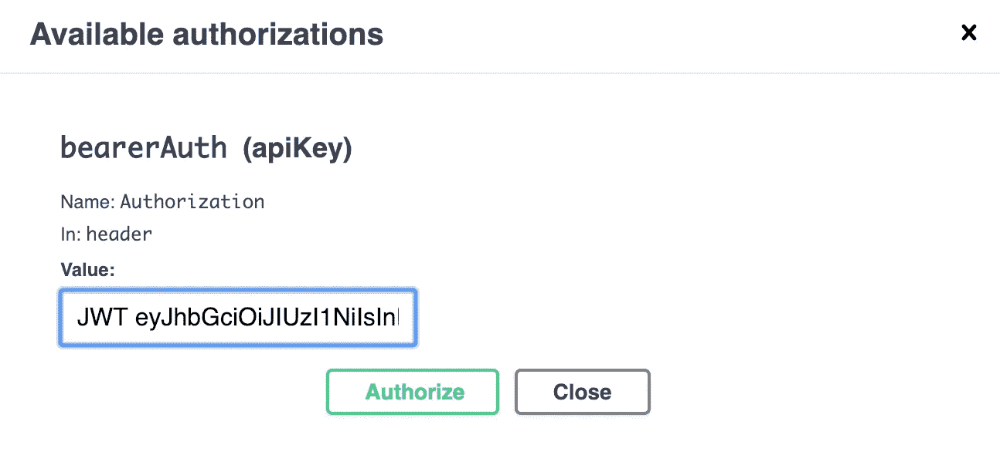

在输入框中添加“JWT <token string="">”并点击“授权”按钮。</token>

对于我的特定应用程序，伴随每个请求的授权头需要在实际的 JWT 字符串之前加上`JWT`。这个引用就是 Passport 如何找到正确的头字符串来解码和验证用户是否被授权。**它必须包含在此格式中，此 API 调用才能工作。**完成后，点击“授权”按钮，该路线的小锁图标将被锁定，您可以填写用户信息并测试您的呼叫。

这是这个安全路由上的 200 HTTP 响应的样子。

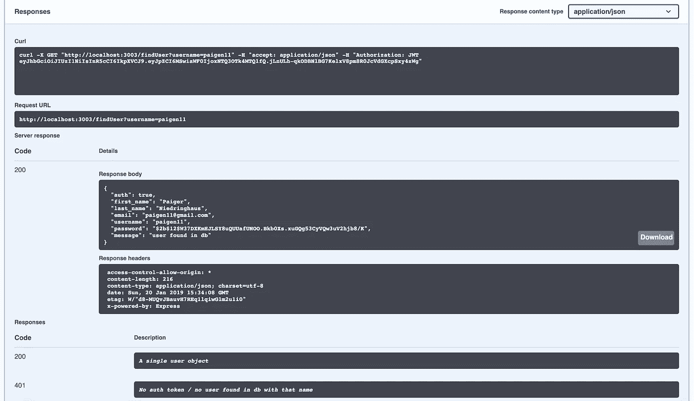

使用“授权”报头中的 JWT 令牌成功调用安全路由。

`Curl`请求框显示了带有用户名查询参数的路由，它显示了我在路由的锁中输入的授权 JWT 令牌，这是返回`User`对象所需要的。如果没有 JWT 令牌，或者令牌无效，将发送 401 或 403 HTTP 响应。

我将展示的最后一个请求是一个处理密码重置电子邮件的 Swagger 请求(我在这里写的是关于实现)。这个有点复杂，因为发送到用户电子邮件地址以重置密码的 URL 链接包含验证其有效性所需的查询字符串，并且只能在接下来的 10 分钟内有效。

因此，如果用户将密码重置电子邮件发送到他们的收件箱，他们会收到一封带有如下图所示链接的电子邮件。

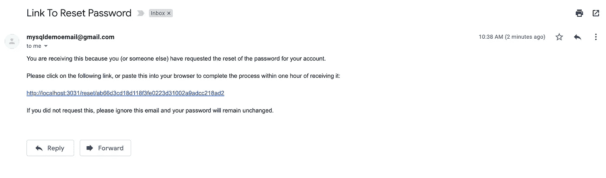

用户收到的重置邮件——末尾的随机字符串是 Swagger 需要的。

从这里开始，用户需要复制`/reset/`之后的字符串，并在发送后 10 分钟内将其粘贴到 swagger `/reset`路由中。这个随机生成的字符串附有一个时间戳，授权的一部分包括对照数据库检查字符串和时间戳。

如果两者对该用户都有效，那么通过 Swagger 的成功验证应该是这样的。

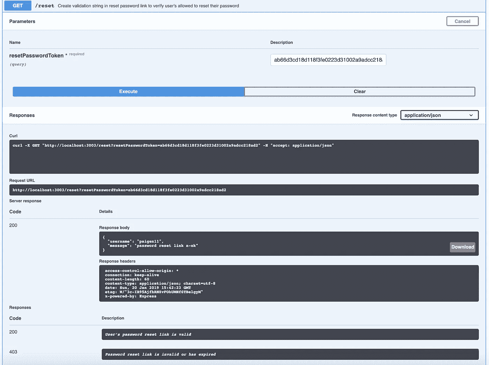

成功的 200 响应验证该用户的密码重置令牌有效，这允许他们到达安全路由以重置其密码。

如果字符串无效或者链接过期，Swagger 会显示这条消息。

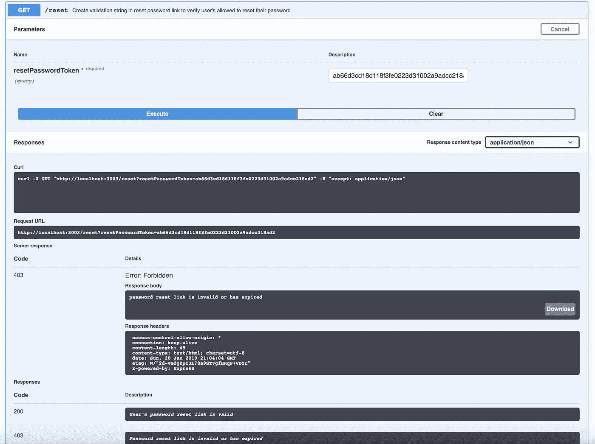

如果用户提交无效或已过期的密码重置令牌，将会出现 403 错误。

我的朋友们，这就是你如何在浏览器中使用 Swagger 的便捷界面来测试你的 API。

# 结论

这就是如何在用于浏览器内 API 测试的 JavaScript / Node.js 应用程序中实现 Swagger。初始设置并不像 Java 那样简单，但是对于 JavaScript 这样的解释型语言来说，一旦我掌握了其中的窍门，就真的不难了。

过几周再来看看，我会写一些关于 Reactjs 或者其他与 web 开发相关的东西，所以请关注我，这样你就不会错过了。

感谢您的阅读，我希望这能帮助您更轻松地记录和测试您自己的 web 应用程序。非常感谢鼓掌和分享！

**如果你喜欢读这篇文章，你可能也会喜欢我的其他一些博客:**

*   [调试 Node.js 最简单的方法——用 VS 代码](/the-absolute-easiest-way-to-debug-node-js-with-vscode-2e02ef5b1bad)
*   [用更漂亮的& ESLint](/keep-code-consistent-across-developers-the-easy-way-with-prettier-eslint-60bb7e91b76c) 保持开发人员之间的代码一致
*   [使用 Nodemailer 简化 React 应用程序中的密码重置电子邮件](/password-reset-emails-in-your-react-app-made-easy-with-nodemailer-bb27968310d7)

**参考资料和更多资源:**

*   https://github.com/paigen11/mysql-registration-passport MERN JavaScript App 回购:
*   霸气:【https://swagger.io/】T4
*   维基百科，Swagger(软件):[https://en . Wikipedia . org/wiki/Swagger _(软件)](https://en.wikipedia.org/wiki/Swagger_(software))
*   OpenAPI 规范(Swagger Specification):[https://swagger.io/docs/specification/about/](https://swagger.io/docs/specification/about/)
*   https://www.npmjs.com/package/swagger-jsdoc NPM 斯瓦格 JSDoc:
*   斯瓦格 UI 快递，https://www.npmjs.com/package/swagger-ui-express NPM:
*   YAML Sytnax 参考:[https://docs . ansi ble . com/ansi ble/latest/reference _ appendencies/yamlsyntax . html](https://docs.ansible.com/ansible/latest/reference_appendices/YAMLSyntax.html)