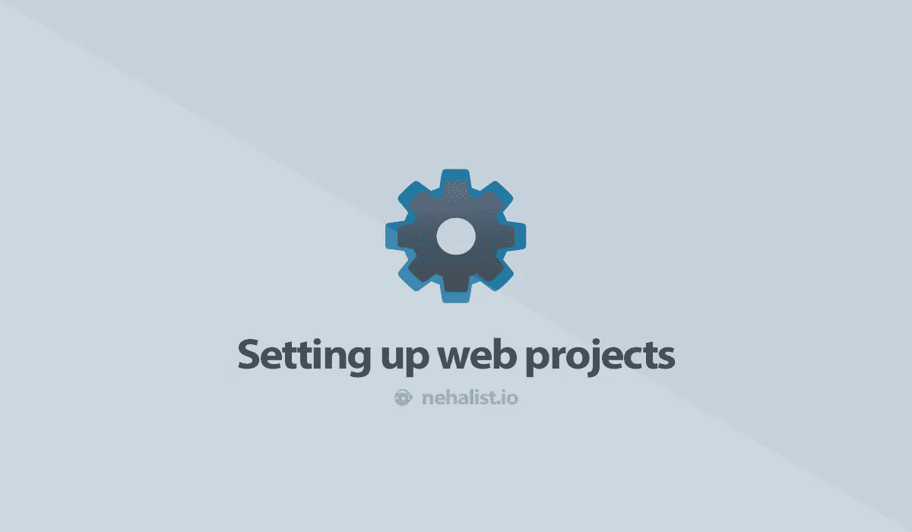

# 设置 web 项目

> 原文：<https://itnext.io/setting-up-web-projects-c7142319a7bd?source=collection_archive---------3----------------------->



开始一个网络项目不仅仅是黑掉几行代码就完事了——至少如果你想创造一些好的和可持续的东西。

在一个快节奏的网络开发世界中，拥有一个坚实的工作基础——*帮助*你改进你正在开发的产品的工具已经成为一种必需。让其他人有可能做出贡献需要一些准备——但是很高兴这些年来一些事实上的标准已经建立，我们将在这篇文章中讨论。

# 饭桶

使用版本控制是强制性的，Git 总是一个好的选择。但是仅仅运行`git init`还不足以拥有一个干净的存储库。

# 。gitignore

在初始化存储库之后，我总是首先添加到我的存储库中的是一个适当的`.gitignore`文件，它告诉 Git 忽略哪些文件。查看 [github/gitignore](https://github.com/github/gitignore) 资源库，获取特定语言的 gitignore 文件列表。

# 提交消息约定

只有每个开发人员都使用相同的约定来编写提交消息，才有可能拥有干净的历史。我非常喜欢阅读和编写的一个约定是[常规提交](https://www.conventionalcommits.org/en/v1.0.0/)，它强制提交消息，比如

```
feat(post): add post about project setup 
docs: add usage guide for library x 
refactor: clean up class y
```

但是不管你是否想要坚持一个约定:*总是*坚持所有提交都使用一种时态。Git 本身有一个[偏好](https://git.kernel.org/pub/scm/git/git.git/tree/Documentation/SubmittingPatches?id=HEAD#n133)，推荐现在时态、命令式风格，比如:

```
add feature x 
remove deprecated code 
change this to that
```

代替

```
added feature x
this commit will add feature x
feature x added
some badass dude (me) has added feature x!
```

作为一条经验法则，我总是告诉自己，提交消息应该这样读

> *该提交将[实际提交消息]*

因此像过去式(*“这个提交将被添加/这个特性将被添加/特性 x 被添加/某个坏蛋…”*？！毫无意义。

# 纱线还是 NPM？

前段时间有很多关于你应该使用纱线还是 NPM 的讨论。这些文章中的大多数都认为纱线优于 NPM——但是这仍然有效吗？让我们考虑几件事:

*   就速度而言，NPM [已经赶上](https://github.com/nehalist/npm-yarn-action/commit/4fc71773e166058406b831f2611bec52615a8ebd/checks?check_suite_id=331924895)
*   Yarn 支持[工作区](https://yarnpkg.com/lang/en/docs/workspaces/)(这对维护 [monorepo](https://en.wikipedia.org/wiki/Monorepo) 非常有用)，而 NPM 不提供这样的功能
*   `npm ci`在安装前删除`node_modules`目录，使得 CI 环境中的缓存变得毫无用处
*   NPM 前一段时间添加了一个锁文件，这是之前 Yarn 的主要优势之一

就我个人而言，我会遵循一个简单的规则:如果你需要工作空间(因为你在做一个单一回购)，就去找纱线，否则就去找 NPM。NPM 仍然与 Node 一起提供，不需要安装另外一个工具。

# 我应该提交锁文件吗？

[是](https://yarnpkg.com/blog/2016/11/24/lockfiles-for-all/)。

# 编程风格

不管有多少开发人员参与，代码应该总是看起来像是由一个人写的。这并没有改变一些人喜欢的工作方式，只是增加了可读性和结构。想象一下，一部电影中的每一个场景都有不同的风格——这看起来太可怕了。看到类似于

```
if (condition) { ... } 
if(condition) {
  ...
} 
if (condition) ...
```

在同一个项目中只会让所有东西更难阅读，甚至更难写。如果每个人都遵循相同的规则，许多问题会马上得到解答，整体代码质量也会提高。

# 编辑器配置

在最基本的层面上，像缩进层次或是否使用制表符或空格这样的事情可以通过使用 [EditorConfig](https://editorconfig.org/) 很容易地在项目中定义。你只需要在你的库里面创建一个`.editorconfig`文件，几乎所有的编辑器和 IDE 都有一个插件来使用这个文件。

# 林挺

就 JavaScript 而言，ESLint 是帮助维护一致编码标准的事实上的标准。

> ***注意*** *:切记用于打字稿的林挺工具，*[*ts lint*](https://medium.com/palantir/tslint-in-2019-1a144c2317a9)*，已经弃用，以后会过渡到 ESLint！*

谈到林挺规则，有一件事永远不要忘记:*如果林挺规则弊大于利，那就干脆禁用它。没有一个神圣的实体会根据你所启用的林挺法则来评判你——所以用它来帮助你，而不是折磨你。*

# 那么…制表符还是空格？

空格。


# 测试

没有测试的软件是不完整的 T2。我不相信别人的代码——我甚至不相信我自己的代码。但是我*做*信任测试。*大多是*。

使用测试框架对于编写正确的测试是必不可少的。一开始选择一个可能有些困难，因为有:

比较这些应该有自己的博客文章——但事实上，它们都不是一个坏的选择。

Karma 主要用于 Angular(至少我没见过其他项目用它)。

我个人使用 Mocha 编写测试已经有一段时间了，但最近改用 Jest，因为它几乎就是一些人所说的包含电池、带来断言、模仿库和覆盖生成器(而所有这些都需要通过像 [Chai](https://www.chaijs.com/) 、 [Sinon](https://sinonjs.org/) 和 [nyc](https://github.com/istanbuljs/nyc) 这样的库为 Mocha 单独安装)。

# 持续集成

一个非常常见的实践和良好维护的标志是利用持续集成工具，简称 CI。用于 web 开发的流行 CI 工具有:

*   [Travis CI](https://travis-ci.org/) (开源免费，见[此处](https://travis-ci.com/plans)关于私有库的定价)
*   [GitLab](https://about.gitlab.com/) (开源免费，私人项目最多 2.000 分钟构建时间)
*   [GitHub actions](https://github.com/features/actions) (开源免费，私有项目最多 2.000 分钟构建时间)

每当您的代码发生变化(或其他事件，如 webhooks、注释、新的 pull 请求等)时，CI 工具都会执行一系列命令。发生)。如果您的代码确实有测试，这些测试(以及类似林挺、检查安全漏洞的依赖关系等)将由您的 CI 在每次该事件发生时执行(很可能是一个`git push`命令)。

# 代码质量分析

有大量*真正*有用的工具可以帮助你分析你的代码，而不必运行它。这些工具有助于识别代码味道(重复、过度设计的方法等)、潜在的错误或安全漏洞。它们使得在没有人审查的情况下获得审查成为可能，并且通常会立即导致更干净的代码。

仅举几个例子:

都很有用，各有各的好处。Sonarqube 很棒，因为它提供了一个自托管的 docker，甚至可以用于没有公开托管的项目*而不会导致额外的成本。*

# 批准

首先:如果你想让其他人使用你的软件，你肯定[应该包括](https://choosealicense.com/no-permission/)一个许可证。

> 当你创作一个创造性的作品(包括代码)时，默认情况下该作品是受专有版权保护的。除非你包含一个明确的许可，否则没有人可以复制、分发或修改你的作品而不冒被撤销、勒索或诉讼的风险。一旦作品有了其他贡献者(每个都是版权所有者)，“没有人”开始包括你。

许可可能会有点混乱，尤其是如果你以前从未处理过它。choosealicense.com[有一个很棒的工具可以帮助你选择正确的许可证，而不必打电话给律师将许可证文本翻译成更容易理解的东西。](https://choosealicense.com/)

在我的情况下，我的大多数项目要么使用 MIT(当它们是开源的时候)，要么使用专有文本，而不是预制的许可文本，只要它们不打算被其他人使用:

```
Copyright (c) <year> <name> All rights reserved.
```

> *请记住，在一个开放的 GitHub repo 中放入专有许可证并不意味着人们不能克隆、修改或分发你的代码。这可能是违反许可的——但从技术上讲，没有什么可以阻止这一点。如果是 GitHub，你可以提交一个* [*DMCA 撤销通知*](https://help.github.com/en/github/site-policy/guide-to-submitting-a-dmca-takedown-notice) *来撤销非法使用你代码的软件仓库。*

# 版本控制

正确的版本控制有助于识别变更，甚至不需要查看变更日志或代码。通过使用[语义版本化](https://semver.org/)(被定义为`MAJOR.MINOR.PATCH`，例如`2.1.3`)很容易判断出一个版本与另一个版本之间发生了什么:

*   **主要**版本表示不兼容的 API 变更。如果您的代码破坏了向后兼容性(或者，换句话说，您的版本需要修改现有的代码库才能再次工作)，那么是时候发布一个主版本了。
*   增加**次要**版本仅仅意味着在不破坏兼容性的情况下增加了功能。
*   补丁号是用来修复错误的。

如果你坚持这个计划，跟踪你的软件开发总是很容易的。

> *随机事实:WordPress 没有遵循语义版本控制，而是在第二个数字超过“9”时增加第一个数字。它使用前两个数字来表示主要版本，其中第一个数字实际上只是一个计数器。*

如果你没有发布路线图，你可能会对如何应用语义版本感到困惑。我坚持将`0.1.0`放在整个项目上，直到第一次发布——并从那里开始应用语义版本化(除了更大的项目，在那里我为发布增加次要版本，直到我遇到我想称之为`1.0.0`的东西)。

# 证明文件

如果你曾经在没有文档的情况下使用过软件，你肯定不知道它的价值。编写*好的*文档是困难的，需要*大量的*工作来保持最新——但是很高兴有工具在这方面帮助你。

# 自述文件

进入一个项目，一份写得很好的自述文件是必不可少的。如何安装，甚至是为了什么，如何贡献等。—所有这些都应该包含在一个好的自述文件中。

[makeareadme.com](https://www.makeareadme.com/)为你的自述文件的结构提供了一个坚实的模板。

# 徽章

每当您希望人们立即看到示例测试已经通过，并且您的 CI 在安装依赖项的过程中没有死亡，徽章是必不可少的。

但是，说真的，徽章很酷——只要它们显示良好的统计数据。看着一个仓库，看到一个红色的*“构建:失败”*徽章总是有点令人害怕。

[shields.io](https://shields.io/) 提供了大量不同的徽章来添加到您的项目中——甚至提供创建自定义徽章。

# 变更日志

变更日志是好文档的一部分，维护它们有助于识别版本之间的细节变化。查看一下 keepachangelog.com 的变更日志格式。

# 代码文档

有两种不同的代码文档:生成的 API 文档和使用文档。

像 [Typedoc](https://typedoc.org/guides/doccomments/) 、 [TSDoc](https://microsoft.github.io/tsdoc/) 或 [JSDoc](https://devdocs.io/jsdoc/) 这样的工具帮助你根据你的代码生成一个有用的文档。这通常有助于了解您的实现，而不必直接查看文件。

另一件事是使用文档，这需要大部分手动完成。像 [docz](https://www.docz.site/docs/document-settings) 这样的工具可以帮助你更快地开始——但是编写一份好的文档仍然取决于你。

如果你正在构建一个基于组件的前端应用程序(通过使用像 React、Vue 或 Angular 这样的框架) [Storybook](https://storybook.js.org/) 也是一个值得一看的东西——一个记录和展示独立组件的不错的选择。

# 投稿指南

在不知道你对他们有什么期望的情况下，别人很难参与进来。描述你希望人们如何参与(约定、格式……)可能是让其他人参与你的代码的重要部分。GitHub 上有一个很好的 [CONTRIBUTING.md 模板](https://gist.github.com/PurpleBooth/b24679402957c63ec426)，其中甚至包括一个行为准则(基本上是告诉那些想成为你软件一部分的人不要成为十足的人渣)。

# 维护

你的软件发布后，乐趣并没有结束；需要保养！像[renewal](https://github.com/renovatebot/renovate)或[dependent bot](https://dependabot.com/)这样的机器人会帮助你，只要你正在使用的库的新版本可用，就提交拉请求。

# 支持

许多开源项目依赖于用户的支持。最后，即使是开源项目，也只是由普通人带来的，他们牺牲自己的空闲时间，间接地为他们甚至不认识的人工作(*很奇怪，不是吗？*)。

获得支持或被支持的平台有很多，例如:

> *随机事实:Vue 框架的创建者尤雨溪每月在*[*Patreon*](https://www.patreon.com/evanyou)*上赚大约 20000 美元——来自开源！*

# 少了点什么？

如果你认为这篇文章在为你的下一个 web 项目创建一个坚实的基础方面有所欠缺，请在评论中告诉我——我总是对帮助和改进现有工作流的工具和库感兴趣！

*原载于 2019 年 12 月 19 日*[*https://nehalist . io*](https://nehalist.io/setting-up-web-projects/)*。*