# 通过设置同步，您可以随时随地轻松配置 VS 代码

> 原文：<https://itnext.io/settings-sync-with-vs-code-c3d4f126989?source=collection_archive---------0----------------------->

# 就在你认为 Visual Studio 代码已经好得不能再好的时候，它做到了

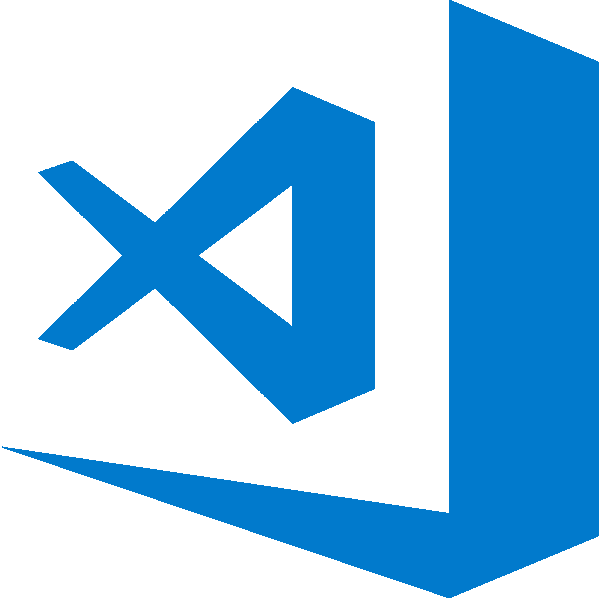

VS Code——当今最好的 JavaScript IDE

# 我的最佳工作安排&我如何玩火

我拥有目前工作用的 MacBook Pro 还不到两年，作为一名软件开发人员，你可能会想到，我已经在上面安装了很多东西。有些东西，比如我经常使用的工具，我记得，但我在上面安装的大多数东西，我可能不记得了。这是一种“全球安装一次，然后就再也不用考虑它”的心态。

我知道这是一个危险的游戏，因为虽然我通常很小心我的个人物品，但事情还是发生了。咖啡洒了，笔记本滑落到地板上，操作系统损坏了，其他人对他们自己和他们的东西会变得不认真。

在这一点上，我有一个问题，我有一个新的或刚刚重置的笔记本电脑，没有我所有的个人设置，插件，随机安装和预配置的工具，使开发更容易和更有趣。尤其是当它涉及到我的 IDE (Visual Studio 代码)的时候——我按照我喜欢的方式对它进行了调整和设置，一眨眼的功夫，它就可能全部消失。

在那一刻，我想起了设置和配置是多么痛苦。显然，每次我不得不经历这些时，我都必须将这些从记忆中抹去，因为说实话，这只是一种巨大的痛苦。

重新开始真的很痛苦…

这篇文章不会将您的整个机器完美地恢复到事件发生前的状态，这超出了我的讨论范围。

> 然而，本文将向您展示如何完美地重新创建您的 [Visual Studio 代码 IDE](https://code.visualstudio.com/) 设置，而不需要从头开始，也不需要花费大量时间。

我们走吧。

# 设置与救援同步

如果你没有读过我之前关于 VS 代码的文章[这里](/the-absolute-easiest-way-to-debug-node-js-with-vscode-2e02ef5b1bad)和[这里](/keep-code-consistent-across-developers-the-easy-way-with-prettier-eslint-60bb7e91b76c)，我强烈建议你去看看。这是一个不可思议的免费 IDE，它几乎在所有方面都胜过了 WebStorm，这不是免费的，我要补充一点(我以前也用过)。

关于 VS 代码，我最喜欢的事情之一是[扩展市场](https://marketplace.visualstudio.com/vscode)，那里绝对充满了有用的插件，人们自己开发了这些插件，并觉得有必要与我们这些开发者分享，而且大部分还是免费的。祝福这些人。

这些扩展是让 VS 代码开发如此愉快的原因之一——它们也让它成为我自己的编辑器。我的颜色主题(Night Owl)，我的必备插件列表(更漂亮，启用了保存时自动格式化)，我的有用小工具侧栏(Docker，Gitlens)，更不用说 LiveShare 和 VS 代码团队每个月发布的不断增长的功能列表了。我可以继续…

当面临丢失(甚至试图转移)我精心开发的 VS 代码设置到另一台机器上的可能性时，我知道必须有一种方法来优雅地完成它。某个地方的一些有进取心的开发人员已经面临了我现在面临的挑战，并且已经找到了一种在不同的机器上同步他们的设置的方法。

我只知道解决方案必须存在，所以，我问了互联网，它带回了[设置同步](https://marketplace.visualstudio.com/itemdetails?itemName=Shan.code-settings-sync)(以前被称为 Visual Studio 代码设置同步)。

## [设置同步](https://marketplace.visualstudio.com/itemdetails?itemName=Shan.code-settings-sync)

我希望这个可爱的小云在这篇文章中有一个更大的图片尺寸，但是唉。

> 🌴💪使用 Github GIST 在多台机器上同步 Visual Studio 代码设置💪🌴—设置同步，Github

这个插件，在 VS 代码市场上是免费的，正如 Github 的描述所说:一个工具，可以在你喜欢的任意多的机器上同步你的 VS 代码设置(包括棕榈树表情符号等等)，Github 的 gists 使这成为可能。

它能同步一切:

*   设置文件
*   按键绑定文件
*   启动文件
*   片段文件夹
*   VSCode 扩展和扩展配置
*   工作区文件夹

理论上听起来不错，但它真的像想象的那么容易吗？实际上，是的。因为伴随设置同步插件的[文档](http://shanalikhan.github.io/2015/12/15/Visual-Studio-Code-Sync-Settings.html)非常棒。

我自己也尝试了几次(有一点特殊的字符串复制，必须按照一定的顺序完成和输入)，但我最终让同步工作了，现在，我将分享我是如何做到的，以及最初让我犯错的一些令人困惑的部分。

好了，让我们开始设置同步。

# 设置同步运行

正如我所说，设置同步的创建者提供的实际[方向](http://shanalikhan.github.io/2015/12/15/Visual-Studio-Code-Sync-Settings.html)非常好，但既然你在这里，我将一步一步地浏览它们，并澄清一些我希望第一次知道的要点。

## 步骤 1:在 VS 代码中安装同步设置

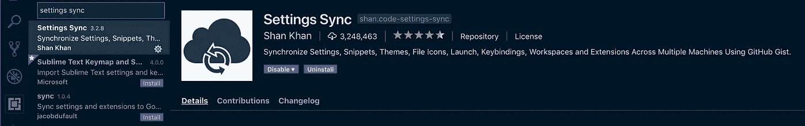

这是你将在你自己的 VS 代码市场看到的官方插件。

显而易见的第一步是从市场上将 Settings Sync 安装到您的 VS 代码终端中。这是您搜索时会看到的图标。

接下来，你需要进入你的 Github 账户。

## 步骤 2:从 Github 生成个人访问令牌

Settings Sync 的工作方式是通过 Github，它创建了一个私有的 gist，其中保存了所有的 VS 代码信息，任何拥有 gist 访问密钥的人都可以访问它。

所以在 Github 中，你会去:[设置](https://github.com/settings) / [开发者设置](https://github.com/settings/tokens) / [个人访问令牌](https://github.com/settings/tokens) /生成新令牌**(见下面截图)。

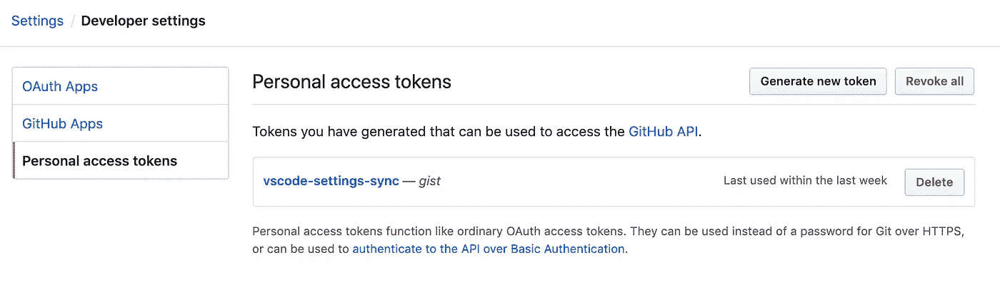

下面是我自己的 VS 代码设置同步要点图。

如您所见，我已经有了一个“vscode-settings-sync”令牌，但是出于本文的目的，我单击了“Generate new token”按钮来完成这些步骤。

一旦您开始生成令牌，请为令牌命名一个容易记住的名称，然后单击“创建 gists”旁边的复选框。这是您在创建令牌之前必须做的全部工作。

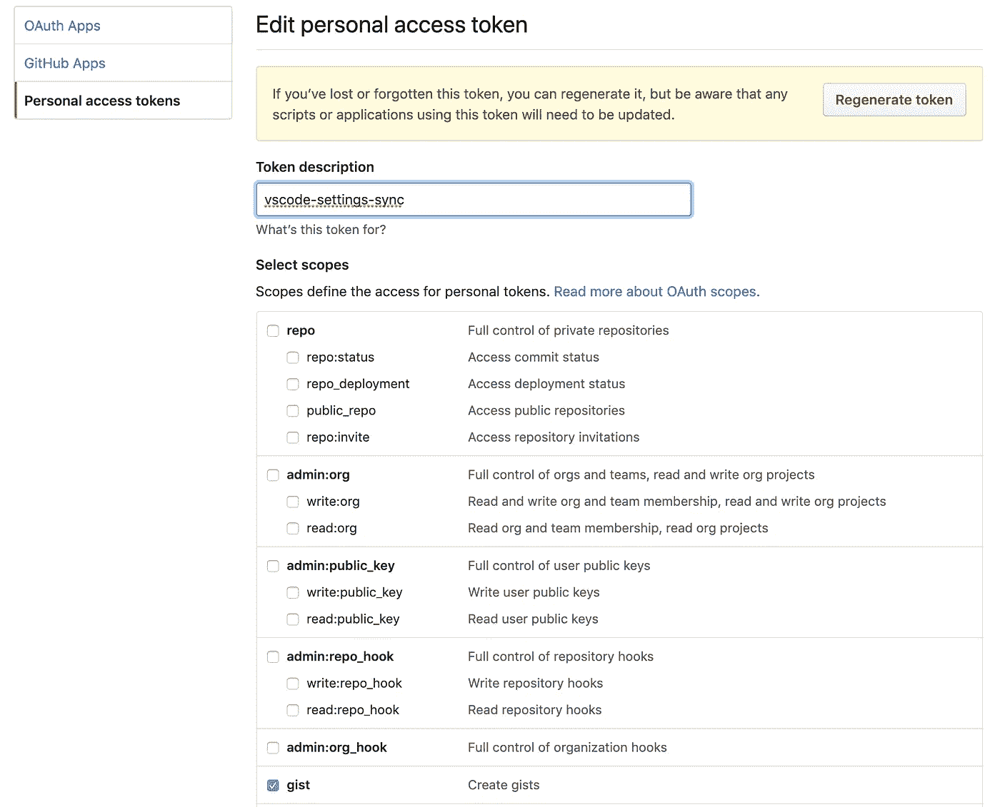

创建令牌时，您只需点击“要点”框。

生成新令牌后，将令牌哈希复制到您的计算机剪贴板(或 Sublime 或 notes 或其他地方)，您将永远无法再访问该字符串。

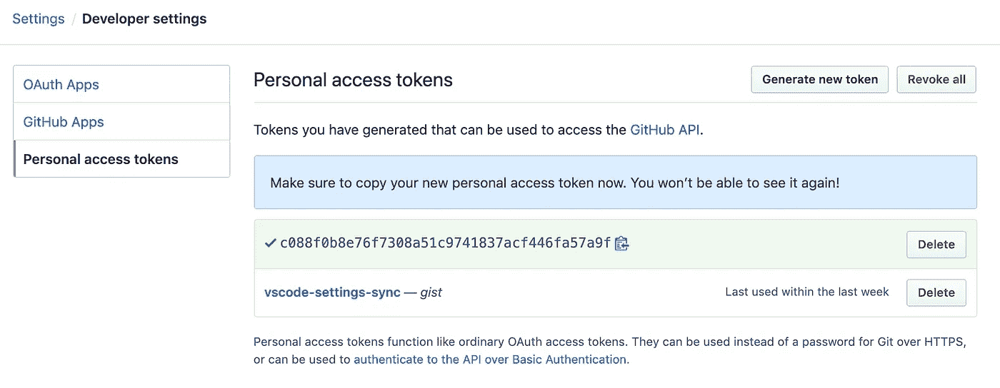

复制访问令牌哈希以备将来使用。

完成这些后，我们现在就可以回到 VS 代码了。

## 步骤 3:上传你的 VS 代码设置

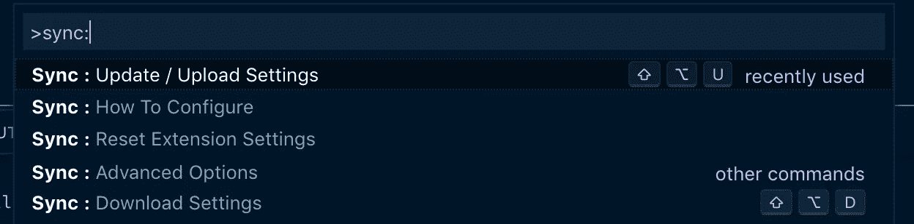

将您的设置与更新/上传设置同步

一旦回到 VS 代码，用`command + shift + p`(对于 MAC)打开命令面板，开始输入`sync:`，你应该会看到下面的选项列表。点击第一个:`Sync: Update/Upload Settings`，系统会提示您添加刚刚从新建的 gist 中复制的 Github 令牌。

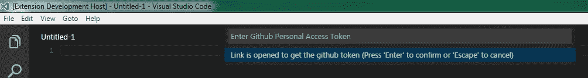

这是您从 Github 输入散列令牌的时候。

现在你已经输入了 token，你当前所有的 VS 代码设置都应该上传了，VS 代码中的`OUTPUT`终端会显示一个类似下面截图的信息。

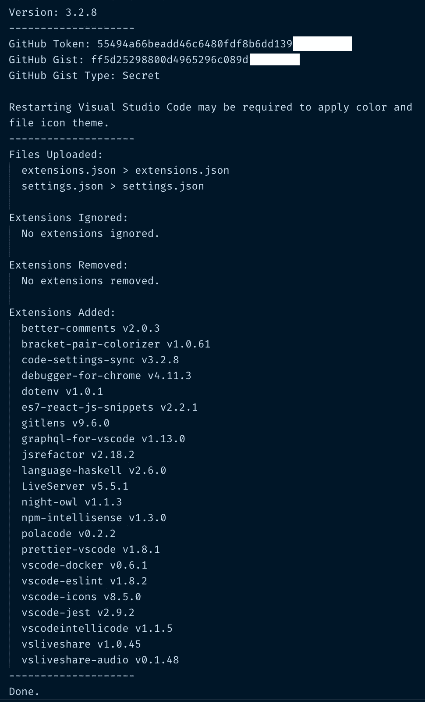

从 VS 代码终端的输出中验证它是否工作。

你可以看到我的`settings`和`extensions`文件和我目前在自己的 VS 代码设置中使用的所有扩展一起被上传。

您还应该能够在 Github 中访问您的 gists，并验证那里的设置。它将以类似`cloudSettings`的文件名存储在 Gists 中。

但是在关闭这个输出终端之前:复制上传生成的 Github 令牌和 Gist ID——您将需要它们来在其他机器上下载您的设置。把它放在一个你可以从你要下载设置的新机器上访问的地方(Slack，Google Docs 等等。).

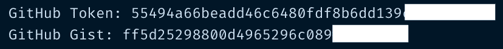

您需要将这个 git 和 token 保存在某个地方，以便能够在另一台机器上再次访问它，比如 Slack、Sublime 等。

现在，我们准备转移到需要这些设置的新的 VS 代码 IDE。

## 步骤 4:在新机器上下载你的设置

启动你的新 VS 代码机，你将遵循与上传设置相同的第一步:用`command + shift + p`打开命令面板，然后开始输入`sync:`，但是这一次，你将从列表中选择`Sync: Download Settings`选项。

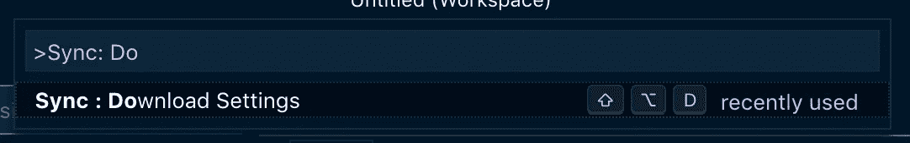

按照这种方式将设置下载到新的 VS 代码中。

选择之后，同步设置会提示您首先输入您的 Github 个人访问令牌——这是您将 VS 代码设置上传到同步设置时从终端输出中复制的令牌。

首先输入 Github 令牌。

然后，您将被要求输入 Gist ID，也是从输出终端提供的(这是第一次让我犯错误的部分，我没有意识到我第一次需要令牌和 ID)。这导致我不得不重置我的设置同步，并从原来的计算机上再次生成一个新的令牌和 ID，这不是一件大事，但有点痛苦。

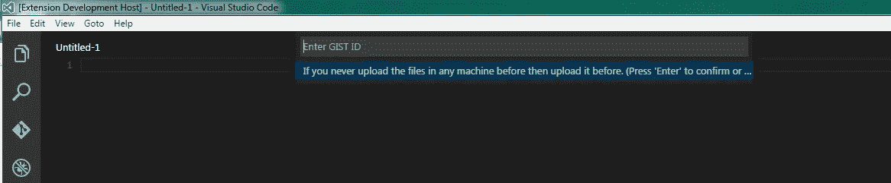

然后输入要点 ID。

之后，您的原始设置应该可以毫无问题地下载到 VS 代码中。

## 第五步:重新启动你的编辑器并享受

你完了！此时，您可能需要完全关闭 VS 代码编辑器，然后重新打开它，以使所有的更改生效，但应该就这样了。

随着一件大事从您的待办事项列表中删除，让您的 IDE 按照您想要的方式运行，您可以继续设置一台全新的机器所带来的其他事情。要是一切都这么简单就好了。😬

最后一个有趣的事实是，如果你想在一组开发人员和机器之间共享这些 VS 代码设置，你甚至可以创建一个他们都可以访问的公共要点，更多信息可以在[这里](http://shanalikhan.github.io/2015/12/15/Visual-Studio-Code-Sync-Settings.html)的“创建公共要点以共享设置”一节中找到。

# 结论

在开发软件(尤其是 JavaScript)时，没有什么比像 VS Code 这样完全配置的 IDE 更好的了。没有什么比试图记住所有的细微差别、插件和调整来让它达到完美状态更痛苦的了。

现在，在设置同步插件的帮助下，你不必记住所有这些东西，或者花几个小时在新机器上重新创建它们，你可以简单地将它们保存到 Github cloud(让我们面对它，如果 Github 宕机，我们都有比我们的 VS 代码配置更大的问题)，并从任何其他机器访问它们，只要你有个人访问令牌和 Gist ID。

过几周再来看看，我会写一些关于 Reactjs 或者其他与 web 开发相关的东西，所以请关注我，这样你就不会错过了。

感谢您的阅读，我希望这能帮助您保护自己和您的 VS 代码设置免受未来事故的影响，这只需要几分钟的时间，但它可以节省您重新配置的时间。如果你觉得有帮助，请与你的朋友分享！

如果你喜欢读这篇文章，你可能也会喜欢我的其他一些博客:

*   [用更漂亮的& ESLint](/keep-code-consistent-across-developers-the-easy-way-with-prettier-eslint-60bb7e91b76c) 保持开发者代码的一致性
*   [调试 Node.js 最简单的方法——用 VS 代码](/the-absolute-easiest-way-to-debug-node-js-with-vscode-2e02ef5b1bad)
*   [ESLint 如何让我成为更好的 React 开发人员](/how-eslint-makes-me-a-better-react-developer-237fb14c00ae)

**参考资料和更多资源:**

*   Visual Studio 代码:[https://code.visualstudio.com/](https://code.visualstudio.com/)
*   设置同步文档:[http://shanalikhan . github . io/2015/12/15/Visual-Studio-Code-Sync-settings . html](http://shanalikhan.github.io/2015/12/15/Visual-Studio-Code-Sync-Settings.html)
*   设置同步:[https://marketplace.visualstudio.com/itemdetails?itemName = shan . code-settings-sync](https://marketplace.visualstudio.com/itemdetails?itemName=Shan.code-settings-sync)
*   设置同步，Github:[https://github.com/shanalikhan/code-settings-sync](https://github.com/shanalikhan/code-settings-sync)
*   VS 代码市场:[https://marketplace.visualstudio.com/vscode](https://marketplace.visualstudio.com/vscode)