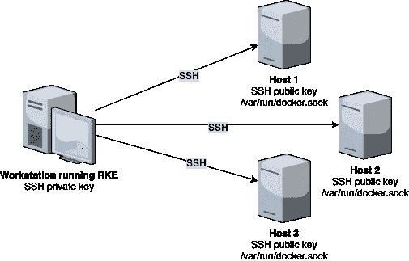
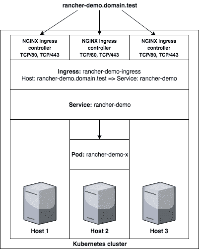

# 使用 RKE 轻松设置基本的 Kubernetes 集群

> 原文：<https://itnext.io/setup-a-basic-kubernetes-cluster-with-ease-using-rke-a5f3cc44f26f?source=collection_archive---------0----------------------->

在本文中，您将通过几个简单的步骤从 3 个 Ubuntu 16.04 节点升级到一个基本的 Kubernetes 集群。为此，您将使用牧场主 Kubernetes 发动机(RKE)。为了能够使用 RKE，你需要 3 个安装了 Docker 的 Linux 节点(见下面的**需求**)。

这不会是一个生产就绪的集群，但足以让您熟悉 RKE 和一些 Kubernetes，并能够使用该集群。关注构建生产就绪集群的帖子。

这个帖子也发表在 Rancher 博客上:[https://Rancher . com/Blog/2018/2018-09-26-setup-basic-kubernetes-cluster-with-easy-using-rke/](https://rancher.com/blog/2018/2018-09-26-setup-basic-kubernetes-cluster-with-ease-using-rke/)

## 要求

*   RKE 你将在你的工作站上使用 RKE。从
    [https://github.com/rancher/rke/releases/latest](https://github.com/rancher/rke/releases/latest)下载您平台的最新版本
*   **kubectl** 创建集群后，我们将使用默认的名为`kubectl`的 Kubernetes 命令行工具与集群进行交互。
    从
    [https://kubernetes.io/docs/tasks/tools/install-kubectl/](https://kubernetes.io/docs/tasks/tools/install-kubectl/)获取您平台的最新版本
*   **3 个 Ubuntu 16.04 节点，2 个(v)CPU，4GB 内存，禁用交换** 最常用的 Linux 发行版是 Ubuntu 16.04，这是本文将使用的。通过运行`swapoff -a`并删除`/etc/fstab`中的任何`swap`条目，确保 swap 被禁用。您必须能够使用 SSH 访问节点。由于这是一个多节点集群，[在继续之前，需要打开所需的端口](https://rancher.com/docs/rke/v0.1.x/en/os/#ports)。
*   **安装在每个 Linux 节点上的 Docker** Kubernetes 只验证 Docker 到 **17.03.2** (参见[https://github . com/Kubernetes/Kubernetes/blob/master/CHANGELOG-1.11 . MD # external-dependencies](https://github.com/kubernetes/kubernetes/blob/master/CHANGELOG-1.11.md#external-dependencies))。
    你可以使用[https://docs.docker.com/install/linux/docker-ce/ubuntu/](https://docs.docker.com/install/linux/docker-ce/ubuntu/)来安装 Docker(确保你安装了 **17.03.2** )或者使用这个一行程序来安装正确的版本:
    `curl [https://releases.rancher.com/install-docker/17.03.sh](https://releases.rancher.com/install-docker/17.03.sh) | sh`

在继续之前，请确保满足上面列出的要求。

## RKE 是如何运作的

RKE 可以在任何平台上运行(二进制文件可用于 MacOS/Linux/Windows)，在这个例子中，它将在您的工作站/笔记本电脑/计算机上运行。本文中的例子是基于 MacOS/Linux 的。

RKE 将使用配置的 SSH 私钥连接到节点(节点应该为 SSH 用户安装匹配的 SSH 公钥)，并设置一个隧道来访问 Docker 套接字(默认为`/var/run/docker.sock`，但可配置)。这意味着已配置的 SSH 用户必须能够访问机器上的 Docker 套接字，我们将在**创建 Linux 用户帐户**中讨论这一点。



## 创建 Linux 用户帐户

*注意:确保 Docker 按照上面* ***要求*** *部分的说明进行安装。*

需要在每个节点上执行以下步骤。如果你需要使用 sudo，在每个命令前面加上`sudo`。如果已经有用户可以使用 SSH 密钥访问机器，并且可以访问 Docker 套接字，那么可以跳过这一步。

```
# Login to the node
$ ssh your_user@hostname
# Create a Linux user called rke, create home directory, and add to docker group
$ useradd -m -G docker rke
# Switch user to rke and create SSH directories
$ su - rke
$ mkdir $HOME/.ssh
$ chmod 700 $HOME/.ssh
$ touch $HOME/.ssh/authorized_keys
# Test Docker socket access
$ docker version
Client:
 Version:      17.03.2-ce
 API version:  1.27
 Go version:   go1.7.5
 Git commit:   f5ec1e2
 Built:        Tue Jun 27 03:35:14 2017
 OS/Arch:      linux/amd64Server:
 Version:      17.03.2-ce
 API version:  1.27 (minimum version 1.12)
 Go version:   go1.7.5
 Git commit:   f5ec1e2
 Built:        Tue Jun 27 03:35:14 2017
 OS/Arch:      linux/amd64
 Experimental: false
```

## 配置 SSH 密钥

在本帖中，我们将创建新的密钥，但请随意使用您现有的密钥。当我们在 RKE 配置密钥时，请确保正确指定它们。

*注意:如果您想将 SSH 密钥与密码一起使用，您需要添加密钥运行* `*ssh-agent*` *，并在运行 RKE 时指定* `*--ssh-agent-auth*` *。*

**创建 SSH 密钥对
强烈建议在您的 SSH 私有密钥上放置一个密码短语。如果您丢失了 SSH 私有密钥(并且上面没有密码)，任何人都可以使用它来访问您的节点。**

```
ssh-keygen
Generating public/private rsa key pair.
Enter file in which to save the key ($HOME/.ssh/id_rsa):
Enter passphrase (empty for no passphrase):
Enter same passphrase again:
Your identification has been saved in $HOME/.ssh/id_rsa.
Your public key has been saved in $HOME/.ssh/id_rsa.pub.
The key fingerprint is:
xxx
```

创建 SSH 密钥对后，您应该拥有以下文件:

*   `$HOME/.ssh/id_rsa` (SSH 私钥，保持安全)
*   `$HOME/.ssh/id_rsa.pub` (SSH 公钥)

**将 SSH 公钥复制到节点:** 为了能够使用创建的 SSH 密钥对访问节点，您需要将 SSH 公钥安装到节点上。

对每个节点执行此操作(其中`hostname`是节点的 IP/主机名):

```
# Install the SSH public key on the node
$ cat $HOME/.ssh/id_rsa.pub | ssh hostname "sudo tee -a /home/rke/.ssh/authorized_keys"
```

*注意:这篇文章演示了如何为 RKE 创建一个单独的用户。正因为如此，我们不能使用* `*ssh-copy-id*` *，因为它只能为 SSH 连接使用的同一个用户安装密钥。*

**设置 ssh-agent** *注意:如果您选择不在您的 ssh 私有密钥上设置密码，您可以跳过这一步。*

这需要在您的工作站/笔记本电脑/计算机上执行:

```
# Run ssh-agent and configure the correct environment variables
$ eval $(ssh-agent)
Agent pid 5151
# Add the private key to the ssh-agent
$ ssh-add $HOME/.ssh/id_rsa
Identity added: $HOME/.ssh/id_rsa ($HOME/.ssh/id_rsa)
```

**测试 SSH 连接** 最后一步是测试我们是否可以使用 SSH 私钥访问节点。这需要在您的工作站/笔记本电脑/计算机上执行，将`hostname`替换为每个节点的 IP/主机名):

```
$ ssh -i $HOME/.ssh/id_rsa rke@hostname docker version
Client:
 Version:      17.03.2-ce
 API version:  1.27
 Go version:   go1.7.5
 Git commit:   f5ec1e2
 Built:        Tue Jun 27 03:35:14 2017
 OS/Arch:      linux/amd64Server:
 Version:      17.03.2-ce
 API version:  1.27 (minimum version 1.12)
 Go version:   go1.7.5
 Git commit:   f5ec1e2
 Built:        Tue Jun 27 03:35:14 2017
 OS/Arch:      linux/amd64
 Experimental: false
```

## 配置和运行 RKE

通过
[https://github.com/rancher/rke/releases/latest](https://github.com/rancher/rke/releases/latest)获取 RKE 平台。

RKE 将在你的工作站/笔记本电脑/计算机上运行。

在这篇文章中，我将 RKE 二进制文件重命名为`rke`，以使命令对每个平台通用。您可以通过运行以下命令来完成同样的操作:

```
mv rke_darwin-amd64 rke
```

使用以下命令测试 RKE 是否可以成功执行:

```
# Download RKE for MacOS (Darwin)
$ wget [https://github.com/rancher/rke/releases/download/v0.1.9/rke_darwin-amd64](https://github.com/rancher/rke/releases/download/v0.1.9/rke_darwin-amd64)
# Rename binary to rke
mv rke_darwin-amd64 rke
# Make RKE binary executable
$ chmod +x rke
# Show RKE version
$ ./rke --version
rke version v0.1.9
```

下一步是创建一个集群配置文件(默认为`cluster.yml`)。这包含了构建 Kubernetes 集群的所有信息，比如节点连接信息、什么角色应用于什么节点等等。所有[配置选项](https://rancher.com/docs/rke/v0.1.x/en/config-options/)都可以在文档中找到。您可以通过运行`./rke config`并回答问题来创建集群配置文件。在这篇文章中，您将创建一个 3 节点集群，每个节点上有每个角色(每个角色回答`y`)，我们将添加 Kubernetes 仪表板作为插件(使用[https://raw . githubusercontent . com/Kubernetes/Dashboard/master/src/deploy/recommended/Kubernetes-Dashboard . YAML](https://raw.githubusercontent.com/kubernetes/dashboard/master/src/deploy/recommended/kubernetes-dashboard.yaml))。要访问 Kubernetes 仪表板，您需要一个服务帐户令牌，该令牌将通过向附加组件添加[https://gist . githubusercontent . com/superseb/499 F2 CAA 2637 c 404 af 41 CFB 7 e 5 F4 a 938/raw/930841 AC 00653 fdff 8 beca 61 dab 9 a 20 bb 8983782/k8s-Dashboard-user . yml](https://gist.githubusercontent.com/superseb/499f2caa2637c404af41cfb7e5f4a938/raw/930841ac00653fdff8beca61dab9a20bb8983782/k8s-dashboard-user.yml)来创建。

关于回答创建集群配置文件的问题:

*   括号中的值，例如 SSH 端口的`[22]`是默认值，只需按下回车键即可使用。
*   默认的 SSH 私有密钥就可以了，如果您有另一个密钥，请更改它。

```
$ ./rke config
[+] Cluster Level SSH Private Key Path [~/.ssh/id_rsa]: ~/.ssh/id_rsa
[+] Number of Hosts [1]: 3
[+] SSH Address of host (1) [none]: ip_or_dns_host1
[+] SSH Port of host (1) [22]:
[+] SSH Private Key Path of host (ip_or_dns_host1) [none]:
[-] You have entered empty SSH key path, trying fetch from SSH key parameter
[+] SSH Private Key of host (ip_or_dns_host1) [none]:
[-] You have entered empty SSH key, defaulting to cluster level SSH key: ~/.ssh/id_rsa
[+] SSH User of host (ip_or_dns_host1) [ubuntu]: rke
[+] Is host (ip_or_dns_host1) a Control Plane host (y/n)? [y]: y
[+] Is host (ip_or_dns_host1) a Worker host (y/n)? [n]: y
[+] Is host (ip_or_dns_host1) an etcd host (y/n)? [n]: y
[+] Override Hostname of host (ip_or_dns_host1) [none]:
[+] Internal IP of host (ip_or_dns_host1) [none]:
[+] Docker socket path on host (ip_or_dns_host1) [/var/run/docker.sock]:
[+] SSH Address of host (2) [none]: ip_or_dns_host2
[+] SSH Port of host (2) [22]:
[+] SSH Private Key Path of host (ip_or_dns_host2) [none]:
[-] You have entered empty SSH key path, trying fetch from SSH key parameter
[+] SSH Private Key of host (ip_or_dns_host2) [none]:
[-] You have entered empty SSH key, defaulting to cluster level SSH key: ~/.ssh/id_rsa
[+] SSH User of host (ip_or_dns_host2) [ubuntu]: rke
[+] Is host (ip_or_dns_host2) a Control Plane host (y/n)? [y]: y
[+] Is host (ip_or_dns_host2) a Worker host (y/n)? [n]: y
[+] Is host (ip_or_dns_host2) an etcd host (y/n)? [n]: y
[+] Override Hostname of host (ip_or_dns_host2) [none]:
[+] Internal IP of host (ip_or_dns_host2) [none]:
[+] Docker socket path on host (ip_or_dns_host2) [/var/run/docker.sock]:
[+] SSH Address of host (3) [none]: ip_or_dns_host3
[+] SSH Port of host (3) [22]:
[+] SSH Private Key Path of host (ip_or_dns_host3) [none]:
[-] You have entered empty SSH key path, trying fetch from SSH key parameter
[+] SSH Private Key of host (ip_or_dns_host3) [none]:
[-] You have entered empty SSH key, defaulting to cluster level SSH key: ~/.ssh/id_rsa
[+] SSH User of host (ip_or_dns_host3) [ubuntu]: rke
[+] Is host (ip_or_dns_host3) a Control Plane host (y/n)? [y]: y
[+] Is host (ip_or_dns_host3) a Worker host (y/n)? [n]: y
[+] Is host (ip_or_dns_host3) an etcd host (y/n)? [n]: y
[+] Override Hostname of host (ip_or_dns_host3) [none]:
[+] Internal IP of host (ip_or_dns_host3) [none]:
[+] Docker socket path on host (ip_or_dns_host3) [/var/run/docker.sock]:
[+] Network Plugin Type (flannel, calico, weave, canal) [canal]:
[+] Authentication Strategy [x509]:
[+] Authorization Mode (rbac, none) [rbac]:
[+] Kubernetes Docker image [rancher/hyperkube:v1.11.1-rancher1]:
[+] Cluster domain [cluster.local]:
[+] Service Cluster IP Range [10.43.0.0/16]:
[+] Enable PodSecurityPolicy [n]:
[+] Cluster Network CIDR [10.42.0.0/16]:
[+] Cluster DNS Service IP [10.43.0.10]:
[+] Add addon manifest URLs or YAML files [no]: yes
[+] Enter the Path or URL for the manifest [none]: [https://raw.githubusercontent.com/kubernetes/dashboard/master/src/deploy/recommended/kubernetes-dashboard.yaml](https://raw.githubusercontent.com/kubernetes/dashboard/master/src/deploy/recommended/kubernetes-dashboard.yaml)                                                                                                                    
[+] Add another addon [no]: yes
[+] Enter the Path or URL for the manifest [none]: [https://gist.githubusercontent.com/superseb/499f2caa2637c404af41cfb7e5f4a938/raw/930841ac00653fdff8beca61dab9a20bb8983782/k8s-dashboard-user.yml](https://gist.githubusercontent.com/superseb/499f2caa2637c404af41cfb7e5f4a938/raw/930841ac00653fdff8beca61dab9a20bb8983782/k8s-dashboard-user.yml)                                                                                                                    
[+] Add another addon [no]: no
```

当最后一个问题被回答时，`cluster.yml`文件将被创建在运行 RKE 的同一个目录下:

```
ls -la cluster.yml 
-rw-r----- 1 user user 3688 Sep 17 12:50 cluster.yml
```

您现在已经准备好构建您的 Kubernetes 集群了。这可以通过运行`rke up`来完成。在运行该命令之前，请确保工作站/笔记本电脑/计算机与节点之间以及每个节点之间所需的[端口](https://rancher.com/docs/rke/v0.1.x/en/os/#ports)已打开。现在，您可以使用以下命令构建集群:

```
$ ./rke up
INFO[0000] Building Kubernetes cluster
...
INFO[0151] Finished building Kubernetes cluster successfully
```

如果一切顺利，该命令应该会有很多输出，但应该以`Finished building Kubernetes cluster successfully`结束。它还将写一个 kubeconfig 文件作为`kube_config_cluster.yml`。您可以使用该文件连接到您的 Kubernetes 集群。

## 探索您的 Kubernetes 集群

确保您已经安装了`kubectl`，参见[https://kubernetes.io/docs/tasks/tools/install-kubectl/](https://kubernetes.io/docs/tasks/tools/install-kubectl/)如何为您的平台获取它。

*注:运行* `*kubectl*` *时，自动尝试使用默认位置的 kubeconfig* `*$HOME/.kube/config*` *。在示例中，我们使用* `*--kubeconfig kube_config_cluster.yml*` *显式指定 kubeconfig 文件。如果不想每次都指定 kubeconfig 文件，可以将文件* `*kube_config_cluster.yml*` *复制到* `*$HOME/.kube/config*` *。(你可能需要先创建目录*`*$HOME/.kube*`*)*

从查询服务器的版本开始:

```
$ kubectl --kubeconfig kube_config_cluster.yml versionClient Version: version.Info{Major:"1", Minor:"11", GitVersion:"v1.11.3", GitCommit:"a4529464e4629c21224b3d52edfe0ea91b072862", GitTreeState:"clean", BuildDate:"2018-09-10T11:44:36Z", GoVersion:"go1.11", Compiler:"gc", Platform:"darwin/amd64"}                                                                   
Server Version: version.Info{Major:"1", Minor:"11", GitVersion:"v1.11.1", GitCommit:"b1b29978270dc22fecc592ac55d903350454310a", GitTreeState:"clean", BuildDate:"2018-07-17T18:43:26Z", GoVersion:"go1.10.3", Compiler:"gc", Platform:"linux/amd64"}
```

首先要检查的事情之一是，是否所有节点都处于`Ready`状态:

```
$ kubectl --kubeconfig kube_config_cluster.yml get nodes
NAME    STATUS    ROLES                      AGE       VERSION
host1   Ready     controlplane,etcd,worker   11m       v1.11.1
host2   Ready     controlplane,etcd,worker   11m       v1.11.1
host3   Ready     controlplane,etcd,worker   11m       v1.11.1
```

当您生成集群配置文件时，您添加了要在集群上部署的 Kubernetes dashboard 插件。您可以使用以下命令检查部署状态:

```
$ kubectl --kubeconfig kube_config_cluster.yml get deploy -n kube-system -l k8s-app=kubernetes-dashboardNAME                   DESIRED   CURRENT   UP-TO-DATE   AVAILABLE   AGE
kubernetes-dashboard   1         1         1            1           17m
```

默认情况下，部署不对外公开。如果您想在浏览器中访问 Kubernetes 仪表板，您将需要向外公开部署(稍后我们将在我们的演示应用程序中这样做)或者使用 kubectl 的内置代理功能。这将打开`127.0.0.1:8001`(您的本地机器在端口 8001 上)并将它隧道化到 Kubernetes 集群。

在访问 Kubernetes 仪表板之前，您需要检索令牌来登录仪表板。默认情况下，它在一个非常有限的帐户下运行，无法显示集群中的所有资源。我们在创建集群配置文件时添加的第二个插件创建了我们需要的帐户和令牌(这是基于[https://github . com/kubernetes/dashboard/wiki/Creating-sample-user](https://github.com/kubernetes/dashboard/wiki/Creating-sample-user))

您可以通过运行以下命令来检索令牌:

```
$ kubectl --kubeconfig kube_config_cluster.yml -n kube-system describe secret $(kubectl --kubeconfig kube_config_cluster.yml -n kube-system get secret | grep admin-user | awk '{print $1}') | grep ^token: | awk '{ print $2 }'eyJhbGciOiJSUzI1NiIs....<more_characters>
```

返回的字符串是您登录仪表板所需的令牌。复制整个字符串。

按如下方式设置 kubectl 代理:

```
$ kubectl --kubeconfig kube_config_cluster.yml proxyStarting to serve on 127.0.0.1:8001
```

并打开以下 URL:

[http://localhost:8001/API/v1/namespaces/kube-system/services/https:kubernetes-dashboard:/proxy/](http://localhost:8001/api/v1/namespaces/kube-system/services/https:kubernetes-dashboard:/proxy/)

当提示登录时，选择**令牌**，粘贴令牌，点击**登录**。

*注意:当您没有看到登录屏幕时，请通过点击右上角的登录来手动打开它。*

## 运行演示应用程序

本文的最后一步，运行一个演示应用程序并公开它。对于这个例子，您将运行一个演示应用程序`superseb/rancher-demo`，它是一个显示部署规模的 web UI。它将使用 Ingress 公开，这由默认部署的 NGINX Ingress 控制器处理。如果你想了解更多关于 Ingress 的信息，请参见[https://kubernetes . io/docs/concepts/services-networking/Ingress/](https://kubernetes.io/docs/concepts/services-networking/ingress/)

首先部署并公开演示应用程序(运行在端口 8080 上):

```
$ kubectl --kubeconfig kube_config_cluster.yml run --image=superseb/rancher-demo rancher-demo --port 8080 --expose
service/rancher-demo created
deployment.apps/rancher-demo created
```

检查您的部署状态:

```
$ kubectl --kubeconfig kube_config_cluster.yml rollout status deployment/rancher-demo
...
deployment "rancher-demo" successfully rolled out
```

命令`kubectl run`是让容器在集群上运行的最简单的方法。它需要一个图像参数来指定 Docker 图像和至少一个名称。在这种情况下，我们还想配置这个容器公开的端口(内部)，并公开它。所发生的是，创建了一个部署(和一个复制集),规模为 1(默认),并且创建了一个服务来抽象对 pod 的访问(它可以包含一个或多个容器，在本例中为 1)。有关这些主题的更多信息，请查看以下链接:

*   [https://kubernetes . io/docs/tutorials/kubernetes-basics/deploy-app/deploy-intro/](https://kubernetes.io/docs/tutorials/kubernetes-basics/deploy-app/deploy-intro/)
*   [https://kubernetes . io/docs/tutorials/kubernetes-basics/expose/expose-intro/](https://kubernetes.io/docs/tutorials/kubernetes-basics/expose/expose-intro/)

默认情况下，RKE 在每个节点上部署 NGINX 入口控制器。这将打开 op 端口 80 和端口 443，并且可以作为任何创建的入口的主入口点。入口可以包含单个主机或多个路径，并且您可以配置 SSL 证书。在本帖中，您将配置一个基本入口，使我们的演示应用程序可以在某个主机名上访问。在示例中，我们将使用`rancher-demo.domain.test`作为主机名来访问演示应用程序。

*注意:要访问我们的测试域，您必须将域名添加到/etc/hosts 以访问 UI，因为它不是有效的 DNS 名称。如果您可以访问自己的域，您可以添加一个 DNS A 记录，指向每个节点。*



唯一没有创建的部分是入口。让我们创建一个名为`rancher-demo-ingress`的入口，它有一个主机规范来匹配对我们的测试域(`rancher-demo.domain.test`)的请求，并将它指向端口 8080 上名为`rancher-demo`的服务。将以下内容保存到名为`ingress.yml`的文件中:

```
apiVersion: extensions/v1beta1
kind: Ingress
metadata:
  name: rancher-demo-ingress
spec:
  rules:
  - host: rancher-demo.domain.test
    http:
      paths:
      - path: /
        backend:
          serviceName: rancher-demo
          servicePort: 8080
```

使用 kubectl 创建这个入口:

```
$ kubectl --kubeconfig kube_config_cluster.yml apply -f ingress.yml
ingress.extensions/rancher-demo-ingress created
```

测试访问演示应用程序的时间到了。您可以首先在命令行上尝试，指示`curl`将测试域解析到每个节点:

```
# Get node IP addresses
$ kubectl --kubeconfig kube_config_cluster.yml get nodes                                                                                                                                                                                                                           
NAME       STATUS    ROLES                      AGE       VERSION
10.0.0.1   Ready     controlplane,etcd,worker   3h        v1.11.1
10.0.0.2   Ready     controlplane,etcd,worker   3h        v1.11.1
10.0.0.3   Ready     controlplane,etcd,worker   3h        v1.11.1
# Test accessing the demo application
$ curl --resolve rancher-demo.domain.test:80:10.0.0.1 [http://rancher-demo.domain.test/ping](http://rancher-demo.domain.test/ping)

{"instance":"rancher-demo-5cbfb4b4-thmbh","version":"0.1"}
$ curl --resolve rancher-demo.domain.test:80:10.0.0.2 [http://rancher-demo.domain.test/ping](http://rancher-demo.domain.test/ping)

{"instance":"rancher-demo-5cbfb4b4-thmbh","version":"0.1"}
$ curl --resolve rancher-demo.domain.test:80:10.0.0.3
[http://rancher-demo.domain.test/ping](http://rancher-demo.domain.test/ping)

{"instance":"rancher-demo-5cbfb4b4-thmbh","version":"0.1"}
```

如果您使用测试域，您需要将它添加到您机器的`/etc/hosts`文件中，以便能够正确地访问它。

```
echo "10.0.0.1  rancher-demo.domain.test" | sudo tee -a /etc/hosts
```

现在在你的浏览器中访问[http://rancher-demo . domain . test](http://rancher-demo.domain.test)。

如果这一切都解决了，您可以通过扩展您的部署来填充演示应用程序:

```
$ kubectl --kubeconfig kube_config_cluster.yml scale deploy/rancher-demo --replicas=10
deployment.extensions/rancher-demo scaled
```

*注:完成后，请务必清理* `*/etc/hosts*` *条目。*

## 结束语

这是一篇如何在 10 分钟内创建一个 Kubernetes 集群的帖子，但是在这个过程中，我试图添加一些关于某些部分如何工作的有用信息。为了避免有一个帖子需要一天的时间来阅读(解释每个部分)，会有其他帖子描述某些部分。现在，我已经将尽可能多的资源链接到现有的文档，您可以在那里了解更多。

*   [RKE 文档](https://rancher.com/docs/rke/v0.1.x/en/)
*   [NGINX 入口控制器](https://kubernetes.github.io/ingress-nginx/)
*   [学习 Kubernetes 基础知识](https://kubernetes.io/docs/tutorials/kubernetes-basics/)