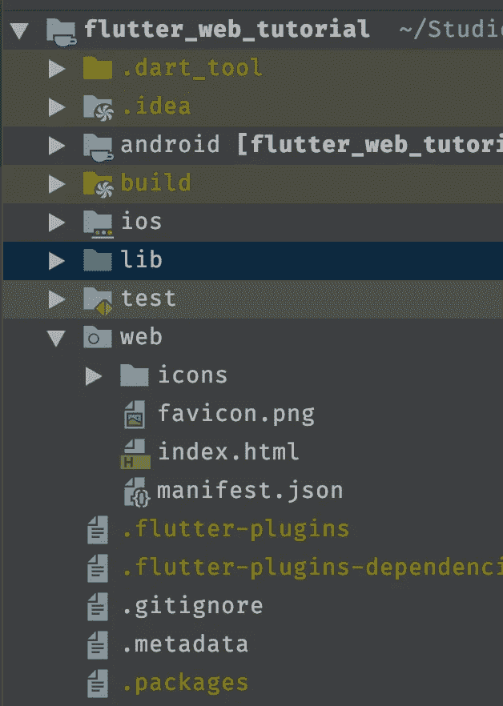
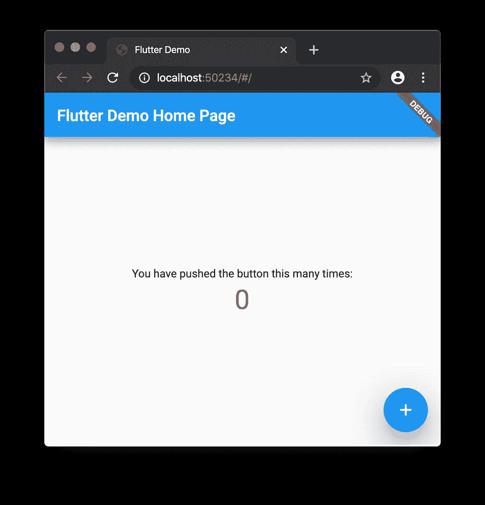
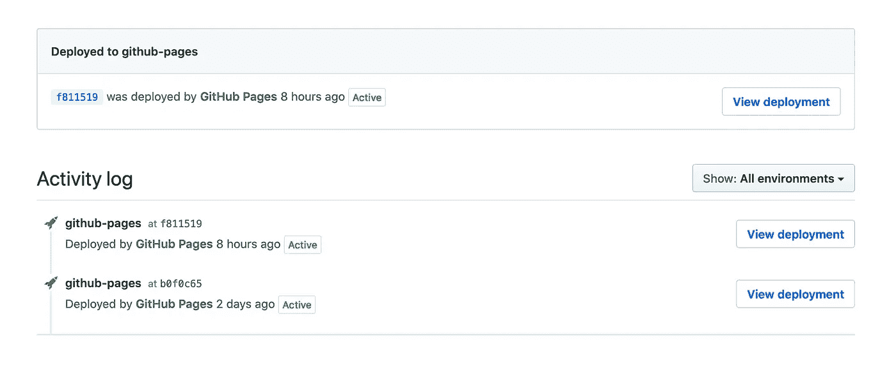

# 在 GitHub 页面上设置一个 Flutter Web 项目

> 原文：<https://itnext.io/setup-a-flutter-web-project-on-github-pages-58b3118b0a28?source=collection_archive---------1----------------------->

在我的上一篇[博客文章之后，](https://dev.to/myracledesign/my-flutter-journey-3ndj)有人问我如何在 Flutter 中创建了一个 web 项目，以及我如何设法部署它。因此，请和我一起踏上旅程，了解如何创建一个 Flutter web 应用程序，并在 GitHub 页面上实现整个过程。

# 颤动通道

要启用 flutter web，你必须正确设置你的 Flutter CLI，之后，你必须确保你在正确的频道上。今天当我写这篇文章时，Flutter web 仍处于测试阶段，所以我们必须选择一个支持测试功能的分支。

主渠道是目前的发展尖端。它包含了框架中的最新变化，但也容易受到破坏性变化的影响。所以这意味着在最坏的情况下，会有一些事情出错。beta 通道是 flutter 团队每月一次对包含最新发布功能的分支进行的代码选择。它是精选的，更稳定。因此，如果你想尝试一下，这将是一个可以去的渠道。

更多关于 Flutter 频道的信息，请看这里的[。](https://github.com/flutter/flutter/wiki/Flutter-build-release-channels)

# 启用颤动网

在我们设置了正确的通道并下载了新版本的 flutter 之后，我们必须启用 web 开发模型。

现在我们准备好出发了。接下来，我们必须创建一个基本的颤振项目。这将为我们创建所有相关的文件夹。

Flutter create 将为我们创建所有相关的文件夹。如果我们打开该项目，我们现在应该看到项目中的文件夹“web”。

最后一步是运行 app。所以进入项目文件夹，运行颤振设备。我们现在应该看到 chrome 和 Web 服务器是一个选择。

在 flutter run -d chrome 命令之后，chrome 浏览器将启动并显示 flutter 应用程序。

太好了，我们成功了！

# 在 GitHub 上部署

在我们部署之前，我们必须在 GitHub 中创建一个新的存储库，为了将它用作 GitHub 页面，它需要有一个特定的命名约定。

> 模板:> GitHub-用户名<.github.io/>示例: [md-weber.github.io](https://github.com/md-weber/md-weber.github.io)

现在，我们可以在我们的 Flutter 应用程序中创建任何我们想要的东西。如果我们准备好了，我们必须建立应用程序。

然后在你的项目中会有一个 build/web 文件夹。该文件夹包含所有需要上传到 GitHub 库的文件。打开一个终端，切换到文件夹，并将其推入您的存储库。

如果你是 GitHub 和 Git 的新手，这个[指南](https://product.hubspot.com/blog/git-and-github-tutorial-for-beginners)可以帮助你。

推送结束后，GitHub 会处理剩下的事情。它会立即为您创建一个环境，并将您的更改推送到网站。

在 GitHub 存储库中，您会发现一个名为 environments 的新标签。在此选项卡中，您可以看到部署过程的进度。

现在你可以在[https://::username::. github . io](/::username::.github.io)或者我的例子【https://md-weber.github.io/ 下输入 find。

如果你在那个阶段得到一个 404 错误，请尝试将/index.html 添加到你的路径中，现在你应该看到你的第一个 Flutter Web 应用程序。

感谢您的阅读！

 [## 登录-BuyMeACoffee.com

### 给我买杯咖啡是创作者接受粉丝一次性和每月支持的美好方式。

www.buymeacoffee.com](https://www.buymeacoffee.com/dashboard)